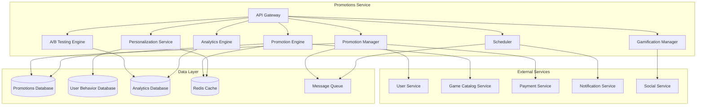

# Promotions Service - Дизайн

## 📋 **Обзор**

Promotions Service представляет собой комплексный микросервис для управления акциями, специальными предложениями, распродажами и промо-кампаниями. Сервис поддерживает различные типы акций от флеш-распродаж до персонализированных предложений с интеграцией геймификации и социальных механик.

## 🏗️ **Архитектура**

### **Общая архитектура**


### **Микросервисная архитектура**
- **API Gateway**: Единая точка входа с rate limiting и аутентификацией
- **Promotion Manager**: Управление жизненным циклом акций
- **Promotion Engine**: Применение акций и расчет скидок
- **Personalization Service**: Генерация персональных предложений
- **Gamification Manager**: Управление игровыми механиками акций
- **A/B Testing Engine**: Проведение A/B тестов акций
- **Scheduler**: Автоматическое планирование и запуск акций
- **Analytics Engine**: Сбор и анализ эффективности акций

## 🔧 **Компоненты и интерфейсы**

### **1. Promotion Manager Component**
```typescript
interface PromotionManager {
  // Управление акциями
  createPromotion(promotion: PromotionRequest): Promise<Promotion>;
  updatePromotion(promotionId: string, updates: PromotionUpdate): Promise<Promotion>;
  activatePromotion(promotionId: string): Promise<void>;
  deactivatePromotion(promotionId: string): Promise<void>;
  
  // Получение акций
  getActivePromotions(filters?: PromotionFilters): Promise<Promotion[]>;
  getUpcomingPromotions(): Promise<Promotion[]>;
  getPromotionById(promotionId: string): Promise<Promotion>;
  
  // Планирование
  schedulePromotion(promotionId: string, schedule: PromotionSchedule): Promise<void>;
  getPromotionCalendar(period: DateRange): Promise<PromotionCalendar>;
}

interface PromotionRequest {
  name: string;
  description: string;
  type: PromotionType;
  discountType: DiscountType;
  discountValue: number;
  targetGames?: string[];
  targetCategories?: string[];
  startDate: Date;
  endDate: Date;
  maxUses?: number;
  userRestrictions?: UserRestriction[];
  regionalRestrictions?: RegionalRestriction[];
  conditions?: PromotionCondition[];
}

interface Promotion {
  id: string;
  name: string;
  description: string;
  type: PromotionType;
  status: PromotionStatus;
  discountType: DiscountType;
  discountValue: number;
  targetItems: PromotionTarget[];
  startDate: Date;
  endDate: Date;
  currentUses: number;
  maxUses?: number;
  conditions: PromotionCondition[];
  createdAt: Date;
  updatedAt: Date;
}
```

### **2. Promotion Engine Component**
```typescript
interface PromotionEngine {
  // Применение акций
  calculateDiscount(userId: string, gameId: string): Promise<DiscountCalculation>;
  applyPromotion(userId: string, promotionId: string, gameId: string): Promise<PromotionApplication>;
  validatePromotionEligibility(userId: string, promotionId: string): Promise<EligibilityResult>;
  
  // Комбинирование акций
  combinePromotions(promotions: string[], gameId: string): Promise<CombinedDiscount>;
  getApplicablePromotions(userId: string, gameId: string): Promise<ApplicablePromotion[]>;
  
  // Флеш-распродажи
  createFlashSale(flashSaleRequest: FlashSaleRequest): Promise<FlashSale>;
  getActiveFlashSales(): Promise<FlashSale[]>;
}

interface DiscountCalculation {
  originalPrice: number;
  discountAmount: number;
  finalPrice: number;
  appliedPromotions: AppliedPromotion[];
  savings: number;
  savingsPercentage: number;
}

interface FlashSaleRequest {
  gameIds: string[];
  discountPercentage: number;
  duration: number; // в минутах
  maxQuantity?: number;
  startTime?: Date;
}

interface FlashSale {
  id: string;
  gameIds: string[];
  discountPercentage: number;
  startTime: Date;
  endTime: Date;
  remainingQuantity?: number;
  status: FlashSaleStatus;
}
```

### **3. Personalization Service Component**
```typescript
interface PersonalizationService {
  // Персональные предложения
  generatePersonalOffers(userId: string): Promise<PersonalOffer[]>;
  getPersonalOffers(userId: string): Promise<PersonalOffer[]>;
  
  // Анализ поведения
  analyzeUserBehavior(userId: string): Promise<UserBehaviorProfile>;
  updateUserPreferences(userId: string, preferences: UserPreferences): Promise<void>;
  
  // Рекомендации
  getRecommendedPromotions(userId: string): Promise<RecommendedPromotion[]>;
  generateBirthdayOffer(userId: string): Promise<PersonalOffer>;
  generateReturnUserOffer(userId: string): Promise<PersonalOffer>;
}

interface PersonalOffer {
  id: string;
  userId: string;
  gameId: string;
  discountPercentage: number;
  reason: PersonalizationReason;
  validUntil: Date;
  isUsed: boolean;
  createdAt: Date;
}

interface UserBehaviorProfile {
  userId: string;
  favoriteGenres: string[];
  averageSpending: number;
  purchaseFrequency: number;
  lastPurchaseDate: Date;
  wishlistItems: string[];
  playTimeByGenre: Map<string, number>;
  pricePreferences: PriceRange;
}

enum PersonalizationReason {
  WISHLIST_DISCOUNT = 'wishlist_discount',
  GENRE_PREFERENCE = 'genre_preference',
  BIRTHDAY_SPECIAL = 'birthday_special',
  RETURN_USER = 'return_user',
  LOYALTY_REWARD = 'loyalty_reward',
  SIMILAR_GAMES = 'similar_games'
}
```

### **4. Gamification Manager Component**
```typescript
interface GamificationManager {
  // Игровые механики
  createPromotionGame(gameRequest: PromotionGameRequest): Promise<PromotionGame>;
  participateInGame(userId: string, gameId: string): Promise<GameParticipation>;
  
  // Достижения и награды
  awardAchievement(userId: string, achievementId: string): Promise<void>;
  getPromotionAchievements(promotionId: string): Promise<Achievement[]>;
  
  // Коллекционные предметы
  awardCollectible(userId: string, collectibleId: string): Promise<void>;
  getUserCollectibles(userId: string): Promise<Collectible[]>;
  
  // Мини-игры
  spinWheel(userId: string, wheelId: string): Promise<SpinResult>;
  openMysteryBox(userId: string, boxId: string): Promise<MysteryBoxResult>;
  scratchCard(userId: string, cardId: string): Promise<ScratchCardResult>;
}

interface PromotionGameRequest {
  promotionId: string;
  gameType: GameType;
  rewards: GameReward[];
  duration: number;
  maxParticipants?: number;
  rules: GameRule[];
}

interface PromotionGame {
  id: string;
  promotionId: string;
  gameType: GameType;
  status: GameStatus;
  participants: number;
  maxParticipants?: number;
  rewards: GameReward[];
  startTime: Date;
  endTime: Date;
}

enum GameType {
  SPIN_WHEEL = 'spin_wheel',
  MYSTERY_BOX = 'mystery_box',
  SCRATCH_CARD = 'scratch_card',
  TREASURE_HUNT = 'treasure_hunt',
  DAILY_CHECK_IN = 'daily_check_in'
}
```

### **5. A/B Testing Engine Component**
```typescript
interface ABTestingEngine {
  // Создание тестов
  createABTest(testRequest: ABTestRequest): Promise<ABTest>;
  startABTest(testId: string): Promise<void>;
  stopABTest(testId: string): Promise<void>;
  
  // Участие в тестах
  assignUserToTest(userId: string, testId: string): Promise<TestVariant>;
  getUserTestVariant(userId: string, testId: string): Promise<TestVariant>;
  
  // Анализ результатов
  getTestResults(testId: string): Promise<ABTestResults>;
  getTestStatistics(testId: string): Promise<TestStatistics>;
  determineWinner(testId: string): Promise<WinnerResult>;
}

interface ABTestRequest {
  name: string;
  description: string;
  promotionVariants: PromotionVariant[];
  targetAudience: AudienceSegment;
  duration: number;
  successMetrics: SuccessMetric[];
  trafficSplit: number[]; // процентное распределение трафика
}

interface ABTest {
  id: string;
  name: string;
  status: TestStatus;
  variants: TestVariant[];
  startDate: Date;
  endDate: Date;
  participants: number;
  results?: ABTestResults;
}

interface ABTestResults {
  testId: string;
  variants: VariantResult[];
  winner?: string;
  confidenceLevel: number;
  statisticalSignificance: boolean;
}
```

### **6. Scheduler Component**
```typescript
interface Scheduler {
  // Планирование акций
  schedulePromotion(schedule: PromotionSchedule): Promise<void>;
  updateSchedule(scheduleId: string, updates: ScheduleUpdate): Promise<void>;
  cancelScheduledPromotion(scheduleId: string): Promise<void>;
  
  // Автоматизация
  createRecurringPromotion(recurringRequest: RecurringPromotionRequest): Promise<void>;
  getPromotionCalendar(period: DateRange): Promise<PromotionCalendar>;
  
  // Конфликты
  detectScheduleConflicts(schedule: PromotionSchedule): Promise<ScheduleConflict[]>;
  resolveScheduleConflict(conflictId: string, resolution: ConflictResolution): Promise<void>;
}

interface PromotionSchedule {
  promotionId: string;
  startTime: Date;
  endTime: Date;
  timezone: string;
  autoActivate: boolean;
  notifications: ScheduleNotification[];
}

interface RecurringPromotionRequest {
  promotionTemplate: PromotionTemplate;
  recurrencePattern: RecurrencePattern;
  duration: number;
  maxOccurrences?: number;
}
```

## 📊 **Модели данных**

### **Основные сущности**
```typescript
interface Promotion {
  id: string;
  name: string;
  description: string;
  type: PromotionType;
  status: PromotionStatus;
  discountType: DiscountType;
  discountValue: number;
  targetItems: PromotionTarget[];
  conditions: PromotionCondition[];
  startDate: Date;
  endDate: Date;
  currentUses: number;
  maxUses?: number;
  regionalRestrictions: RegionalRestriction[];
  userRestrictions: UserRestriction[];
  createdBy: string;
  createdAt: Date;
  updatedAt: Date;
}

interface PromotionApplication {
  id: string;
  promotionId: string;
  userId: string;
  gameId: string;
  originalPrice: number;
  discountAmount: number;
  finalPrice: number;
  appliedAt: Date;
  orderId?: string;
}

interface FlashSale {
  id: string;
  name: string;
  gameIds: string[];
  discountPercentage: number;
  startTime: Date;
  endTime: Date;
  maxQuantity?: number;
  currentQuantity: number;
  status: FlashSaleStatus;
  urgencyLevel: UrgencyLevel;
}

interface PersonalOffer {
  id: string;
  userId: string;
  gameId: string;
  discountPercentage: number;
  reason: PersonalizationReason;
  validUntil: Date;
  isUsed: boolean;
  createdAt: Date;
}
```

### **Типы и перечисления**
```typescript
enum PromotionType {
  FLASH_SALE = 'flash_sale',
  SEASONAL_SALE = 'seasonal_sale',
  DAILY_DEAL = 'daily_deal',
  WEEKEND_DEAL = 'weekend_deal',
  PERSONAL_OFFER = 'personal_offer',
  MEGA_SALE = 'mega_sale',
  COMMUNITY_CHOICE = 'community_choice'
}

enum PromotionStatus {
  DRAFT = 'draft',
  SCHEDULED = 'scheduled',
  ACTIVE = 'active',
  PAUSED = 'paused',
  EXPIRED = 'expired',
  CANCELLED = 'cancelled'
}

enum DiscountType {
  PERCENTAGE = 'percentage',
  FIXED_AMOUNT = 'fixed_amount',
  BUY_ONE_GET_ONE = 'buy_one_get_one',
  BUNDLE_DISCOUNT = 'bundle_discount'
}

enum FlashSaleStatus {
  SCHEDULED = 'scheduled',
  ACTIVE = 'active',
  SOLD_OUT = 'sold_out',
  EXPIRED = 'expired'
}
```

## 🛡️ **Обработка ошибок**

### **Стратегия обработки ошибок**
```typescript
enum PromotionErrorCode {
  // Ошибки акций
  PROMOTION_NOT_FOUND = 'PROMOTION_NOT_FOUND',
  PROMOTION_EXPIRED = 'PROMOTION_EXPIRED',
  PROMOTION_NOT_ACTIVE = 'PROMOTION_NOT_ACTIVE',
  PROMOTION_LIMIT_EXCEEDED = 'PROMOTION_LIMIT_EXCEEDED',
  
  // Ошибки применения
  USER_NOT_ELIGIBLE = 'USER_NOT_ELIGIBLE',
  GAME_NOT_ELIGIBLE = 'GAME_NOT_ELIGIBLE',
  REGION_RESTRICTED = 'REGION_RESTRICTED',
  ALREADY_USED = 'ALREADY_USED',
  
  // Ошибки планирования
  SCHEDULE_CONFLICT = 'SCHEDULE_CONFLICT',
  INVALID_SCHEDULE = 'INVALID_SCHEDULE',
  
  // Ошибки A/B тестирования
  TEST_NOT_ACTIVE = 'TEST_NOT_ACTIVE',
  INSUFFICIENT_DATA = 'INSUFFICIENT_DATA',
  
  // Системные ошибки
  CALCULATION_ERROR = 'CALCULATION_ERROR',
  DATABASE_ERROR = 'DATABASE_ERROR',
  EXTERNAL_SERVICE_ERROR = 'EXTERNAL_SERVICE_ERROR'
}

interface PromotionError {
  code: PromotionErrorCode;
  message: string;
  details?: any;
  timestamp: Date;
  promotionId?: string;
  userId?: string;
}
```

## 🧪 **Стратегия тестирования**

### **Модульное тестирование**
- Тестирование расчета скидок
- Валидация условий применения акций
- Проверка персонализации предложений
- Тестирование игровых механик

### **Интеграционное тестирование**
- Интеграция с Game Catalog Service
- Интеграция с User Service для персонализации
- Интеграция с Payment Service для применения скидок
- Тестирование уведомлений

### **A/B тестирование**
- Тестирование различных типов акций
- Оптимизация персональных предложений
- Эффективность игровых механик
- Конверсия различных форматов скидок

### **Нагрузочное тестирование**
- Флеш-распродажи с высоким трафиком
- Одновременное применение множества акций
- Производительность персонализации
- Масштабирование при мега-распродажах

## 🔧 **Технические детали реализации**

### **База данных**
- **PostgreSQL**: Основное хранилище акций и применений
- **Redis**: Кэширование активных акций и быстрый доступ
- **ClickHouse**: Аналитические данные и A/B тесты

### **Кэширование**
- Активные акции в Redis
- Персональные предложения с TTL
- Результаты расчетов скидок
- Часто запрашиваемые данные пользователей

### **Безопасность**
- Защита от злоупотребления акциями
- Валидация региональных ограничений
- Audit logging всех применений акций
- Rate limiting для предотвращения спама

### **Производительность**
- Асинхронная обработка персонализации
- Предварительный расчет скидок
- Оптимизация запросов к базе данных
- Горизонтальное масштабирование

### **Мониторинг**
- Метрики эффективности акций в реальном времени
- Мониторинг конверсии и ROI
- Алерты на аномальную активность
- Дашборды аналитики для маркетологов