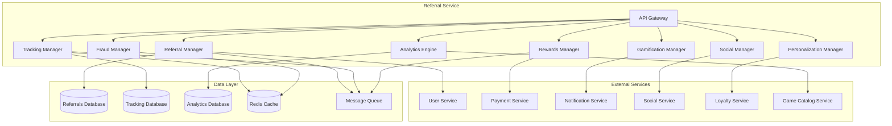

# Referral Service - Дизайн

## 📋 **Обзор**

Referral Service представляет собой комплексный микросервис для управления многоуровневой реферальной системой с поддержкой социальной интеграции, геймификации, персонализации и защиты от мошенничества. Сервис обеспечивает полный жизненный цикл реферальных программ от создания до выплаты наград.

## 🏗️ **Архитектура**

### **Общая архитектура**


### **Микросервисная архитектура**
- **API Gateway**: Единая точка входа с rate limiting и аутентификацией
- **Referral Manager**: Управление реферальными программами и ссылками
- **Tracking Manager**: Отслеживание кликов, конверсий и атрибуции
- **Social Manager**: Интеграция с социальными сетями
- **Gamification Manager**: Игровые элементы и достижения
- **Personalization Manager**: Персонализация реферальных предложений
- **Rewards Manager**: Управление наградами и выплатами
- **Fraud Manager**: Защита от мошенничества и злоупотреблений
- **Analytics Engine**: Аналитика эффективности реферальных программ

## 🔧 **Компоненты и интерфейсы**

### **1. Referral Manager Component**
```typescript
interface ReferralManager {
  // Управление реферальными программами
  createReferralProgram(program: ReferralProgramRequest): Promise<ReferralProgram>;
  updateReferralProgram(programId: string, updates: ProgramUpdate): Promise<ReferralProgram>;
  
  // Управление реферальными ссылками
  generateReferralLink(userId: string, programId?: string): Promise<ReferralLink>;
  generateCustomCode(userId: string, customCode: string): Promise<ReferralCode>;
  
  // Получение данных
  getUserReferrals(userId: string): Promise<UserReferral[]>;
  getReferralPrograms(filters?: ProgramFilters): Promise<ReferralProgram[]>;
  getReferralStats(userId: string): Promise<ReferralStats>;
  
  // Управление рефералами
  processReferralRegistration(referralCode: string, newUserId: string): Promise<ReferralRegistration>;
  validateReferralEligibility(referrerId: string, refereeId: string): Promise<EligibilityResult>;
}

interface ReferralProgramRequest {
  name: string;
  description: string;
  type: ProgramType;
  rewards: RewardStructure;
  conditions: ProgramCondition[];
  validFrom: Date;
  validUntil?: Date;
  targetAudience: AudienceSegment;
  maxParticipants?: number;
  isActive: boolean;
}

interface ReferralProgram {
  id: string;
  name: string;
  description: string;
  type: ProgramType;
  rewards: RewardStructure;
  conditions: ProgramCondition[];
  validFrom: Date;
  validUntil?: Date;
  participants: number;
  maxParticipants?: number;
  totalRewards: number;
  conversionRate: number;
  status: ProgramStatus;
  createdAt: Date;
  updatedAt: Date;
}

enum ProgramType {
  USER_TO_USER = 'user_to_user',
  INFLUENCER = 'influencer',
  CORPORATE = 'corporate',
  GAME_SPECIFIC = 'game_specific',
  SEASONAL = 'seasonal'
}

enum ProgramStatus {
  DRAFT = 'draft',
  ACTIVE = 'active',
  PAUSED = 'paused',
  COMPLETED = 'completed',
  CANCELLED = 'cancelled'
}
```

### **2. Tracking Manager Component**
```typescript
interface TrackingManager {
  // Отслеживание кликов и конверсий
  trackClick(referralCode: string, clickData: ClickData): Promise<ClickEvent>;
  trackConversion(referralCode: string, conversionData: ConversionData): Promise<ConversionEvent>;
  
  // Атрибуция
  attributeConversion(userId: string, conversionValue: number): Promise<AttributionResult>;
  getAttributionChain(userId: string): Promise<AttributionChain>;
  
  // Аналитика трекинга
  getClickAnalytics(referralCode: string, period: DateRange): Promise<ClickAnalytics>;
  getConversionFunnel(referralCode: string): Promise<ConversionFunnel>;
  
  // Управление UTM параметрами
  generateUTMParameters(referralCode: string, campaign?: string): Promise<UTMParameters>;
  trackUTMPerformance(utmParams: UTMParameters): Promise<UTMAnalytics>;
}

interface ClickData {
  referralCode: string;
  ipAddress: string;
  userAgent: string;
  referer?: string;
  utmParameters?: UTMParameters;
  deviceInfo: DeviceInfo;
  location?: GeoLocation;
  timestamp: Date;
}

interface ConversionData {
  referralCode: string;
  userId: string;
  conversionType: ConversionType;
  conversionValue: number;
  orderId?: string;
  gameId?: string;
  timestamp: Date;
}

enum ConversionType {
  REGISTRATION = 'registration',
  FIRST_PURCHASE = 'first_purchase',
  REPEAT_PURCHASE = 'repeat_purchase',
  SUBSCRIPTION = 'subscription',
  GAME_PURCHASE = 'game_purchase'
}
```

### **3. Rewards Manager Component**
```typescript
interface RewardsManager {
  // Управление наградами
  calculateReward(referralId: string, conversionData: ConversionData): Promise<RewardCalculation>;
  processRewardPayout(rewardId: string): Promise<PayoutResult>;
  
  // Типы наград
  createRewardStructure(structure: RewardStructureRequest): Promise<RewardStructure>;
  updateRewardTiers(programId: string, tiers: RewardTier[]): Promise<void>;
  
  // Выплаты
  initiateWithdrawal(userId: string, amount: number, method: PayoutMethod): Promise<WithdrawalRequest>;
  processWithdrawal(withdrawalId: string): Promise<WithdrawalResult>;
  
  // Баланс и история
  getUserBalance(userId: string): Promise<UserBalance>;
  getRewardHistory(userId: string, period?: DateRange): Promise<RewardHistory[]>;
}

interface RewardCalculation {
  referralId: string;
  baseReward: number;
  bonusMultiplier: number;
  tierBonus: number;
  totalReward: number;
  currency: Currency;
  rewardType: RewardType;
  breakdown: RewardBreakdown[];
}

enum RewardType {
  CASH = 'cash',
  STORE_CREDIT = 'store_credit',
  GAME_KEY = 'game_key',
  DISCOUNT_COUPON = 'discount_coupon',
  LOYALTY_POINTS = 'loyalty_points'
}

enum PayoutMethod {
  BANK_CARD = 'bank_card',
  PAYPAL = 'paypal',
  YANDEX_MONEY = 'yandex_money',
  QIWI = 'qiwi',
  STORE_CREDIT = 'store_credit'
}
```

## 📊 **Модели данных**

### **Основные сущности**
```typescript
interface Referral {
  id: string;
  referrerId: string;
  refereeId: string;
  programId: string;
  referralCode: string;
  status: ReferralStatus;
  createdAt: Date;
  convertedAt?: Date;
  rewards: ReferralReward[];
  trackingData: TrackingData;
  fraudFlags: FraudFlag[];
}

interface ReferralProgram {
  id: string;
  name: string;
  description: string;
  type: ProgramType;
  rewards: RewardStructure;
  conditions: ProgramCondition[];
  validFrom: Date;
  validUntil?: Date;
  participants: number;
  maxParticipants?: number;
  totalRewards: number;
  conversionRate: number;
  status: ProgramStatus;
  createdAt: Date;
  updatedAt: Date;
}

interface UserReferralProfile {
  userId: string;
  referralLevel: number;
  totalReferrals: number;
  successfulReferrals: number;
  totalEarnings: number;
  achievements: Achievement[];
  badges: Badge[];
  socialConnections: SocialConnection[];
  preferences: UserPreferences;
}

interface ReferralReward {
  id: string;
  referralId: string;
  userId: string;
  amount: number;
  currency: Currency;
  type: RewardType;
  status: RewardStatus;
  earnedAt: Date;
  paidAt?: Date;
  transactionId?: string;
}
```

### **Типы и перечисления**
```typescript
enum ReferralStatus {
  PENDING = 'pending',
  CONVERTED = 'converted',
  EXPIRED = 'expired',
  FRAUDULENT = 'fraudulent',
  CANCELLED = 'cancelled'
}

enum RewardStatus {
  PENDING = 'pending',
  APPROVED = 'approved',
  PAID = 'paid',
  CANCELLED = 'cancelled',
  DISPUTED = 'disputed'
}

enum Currency {
  RUB = 'RUB',
  USD = 'USD',
  EUR = 'EUR'
}
```

## 🛡️ **Обработка ошибок**

### **Стратегия обработки ошибок**
```typescript
enum ReferralErrorCode {
  // Ошибки рефералов
  REFERRAL_NOT_FOUND = 'REFERRAL_NOT_FOUND',
  INVALID_REFERRAL_CODE = 'INVALID_REFERRAL_CODE',
  REFERRAL_EXPIRED = 'REFERRAL_EXPIRED',
  SELF_REFERRAL_DETECTED = 'SELF_REFERRAL_DETECTED',
  
  // Ошибки программ
  PROGRAM_NOT_ACTIVE = 'PROGRAM_NOT_ACTIVE',
  PROGRAM_LIMIT_EXCEEDED = 'PROGRAM_LIMIT_EXCEEDED',
  USER_NOT_ELIGIBLE = 'USER_NOT_ELIGIBLE',
  
  // Ошибки наград
  INSUFFICIENT_BALANCE = 'INSUFFICIENT_BALANCE',
  PAYOUT_FAILED = 'PAYOUT_FAILED',
  MINIMUM_PAYOUT_NOT_MET = 'MINIMUM_PAYOUT_NOT_MET',
  
  // Ошибки мошенничества
  FRAUDULENT_ACTIVITY = 'FRAUDULENT_ACTIVITY',
  SUSPICIOUS_PATTERN = 'SUSPICIOUS_PATTERN',
  ACCOUNT_BLOCKED = 'ACCOUNT_BLOCKED'
}
```

## 🧪 **Стратегия тестирования**

### **Модульное тестирование**
- Тестирование логики расчета наград
- Валидация реферальных кодов
- Проверка алгоритмов атрибуции
- Тестирование обнаружения мошенничества

### **Интеграционное тестирование**
- Интеграция с Payment Service для выплат
- Интеграция с Social Service
- Интеграция с User Service
- Тестирование уведомлений

### **End-to-End тестирование**
- Полный цикл реферала: приглашение → регистрация → конверсия → награда
- Социальный шаринг и отслеживание
- Процесс выплаты наград
- Обнаружение и блокировка мошенничества

## 🔧 **Технические детали реализации**

### **База данных**
- **PostgreSQL**: Основное хранилище рефералов и программ
- **Redis**: Кэширование активных кодов и защита от спама
- **ClickHouse**: Аналитические данные и отслеживание событий

### **Безопасность**
- Защита от самореферальства
- Обнаружение координированного мошенничества
- Валидация подлинности конверсий
- Audit logging всех операций с наградами

### **Производительность**
- Кэширование популярных реферальных кодов
- Асинхронная обработка наград
- Оптимизация трекинга событий
- Горизонтальное масштабирование

### **Мониторинг**
- Метрики конверсии в реальном времени
- Мониторинг подозрительной активности
- Алерты на аномальные паттерны
- Дашборды ROI и эффективности программ