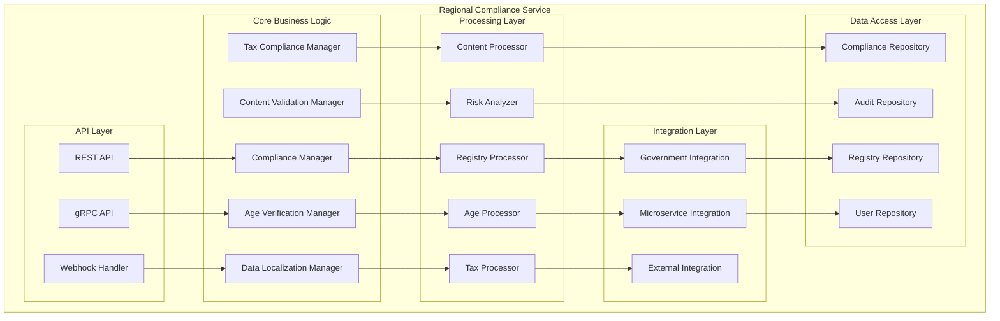

# Дизайн Regional Compliance Service

## Обзор

Regional Compliance Service - это критически важный микросервис российской Steam-платформы, обеспечивающий соблюдение российского законодательства во всех аспектах работы платформы. Сервис интегрируется с государственными реестрами, автоматически проверяет соответствие требованиям и обеспечивает проактивное управление compliance-рисками.

## Архитектура

### Высокоуровневая архитектура

```mermaid
graph TB
    subgraph "External Government Services"
        RKN[Роскомнадзор API]
        GOSUSLUGI[Госуслуги API]
        FNS[ФНС API]
        ROSFINMON[Росфинмониторинг API]
        REGISTRY[Реестры запрещенной информации]
    end
    
    subgraph "Regional Compliance Service"
        API[Compliance API]
        MONITOR[Compliance Monitor]
        VALIDATOR[Content Validator]
        AGE_CHECK[Age Verification]
        DATA_LOCAL[Data Localization]
        TAX_CALC[Tax Calculator]
        RISK_ASSESS[Risk Assessment]
        AUDIT[Audit Engine]
    end
    
    subgraph "Internal Services"
        NOTIFICATION[Notification Service]
        LOGGING[Logging Service]
        ANALYTICS[Analytics Service]
    end
    
    subgraph "Data Storage"
        POSTGRES[(PostgreSQL)]
        REDIS[(Redis Cache)]
        VAULT[(HashiCorp Vault)]
        AUDIT_DB[(Audit Database)]
    end
    
    subgraph "Platform Microservices"
        USER[User Service]
        GAME[Game Catalog]
        PAYMENT[Payment Service]
        CONTENT[Content Service]
        NEWS[News Service]
        DEVELOPER[Developer Portal]
    end
    
    subgraph "Compliance Dashboard"
        ADMIN[Admin Interface]
        REPORTS[Compliance Reports]
        ALERTS[Alert Management]
    end
    
    RKN --> MONITOR
    GOSUSLUGI --> AGE_CHECK
    FNS --> TAX_CALC
    ROSFINMON --> RISK_ASSESS
    REGISTRY --> VALIDATOR
    
    API --> MONITOR
    API --> VALIDATOR
    API --> AGE_CHECK
    API --> DATA_LOCAL
    API --> TAX_CALC
    API --> RISK_ASSESS
    API --> AUDIT
    
    MONITOR --> NOTIFICATION
    RISK_ASSESS --> LOGGING
    AUDIT --> ANALYTICS
    
    API --> POSTGRES
    MONITOR --> REDIS
    DATA_LOCAL --> VAULT
    AUDIT --> AUDIT_DB
    
    USER --> API
    GAME --> API
    PAYMENT --> API
    CONTENT --> API
    NEWS --> API
    DEVELOPER --> API
    
    ADMIN --> API
    REPORTS --> API
    ALERTS --> API
```



### Компонентная архитектура



## Компоненты и интерфейсы

### 1. Compliance Manager
**Назначение:** Центральный компонент для управления соответствием требованиям

**Интерфейсы:**
```typescript
interface ComplianceManager {
  checkCompliance(request: ComplianceCheckRequest): Promise<ComplianceResult>
  validateContent(content: Content): Promise<ValidationResult>
  verifyAge(userId: string, requiredAge: number): Promise<AgeVerificationResult>
  checkDataLocalization(userId: string): Promise<LocalizationStatus>
  calculateTax(transaction: Transaction): Promise<TaxCalculation>
  assessRisk(entity: ComplianceEntity): Promise<RiskAssessment>
}

interface ComplianceCheckRequest {
  entityType: EntityType
  entityId: string
  checkTypes: ComplianceCheckType[]
  context: ComplianceContext
}

interface ComplianceResult {
  entityId: string
  status: ComplianceStatus
  violations: ComplianceViolation[]
  recommendations: ComplianceRecommendation[]
  riskLevel: RiskLevel
  nextCheckDate: Date
}

enum ComplianceStatus {
  COMPLIANT = 'compliant',
  NON_COMPLIANT = 'non_compliant',
  PENDING_REVIEW = 'pending_review',
  REQUIRES_ACTION = 'requires_action'
}
```

### 2. Age Verification Manager
**Назначение:** Управление возрастной верификацией и ограничениями

**Интерфейсы:**
```typescript
interface AgeVerificationManager {
  verifyUserAge(userId: string, document: IdentityDocument): Promise<AgeVerificationResult>
  checkAgeRestriction(userId: string, contentId: string): Promise<AccessPermission>
  updateAgeVerification(userId: string, verification: AgeVerification): Promise<void>
  getAgeRestrictedContent(userId: string): Promise<RestrictedContent[]>
  integrateWithGosuslugi(userId: string): Promise<GosuslugiVerification>
}

interface AgeVerificationResult {
  userId: string
  verified: boolean
  age: number
  verificationMethod: VerificationMethod
  documentType: DocumentType
  verifiedAt: Date
  expiresAt: Date
  confidence: number
}

interface IdentityDocument {
  type: DocumentType
  number: string
  series?: string
  issuedBy: string
  issuedAt: Date
  photo?: string
  biometricData?: BiometricData
}

enum VerificationMethod {
  PASSPORT = 'passport',
  DRIVERS_LICENSE = 'drivers_license',
  GOSUSLUGI = 'gosuslugi',
  BIOMETRIC = 'biometric'
}
```

### 3. Content Validation Manager
**Назначение:** Проверка контента на соответствие российскому законодательству

**Интерфейсы:**
```typescript
interface ContentValidationManager {
  validateContent(content: Content): Promise<ContentValidationResult>
  checkProhibitedContent(content: Content): Promise<ProhibitionCheck>
  validateAdvertising(ad: Advertisement): Promise<AdvertisingValidation>
  checkCopyright(content: Content): Promise<CopyrightCheck>
  validateGambling(game: Game): Promise<GamblingValidation>
}

interface ContentValidationResult {
  contentId: string
  status: ValidationStatus
  violations: ContentViolation[]
  ageRating: AgeRating
  restrictions: ContentRestriction[]
  recommendations: string[]
}

interface ContentViolation {
  type: ViolationType
  severity: Severity
  description: string
  lawReference: string
  requiredAction: RequiredAction
  deadline?: Date
}

enum ViolationType {
  PROHIBITED_CONTENT = 'prohibited_content',
  AGE_INAPPROPRIATE = 'age_inappropriate',
  COPYRIGHT_VIOLATION = 'copyright_violation',
  EXTREMIST_CONTENT = 'extremist_content',
  GAMBLING_VIOLATION = 'gambling_violation',
  ADVERTISING_VIOLATION = 'advertising_violation'
}
```

### 4. Data Localization Manager
**Назначение:** Обеспечение локализации персональных данных в России

**Интерфейсы:**
```typescript
interface DataLocalizationManager {
  checkDataLocalization(userId: string): Promise<LocalizationStatus>
  migrateUserData(userId: string, targetRegion: Region): Promise<MigrationResult>
  validateDataStorage(dataType: DataType, location: StorageLocation): Promise<ValidationResult>
  getDataProcessingConsent(userId: string): Promise<ConsentStatus>
  handleDataDeletionRequest(userId: string, request: DeletionRequest): Promise<DeletionResult>
}

interface LocalizationStatus {
  userId: string
  dataLocalized: boolean
  storageLocations: StorageLocation[]
  violations: LocalizationViolation[]
  complianceLevel: ComplianceLevel
  lastChecked: Date
}

interface StorageLocation {
  dataType: DataType
  region: Region
  provider: string
  encrypted: boolean
  compliant: boolean
}

enum DataType {
  PERSONAL_DATA = 'personal_data',
  BIOMETRIC_DATA = 'biometric_data',
  PAYMENT_DATA = 'payment_data',
  BEHAVIORAL_DATA = 'behavioral_data',
  COMMUNICATION_DATA = 'communication_data'
}
```

### 5. Tax Compliance Manager
**Назначение:** Обеспечение соблюдения налогового законодательства

**Интерфейсы:**
```typescript
interface TaxComplianceManager {
  calculateVAT(transaction: Transaction): Promise<VATCalculation>
  calculateIncomeTax(payment: Payment): Promise<IncomeTaxCalculation>
  generateTaxReport(period: ReportingPeriod): Promise<TaxReport>
  validateTaxCompliance(entity: TaxEntity): Promise<TaxComplianceResult>
  submitTaxData(data: TaxData): Promise<SubmissionResult>
}

interface VATCalculation {
  transactionId: string
  baseAmount: number
  vatRate: number
  vatAmount: number
  totalAmount: number
  exemptions: TaxExemption[]
  calculatedAt: Date
}

interface TaxReport {
  period: ReportingPeriod
  totalRevenue: number
  totalVAT: number
  totalIncomeTax: number
  transactions: TaxTransaction[]
  compliance: TaxComplianceStatus
  submissionDeadline: Date
}
```

### 6. Risk Assessment Engine
**Назначение:** Оценка и мониторинг compliance-рисков

**Интерфейсы:**
```typescript
interface RiskAssessmentEngine {
  assessRisk(entity: ComplianceEntity): Promise<RiskAssessment>
  monitorRisks(): Promise<RiskMonitoringResult>
  predictRisks(context: RiskContext): Promise<RiskPrediction>
  generateRiskReport(timeframe: TimeFrame): Promise<RiskReport>
  escalateRisk(riskId: string, escalation: RiskEscalation): Promise<void>
}

interface RiskAssessment {
  entityId: string
  riskLevel: RiskLevel
  riskFactors: RiskFactor[]
  probability: number
  impact: ImpactLevel
  mitigation: MitigationPlan
  nextReview: Date
}

interface RiskFactor {
  type: RiskType
  weight: number
  description: string
  evidence: Evidence[]
  trend: RiskTrend
}

enum RiskLevel {
  LOW = 'low',
  MEDIUM = 'medium',
  HIGH = 'high',
  CRITICAL = 'critical'
}
```

## Модели данных

### Compliance Records Schema
```sql
CREATE TABLE compliance_records (
    id UUID PRIMARY KEY DEFAULT gen_random_uuid(),
    entity_type entity_type NOT NULL,
    entity_id UUID NOT NULL,
    check_type compliance_check_type NOT NULL,
    status compliance_status NOT NULL,
    risk_level risk_level DEFAULT 'low',
    violations JSONB DEFAULT '[]',
    recommendations JSONB DEFAULT '[]',
    checked_at TIMESTAMP DEFAULT NOW(),
    next_check_at TIMESTAMP,
    created_at TIMESTAMP DEFAULT NOW(),
    updated_at TIMESTAMP DEFAULT NOW(),
    
    UNIQUE(entity_type, entity_id, check_type)
);

CREATE INDEX idx_compliance_records_entity ON compliance_records(entity_type, entity_id);
CREATE INDEX idx_compliance_records_status ON compliance_records(status);
CREATE INDEX idx_compliance_records_risk ON compliance_records(risk_level);
```

### Age Verification Schema
```sql
CREATE TABLE age_verifications (
    id UUID PRIMARY KEY DEFAULT gen_random_uuid(),
    user_id UUID REFERENCES users(id),
    verification_method verification_method NOT NULL,
    document_type document_type,
    document_number VARCHAR(50),
    verified_age INTEGER,
    verified BOOLEAN DEFAULT FALSE,
    confidence DECIMAL(3,2),
    verified_at TIMESTAMP,
    expires_at TIMESTAMP,
    created_at TIMESTAMP DEFAULT NOW(),
    
    CONSTRAINT valid_age CHECK (verified_age >= 0 AND verified_age <= 150),
    CONSTRAINT valid_confidence CHECK (confidence >= 0 AND confidence <= 1)
);

CREATE INDEX idx_age_verifications_user_id ON age_verifications(user_id);
CREATE INDEX idx_age_verifications_verified ON age_verifications(verified);
```

### Content Violations Schema
```sql
CREATE TABLE content_violations (
    id UUID PRIMARY KEY DEFAULT gen_random_uuid(),
    content_id UUID NOT NULL,
    content_type content_type NOT NULL,
    violation_type violation_type NOT NULL,
    severity severity NOT NULL,
    description TEXT NOT NULL,
    law_reference VARCHAR(200),
    required_action required_action,
    deadline TIMESTAMP,
    status violation_status DEFAULT 'open',
    resolved_at TIMESTAMP,
    created_at TIMESTAMP DEFAULT NOW()
);

CREATE INDEX idx_content_violations_content ON content_violations(content_id, content_type);
CREATE INDEX idx_content_violations_type ON content_violations(violation_type);
CREATE INDEX idx_content_violations_status ON content_violations(status);
```

### Audit Trail Schema
```sql
CREATE TABLE compliance_audit_trail (
    id UUID PRIMARY KEY DEFAULT gen_random_uuid(),
    entity_type entity_type NOT NULL,
    entity_id UUID NOT NULL,
    action audit_action NOT NULL,
    actor_id UUID,
    actor_type actor_type,
    details JSONB NOT NULL,
    ip_address INET,
    user_agent TEXT,
    timestamp TIMESTAMP DEFAULT NOW(),
    
    CONSTRAINT valid_details CHECK (jsonb_typeof(details) = 'object')
);

CREATE INDEX idx_audit_trail_entity ON compliance_audit_trail(entity_type, entity_id);
CREATE INDEX idx_audit_trail_timestamp ON compliance_audit_trail(timestamp DESC);
CREATE INDEX idx_audit_trail_action ON compliance_audit_trail(action);
```

## Обработка ошибок

### Стратегия обработки ошибок
1. **Fail-Safe Approach**: При сомнениях блокировать доступ до выяснения
2. **Circuit Breaker**: Защита от каскадных сбоев государственных API
3. **Graceful Degradation**: Работа с кэшированными данными при недоступности внешних сервисов
4. **Audit Trail**: Полное логирование всех compliance-операций

### Типы ошибок
```typescript
enum ComplianceErrorType {
  VERIFICATION_FAILED = 'VERIFICATION_FAILED',
  GOVERNMENT_API_UNAVAILABLE = 'GOVERNMENT_API_UNAVAILABLE',
  INVALID_DOCUMENT = 'INVALID_DOCUMENT',
  CONTENT_BLOCKED = 'CONTENT_BLOCKED',
  DATA_LOCALIZATION_VIOLATION = 'DATA_LOCALIZATION_VIOLATION',
  TAX_CALCULATION_ERROR = 'TAX_CALCULATION_ERROR',
  RISK_ASSESSMENT_FAILED = 'RISK_ASSESSMENT_FAILED'
}

interface ComplianceError {
  type: ComplianceErrorType
  message: string
  details?: any
  lawReference?: string
  requiredAction?: string
  escalationRequired: boolean
}
```

## Стратегия тестирования

### Unit Tests
- Тестирование бизнес-логики компонентов
- Валидация алгоритмов проверки соответствия
- Проверка расчетов налогов и рисков
- Тестирование обработки ошибок

### Integration Tests
- Интеграция с государственными API
- Взаимодействие с другими микросервисами
- Тестирование базы данных
- Проверка audit trail

### Compliance Tests
- Тестирование соответствия 152-ФЗ
- Проверка возрастных ограничений
- Валидация блокировки запрещенного контента
- Тестирование налоговых расчетов

### Security Tests
- Тестирование защиты персональных данных
- Проверка шифрования биометрических данных
- Валидация доступа к чувствительной информации
- Penetration testing

## Безопасность

### Защита данных
- End-to-end шифрование для персональных данных
- Специальное шифрование для биометрических данных
- Secure key management с HashiCorp Vault
- Regular security audits

### Аутентификация и авторизация
- Multi-factor authentication для администраторов
- Role-based access control с принципом минимальных привилегий
- API key management для внешних интеграций
- Session management с автоматическим logout

### Соответствие стандартам
- ISO 27001 compliance
- ГОСТ Р 57580.1-2017 соответствие
- Сертификация ФСТЭК России
- Regular compliance audits

## Мониторинг и метрики

### Ключевые метрики
- Compliance check success rate (>99%)
- Age verification accuracy (>98%)
- Content blocking effectiveness (>99.5%)
- Government API response time (<2s)
- Risk assessment accuracy

### Алерты
- Critical compliance violations
- Government API failures
- Data localization violations
- High-risk content detection
- Tax calculation errors

### Дашборды
- Real-time compliance status
- Risk assessment overview
- Violation trends analysis
- Government integration health
- Audit trail monitoring

## Развертывание и масштабирование

### High Availability
```yaml
apiVersion: apps/v1
kind: Deployment
metadata:
  name: regional-compliance-service
spec:
  replicas: 5
  strategy:
    type: RollingUpdate
    rollingUpdate:
      maxUnavailable: 1
      maxSurge: 2
  selector:
    matchLabels:
      app: regional-compliance-service
  template:
    metadata:
      labels:
        app: regional-compliance-service
    spec:
      containers:
      - name: compliance-service
        image: regional-compliance-service:latest
        ports:
        - containerPort: 3000
        env:
        - name: DATABASE_URL
          valueFrom:
            secretKeyRef:
              name: db-secret
              key: url
        - name: VAULT_TOKEN
          valueFrom:
            secretKeyRef:
              name: vault-secret
              key: token
        resources:
          requests:
            memory: "1Gi"
            cpu: "500m"
          limits:
            memory: "2Gi"
            cpu: "1000m"
        livenessProbe:
          httpGet:
            path: /health
            port: 3000
          initialDelaySeconds: 30
          periodSeconds: 10
        readinessProbe:
          httpGet:
            path: /ready
            port: 3000
          initialDelaySeconds: 5
          periodSeconds: 5
```

### Disaster Recovery
- Multi-region deployment с активным резервированием
- Automated backup и restore процедуры
- Real-time data replication
- Emergency compliance procedures

## Интеграция с другими сервисами

### User Service
- Возрастная верификация пользователей
- Управление согласиями на обработку данных
- Локализация персональных данных

### Game Catalog Service
- Проверка игр на соответствие требованиям
- Возрастные рейтинги и ограничения
- Блокировка запрещенного контента

### Payment Service
- Налоговые расчеты для транзакций
- Соответствие требованиям 115-ФЗ
- Интеграция с российскими платежными системами

### Content Service
- Модерация пользовательского контента
- Проверка на нарушение авторских прав
- Блокировка экстремистских материалов

### Developer Portal Service
- Compliance-проверки для разработчиков
- Валидация загружаемого контента
- Налоговые обязательства разработчиков