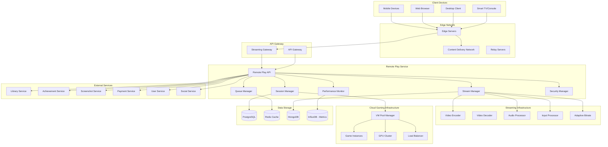

# Дизайн Remote Play Service

## Обзор

Remote Play Service - это микросервис для удаленной игры и облачного гейминга российской Steam-платформы. Сервис обеспечивает стриминг игр с минимальной задержкой, совместную удаленную игру, облачные вычисления для слабых устройств и адаптивное качество в зависимости от сетевых условий.

## Архитектура

### Высокоуровневая архитектура



## Компоненты и интерфейсы

### 1. Session Manager
**Назначение:** Управление удаленными игровыми сессиями

**Основные функции:**
- Создание и управление игровыми сессиями
- Выделение виртуальных машин для облачного гейминга
- Управление совместными сессиями
- Миграция сессий между серверами

**API Endpoints:**
```typescript
POST /api/v1/remote-play/sessions - создание новой сессии
GET /api/v1/remote-play/sessions/{sessionId} - информация о сессии
PUT /api/v1/remote-play/sessions/{sessionId}/migrate - миграция сессии
DELETE /api/v1/remote-play/sessions/{sessionId} - завершение сессии
POST /api/v1/remote-play/sessions/{sessionId}/invite - приглашение в совместную сессию
```

### 2. Stream Manager
**Назначение:** Управление видео и аудио стримингом

**Основные функции:**
- Кодирование и декодирование видео/аудио
- Адаптивное качество стриминга
- Обработка пользовательского ввода
- Синхронизация аудио и видео

**API Endpoints:**
```typescript
POST /api/v1/remote-play/stream/start - начало стриминга
PUT /api/v1/remote-play/stream/{streamId}/quality - изменение качества
POST /api/v1/remote-play/stream/{streamId}/input - отправка пользовательского ввода
GET /api/v1/remote-play/stream/{streamId}/stats - статистика стриминга
POST /api/v1/remote-play/stream/{streamId}/screenshot - создание скриншота
```

### 3. Queue Manager
**Назначение:** Управление очередями и приоритетами доступа

**Основные функции:**
- Управление очередью на облачные серверы
- Система приоритетов для премиум пользователей
- Прогнозирование времени ожидания
- Уведомления о доступности серверов

**API Endpoints:**
```typescript
POST /api/v1/remote-play/queue/join - присоединение к очереди
GET /api/v1/remote-play/queue/position - позиция в очереди
GET /api/v1/remote-play/queue/estimate - оценка времени ожидания
DELETE /api/v1/remote-play/queue/leave - выход из очереди
GET /api/v1/remote-play/queue/status - статус очереди
```

### 4. Performance Monitor
**Назначение:** Мониторинг производительности и качества стриминга

**Основные функции:**
- Отслеживание задержки и FPS
- Мониторинг качества сетевого соединения
- Автоматическая оптимизация производительности
- Создание алертов при проблемах

**API Endpoints:**
```typescript
GET /api/v1/remote-play/performance/{sessionId} - метрики сессии
POST /api/v1/remote-play/performance/optimize - запуск оптимизации
GET /api/v1/remote-play/performance/alerts - активные алерты
GET /api/v1/remote-play/performance/reports - отчеты производительности
```

### 5. Security Manager
**Назначение:** Обеспечение безопасности удаленных сессий

**Основные функции:**
- End-to-end шифрование трафика
- Очистка виртуальных машин после сессий
- Детекция подозрительной активности
- Управление доступом и блокировками

**API Endpoints:**
```typescript
POST /api/v1/remote-play/security/encrypt - настройка шифрования
POST /api/v1/remote-play/security/cleanup - очистка VM
GET /api/v1/remote-play/security/threats - обнаруженные угрозы
POST /api/v1/remote-play/security/block - блокировка IP/пользователя
```

## Модели данных

### Remote Play Session
```typescript
interface RemotePlaySession {
  id: string;
  userId: string;
  gameId: string;
  type: 'single' | 'shared' | 'cloud';
  status: 'queued' | 'starting' | 'active' | 'paused' | 'ended';
  vmInstance: {
    id: string;
    region: string;
    specs: {
      cpu: string;
      gpu: string;
      ram: number;
      storage: number;
    };
    ip: string;
    port: number;
  };
  streamSettings: {
    resolution: string;
    fps: number;
    bitrate: number;
    codec: string;
    adaptiveQuality: boolean;
  };
  participants: string[];
  performance: {
    latency: number;
    packetLoss: number;
    jitter: number;
    bandwidth: number;
  };
  startTime: Date;
  endTime?: Date;
  createdAt: Date;
  updatedAt: Date;
}
```

### Stream Configuration
```typescript
interface StreamConfiguration {
  id: string;
  sessionId: string;
  video: {
    codec: 'h264' | 'h265' | 'av1';
    resolution: string;
    fps: number;
    bitrate: number;
    keyFrameInterval: number;
  };
  audio: {
    codec: 'aac' | 'opus';
    sampleRate: number;
    bitrate: number;
    channels: number;
  };
  network: {
    protocol: 'webrtc' | 'rtmp' | 'custom';
    adaptiveBitrate: boolean;
    bufferSize: number;
    maxRetries: number;
  };
  input: {
    mouseEnabled: boolean;
    keyboardEnabled: boolean;
    gamepadEnabled: boolean;
    touchEnabled: boolean;
  };
  createdAt: Date;
  updatedAt: Date;
}
```

### Queue Entry
```typescript
interface QueueEntry {
  id: string;
  userId: string;
  gameId: string;
  priority: number;
  position: number;
  estimatedWaitTime: number;
  region: string;
  requirements: {
    minCpu: string;
    minGpu: string;
    minRam: number;
  };
  status: 'waiting' | 'notified' | 'expired';
  joinedAt: Date;
  notifiedAt?: Date;
  expiresAt: Date;
}
```

### Performance Metrics
```typescript
interface PerformanceMetrics {
  id: string;
  sessionId: string;
  timestamp: Date;
  client: {
    fps: number;
    frameDrops: number;
    inputLatency: number;
    renderLatency: number;
  };
  network: {
    latency: number;
    jitter: number;
    packetLoss: number;
    bandwidth: number;
    connectionType: string;
  };
  server: {
    cpuUsage: number;
    gpuUsage: number;
    memoryUsage: number;
    temperature: number;
  };
  quality: {
    resolution: string;
    bitrate: number;
    fps: number;
    adaptations: number;
  };
}
```

### VM Instance
```typescript
interface VMInstance {
  id: string;
  region: string;
  zone: string;
  status: 'available' | 'allocated' | 'starting' | 'running' | 'stopping' | 'maintenance';
  specs: {
    cpu: string;
    gpu: string;
    ram: number;
    storage: number;
    network: string;
  };
  currentSession?: string;
  lastCleanup: Date;
  healthCheck: {
    status: 'healthy' | 'degraded' | 'unhealthy';
    lastCheck: Date;
    issues: string[];
  };
  costs: {
    hourlyRate: number;
    currentUsage: number;
  };
  createdAt: Date;
  updatedAt: Date;
}
```

## Обработка ошибок

### Стандартные коды ошибок
- `SESSION_NOT_FOUND` - сессия не найдена
- `VM_ALLOCATION_FAILED` - ошибка выделения виртуальной машины
- `STREAM_INITIALIZATION_FAILED` - ошибка инициализации стриминга
- `NETWORK_QUALITY_INSUFFICIENT` - недостаточное качество сети
- `QUEUE_FULL` - очередь переполнена
- `GAME_NOT_SUPPORTED` - игра не поддерживает удаленную игру
- `SECURITY_VIOLATION` - нарушение безопасности
- `PERFORMANCE_DEGRADED` - критическое снижение производительности

### Обработка сетевых проблем
- Автоматическое переключение на резервные серверы
- Адаптивное снижение качества при проблемах с сетью
- Буферизация для сглаживания нестабильного соединения
- Graceful degradation при критических проблемах

## Стратегия тестирования

### Unit тесты
- Тестирование логики управления сессиями
- Валидация алгоритмов адаптивного качества
- Проверка системы очередей и приоритетов
- Тестирование алгоритмов безопасности

### Integration тесты
- Интеграция с Library Service для проверки лицензий
- Тестирование с Achievement Service
- Интеграция с Payment Service для облачных подписок
- Синхронизация с Screenshot Service

### Performance тесты
- Нагрузочное тестирование с множественными сессиями
- Тестирование задержки в различных регионах
- Проверка качества стриминга при разных условиях сети
- Тестирование масштабирования VM pool

### Network тесты
- Тестирование при различных типах соединения
- Проверка работы через VPN и прокси
- Тестирование в условиях высокой задержки
- Проверка адаптивного качества

## Безопасность

### Аутентификация и авторизация
- JWT токены для API доступа
- Проверка лицензий игр через Library Service
- Ограничения по регионам и подпискам
- Двухфакторная аутентификация для облачных сессий

### Защита данных
- End-to-end шифрование всего трафика
- Полная очистка VM после каждой сессии
- Изоляция пользовательских данных
- Защита от перехвата трафика

### Защита инфраструктуры
- DDoS защита для стриминговых серверов
- Мониторинг подозрительной активности
- Автоматическая блокировка вредоносного трафика
- Регулярные security аудиты VM образов

## Мониторинг и логирование

### Метрики производительности
- Задержка end-to-end для каждой сессии
- FPS и качество видео в реальном времени
- Использование ресурсов VM
- Пропускная способность сети

### Бизнес-метрики
- Время ожидания в очереди
- Конверсия из очереди в активные сессии
- Средняя продолжительность сессий
- Популярность игр в облачном режиме

### Логирование
- Все действия пользователей в сессиях
- Сетевые события и проблемы
- Изменения производительности
- События безопасности

## Развертывание и масштабирование

### Контейнеризация
- Docker контейнеры для всех компонентов
- Kubernetes для оркестрации
- Специализированные образы для игровых VM
- Auto-scaling на основе нагрузки

### Региональное развертывание
- Мультирегиональная архитектура для снижения задержек
- Edge серверы в крупных городах России
- Интеллектуальная маршрутизация трафика
- Резервирование между регионами

### Масштабирование
- Горизонтальное масштабирование стриминговых серверов
- Динамическое выделение VM на основе спроса
- Предиктивное масштабирование на основе исторических данных
- Балансировка нагрузки между дата-центрами

## Интеграция с российскими сервисами

### Сетевая инфраструктура
- Интеграция с российскими CDN провайдерами
- Оптимизация для российских интернет-провайдеров
- Поддержка российских протоколов и стандартов
- Соответствие требованиям Роскомнадзора

### Соответствие законодательству
- Хранение логов на территории РФ
- Соблюдение закона о персональных данных
- Интеграция с российскими системами мониторинга
- Поддержка российских стандартов шифрования

### Локализация
- Поддержка русского языка в интерфейсах
- Адаптация под российские игровые предпочтения
- Интеграция с российскими платежными системами
- Поддержка российских часовых поясов