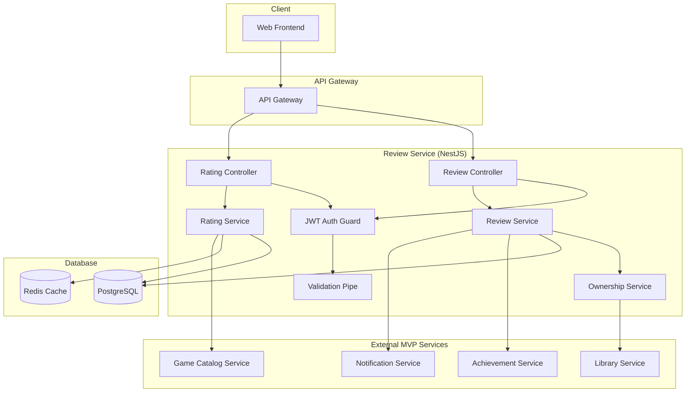

# Design Document - Review Service MVP

## Overview

Review Service is a critical microservice for the MVP Russian gaming platform that enables users to create and view game reviews with comprehensive rating functionality. The service provides essential review and rating features through REST API with Docker support, comprehensive test coverage, and production-ready security and monitoring capabilities.

**Technology Stack:** NestJS + TypeScript + PostgreSQL + Redis (primary stack for business logic)

**Key Design Decisions:**
- **NestJS Framework**: Chosen for its robust dependency injection, built-in validation, and microservice architecture support
- **PostgreSQL**: Selected for ACID compliance and complex query support for review analytics
- **Redis Caching**: Implemented for high-performance game rating retrieval (< 200ms response time requirement)
- **JWT Authentication**: Used for secure user authentication and authorization
- **Ownership Verification**: Integrated with Library Service to ensure only game owners can review

## Architecture

### System Architecture



## NestJS Architecture

### Module Structure

```typescript
@Module({
  imports: [
    TypeOrmModule.forFeature([Review, GameRating]),
    HttpModule,
    CacheModule.register(),
  ],
  controllers: [ReviewController, RatingController],
  providers: [
    ReviewService,
    RatingService,
    OwnershipService,
  ],
  exports: [ReviewService, RatingService],
})
export class ReviewModule {}
```

### Controllers

```typescript
@Controller('reviews')
@UseGuards(JwtAuthGuard)
export class ReviewController {
  constructor(private readonly reviewService: ReviewService) {}

  @Post()
  @UsePipes(ValidationPipe)
  async createReview(@Request() req, @Body() createDto: CreateReviewDto) {
    return this.reviewService.createReview(req.user.id, createDto);
  }

  @Get('game/:gameId')
  async getGameReviews(@Param('gameId') gameId: string, @Query() query: PaginationDto) {
    return this.reviewService.getGameReviews(gameId, query);
  }

  @Put(':id')
  @UsePipes(ValidationPipe)
  async updateReview(@Param('id') id: string, @Request() req, @Body() updateDto: UpdateReviewDto) {
    return this.reviewService.updateReview(id, req.user.id, updateDto);
  }

  @Delete(':id')
  async deleteReview(@Param('id') id: string, @Request() req) {
    return this.reviewService.deleteReview(id, req.user.id);
  }
}

@Controller('ratings')
export class RatingController {
  constructor(private readonly ratingService: RatingService) {}

  @Get('game/:gameId')
  @UseInterceptors(CacheInterceptor)
  async getGameRating(@Param('gameId') gameId: string) {
    return this.ratingService.getGameRating(gameId);
  }
}
```

## Components and Interfaces

### REST API Endpoints

#### Reviews
- `POST /reviews` - Create review
- `GET /reviews/game/:gameId` - Get game reviews with pagination
- `PUT /reviews/:id` - Update review
- `DELETE /reviews/:id` - Delete review
- `GET /reviews/user/:userId` - Get user reviews

#### Ratings
- `GET /ratings/game/:gameId` - Get game rating (cached)

### Services

#### ReviewService
- `createReview(userId, createDto)` - Create review with ownership verification
- `getGameReviews(gameId, pagination)` - Get game reviews with pagination
- `updateReview(reviewId, userId, updateDto)` - Update review with permission check
- `deleteReview(reviewId, userId)` - Delete review with permission check
- `getUserReviews(userId)` - Get user reviews
- `notifyFirstReviewAchievement(userId)` - Notify Achievement Service about first review
- `notifyNewReview(review)` - Notify Notification Service about new review

#### RatingService
- `calculateGameRating(gameId)` - Calculate game rating
- `updateGameRating(gameId)` - Update game rating
- `getGameRating(gameId)` - Get game rating (with caching)

#### OwnershipService
- `checkGameOwnership(userId, gameId)` - Check game ownership through Library Service

## Data Models

### Review Entity

```typescript
@Entity('reviews')
export class Review {
  @PrimaryGeneratedColumn('uuid')
  id: string;

  @Column()
  userId: string;

  @Column()
  gameId: string;

  @Column('text')
  text: string;

  @Column('int', { minimum: 1, maximum: 5 })
  rating: number;

  @CreateDateColumn()
  createdAt: Date;

  @UpdateDateColumn()
  updatedAt: Date;

  @Index(['gameId'])
  @Index(['userId'])
  @Index(['gameId', 'userId'], { unique: true })
}
```

### GameRating Entity

```typescript
@Entity('game_ratings')
export class GameRating {
  @PrimaryColumn()
  gameId: string;

  @Column('decimal', { precision: 3, scale: 2 })
  averageRating: number;

  @Column('int')
  totalReviews: number;

  @UpdateDateColumn()
  updatedAt: Date;
}
```

### DTOs

```typescript
export class CreateReviewDto {
  @IsString()
  @IsNotEmpty()
  gameId: string;

  @IsString()
  @Length(10, 1000)
  text: string;

  @IsInt()
  @Min(1)
  @Max(5)
  rating: number;
}

export class UpdateReviewDto {
  @IsOptional()
  @IsString()
  @Length(10, 1000)
  text?: string;

  @IsOptional()
  @IsInt()
  @Min(1)
  @Max(5)
  rating?: number;
}

export class PaginationDto {
  @IsOptional()
  @IsInt()
  @Min(1)
  page?: number = 1;

  @IsOptional()
  @IsInt()
  @Min(1)
  @Max(50)
  limit?: number = 10;
}
```

## Error Handling

### Error Types
- `ValidationError` - Data validation errors
- `ReviewNotFoundError` - Review not found
- `DuplicateReviewError` - Review already exists
- `UnauthorizedError` - No permission for action
- `GameOwnershipError` - User does not own the game
- `ExternalServiceError` - External service error

### Error Response Format

```json
{
  "error": {
    "code": "GAME_OWNERSHIP_ERROR",
    "message": "You must own the game to leave a review",
    "details": {}
  }
}
```

## Testing Strategy

### Unit Tests
- ReviewService methods
- RatingService methods  
- OwnershipService methods
- DTO class validation

### Integration Tests
- REST API endpoints
- TypeORM database operations
- Rating calculations
- Library Service integration

### End-to-End Testing Strategy
- Complete cycle: game purchase → review creation → rating update
- Integration testing with Library Service, Game Catalog Service, Achievement Service, Notification Service
- Rating synchronization verification between Review Service and Game Catalog Service
- Fault tolerance testing when external services are unavailable

### Load Testing Strategy
- Load testing for 1000+ concurrent users creating reviews
- Stress testing for rating calculation operations under high load
- Redis rating caching performance testing
- Auto-scaling verification during mass review creation

### Security Testing Strategy
- Penetration testing of review API endpoints
- Spam and fake review protection testing
- Review content validation and malicious content protection verification
- Rating manipulation and review system abuse protection testing

### Production Readiness Strategy (Месяц 4)

#### Monitoring and Analytics
```typescript
@Injectable()
export class ReviewMetricsService {
  private readonly reviewCounter = new Counter({
    name: 'reviews_total',
    help: 'Total number of reviews created',
    labelNames: ['rating']
  });

  private readonly ratingDistribution = new Histogram({
    name: 'rating_distribution',
    help: 'Distribution of ratings',
    buckets: [1, 2, 3, 4, 5]
  });

  recordReview(rating: number) {
    this.reviewCounter.inc({ rating: rating.toString() });
    this.ratingDistribution.observe(rating);
  }
}
```

#### Content Moderation System
```typescript
@Injectable()
export class ContentModerationService {
  async moderateReview(review: CreateReviewDto): Promise<ModerationResult> {
    // Basic content moderation for beta testing
    const suspiciousWords = ['spam', 'fake', 'bot'];
    const containsSuspiciousContent = suspiciousWords.some(word => 
      review.text.toLowerCase().includes(word)
    );

    return {
      approved: !containsSuspiciousContent,
      reason: containsSuspiciousContent ? 'Suspicious content detected' : null,
      confidence: containsSuspiciousContent ? 0.8 : 0.1
    };
  }

  async flagReview(reviewId: string, reason: string) {
    // Flag review for manual moderation
    await this.reviewRepository.update(reviewId, {
      flagged: true,
      flagReason: reason,
      flaggedAt: new Date()
    });
  }
}
```

#### Quality Control Dashboard
```typescript
@Controller('admin/reviews')
@UseGuards(AdminAuthGuard)
export class ReviewAdminController {
  constructor(
    private readonly reviewService: ReviewService,
    private readonly analyticsService: ReviewAnalyticsService
  ) {}

  @Get('analytics')
  async getReviewAnalytics() {
    return {
      totalReviews: await this.reviewService.getTotalReviewsCount(),
      ratingDistribution: await this.analyticsService.getRatingDistribution(),
      topRatedGames: await this.analyticsService.getTopRatedGames(),
      recentActivity: await this.analyticsService.getRecentActivity(),
      flaggedReviews: await this.reviewService.getFlaggedReviews()
    };
  }

  @Get('flagged')
  async getFlaggedReviews(@Query() query: PaginationDto) {
    return this.reviewService.getFlaggedReviews(query);
  }

  @Post(':id/approve')
  async approveReview(@Param('id') id: string) {
    return this.reviewService.approveReview(id);
  }

  @Delete(':id')
  async deleteReview(@Param('id') id: string) {
    return this.reviewService.deleteReview(id);
  }
}
```

#### Feedback and Improvement System
```typescript
@Injectable()
export class ReviewFeedbackService {
  async collectUserFeedback(userId: string, feedback: ReviewFeedbackDto) {
    // Collect user feedback for review system improvement
    await this.feedbackRepository.save({
      userId,
      type: feedback.type,
      message: feedback.message,
      rating: feedback.rating,
      createdAt: new Date()
    });

    // Send notification to development team
    if (feedback.rating <= 2) {
      await this.notificationService.sendDeveloperAlert({
        type: 'negative_feedback',
        userId,
        feedback
      });
    }
  }

  async getImprovementSuggestions(): Promise<ImprovementSuggestion[]> {
    // Analyze feedback for improvement suggestions
    const commonIssues = await this.feedbackRepository
      .createQueryBuilder('feedback')
      .select('feedback.message')
      .where('feedback.rating <= 2')
      .groupBy('feedback.message')
      .orderBy('COUNT(*)', 'DESC')
      .limit(10)
      .getRawMany();

    return commonIssues.map(issue => ({
      issue: issue.message,
      priority: this.calculatePriority(issue.count),
      suggestedAction: this.generateSuggestion(issue.message)
    }));
  }
}
```

### Test Coverage Requirements
- **Core Development**: Minimum 80% code coverage
- **Production Ready**: 100% coverage of critical review and rating paths
- All integrations covered by tests
- Moderation system covered by tests
- Analytics and monitoring covered by tests