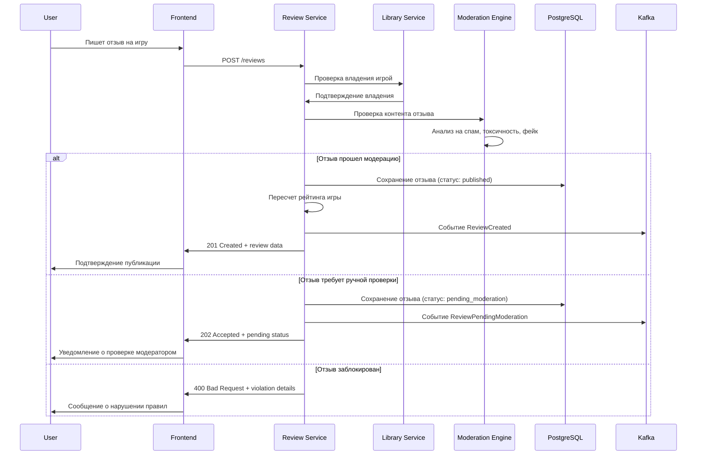
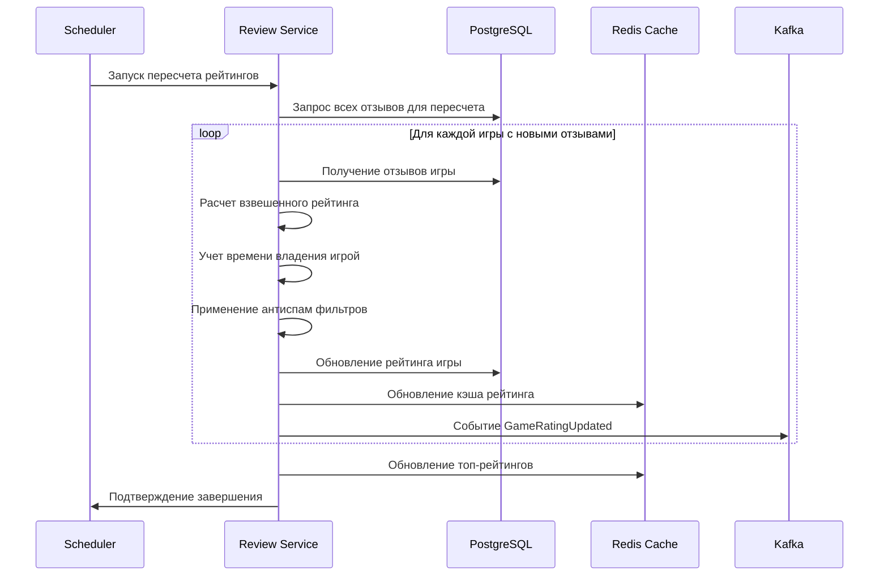
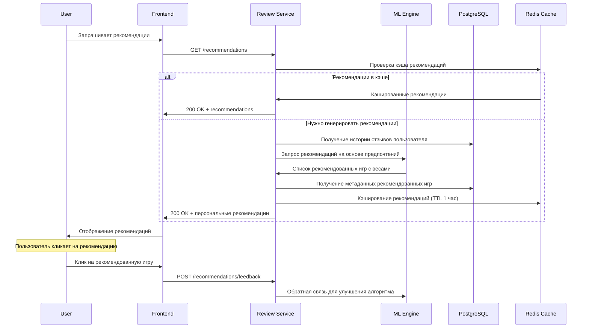
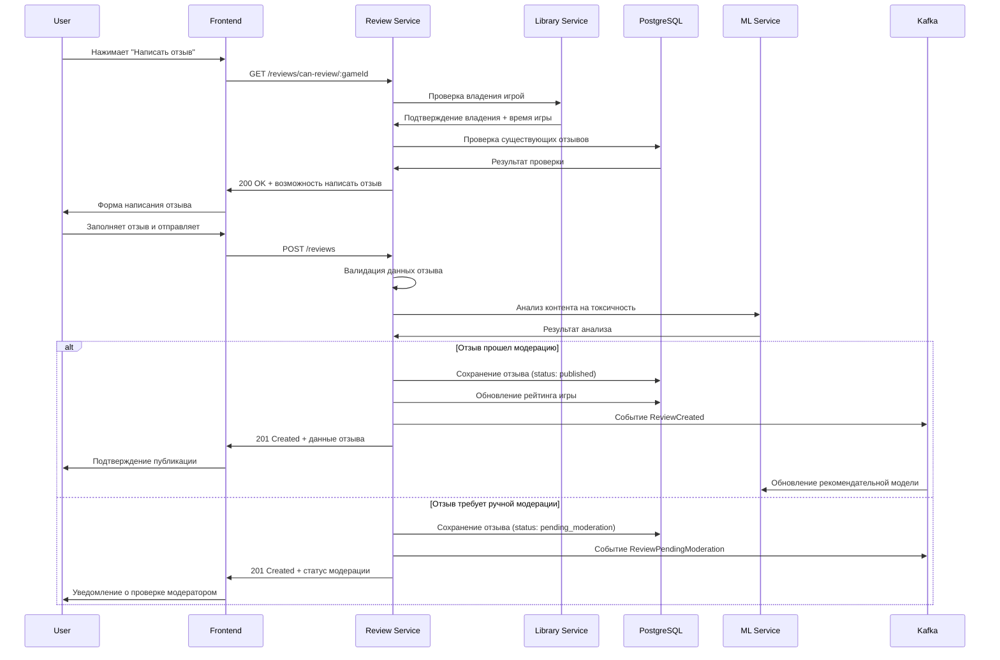
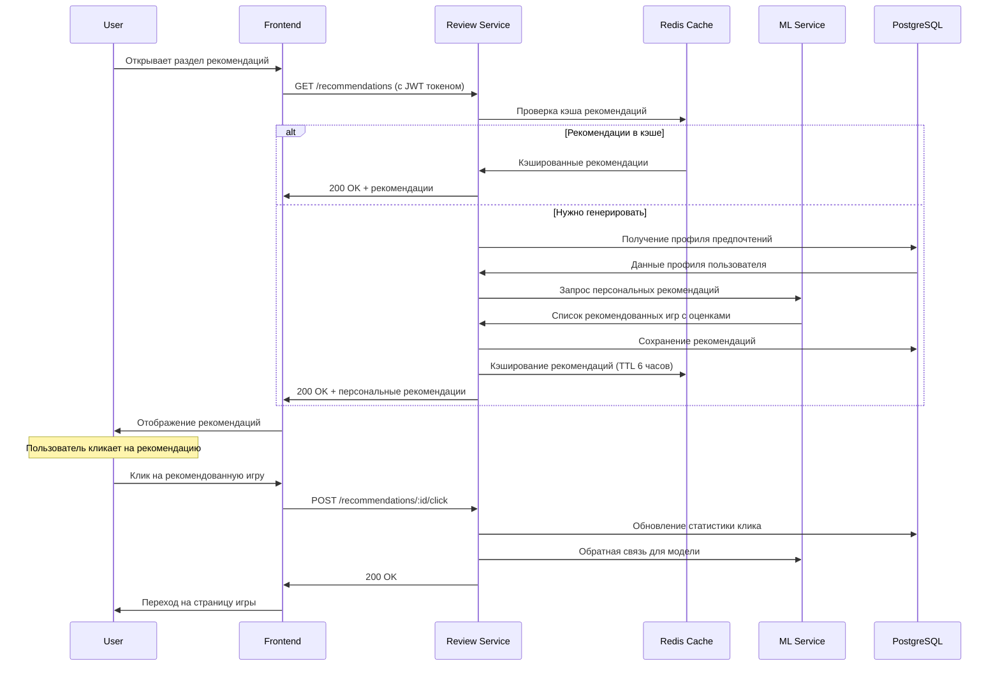

# Дизайн Review Service

## Обзор

Review Service является сервисом для управления отзывами и рейтингами игр российской игровой платформы. Сервис обеспечивает создание и модерацию отзывов, расчет рейтингов, рекомендательную систему, защиту от фейковых отзывов и мультиязычную поддержку.

### Ключевые принципы дизайна

- **Достоверность**: Защита от фейковых и накрученных отзывов
- **Производительность**: Быстрый расчет рейтингов и загрузка отзывов
- **Персонализация**: ML-рекомендации на основе предпочтений
- **Мультиязычность**: Поддержка переводов и локализации
- **Модерация**: Автоматическая и ручная проверка контента

## Архитектура

### Общая архитектура

```mermaid
graph TB
    subgraph "External Services"
        ML[ML Content Analysis]
        Translation[Translation API]
        Sentiment[Sentiment Analysis]
        Spam[Spam Detection]
    end
    
    subgraph "API Gateway"
        Gateway[API Gateway]
    end
    
    subgraph "Review Service"
        API[REST API]
        ReviewManager[Review Manager]
        RatingCalculator[Rating Calculator]
        ModerationEngine[Moderation Engine]
        RecommendationEngine[Recommendation Engine]
        TranslationManager[Translation Manager]
        Events[Event Publisher]
        
        API --> ReviewManager
        API --> RatingCalculator
        ReviewManager --> ModerationEngine
        ReviewManager --> RecommendationEngine
        ReviewManager --> TranslationManager
        ReviewManager --> Events
        RatingCalculator --> Events
    end
    
    subgraph "Data Layer"
        PostgreSQL[(PostgreSQL)]
        Redis[(Redis Cache)]
        Elasticsearch[(Elasticsearch)]
        Kafka[Apache Kafka]
    end
    
    subgraph "Other Services"
        User[User Service]
        Library[Library Service]
        Catalog[Game Catalog]
        Social[Social Service]
        Notification[Notification Service]
    end
    
    Gateway --> API
    ModerationEngine --> ML
    ModerationEngine --> Sentiment
    ModerationEngine --> Spam
    TranslationManager --> Translation
    
    API --> PostgreSQL
    API --> Redis
    API --> Elasticsearch
    Events --> Kafka
    
    Kafka --> User
    Kafka --> Library
    Kafka --> Catalog
    Kafka --> Social
    Kafka --> Notification
```## AP
I Эндпоинты и маршруты

### Структура API

```
Base URL: https://api.gaming-platform.ru/review-service/v1
```

### Review Management Endpoints

```typescript
// Управление отзывами
GET    /reviews                     // Список отзывов с фильтрами
POST   /reviews                     // Создание нового отзыва
GET    /reviews/:id                 // Получение конкретного отзыва
PUT    /reviews/:id                 // Обновление отзыва
DELETE /reviews/:id                 // Удаление отзыва

// Отзывы по играм
GET    /games/:gameId/reviews       // Отзывы для конкретной игры
GET    /games/:gameId/rating        // Рейтинг игры
GET    /games/:gameId/rating/breakdown // Детальная разбивка рейтинга
GET    /games/:gameId/reviews/summary // Сводка отзывов

// Пользовательские отзывы
GET    /users/:userId/reviews       // Отзывы пользователя
GET    /users/me/reviews            // Мои отзывы
GET    /users/me/reviews/drafts     // Черновики отзывов
```

### Review Interaction Endpoints

```typescript
// Взаимодействие с отзывами
POST   /reviews/:id/helpful         // Отметить отзыв как полезный
DELETE /reviews/:id/helpful         // Убрать отметку полезности
POST   /reviews/:id/report          // Пожаловаться на отзыв
GET    /reviews/:id/comments        // Комментарии к отзыву
POST   /reviews/:id/comments        // Добавить комментарий
PUT    /reviews/:id/comments/:commentId // Обновить комментарий
DELETE /reviews/:id/comments/:commentId // Удалить комментарий

// Переводы отзывов
GET    /reviews/:id/translations    // Доступные переводы
POST   /reviews/:id/translate       // Запросить перевод
GET    /reviews/:id/translate/:lang // Получить перевод на язык
```

### Rating & Analytics Endpoints

```typescript
// Рейтинги и аналитика
GET    /ratings/trending            // Игры с растущими рейтингами
GET    /ratings/top                 // Топ игр по рейтингу
GET    /ratings/controversial       // Спорные игры (большой разброс оценок)
GET    /analytics/sentiment         // Анализ настроений в отзывах
GET    /analytics/topics            // Популярные темы в отзывах
```

### Recommendation Endpoints

```typescript
// Рекомендации
GET    /recommendations             // Персональные рекомендации игр
GET    /recommendations/similar     // Игры похожие на понравившиеся
GET    /recommendations/friends     // Рекомендации на основе друзей
POST   /recommendations/feedback    // Обратная связь по рекомендациям
```

### Moderation Endpoints

```typescript
// Модерация (для модераторов)
GET    /moderation/queue            // Очередь модерации
GET    /moderation/reviews/:id      // Отзыв для модерации
POST   /moderation/reviews/:id/approve // Одобрить отзыв
POST   /moderation/reviews/:id/reject  // Отклонить отзыв
GET    /moderation/reports          // Жалобы на отзывы
POST   /moderation/reports/:id/resolve // Разрешить жалобу

// Борьба со спамом
GET    /admin/spam/detection        // Статистика обнаружения спама
POST   /admin/spam/train            // Обучение антиспам системы
GET    /admin/fake-reviews          // Подозрительные отзывы
POST   /admin/users/:id/flag        // Пометить пользователя как спамера
```

## User Flows (Пользовательские сценарии)

### 1. Создание отзыва на игру



### 2. Расчет рейтинга игры



### 3. Персональные рекомендации



## Модели данных

### Основные сущности

```typescript
interface Review {
  id: string
  userId: string
  gameId: string
  
  // Основной контент
  title: string
  content: string
  rating: number // 1-5 звезд
  
  // Детальные оценки
  aspectRatings: {
    gameplay: number
    graphics: number
    sound: number
    story: number
    value: number
  }
  
  // Контекст
  playtimeHours: number
  platform: string
  gameVersion: string
  
  // Статус
  status: 'draft' | 'published' | 'pending_moderation' | 'rejected' | 'hidden'
  
  // Модерация
  moderationFlags: string[]
  moderationScore: number
  moderatedBy?: string
  moderatedAt?: Date
  
  // Взаимодействие
  helpfulCount: number
  notHelpfulCount: number
  commentsCount: number
  
  // Переводы
  translations: ReviewTranslation[]
  
  // Метаданные
  createdAt: Date
  updatedAt: Date
  publishedAt?: Date
  
  // Анализ контента
  sentimentScore: number // -1 to 1
  topics: string[]
  language: string
}

interface GameRating {
  gameId: string
  
  // Основной рейтинг
  averageRating: number
  totalReviews: number
  
  // Распределение оценок
  ratingDistribution: {
    1: number
    2: number
    3: number
    4: number
    5: number
  }
  
  // Детальные рейтинги
  aspectRatings: {
    gameplay: number
    graphics: number
    sound: number
    story: number
    value: number
  }
  
  // Временная динамика
  recentRating: number // за последние 30 дней
  trendDirection: 'up' | 'down' | 'stable'
  
  // Статистика
  recommendationRate: number // % положительных отзывов
  
  updatedAt: Date
}

interface ReviewComment {
  id: string
  reviewId: string
  userId: string
  
  // Контент
  content: string
  
  // Статус
  status: 'published' | 'pending_moderation' | 'rejected'
  
  // Взаимодействие
  likesCount: number
  
  createdAt: Date
  updatedAt: Date
}

interface ReviewHelpfulness {
  id: string
  reviewId: string
  userId: string
  isHelpful: boolean
  createdAt: Date
}

interface ReviewTranslation {
  id: string
  reviewId: string
  language: string
  
  // Переведенный контент
  title: string
  content: string
  
  // Качество перевода
  translationQuality: number // 0-1
  isHumanTranslated: boolean
  
  createdAt: Date
}

interface UserRecommendation {
  userId: string
  gameId: string
  
  // Рекомендация
  score: number // 0-1
  reasons: string[]
  
  // Источник рекомендации
  source: 'collaborative_filtering' | 'content_based' | 'hybrid' | 'social'
  
  // Статус
  isShown: boolean
  clickedAt?: Date
  purchasedAt?: Date
  
  createdAt: Date
  expiresAt: Date
}
```

## Детальная схема базы данных

```sql
-- Отзывы на игры
CREATE TABLE reviews (
    id UUID PRIMARY KEY DEFAULT gen_random_uuid(),
    user_id UUID NOT NULL,
    game_id VARCHAR(255) NOT NULL,
    
    -- Основной контент
    title VARCHAR(255) NOT NULL,
    content TEXT NOT NULL,
    rating INTEGER NOT NULL CHECK (rating >= 1 AND rating <= 5),
    
    -- Детальные оценки
    gameplay_rating INTEGER CHECK (gameplay_rating >= 1 AND gameplay_rating <= 5),
    graphics_rating INTEGER CHECK (graphics_rating >= 1 AND graphics_rating <= 5),
    sound_rating INTEGER CHECK (sound_rating >= 1 AND sound_rating <= 5),
    story_rating INTEGER CHECK (story_rating >= 1 AND story_rating <= 5),
    value_rating INTEGER CHECK (value_rating >= 1 AND value_rating <= 5),
    
    -- Контекст
    playtime_hours INTEGER DEFAULT 0,
    platform VARCHAR(50),
    game_version VARCHAR(50),
    
    -- Статус
    status VARCHAR(20) DEFAULT 'published' CHECK (status IN ('draft', 'published', 'pending_moderation', 'rejected', 'hidden')),
    
    -- Модерация
    moderation_flags TEXT[] DEFAULT '{}',
    moderation_score INTEGER DEFAULT 0,
    moderated_by UUID,
    moderated_at TIMESTAMP,
    
    -- Взаимодействие
    helpful_count INTEGER DEFAULT 0,
    not_helpful_count INTEGER DEFAULT 0,
    comments_count INTEGER DEFAULT 0,
    
    -- Метаданные
    created_at TIMESTAMP DEFAULT NOW(),
    updated_at TIMESTAMP DEFAULT NOW(),
    published_at TIMESTAMP,
    
    -- Анализ контента
    sentiment_score DECIMAL(3,2) DEFAULT 0, -- -1.00 to 1.00
    topics TEXT[] DEFAULT '{}',
    language CHAR(2) DEFAULT 'ru',
    
    UNIQUE(user_id, game_id)
);

-- Рейтинги игр (агрегированные данные)
CREATE TABLE game_ratings (
    game_id VARCHAR(255) PRIMARY KEY,
    
    -- Основной рейтинг
    average_rating DECIMAL(3,2) DEFAULT 0,
    total_reviews INTEGER DEFAULT 0,
    
    -- Распределение оценок
    rating_1_count INTEGER DEFAULT 0,
    rating_2_count INTEGER DEFAULT 0,
    rating_3_count INTEGER DEFAULT 0,
    rating_4_count INTEGER DEFAULT 0,
    rating_5_count INTEGER DEFAULT 0,
    
    -- Детальные рейтинги
    avg_gameplay_rating DECIMAL(3,2) DEFAULT 0,
    avg_graphics_rating DECIMAL(3,2) DEFAULT 0,
    avg_sound_rating DECIMAL(3,2) DEFAULT 0,
    avg_story_rating DECIMAL(3,2) DEFAULT 0,
    avg_value_rating DECIMAL(3,2) DEFAULT 0,
    
    -- Временная динамика
    recent_rating DECIMAL(3,2) DEFAULT 0, -- за последние 30 дней
    trend_direction VARCHAR(10) DEFAULT 'stable' CHECK (trend_direction IN ('up', 'down', 'stable')),
    
    -- Статистика
    recommendation_rate DECIMAL(5,2) DEFAULT 0, -- % положительных отзывов
    
    updated_at TIMESTAMP DEFAULT NOW()
);

-- Комментарии к отзывам
CREATE TABLE review_comments (
    id UUID PRIMARY KEY DEFAULT gen_random_uuid(),
    review_id UUID NOT NULL REFERENCES reviews(id) ON DELETE CASCADE,
    user_id UUID NOT NULL,
    
    -- Контент
    content TEXT NOT NULL,
    
    -- Статус
    status VARCHAR(20) DEFAULT 'published' CHECK (status IN ('published', 'pending_moderation', 'rejected')),
    
    -- Взаимодействие
    likes_count INTEGER DEFAULT 0,
    
    created_at TIMESTAMP DEFAULT NOW(),
    updated_at TIMESTAMP DEFAULT NOW()
);

-- Оценки полезности отзывов
CREATE TABLE review_helpfulness (
    id UUID PRIMARY KEY DEFAULT gen_random_uuid(),
    review_id UUID NOT NULL REFERENCES reviews(id) ON DELETE CASCADE,
    user_id UUID NOT NULL,
    is_helpful BOOLEAN NOT NULL,
    created_at TIMESTAMP DEFAULT NOW(),
    
    UNIQUE(review_id, user_id)
);

-- Переводы отзывов
CREATE TABLE review_translations (
    id UUID PRIMARY KEY DEFAULT gen_random_uuid(),
    review_id UUID NOT NULL REFERENCES reviews(id) ON DELETE CASCADE,
    language CHAR(2) NOT NULL,
    
    -- Переведенный контент
    title VARCHAR(255) NOT NULL,
    content TEXT NOT NULL,
    
    -- Качество перевода
    translation_quality DECIMAL(3,2) DEFAULT 0.8,
    is_human_translated BOOLEAN DEFAULT FALSE,
    
    created_at TIMESTAMP DEFAULT NOW(),
    
    UNIQUE(review_id, language)
);

-- Жалобы на отзывы
CREATE TABLE review_reports (
    id UUID PRIMARY KEY DEFAULT gen_random_uuid(),
    review_id UUID NOT NULL REFERENCES reviews(id) ON DELETE CASCADE,
    reporter_id UUID NOT NULL,
    
    -- Жалоба
    reason VARCHAR(50) NOT NULL CHECK (reason IN ('spam', 'fake', 'offensive', 'irrelevant', 'other')),
    description TEXT,
    
    -- Статус
    status VARCHAR(20) DEFAULT 'pending' CHECK (status IN ('pending', 'resolved', 'dismissed')),
    resolved_by UUID,
    resolved_at TIMESTAMP,
    resolution_notes TEXT,
    
    created_at TIMESTAMP DEFAULT NOW()
);

-- Рекомендации для пользователей
CREATE TABLE user_recommendations (
    id UUID PRIMARY KEY DEFAULT gen_random_uuid(),
    user_id UUID NOT NULL,
    game_id VARCHAR(255) NOT NULL,
    
    -- Рекомендация
    score DECIMAL(3,2) NOT NULL, -- 0.00-1.00
    reasons TEXT[] DEFAULT '{}',
    
    -- Источник рекомендации
    source VARCHAR(30) NOT NULL CHECK (source IN ('collaborative_filtering', 'content_based', 'hybrid', 'social')),
    
    -- Статус
    is_shown BOOLEAN DEFAULT FALSE,
    clicked_at TIMESTAMP,
    purchased_at TIMESTAMP,
    
    created_at TIMESTAMP DEFAULT NOW(),
    expires_at TIMESTAMP NOT NULL,
    
    UNIQUE(user_id, game_id)
);

-- Профили предпочтений пользователей
CREATE TABLE user_preference_profiles (
    user_id UUID PRIMARY KEY,
    
    -- Предпочтения по жанрам
    genre_preferences JSONB DEFAULT '{}',
    
    -- Предпочтения по аспектам игр
    aspect_weights JSONB DEFAULT '{
        "gameplay": 0.3,
        "graphics": 0.2,
        "sound": 0.1,
        "story": 0.2,
        "value": 0.2
    }',
    
    -- Поведенческие паттерны
    avg_playtime_preference INTEGER DEFAULT 0,
    price_sensitivity DECIMAL(3,2) DEFAULT 0.5,
    
    -- Социальные предпочтения
    follows_reviewers TEXT[] DEFAULT '{}',
    similar_users TEXT[] DEFAULT '{}',
    
    updated_at TIMESTAMP DEFAULT NOW()
);

-- Индексы для производительности
CREATE INDEX idx_reviews_game_status ON reviews(game_id, status, published_at DESC) WHERE status = 'published';
CREATE INDEX idx_reviews_user ON reviews(user_id, created_at DESC);
CREATE INDEX idx_reviews_rating ON reviews(game_id, rating, published_at DESC) WHERE status = 'published';
CREATE INDEX idx_reviews_playtime ON reviews(game_id, playtime_hours DESC) WHERE status = 'published';
CREATE INDEX idx_reviews_moderation ON reviews(status, created_at) WHERE status = 'pending_moderation';
CREATE INDEX idx_reviews_sentiment ON reviews(game_id, sentiment_score DESC) WHERE status = 'published';

CREATE INDEX idx_game_ratings_avg ON game_ratings(average_rating DESC);
CREATE INDEX idx_game_ratings_total ON game_ratings(total_reviews DESC);
CREATE INDEX idx_game_ratings_recent ON game_ratings(recent_rating DESC);

CREATE INDEX idx_review_comments_review ON review_comments(review_id, created_at DESC);
CREATE INDEX idx_review_comments_user ON review_comments(user_id, created_at DESC);

CREATE INDEX idx_review_helpfulness_review ON review_helpfulness(review_id, is_helpful);

CREATE INDEX idx_review_reports_status ON review_reports(status, created_at) WHERE status = 'pending';
CREATE INDEX idx_review_reports_review ON review_reports(review_id);

CREATE INDEX idx_user_recommendations_user_score ON user_recommendations(user_id, score DESC, expires_at) WHERE expires_at > NOW();
CREATE INDEX idx_user_recommendations_shown ON user_recommendations(is_shown, created_at) WHERE is_shown = FALSE;

-- Триггеры для автоматического обновления рейтингов
CREATE OR REPLACE FUNCTION update_game_rating()
RETURNS TRIGGER AS $$
BEGIN
    IF TG_OP = 'INSERT' AND NEW.status = 'published' THEN
        INSERT INTO game_ratings (game_id, average_rating, total_reviews, rating_1_count, rating_2_count, rating_3_count, rating_4_count, rating_5_count)
        VALUES (NEW.game_id, NEW.rating, 1, 
                CASE WHEN NEW.rating = 1 THEN 1 ELSE 0 END,
                CASE WHEN NEW.rating = 2 THEN 1 ELSE 0 END,
                CASE WHEN NEW.rating = 3 THEN 1 ELSE 0 END,
                CASE WHEN NEW.rating = 4 THEN 1 ELSE 0 END,
                CASE WHEN NEW.rating = 5 THEN 1 ELSE 0 END)
        ON CONFLICT (game_id) DO UPDATE SET
            average_rating = (
                SELECT AVG(rating)::DECIMAL(3,2) 
                FROM reviews 
                WHERE game_id = NEW.game_id AND status = 'published'
            ),
            total_reviews = total_reviews + 1,
            rating_1_count = rating_1_count + CASE WHEN NEW.rating = 1 THEN 1 ELSE 0 END,
            rating_2_count = rating_2_count + CASE WHEN NEW.rating = 2 THEN 1 ELSE 0 END,
            rating_3_count = rating_3_count + CASE WHEN NEW.rating = 3 THEN 1 ELSE 0 END,
            rating_4_count = rating_4_count + CASE WHEN NEW.rating = 4 THEN 1 ELSE 0 END,
            rating_5_count = rating_5_count + CASE WHEN NEW.rating = 5 THEN 1 ELSE 0 END,
            updated_at = NOW();
    END IF;
    
    RETURN NEW;
END;
$$ LANGUAGE plpgsql;

CREATE TRIGGER trigger_update_game_rating
    AFTER INSERT OR UPDATE ON reviews
    FOR EACH ROW EXECUTE FUNCTION update_game_rating();
```

## User Flows (Пользовательские сценарии)

### 1. Написание отзыва



### 2. Система рекомендаций


    
    -- Социальные предпочтения
    follows_friends_recommendations BOOLEAN DEFAULT TRUE,
    trusts_critic_reviews BOOLEAN DEFAULT TRUE,
    
    updated_at TIMESTAMP DEFAULT NOW()
);

-- Топики и темы в отзывах
CREATE TABLE review_topics (
    id UUID PRIMARY KEY DEFAULT gen_random_uuid(),
    name VARCHAR(100) UNIQUE NOT NULL,
    category VARCHAR(50) NOT NULL,
    keywords TEXT[] DEFAULT '{}',
    
    -- Статистика
    mentions_count INTEGER DEFAULT 0,
    sentiment_score DECIMAL(3,2) DEFAULT 0,
    
    created_at TIMESTAMP DEFAULT NOW(),
    updated_at TIMESTAMP DEFAULT NOW()
);

-- Связь отзывов с топиками
CREATE TABLE review_topic_mentions (
    id UUID PRIMARY KEY DEFAULT gen_random_uuid(),
    review_id UUID NOT NULL REFERENCES reviews(id) ON DELETE CASCADE,
    topic_id UUID NOT NULL REFERENCES review_topics(id) ON DELETE CASCADE,
    relevance_score DECIMAL(3,2) NOT NULL, -- 0.00-1.00
    
    UNIQUE(review_id, topic_id)
);

-- Индексы для производительности
CREATE INDEX idx_reviews_game_status ON reviews(game_id, status) WHERE status = 'published';
CREATE INDEX idx_reviews_user ON reviews(user_id, created_at DESC);
CREATE INDEX idx_reviews_rating ON reviews(game_id, rating DESC, created_at DESC);
CREATE INDEX idx_reviews_helpful ON reviews(helpful_count DESC, created_at DESC);
CREATE INDEX idx_reviews_recent ON reviews(created_at DESC) WHERE status = 'published';
CREATE INDEX idx_reviews_moderation ON reviews(status, created_at) WHERE status = 'pending_moderation';

CREATE INDEX idx_game_ratings_average ON game_ratings(average_rating DESC);
CREATE INDEX idx_game_ratings_recent ON game_ratings(recent_rating DESC);
CREATE INDEX idx_game_ratings_trend ON game_ratings(trend_direction, updated_at);

CREATE INDEX idx_review_comments_review ON review_comments(review_id, created_at DESC);
CREATE INDEX idx_review_comments_user ON review_comments(user_id, created_at DESC);

CREATE INDEX idx_review_helpfulness_review ON review_helpfulness(review_id, is_helpful);
CREATE INDEX idx_review_helpfulness_user ON review_helpfulness(user_id, created_at DESC);

CREATE INDEX idx_review_translations_review_lang ON review_translations(review_id, language);

CREATE INDEX idx_review_reports_status ON review_reports(status, created_at) WHERE status = 'pending';
CREATE INDEX idx_review_reports_review ON review_reports(review_id);

CREATE INDEX idx_user_recommendations_user_score ON user_recommendations(user_id, score DESC) WHERE expires_at > NOW();
CREATE INDEX idx_user_recommendations_game ON user_recommendations(game_id, score DESC);

CREATE INDEX idx_review_topic_mentions_topic ON review_topic_mentions(topic_id, relevance_score DESC);
CREATE INDEX idx_review_topic_mentions_review ON review_topic_mentions(review_id);

-- Полнотекстовый поиск по отзывам
CREATE INDEX idx_reviews_search ON reviews USING gin(to_tsvector('russian', title || ' ' || content));

-- Триггеры для автоматического обновления рейтингов
CREATE OR REPLACE FUNCTION update_game_rating()
RETURNS TRIGGER AS $$
BEGIN
    -- Обновляем рейтинг игры при изменении отзыва
    INSERT INTO game_ratings (game_id, average_rating, total_reviews, 
                             rating_1_count, rating_2_count, rating_3_count, rating_4_count, rating_5_count,
                             avg_gameplay_rating, avg_graphics_rating, avg_sound_rating, avg_story_rating, avg_value_rating,
                             recommendation_rate)
    SELECT 
        game_id,
        AVG(rating::DECIMAL),
        COUNT(*),
        COUNT(*) FILTER (WHERE rating = 1),
        COUNT(*) FILTER (WHERE rating = 2),
        COUNT(*) FILTER (WHERE rating = 3),
        COUNT(*) FILTER (WHERE rating = 4),
        COUNT(*) FILTER (WHERE rating = 5),
        AVG(gameplay_rating::DECIMAL),
        AVG(graphics_rating::DECIMAL),
        AVG(sound_rating::DECIMAL),
        AVG(story_rating::DECIMAL),
        AVG(value_rating::DECIMAL),
        (COUNT(*) FILTER (WHERE rating >= 4) * 100.0 / COUNT(*))
    FROM reviews 
    WHERE game_id = COALESCE(NEW.game_id, OLD.game_id) AND status = 'published'
    GROUP BY game_id
    ON CONFLICT (game_id) 
    DO UPDATE SET
        average_rating = EXCLUDED.average_rating,
        total_reviews = EXCLUDED.total_reviews,
        rating_1_count = EXCLUDED.rating_1_count,
        rating_2_count = EXCLUDED.rating_2_count,
        rating_3_count = EXCLUDED.rating_3_count,
        rating_4_count = EXCLUDED.rating_4_count,
        rating_5_count = EXCLUDED.rating_5_count,
        avg_gameplay_rating = EXCLUDED.avg_gameplay_rating,
        avg_graphics_rating = EXCLUDED.avg_graphics_rating,
        avg_sound_rating = EXCLUDED.avg_sound_rating,
        avg_story_rating = EXCLUDED.avg_story_rating,
        avg_value_rating = EXCLUDED.avg_value_rating,
        recommendation_rate = EXCLUDED.recommendation_rate,
        updated_at = NOW();
    
    RETURN COALESCE(NEW, OLD);
END;
$$ LANGUAGE plpgsql;

CREATE TRIGGER trigger_update_game_rating
    AFTER INSERT OR UPDATE OR DELETE ON reviews
    FOR EACH ROW EXECUTE FUNCTION update_game_rating();

-- Функция для обновления счетчиков полезности
CREATE OR REPLACE FUNCTION update_review_helpfulness_count()
RETURNS TRIGGER AS $$
BEGIN
    IF TG_OP = 'INSERT' THEN
        IF NEW.is_helpful THEN
            UPDATE reviews SET helpful_count = helpful_count + 1 WHERE id = NEW.review_id;
        ELSE
            UPDATE reviews SET not_helpful_count = not_helpful_count + 1 WHERE id = NEW.review_id;
        END IF;
        RETURN NEW;
    ELSIF TG_OP = 'UPDATE' THEN
        IF OLD.is_helpful != NEW.is_helpful THEN
            IF NEW.is_helpful THEN
                UPDATE reviews SET helpful_count = helpful_count + 1, not_helpful_count = not_helpful_count - 1 WHERE id = NEW.review_id;
            ELSE
                UPDATE reviews SET helpful_count = helpful_count - 1, not_helpful_count = not_helpful_count + 1 WHERE id = NEW.review_id;
            END IF;
        END IF;
        RETURN NEW;
    ELSIF TG_OP = 'DELETE' THEN
        IF OLD.is_helpful THEN
            UPDATE reviews SET helpful_count = helpful_count - 1 WHERE id = OLD.review_id;
        ELSE
            UPDATE reviews SET not_helpful_count = not_helpful_count - 1 WHERE id = OLD.review_id;
        END IF;
        RETURN OLD;
    END IF;
    RETURN NULL;
END;
$$ LANGUAGE plpgsql;

CREATE TRIGGER trigger_update_review_helpfulness_count
    AFTER INSERT OR UPDATE OR DELETE ON review_helpfulness
    FOR EACH ROW EXECUTE FUNCTION update_review_helpfulness_count();

-- Функция для очистки старых данных
CREATE OR REPLACE FUNCTION cleanup_old_review_data()
RETURNS void AS $$
BEGIN
    -- Удаляем просроченные рекомендации
    DELETE FROM user_recommendations WHERE expires_at < NOW();
    
    -- Удаляем старые черновики отзывов (старше 30 дней)
    DELETE FROM reviews WHERE status = 'draft' AND created_at < NOW() - INTERVAL '30 days';
    
    -- Архивируем старые жалобы
    UPDATE review_reports 
    SET status = 'dismissed' 
    WHERE status = 'pending' AND created_at < NOW() - INTERVAL '90 days';
END;
$$ LANGUAGE plpgsql;
```

### Elasticsearch Schema для поиска отзывов

```json
{
  "mappings": {
    "properties": {
      "id": { "type": "keyword" },
      "userId": { "type": "keyword" },
      "gameId": { "type": "keyword" },
      "title": {
        "type": "text",
        "analyzer": "russian",
        "fields": {
          "keyword": { "type": "keyword" }
        }
      },
      "content": {
        "type": "text",
        "analyzer": "russian"
      },
      "rating": { "type": "integer" },
      "aspectRatings": {
        "properties": {
          "gameplay": { "type": "integer" },
          "graphics": { "type": "integer" },
          "sound": { "type": "integer" },
          "story": { "type": "integer" },
          "value": { "type": "integer" }
        }
      },
      "playtimeHours": { "type": "integer" },
      "platform": { "type": "keyword" },
      "status": { "type": "keyword" },
      "helpfulCount": { "type": "integer" },
      "sentimentScore": { "type": "float" },
      "topics": { "type": "keyword" },
      "language": { "type": "keyword" },
      "createdAt": { "type": "date" },
      "publishedAt": { "type": "date" }
    }
  },
  "settings": {
    "analysis": {
      "analyzer": {
        "russian": {
          "tokenizer": "standard",
          "filter": ["lowercase", "russian_morphology", "russian_stop"]
        }
      }
    }
  }
}
```

Этот дизайн обеспечивает надежную систему отзывов и рейтингов с защитой от фейков, персонализированными рекомендациями и мультиязычной поддержкой для Review Service российской игровой платформы.