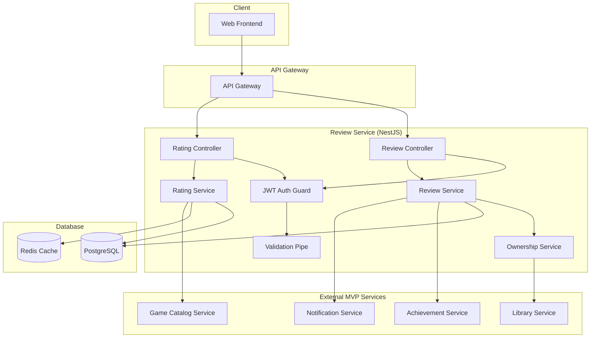

# Design Document - Review Service MVP

## Overview

Review Service - базовый сервис отзывов для MVP российской игровой платформы. Позволяет пользователям оставлять простые отзывы на игры и просматривать мнения других.

**Технологический стек:** NestJS + TypeScript + PostgreSQL + Redis (основной стек для бизнес-логики)

## Architecture

### System Architecture



## NestJS Architecture

### Module Structure

```typescript
@Module({
  imports: [
    TypeOrmModule.forFeature([Review, GameRating]),
    HttpModule,
    CacheModule.register(),
  ],
  controllers: [ReviewController, RatingController],
  providers: [
    ReviewService,
    RatingService,
    OwnershipService,
  ],
  exports: [ReviewService, RatingService],
})
export class ReviewModule {}
```

### Controllers

```typescript
@Controller('reviews')
@UseGuards(JwtAuthGuard)
export class ReviewController {
  constructor(private readonly reviewService: ReviewService) {}

  @Post()
  @UsePipes(ValidationPipe)
  async createReview(@Request() req, @Body() createDto: CreateReviewDto) {
    return this.reviewService.createReview(req.user.id, createDto);
  }

  @Get('game/:gameId')
  async getGameReviews(@Param('gameId') gameId: string, @Query() query: PaginationDto) {
    return this.reviewService.getGameReviews(gameId, query);
  }

  @Put(':id')
  @UsePipes(ValidationPipe)
  async updateReview(@Param('id') id: string, @Request() req, @Body() updateDto: UpdateReviewDto) {
    return this.reviewService.updateReview(id, req.user.id, updateDto);
  }

  @Delete(':id')
  async deleteReview(@Param('id') id: string, @Request() req) {
    return this.reviewService.deleteReview(id, req.user.id);
  }
}

@Controller('ratings')
export class RatingController {
  constructor(private readonly ratingService: RatingService) {}

  @Get('game/:gameId')
  @UseInterceptors(CacheInterceptor)
  async getGameRating(@Param('gameId') gameId: string) {
    return this.ratingService.getGameRating(gameId);
  }
}
```

## Components and Interfaces

### REST API Endpoints

#### Reviews
- `POST /reviews` - Создать отзыв
- `GET /reviews/game/:gameId` - Отзывы на игру с пагинацией
- `PUT /reviews/:id` - Обновить отзыв
- `DELETE /reviews/:id` - Удалить отзыв
- `GET /reviews/user/:userId` - Отзывы пользователя

#### Ratings
- `GET /ratings/game/:gameId` - Рейтинг игры (кешируется)

### Services

#### ReviewService
- `createReview(userId, createDto)` - Создать отзыв с проверкой владения
- `getGameReviews(gameId, pagination)` - Отзывы на игру с пагинацией
- `updateReview(reviewId, userId, updateDto)` - Обновить отзыв с проверкой прав
- `deleteReview(reviewId, userId)` - Удалить отзыв с проверкой прав
- `getUserReviews(userId)` - Отзывы пользователя
- `notifyFirstReviewAchievement(userId)` - Уведомить Achievement Service о первом отзыве
- `notifyNewReview(review)` - Уведомить Notification Service о новом отзыве

#### RatingService
- `calculateGameRating(gameId)` - Рассчитать рейтинг игры
- `updateGameRating(gameId)` - Обновить рейтинг игры
- `getGameRating(gameId)` - Получить рейтинг игры (с кешированием)

#### OwnershipService
- `checkGameOwnership(userId, gameId)` - Проверить владение игрой через Library Service

## Data Models

### Review Entity

```typescript
@Entity('reviews')
export class Review {
  @PrimaryGeneratedColumn('uuid')
  id: string;

  @Column()
  userId: string;

  @Column()
  gameId: string;

  @Column('text')
  text: string;

  @Column('int', { minimum: 1, maximum: 5 })
  rating: number;

  @CreateDateColumn()
  createdAt: Date;

  @UpdateDateColumn()
  updatedAt: Date;

  @Index(['gameId'])
  @Index(['userId'])
  @Index(['gameId', 'userId'], { unique: true })
}
```

### GameRating Entity

```typescript
@Entity('game_ratings')
export class GameRating {
  @PrimaryColumn()
  gameId: string;

  @Column('decimal', { precision: 3, scale: 2 })
  averageRating: number;

  @Column('int')
  totalReviews: number;

  @UpdateDateColumn()
  updatedAt: Date;
}
```

### DTOs

```typescript
export class CreateReviewDto {
  @IsString()
  @IsNotEmpty()
  gameId: string;

  @IsString()
  @Length(10, 1000)
  text: string;

  @IsInt()
  @Min(1)
  @Max(5)
  rating: number;
}

export class UpdateReviewDto {
  @IsOptional()
  @IsString()
  @Length(10, 1000)
  text?: string;

  @IsOptional()
  @IsInt()
  @Min(1)
  @Max(5)
  rating?: number;
}

export class PaginationDto {
  @IsOptional()
  @IsInt()
  @Min(1)
  page?: number = 1;

  @IsOptional()
  @IsInt()
  @Min(1)
  @Max(50)
  limit?: number = 10;
}
```

## Error Handling

### Error Types
- `ValidationError` - Ошибки валидации данных
- `ReviewNotFoundError` - Отзыв не найден
- `DuplicateReviewError` - Отзыв уже существует
- `UnauthorizedError` - Нет прав на действие
- `GameOwnershipError` - Пользователь не владеет игрой
- `ExternalServiceError` - Ошибка внешнего сервиса

### Error Response Format

```json
{
  "error": {
    "code": "GAME_OWNERSHIP_ERROR",
    "message": "You must own the game to leave a review",
    "details": {}
  }
}
```

## Testing Strategy

### Unit Tests (Месяц 1-3)
- ReviewService методы
- RatingService методы
- OwnershipService методы
- Валидация DTO классов

### Integration Tests (Месяц 1-3)
- REST API endpoints
- Database операции TypeORM
- Расчет рейтингов
- Интеграция с Library Service

### Integration Testing Strategy (Месяц 4)

#### End-to-End Testing
- Полный цикл: покупка игры → создание отзыва → обновление рейтинга
- Тестирование интеграций с Library Service, Game Catalog Service, Achievement Service, Notification Service
- Проверка синхронизации рейтингов между Review Service и Game Catalog Service
- Тестирование отказоустойчивости при недоступности внешних сервисов

#### Load Testing Strategy (Месяц 4)
- Нагрузочное тестирование на 1000+ одновременных пользователей создающих отзывы
- Stress testing для операций расчета рейтингов под высокой нагрузкой
- Тестирование производительности кеширования рейтингов в Redis
- Проверка автомасштабирования при массовом создании отзывов

#### Security Testing Strategy (Месяц 4)
- Пентестинг API эндпоинтов отзывов
- Тестирование защиты от спама и фейковых отзывов
- Проверка валидации контента отзывов и защиты от вредоносного содержимого
- Тестирование защиты от накрутки рейтингов и злоупотреблений системой отзывов

### Production Readiness Strategy (Месяц 4)

#### Monitoring and Analytics
```typescript
@Injectable()
export class ReviewMetricsService {
  private readonly reviewCounter = new Counter({
    name: 'reviews_total',
    help: 'Total number of reviews created',
    labelNames: ['rating']
  });

  private readonly ratingDistribution = new Histogram({
    name: 'rating_distribution',
    help: 'Distribution of ratings',
    buckets: [1, 2, 3, 4, 5]
  });

  recordReview(rating: number) {
    this.reviewCounter.inc({ rating: rating.toString() });
    this.ratingDistribution.observe(rating);
  }
}
```

#### Content Moderation System
```typescript
@Injectable()
export class ContentModerationService {
  async moderateReview(review: CreateReviewDto): Promise<ModerationResult> {
    // Базовая модерация контента для бета-тестирования
    const suspiciousWords = ['спам', 'фейк', 'накрутка'];
    const containsSuspiciousContent = suspiciousWords.some(word => 
      review.text.toLowerCase().includes(word)
    );

    return {
      approved: !containsSuspiciousContent,
      reason: containsSuspiciousContent ? 'Suspicious content detected' : null,
      confidence: containsSuspiciousContent ? 0.8 : 0.1
    };
  }

  async flagReview(reviewId: string, reason: string) {
    // Пометка отзыва для ручной модерации
    await this.reviewRepository.update(reviewId, {
      flagged: true,
      flagReason: reason,
      flaggedAt: new Date()
    });
  }
}
```

#### Quality Control Dashboard
```typescript
@Controller('admin/reviews')
@UseGuards(AdminAuthGuard)
export class ReviewAdminController {
  constructor(
    private readonly reviewService: ReviewService,
    private readonly analyticsService: ReviewAnalyticsService
  ) {}

  @Get('analytics')
  async getReviewAnalytics() {
    return {
      totalReviews: await this.reviewService.getTotalReviewsCount(),
      ratingDistribution: await this.analyticsService.getRatingDistribution(),
      topRatedGames: await this.analyticsService.getTopRatedGames(),
      recentActivity: await this.analyticsService.getRecentActivity(),
      flaggedReviews: await this.reviewService.getFlaggedReviews()
    };
  }

  @Get('flagged')
  async getFlaggedReviews(@Query() query: PaginationDto) {
    return this.reviewService.getFlaggedReviews(query);
  }

  @Post(':id/approve')
  async approveReview(@Param('id') id: string) {
    return this.reviewService.approveReview(id);
  }

  @Delete(':id')
  async deleteReview(@Param('id') id: string) {
    return this.reviewService.deleteReview(id);
  }
}
```

#### Feedback and Improvement System
```typescript
@Injectable()
export class ReviewFeedbackService {
  async collectUserFeedback(userId: string, feedback: ReviewFeedbackDto) {
    // Сбор обратной связи для улучшения системы отзывов
    await this.feedbackRepository.save({
      userId,
      type: feedback.type,
      message: feedback.message,
      rating: feedback.rating,
      createdAt: new Date()
    });

    // Отправка уведомления команде разработки
    if (feedback.rating <= 2) {
      await this.notificationService.sendDeveloperAlert({
        type: 'negative_feedback',
        userId,
        feedback
      });
    }
  }

  async getImprovementSuggestions(): Promise<ImprovementSuggestion[]> {
    // Анализ обратной связи для предложений по улучшению
    const commonIssues = await this.feedbackRepository
      .createQueryBuilder('feedback')
      .select('feedback.message')
      .where('feedback.rating <= 2')
      .groupBy('feedback.message')
      .orderBy('COUNT(*)', 'DESC')
      .limit(10)
      .getRawMany();

    return commonIssues.map(issue => ({
      issue: issue.message,
      priority: this.calculatePriority(issue.count),
      suggestedAction: this.generateSuggestion(issue.message)
    }));
  }
}
```

### Test Coverage Requirements
- **Месяц 1-3**: Минимум 80% покрытие кода
- **Месяц 4**: 100% покрытие критических путей отзывов и рейтингов
- Все интеграции покрыты тестами
- Система модерации покрыта тестами
- Аналитика и мониторинг покрыты тестами