# Дизайн Screenshot Service

## Обзор

Screenshot Service - это микросервис для управления скриншотами и записями игрового процесса российской Steam-платформы. Сервис обеспечивает захват, обработку, хранение и социальный шаринг игрового контента с интеграцией в российские социальные сети и соответствием местному законодательству.

## Архитектура

### Высокоуровневая архитектура

```mermaid
graph TB
    subgraph "Client Applications"
        GAME[Game Clients]
        WEB[Web Interface]
        MOBILE[Mobile App]
        DESKTOP[Desktop Client]
    end
    
    subgraph "API Gateway"
        GW[API Gateway]
        MEDIA_GW[Media Gateway]
    end
    
    subgraph "Screenshot Service"
        API[Screenshot API]
        CAPTURE[Capture Manager]
        PROCESS[Media Processor]
        GALLERY[Gallery Manager]
        SOCIAL[Social Manager]
        PRIVACY[Privacy Manager]
        MONETIZATION[Monetization Manager]
    end
    
    subgraph "Media Processing"
        IMAGE_PROC[Image Processor]
        VIDEO_PROC[Video Processor]
        AI_ENHANCE[AI Enhancement]
        THUMBNAIL[Thumbnail Generator]
        WATERMARK[Watermark Engine]
    end
    
    subgraph "External Services"
        VK[VK API]
        TELEGRAM[Telegram API]
        YOUTUBE[YouTube API]
        TWITCH[Twitch API]
        AI_MOD[AI Moderation]
        CDN[Content Delivery Network]
    end
    
    subgraph "Platform Services"
        GAME_LAUNCHER[Game Launcher Service]
        ACHIEVEMENT[Achievement Service]
        SOCIAL_SVC[Social Service]
        PAYMENT[Payment Service]
        MODERATION[Content Moderation Service]
        USER[User Service]
    end
    
    subgraph "Data Storage"
        POSTGRES[(PostgreSQL)]
        REDIS[(Redis Cache)]
        MONGODB[(MongoDB)]
        S3[(Media Storage)]
        ELASTICSEARCH[(Elasticsearch)]
    end
    
    GAME --> MEDIA_GW
    WEB --> GW
    MOBILE --> GW
    DESKTOP --> MEDIA_GW
    
    MEDIA_GW --> API
    GW --> API
    
    API --> CAPTURE
    API --> PROCESS
    API --> GALLERY
    API --> SOCIAL
    API --> PRIVACY
    API --> MONETIZATION
    
    CAPTURE --> IMAGE_PROC
    PROCESS --> VIDEO_PROC
    PROCESS --> AI_ENHANCE
    PROCESS --> THUMBNAIL
    PROCESS --> WATERMARK
    
    SOCIAL --> VK
    SOCIAL --> TELEGRAM
    SOCIAL --> YOUTUBE
    SOCIAL --> TWITCH
    
    API --> GAME_LAUNCHER
    API --> ACHIEVEMENT
    API --> SOCIAL_SVC
    API --> PAYMENT
    API --> MODERATION
    API --> USER
    
    PROCESS --> AI_MOD
    GALLERY --> CDN
    
    API --> POSTGRES
    GALLERY --> MONGODB
    CAPTURE --> REDIS
    PROCESS --> S3
    GALLERY --> ELASTICSEARCH
```



## Компоненты и интерфейсы

### 1. Capture Manager
**Назначение:** Захват скриншотов и видео из игр

**Основные функции:**
- Захват скриншотов по горячим клавишам
- Запись видео геймплея
- Автоматические скриншоты при достижениях
- Интеграция с игровыми движками

**API Endpoints:**
```typescript
POST /api/v1/screenshots/capture - создание скриншота
POST /api/v1/screenshots/video/start - начало записи видео
POST /api/v1/screenshots/video/stop - остановка записи
GET /api/v1/screenshots/capture/settings - настройки захвата
PUT /api/v1/screenshots/capture/hotkeys - настройка горячих клавиш
```

### 2. Media Processor
**Назначение:** Обработка и улучшение медиа-контента

**Основные функции:**
- Обработка изображений (обрезка, фильтры, цветокоррекция)
- Обработка видео (монтаж, эффекты, сжатие)
- AI-апскейлинг низкокачественного контента
- Генерация thumbnail'ов и превью

**API Endpoints:**
```typescript
POST /api/v1/screenshots/process/image - обработка изображения
POST /api/v1/screenshots/process/video - обработка видео
POST /api/v1/screenshots/enhance - AI-улучшение качества
GET /api/v1/screenshots/process/filters - доступные фильтры
POST /api/v1/screenshots/process/batch - пакетная обработка
```

### 3. Gallery Manager
**Назначение:** Управление галереей и организация контента

**Основные функции:**
- Организация контента по играм и датам
- Поиск по тегам и метаданным
- Создание альбомов и коллекций
- Управление хранилищем и архивирование

**API Endpoints:**
```typescript
GET /api/v1/screenshots/gallery - получение галереи
POST /api/v1/screenshots/albums - создание альбома
GET /api/v1/screenshots/search - поиск контента
DELETE /api/v1/screenshots/{id} - удаление контента
POST /api/v1/screenshots/organize - автоорганизация
```

### 4. Social Manager
**Назначение:** Социальный шаринг и интеграция с соцсетями

**Основные функции:**
- Публикация в российские социальные сети
- Участие в фотоконкурсах
- Интеграция с игровыми сообществами
- Система лайков и комментариев

**API Endpoints:**
```typescript
POST /api/v1/screenshots/share/{platform} - публикация в соцсеть
GET /api/v1/screenshots/contests - активные конкурсы
POST /api/v1/screenshots/contests/{id}/submit - участие в конкурсе
GET /api/v1/screenshots/community/{gameId} - контент сообщества
POST /api/v1/screenshots/{id}/like - лайк контента
```

### 5. Privacy Manager
**Назначение:** Управление приватностью и безопасностью контента

**Основные функции:**
- Настройки приватности контента
- Сканирование на персональную информацию
- Автоматическая модерация контента
- Управление доступом к контенту

**API Endpoints:**
```typescript
PUT /api/v1/screenshots/{id}/privacy - настройка приватности
POST /api/v1/screenshots/scan/privacy - сканирование на PII
GET /api/v1/screenshots/moderation/queue - очередь модерации
POST /api/v1/screenshots/{id}/report - жалоба на контент
```

### 6. Monetization Manager
**Назначение:** Монетизация пользовательского контента

**Основные функции:**
- Продажа популярного контента
- Система роялти для создателей
- Интеграция с рекламными платформами
- Управление авторскими правами

**API Endpoints:**
```typescript
POST /api/v1/screenshots/{id}/monetize - включение монетизации
GET /api/v1/screenshots/earnings - доходы создателя
POST /api/v1/screenshots/marketplace/list - выставление на продажу
GET /api/v1/screenshots/royalties - роялти от использования
```

## Модели данных

### Screenshot
```typescript
interface Screenshot {
  id: string;
  userId: string;
  gameId: string;
  title: string;
  description?: string;
  originalUrl: string;
  processedUrl?: string;
  thumbnailUrl: string;
  metadata: {
    resolution: string;
    fileSize: number;
    format: string;
    captureMethod: 'manual' | 'auto' | 'achievement';
    gameVersion: string;
    timestamp: Date;
    location?: string;
  };
  processing: {
    status: 'pending' | 'processing' | 'completed' | 'failed';
    filters: string[];
    enhancements: string[];
    watermark?: boolean;
  };
  privacy: {
    level: 'public' | 'friends' | 'private';
    allowDownload: boolean;
    allowShare: boolean;
  };
  social: {
    likes: number;
    shares: number;
    comments: number;
    platforms: string[];
  };
  monetization?: {
    enabled: boolean;
    price?: number;
    earnings: number;
    license: string;
  };
  createdAt: Date;
  updatedAt: Date;
}
```

### Video Recording
```typescript
interface VideoRecording {
  id: string;
  userId: string;
  gameId: string;
  title: string;
  description?: string;
  originalUrl: string;
  processedUrl?: string;
  thumbnailUrl: string;
  duration: number;
  metadata: {
    resolution: string;
    fps: number;
    bitrate: number;
    fileSize: number;
    format: string;
    codec: string;
    audioCodec: string;
    recordingMethod: 'manual' | 'auto' | 'highlight';
  };
  processing: {
    status: 'pending' | 'processing' | 'completed' | 'failed';
    operations: string[];
    progress: number;
  };
  segments?: {
    start: number;
    end: number;
    type: 'highlight' | 'achievement' | 'epic_moment';
  }[];
  privacy: {
    level: 'public' | 'friends' | 'private';
    allowDownload: boolean;
    allowEmbed: boolean;
  };
  social: {
    views: number;
    likes: number;
    shares: number;
    platforms: string[];
  };
  monetization?: {
    enabled: boolean;
    adRevenue: number;
    sponsorships: string[];
  };
  createdAt: Date;
  updatedAt: Date;
}
```

### Album
```typescript
interface Album {
  id: string;
  userId: string;
  name: string;
  description?: string;
  coverImageId?: string;
  type: 'manual' | 'auto' | 'game' | 'achievement' | 'contest';
  gameId?: string;
  items: {
    id: string;
    type: 'screenshot' | 'video';
    order: number;
    addedAt: Date;
  }[];
  privacy: {
    level: 'public' | 'friends' | 'private';
    allowCollaboration: boolean;
  };
  social: {
    likes: number;
    shares: number;
    subscribers: number;
  };
  createdAt: Date;
  updatedAt: Date;
}
```

### Contest
```typescript
interface Contest {
  id: string;
  organizerId: string;
  gameId?: string;
  title: string;
  description: string;
  theme: string;
  rules: string[];
  prizes: {
    place: number;
    reward: string;
    value: number;
  }[];
  timeline: {
    startDate: Date;
    endDate: Date;
    votingEndDate: Date;
    resultsDate: Date;
  };
  requirements: {
    minResolution?: string;
    gameRequired?: boolean;
    originalContentOnly: boolean;
    maxSubmissions: number;
  };
  submissions: {
    userId: string;
    contentId: string;
    submittedAt: Date;
    votes: number;
  }[];
  status: 'upcoming' | 'active' | 'voting' | 'completed' | 'cancelled';
  createdAt: Date;
  updatedAt: Date;
}
```

### Media Processing Job
```typescript
interface MediaProcessingJob {
  id: string;
  userId: string;
  contentId: string;
  type: 'image' | 'video';
  operations: {
    type: string;
    parameters: any;
    order: number;
  }[];
  status: 'queued' | 'processing' | 'completed' | 'failed';
  progress: number;
  result?: {
    outputUrl: string;
    metadata: any;
    processingTime: number;
  };
  error?: string;
  priority: number;
  createdAt: Date;
  updatedAt: Date;
}
```

## Обработка ошибок

### Стандартные коды ошибок
- `CAPTURE_FAILED` - ошибка захвата скриншота/видео
- `PROCESSING_FAILED` - ошибка обработки медиа
- `STORAGE_FULL` - недостаточно места в хранилище
- `UNSUPPORTED_FORMAT` - неподдерживаемый формат файла
- `PRIVACY_VIOLATION` - нарушение настроек приватности
- `CONTENT_MODERATION_FAILED` - контент не прошел модерацию
- `SOCIAL_SHARE_FAILED` - ошибка публикации в соцсети
- `MONETIZATION_NOT_AVAILABLE` - монетизация недоступна

### Обработка специфичных проблем
- Graceful degradation при недоступности внешних API
- Автоматический retry для временных сбоев
- Fallback на локальное хранение при проблемах с облаком
- Уведомления пользователей о статусе обработки

## Стратегия тестирования

### Unit тесты
- Тестирование алгоритмов обработки изображений
- Валидация логики захвата контента
- Проверка системы приватности
- Тестирование алгоритмов монетизации

### Integration тесты
- Интеграция с российскими социальными сетями
- Тестирование с Game Launcher Service
- Интеграция с Achievement Service
- Тестирование с Content Moderation Service

### Performance тесты
- Нагрузочное тестирование обработки медиа
- Тестирование скорости захвата скриншотов
- Проверка производительности поиска в галерее
- Тестирование масштабирования при высокой нагрузке

### Media Quality тесты
- Тестирование качества обработки изображений
- Проверка сжатия видео без потери качества
- Тестирование AI-апскейлинга
- Валидация генерации thumbnail'ов

## Безопасность

### Аутентификация и авторизация
- JWT токены для API доступа
- OAuth 2.0 интеграция с социальными сетями
- Роли: пользователь, модератор, администратор, создатель контента
- Система разрешений для доступа к контенту

### Защита контента
- Watermarking для защиты авторских прав
- DRM для премиум контента
- Защита от скачивания приватного контента
- Блокировка контента с нарушениями

### Модерация и соответствие
- AI-модерация на неподходящий контент
- Автоматическое сканирование на персональную информацию
- Соблюдение российского законодательства об авторских правах
- Система жалоб и быстрого реагирования

## Мониторинг и логирование

### Метрики производительности
- Время обработки медиа-контента
- Скорость захвата скриншотов
- Использование хранилища
- Качество сжатия и обработки

### Бизнес-метрики
- Количество создаваемого контента
- Популярность различных игр
- Конверсия в социальных сетях
- Доходы от монетизации

### Логирование
- Все операции с медиа-контентом
- Действия модерации
- Социальные взаимодействия
- Финансовые транзакции

## Развертывание и масштабирование

### Контейнеризация
- Docker контейнеры для всех компонентов
- Kubernetes для оркестрации
- Специализированные контейнеры для обработки медиа
- Auto-scaling на основе нагрузки

### Масштабирование
- Горизонтальное масштабирование процессоров медиа
- CDN для быстрой доставки контента
- Кэширование популярного контента
- Региональные серверы для российских пользователей

### Мониторинг
- Prometheus для сбора метрик
- Grafana для визуализации
- ELK stack для логирования
- Custom dashboards для медиа-метрик

## Интеграция с российскими сервисами

### Социальные сети
- Интеграция с VK для публикации контента
- Поддержка Одноклассники
- Интеграция с Telegram каналами
- Поддержка российских игровых сообществ

### Соответствие законодательству
- Соблюдение закона об авторских правах
- Хранение данных на территории РФ
- Интеграция с российскими платежными системами
- Соответствие требованиям Роскомнадзора

### Локализация
- Полная поддержка русского языка
- Российские форматы дат и времени
- Интеграция с российскими CDN
- Поддержка российских игровых традиций