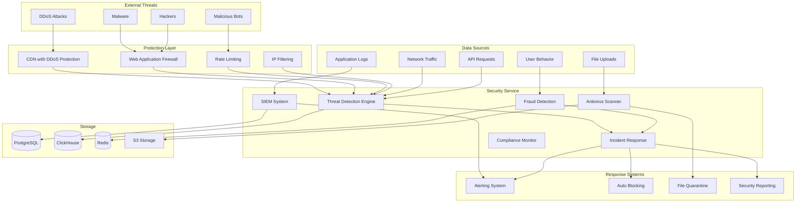
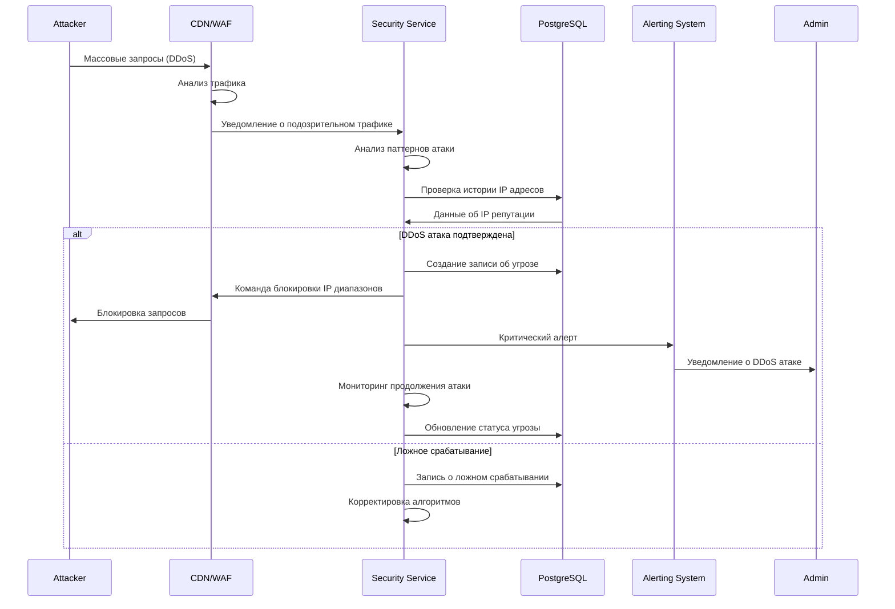
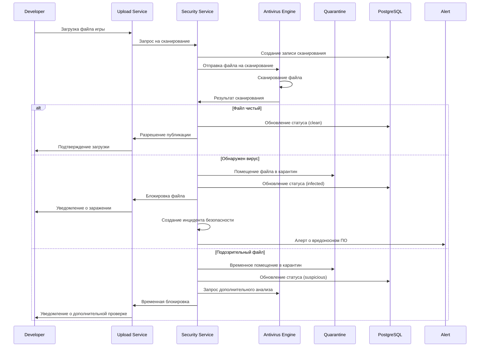
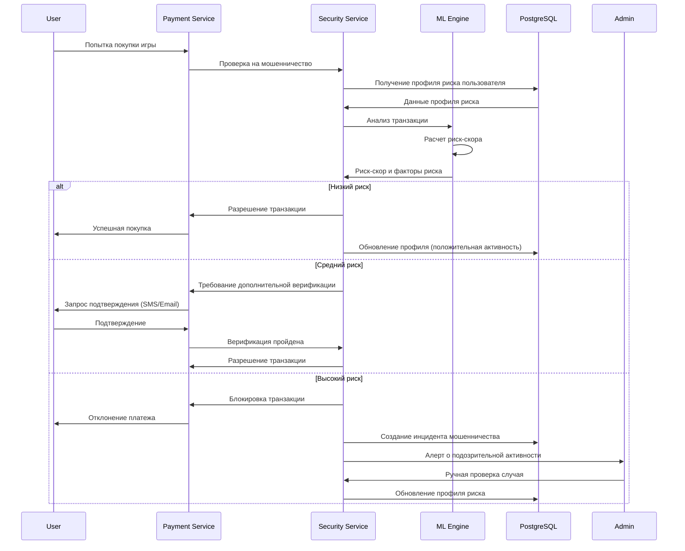
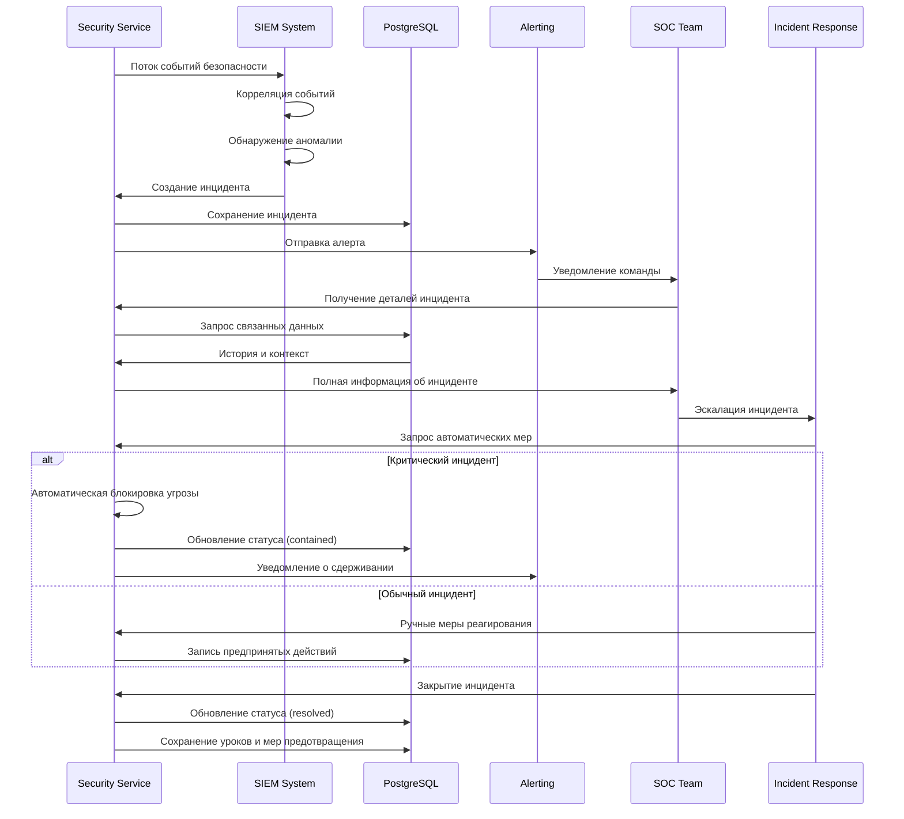

# Дизайн Security Service

## Обзор

Security Service является центральным сервисом безопасности российской игровой платформы, обеспечивающим защиту от кибератак, обнаружение мошенничества, антивирусную проверку, мониторинг безопасности и соответствие российским требованиям кибербезопасности.

### Ключевые принципы дизайна

- **Многоуровневая защита**: Defense in depth подход
- **Real-time мониторинг**: Обнаружение угроз в реальном времени
- **Автоматизация**: Автоматическое реагирование на инциденты
- **Соответствие стандартам**: Соблюдение российских требований кибербезопасности
- **Масштабируемость**: Обработка миллионов событий безопасности

## Архитектура

### Общая архитектура



## API Эндпоинты и маршруты

### Threat Detection API

```typescript
// Анализ угроз
POST   /v1/threats/analyze            // Анализ подозрительной активности
GET    /v1/threats/active             // Активные угрозы
GET    /v1/threats/:id                // Детали угрозы
PUT    /v1/threats/:id/status         // Обновление статуса угрозы

// IP и домены
POST   /v1/blacklist/ip               // Добавить IP в черный список
DELETE /v1/blacklist/ip/:ip           // Удалить IP из черного списка
GET    /v1/blacklist/check/:ip        // Проверить IP
POST   /v1/whitelist/ip               // Добавить IP в белый список

// Правила безопасности
GET    /v1/rules                      // Список правил безопасности
POST   /v1/rules                      // Создать правило
PUT    /v1/rules/:id                  // Обновить правило
DELETE /v1/rules/:id                  // Удалить правило
```

### Fraud Detection API

```typescript
// Обнаружение мошенничества
POST   /v1/fraud/check                // Проверка на мошенничество
GET    /v1/fraud/users/:id            // Профиль риска пользователя
POST   /v1/fraud/report               // Сообщить о мошенничестве
GET    /v1/fraud/patterns             // Паттерны мошенничества

// Скоринг риска
POST   /v1/risk/score                 // Расчет риск-скора
GET    /v1/risk/factors               // Факторы риска
PUT    /v1/risk/threshold             // Обновить пороги риска
```

### Antivirus API

```typescript
// Сканирование файлов
POST   /v1/antivirus/scan             // Сканировать файл
GET    /v1/antivirus/scan/:id         // Статус сканирования
POST   /v1/antivirus/scan/bulk        // Массовое сканирование
GET    /v1/antivirus/quarantine       // Файлы в карантине

// Управление вирусными базами
GET    /v1/antivirus/signatures       // Версия вирусных баз
POST   /v1/antivirus/update           // Обновить базы
GET    /v1/antivirus/stats            // Статистика сканирования
```

### Incident Response API

```typescript
// Инциденты безопасности
GET    /v1/incidents                  // Список инцидентов
POST   /v1/incidents                  // Создать инцидент
GET    /v1/incidents/:id              // Детали инцидента
PUT    /v1/incidents/:id              // Обновить инцидент
POST   /v1/incidents/:id/escalate     // Эскалировать инцидент

// Реагирование
POST   /v1/response/block             // Заблокировать угрозу
POST   /v1/response/quarantine        // Поместить в карантин
POST   /v1/response/alert             // Отправить алерт
```

## Модели данных

### Основные сущности

```typescript
interface SecurityThreat {
  id: string
  type: ThreatType
  severity: 'low' | 'medium' | 'high' | 'critical'
  
  // Источник угрозы
  sourceIP: string
  sourceCountry?: string
  userAgent?: string
  
  // Детали угрозы
  description: string
  indicators: ThreatIndicator[]
  
  // Статус
  status: 'detected' | 'investigating' | 'mitigated' | 'resolved'
  
  // Временные метки
  detectedAt: Date
  resolvedAt?: Date
  
  // Связанные данные
  affectedUsers: string[]
  affectedSystems: string[]
  
  // Ответные меры
  responseActions: ResponseAction[]
}

interface FraudProfile {
  userId: string
  
  // Риск-скор
  riskScore: number
  riskLevel: 'low' | 'medium' | 'high' | 'critical'
  
  // Факторы риска
  riskFactors: RiskFactor[]
  
  // Поведенческие паттерны
  behaviorPatterns: BehaviorPattern[]
  
  // История мошенничества
  fraudHistory: FraudIncident[]
  
  // Временные метки
  lastUpdated: Date
  lastAssessed: Date
}

interface AntivirusScan {
  id: string
  fileId: string
  fileName: string
  fileHash: string
  fileSize: number
  
  // Сканирование
  scanEngine: string
  scanVersion: string
  scanStarted: Date
  scanCompleted?: Date
  
  // Результаты
  status: 'pending' | 'scanning' | 'clean' | 'infected' | 'suspicious' | 'error'
  threatsFound: VirusThreat[]
  
  // Действия
  quarantined: boolean
  deleted: boolean
  
  // Метаданные
  uploadedBy: string
  scanRequestedBy: string
}

interface SecurityIncident {
  id: string
  title: string
  description: string
  
  // Классификация
  category: IncidentCategory
  severity: 'low' | 'medium' | 'high' | 'critical'
  priority: number
  
  // Статус
  status: 'open' | 'investigating' | 'contained' | 'resolved' | 'closed'
  
  // Временная линия
  detectedAt: Date
  reportedAt: Date
  acknowledgedAt?: Date
  resolvedAt?: Date
  
  // Участники
  assignedTo?: string
  reportedBy?: string
  
  // Связанные данные
  relatedThreats: string[]
  affectedAssets: string[]
  
  // Ответные меры
  responseActions: ResponseAction[]
  
  // Уроки
  lessonsLearned?: string
  preventiveMeasures?: string[]
}

interface SecurityRule {
  id: string
  name: string
  description: string
  
  // Условия
  conditions: RuleCondition[]
  
  // Действия
  actions: RuleAction[]
  
  // Настройки
  enabled: boolean
  priority: number
  
  // Статистика
  triggeredCount: number
  lastTriggered?: Date
  
  createdAt: Date
  updatedAt: Date
}

enum ThreatType {
  DDOS = 'ddos',
  SQL_INJECTION = 'sql_injection',
  XSS = 'xss',
  BRUTE_FORCE = 'brute_force',
  MALWARE = 'malware',
  PHISHING = 'phishing',
  FRAUD = 'fraud',
  DATA_BREACH = 'data_breach'
}

enum IncidentCategory {
  NETWORK_ATTACK = 'network_attack',
  MALWARE_INFECTION = 'malware_infection',
  DATA_BREACH = 'data_breach',
  FRAUD_ATTEMPT = 'fraud_attempt',
  SYSTEM_COMPROMISE = 'system_compromise',
  POLICY_VIOLATION = 'policy_violation'
}
```

## Детальная схема базы данных

```sql
-- Угрозы безопасности
CREATE TABLE security_threats (
    id UUID PRIMARY KEY DEFAULT gen_random_uuid(),
    type VARCHAR(50) NOT NULL,
    severity VARCHAR(20) NOT NULL CHECK (severity IN ('low', 'medium', 'high', 'critical')),
    
    -- Источник
    source_ip INET NOT NULL,
    source_country CHAR(2),
    user_agent TEXT,
    
    -- Детали
    description TEXT NOT NULL,
    indicators JSONB DEFAULT '[]',
    
    -- Статус
    status VARCHAR(20) DEFAULT 'detected' CHECK (status IN ('detected', 'investigating', 'mitigated', 'resolved')),
    
    -- Временные метки
    detected_at TIMESTAMP DEFAULT NOW(),
    resolved_at TIMESTAMP,
    
    -- Связанные данные
    affected_users TEXT[] DEFAULT '{}',
    affected_systems TEXT[] DEFAULT '{}',
    
    -- Ответные меры
    response_actions JSONB DEFAULT '[]',
    
    created_at TIMESTAMP DEFAULT NOW(),
    updated_at TIMESTAMP DEFAULT NOW()
);

-- Профили мошенничества
CREATE TABLE fraud_profiles (
    user_id UUID PRIMARY KEY,
    
    -- Риск-скор
    risk_score INTEGER DEFAULT 0 CHECK (risk_score >= 0 AND risk_score <= 100),
    risk_level VARCHAR(20) DEFAULT 'low' CHECK (risk_level IN ('low', 'medium', 'high', 'critical')),
    
    -- Факторы риска
    risk_factors JSONB DEFAULT '[]',
    
    -- Поведенческие паттерны
    behavior_patterns JSONB DEFAULT '{}',
    
    -- История мошенничества
    fraud_incidents INTEGER DEFAULT 0,
    last_fraud_at TIMESTAMP,
    
    -- Временные метки
    last_updated TIMESTAMP DEFAULT NOW(),
    last_assessed TIMESTAMP DEFAULT NOW()
);

-- Сканирование антивирусом
CREATE TABLE antivirus_scans (
    id UUID PRIMARY KEY DEFAULT gen_random_uuid(),
    file_id VARCHAR(255) NOT NULL,
    file_name VARCHAR(500) NOT NULL,
    file_hash VARCHAR(64) NOT NULL,
    file_size BIGINT NOT NULL,
    
    -- Сканирование
    scan_engine VARCHAR(50) NOT NULL,
    scan_version VARCHAR(20) NOT NULL,
    scan_started TIMESTAMP DEFAULT NOW(),
    scan_completed TIMESTAMP,
    
    -- Результаты
    status VARCHAR(20) DEFAULT 'pending' CHECK (status IN ('pending', 'scanning', 'clean', 'infected', 'suspicious', 'error')),
    threats_found JSONB DEFAULT '[]',
    
    -- Действия
    quarantined BOOLEAN DEFAULT FALSE,
    deleted BOOLEAN DEFAULT FALSE,
    
    -- Метаданные
    uploaded_by UUID,
    scan_requested_by UUID,
    
    created_at TIMESTAMP DEFAULT NOW()
);

-- Инциденты безопасности
CREATE TABLE security_incidents (
    id UUID PRIMARY KEY DEFAULT gen_random_uuid(),
    title VARCHAR(255) NOT NULL,
    description TEXT NOT NULL,
    
    -- Классификация
    category VARCHAR(50) NOT NULL,
    severity VARCHAR(20) NOT NULL CHECK (severity IN ('low', 'medium', 'high', 'critical')),
    priority INTEGER DEFAULT 3 CHECK (priority >= 1 AND priority <= 5),
    
    -- Статус
    status VARCHAR(20) DEFAULT 'open' CHECK (status IN ('open', 'investigating', 'contained', 'resolved', 'closed')),
    
    -- Временная линия
    detected_at TIMESTAMP DEFAULT NOW(),
    reported_at TIMESTAMP DEFAULT NOW(),
    acknowledged_at TIMESTAMP,
    resolved_at TIMESTAMP,
    
    -- Участники
    assigned_to UUID,
    reported_by UUID,
    
    -- Связанные данные
    related_threats TEXT[] DEFAULT '{}',
    affected_assets TEXT[] DEFAULT '{}',
    
    -- Ответные меры
    response_actions JSONB DEFAULT '[]',
    
    -- Уроки
    lessons_learned TEXT,
    preventive_measures TEXT[] DEFAULT '{}',
    
    created_at TIMESTAMP DEFAULT NOW(),
    updated_at TIMESTAMP DEFAULT NOW()
);

-- Правила безопасности
CREATE TABLE security_rules (
    id UUID PRIMARY KEY DEFAULT gen_random_uuid(),
    name VARCHAR(255) NOT NULL,
    description TEXT,
    
    -- Условия и действия
    conditions JSONB NOT NULL,
    actions JSONB NOT NULL,
    
    -- Настройки
    enabled BOOLEAN DEFAULT TRUE,
    priority INTEGER DEFAULT 100,
    
    -- Статистика
    triggered_count INTEGER DEFAULT 0,
    last_triggered TIMESTAMP,
    
    created_at TIMESTAMP DEFAULT NOW(),
    updated_at TIMESTAMP DEFAULT NOW()
);

-- Черные и белые списки IP
CREATE TABLE ip_blacklist (
    id UUID PRIMARY KEY DEFAULT gen_random_uuid(),
    ip_address INET NOT NULL UNIQUE,
    reason TEXT NOT NULL,
    expires_at TIMESTAMP,
    created_by UUID,
    created_at TIMESTAMP DEFAULT NOW()
);

CREATE TABLE ip_whitelist (
    id UUID PRIMARY KEY DEFAULT gen_random_uuid(),
    ip_address INET NOT NULL UNIQUE,
    reason TEXT NOT NULL,
    created_by UUID,
    created_at TIMESTAMP DEFAULT NOW()
);

-- Логи безопасности
CREATE TABLE security_logs (
    id UUID PRIMARY KEY DEFAULT gen_random_uuid(),
    event_type VARCHAR(50) NOT NULL,
    severity VARCHAR(20) NOT NULL,
    
    -- Источник события
    source_ip INET,
    user_id UUID,
    session_id VARCHAR(255),
    
    -- Детали события
    message TEXT NOT NULL,
    details JSONB DEFAULT '{}',
    
    -- Контекст
    user_agent TEXT,
    request_path TEXT,
    request_method VARCHAR(10),
    
    -- Геолокация
    country CHAR(2),
    region VARCHAR(100),
    city VARCHAR(100),
    
    created_at TIMESTAMP DEFAULT NOW()
);

-- Индексы для производительности
CREATE INDEX idx_security_threats_type_severity ON security_threats(type, severity, detected_at DESC);
CREATE INDEX idx_security_threats_source_ip ON security_threats(source_ip, detected_at DESC);
CREATE INDEX idx_security_threats_status ON security_threats(status, detected_at DESC);

CREATE INDEX idx_fraud_profiles_risk_level ON fraud_profiles(risk_level, last_updated DESC);
CREATE INDEX idx_fraud_profiles_risk_score ON fraud_profiles(risk_score DESC);

CREATE INDEX idx_antivirus_scans_status ON antivirus_scans(status, scan_started DESC);
CREATE INDEX idx_antivirus_scans_file_hash ON antivirus_scans(file_hash);

CREATE INDEX idx_security_incidents_status_priority ON security_incidents(status, priority DESC, created_at DESC);
CREATE INDEX idx_security_incidents_category_severity ON security_incidents(category, severity, created_at DESC);

CREATE INDEX idx_security_rules_enabled_priority ON security_rules(enabled, priority DESC) WHERE enabled = TRUE;

CREATE INDEX idx_ip_blacklist_ip ON ip_blacklist(ip_address);
CREATE INDEX idx_ip_whitelist_ip ON ip_whitelist(ip_address);

CREATE INDEX idx_security_logs_event_type_time ON security_logs(event_type, created_at DESC);
CREATE INDEX idx_security_logs_source_ip_time ON security_logs(source_ip, created_at DESC);
CREATE INDEX idx_security_logs_user_time ON security_logs(user_id, created_at DESC);
```

## User Flows (Пользовательские сценарии)

### 1. Обнаружение и блокировка DDoS атаки



### 2. Антивирусное сканирование загруженного файла



### 3. Обнаружение мошеннической активности



### 4. Реагирование на инцидент безопасности



Этот дизайн обеспечивает комплексную систему безопасности для российской игровой платформы с многоуровневой защитой, автоматическим обнаружением угроз и быстрым реагированием на инциденты.