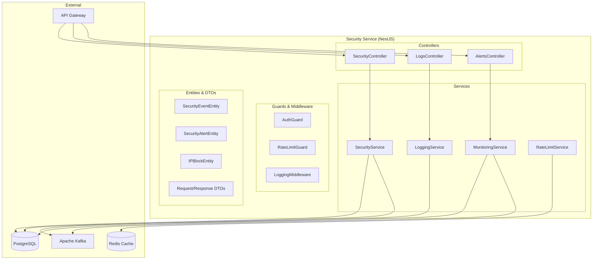

# Design Document - Security Service

## Overview

Security Service - сервис безопасности для российской игровой платформы, построенный на NestJS + TypeScript. Обеспечивает логирование событий безопасности, защиту от спама, мониторинг подозрительной активности и базовую защиту персональных данных.

## Технологический стек

- **Framework**: NestJS (встроенная поддержка микросервисов, DI, декораторы)
- **Runtime**: Node.js 18+ / TypeScript
- **База данных**: PostgreSQL 14+ (primary), Redis (cache)
- **Message Queue**: Apache Kafka (для событий безопасности)
- **Тестирование**: Jest + Supertest (встроенные в NestJS)
- **Документация**: Swagger/OpenAPI (автогенерация)

## Architecture

### NestJS Модульная архитектура



## Components and Interfaces

### NestJS Controllers

#### SecurityController
```typescript
@Controller('security')
@ApiTags('Security')
export class SecurityController {
  @Post('check-login')
  @ApiOperation({ summary: 'Проверить безопасность входа' })
  checkLoginSecurity(@Body() dto: CheckLoginSecurityDto): Promise<SecurityCheckResult>

  @Post('check-transaction')
  @ApiOperation({ summary: 'Проверить безопасность транзакции' })
  checkTransactionSecurity(@Body() dto: CheckTransactionSecurityDto): Promise<SecurityCheckResult>

  @Post('report-event')
  @ApiOperation({ summary: 'Сообщить о событии безопасности' })
  reportSecurityEvent(@Body() dto: ReportSecurityEventDto): Promise<void>

  @Post('block-ip')
  @ApiOperation({ summary: 'Заблокировать IP адрес' })
  @UseGuards(AdminGuard)
  blockIP(@Body() dto: BlockIPDto): Promise<void>

  @Get('ip-status/:ip')
  @ApiOperation({ summary: 'Проверить статус IP адреса' })
  checkIPStatus(@Param('ip') ip: string): Promise<IPStatusResult>
}
```

#### LogsController
```typescript
@Controller('security/logs')
@ApiTags('Security Logs')
export class LogsController {
  @Get()
  @ApiOperation({ summary: 'Получить логи безопасности' })
  @UseGuards(AdminGuard)
  getSecurityLogs(@Query() query: GetLogsQueryDto): Promise<PaginatedSecurityLogs>

  @Get('events/:userId')
  @ApiOperation({ summary: 'Получить события пользователя' })
  @UseGuards(AuthGuard)
  getUserSecurityEvents(@Param('userId') userId: string): Promise<SecurityEvent[]>
}
```

#### AlertsController
```typescript
@Controller('security/alerts')
@ApiTags('Security Alerts')
export class AlertsController {
  @Get()
  @ApiOperation({ summary: 'Получить алерты безопасности' })
  @UseGuards(AdminGuard)
  getSecurityAlerts(@Query() query: GetAlertsQueryDto): Promise<PaginatedSecurityAlerts>

  @Put(':id/resolve')
  @ApiOperation({ summary: 'Разрешить алерт' })
  @UseGuards(AdminGuard)
  resolveAlert(@Param('id') id: string): Promise<void>
}
```

### NestJS Services

#### SecurityService
```typescript
@Injectable()
export class SecurityService {
  async checkLoginSecurity(dto: CheckLoginSecurityDto): Promise<SecurityCheckResult>
  async checkTransactionSecurity(dto: CheckTransactionSecurityDto): Promise<SecurityCheckResult>
  async blockIP(ip: string, reason: string, duration: number): Promise<void>
  async isIPBlocked(ip: string): Promise<boolean>
  async validateUserActivity(userId: string, activityType: string): Promise<boolean>
  async calculateRiskScore(userId: string, context: SecurityContext): Promise<number>
}
```

#### LoggingService
```typescript
@Injectable()
export class LoggingService {
  async logSecurityEvent(event: CreateSecurityEventDto): Promise<SecurityEvent>
  async getSecurityLogs(filters: SecurityLogFilters): Promise<PaginatedSecurityLogs>
  async getUserSecurityEvents(userId: string): Promise<SecurityEvent[]>
  async getEventsByType(type: SecurityEventType): Promise<SecurityEvent[]>
}
```

#### MonitoringService
```typescript
@Injectable()
export class MonitoringService {
  async detectSuspiciousActivity(userId: string): Promise<SuspiciousActivityResult>
  async createAlert(alert: CreateSecurityAlertDto): Promise<SecurityAlert>
  async getActiveAlerts(): Promise<SecurityAlert[]>
  async resolveAlert(alertId: string): Promise<void>
  async analyzeUserBehavior(userId: string): Promise<BehaviorAnalysis>
}
```

#### RateLimitService
```typescript
@Injectable()
export class RateLimitService {
  async checkRateLimit(key: string, limit: number, window: number): Promise<RateLimitResult>
  async incrementCounter(key: string, window: number): Promise<number>
  async getRemainingRequests(key: string, limit: number, window: number): Promise<number>
  async resetRateLimit(key: string): Promise<void>
}
```

## Data Models

### TypeORM Entities

#### SecurityEvent Entity
```typescript
@Entity('security_events')
export class SecurityEvent {
  @PrimaryGeneratedColumn('uuid')
  id: string;

  @Column({
    type: 'enum',
    enum: SecurityEventType,
  })
  type: SecurityEventType;

  @Column({ nullable: true })
  userId?: string;

  @Column()
  ip: string;

  @Column({ nullable: true })
  userAgent?: string;

  @Column('jsonb')
  data: Record<string, any>;

  @Column({ type: 'float', default: 0 })
  riskScore: number;

  @CreateDateColumn()
  createdAt: Date;

  @Index(['userId'])
  @Index(['ip'])
  @Index(['type'])
  @Index(['createdAt'])
}

enum SecurityEventType {
  LOGIN = 'login',
  FAILED_LOGIN = 'failed_login',
  PASSWORD_CHANGE = 'password_change',
  PURCHASE = 'purchase',
  ACCOUNT_LOCKED = 'account_locked',
  SUSPICIOUS_ACTIVITY = 'suspicious_activity',
  DATA_ACCESS = 'data_access',
  PERMISSION_CHANGE = 'permission_change'
}
```

#### SecurityAlert Entity
```typescript
@Entity('security_alerts')
export class SecurityAlert {
  @PrimaryGeneratedColumn('uuid')
  id: string;

  @Column({
    type: 'enum',
    enum: SecurityAlertType,
  })
  type: SecurityAlertType;

  @Column({
    type: 'enum',
    enum: AlertSeverity,
  })
  severity: AlertSeverity;

  @Column({ nullable: true })
  userId?: string;

  @Column({ nullable: true })
  ip?: string;

  @Column('jsonb')
  data: Record<string, any>;

  @Column({ default: false })
  resolved: boolean;

  @Column({ nullable: true })
  resolvedBy?: string;

  @Column({ nullable: true })
  resolvedAt?: Date;

  @CreateDateColumn()
  createdAt: Date;

  @Index(['userId'])
  @Index(['type'])
  @Index(['severity'])
  @Index(['resolved'])
}

enum SecurityAlertType {
  SUSPICIOUS_ACTIVITY = 'suspicious_activity',
  MULTIPLE_FAILED_LOGINS = 'multiple_failed_logins',
  UNUSUAL_PURCHASE = 'unusual_purchase',
  ACCOUNT_COMPROMISE = 'account_compromise',
  DATA_BREACH = 'data_breach',
  RATE_LIMIT_EXCEEDED = 'rate_limit_exceeded'
}

enum AlertSeverity {
  LOW = 'low',
  MEDIUM = 'medium',
  HIGH = 'high',
  CRITICAL = 'critical'
}
```

#### IPBlock Entity
```typescript
@Entity('ip_blocks')
export class IPBlock {
  @PrimaryGeneratedColumn('uuid')
  id: string;

  @Column()
  ip: string;

  @Column()
  reason: string;

  @Column()
  blockedUntil: Date;

  @Column({ nullable: true })
  blockedBy?: string;

  @Column({ default: false })
  isActive: boolean;

  @CreateDateColumn()
  createdAt: Date;

  @Index(['ip'])
  @Index(['blockedUntil'])
  @Index(['isActive'])
}
```

### Request/Response DTOs

#### Request DTOs
```typescript
export class CheckLoginSecurityDto {
  @IsString()
  @ApiProperty()
  userId: string;

  @IsIP()
  @ApiProperty()
  ip: string;

  @IsString()
  @IsOptional()
  @ApiProperty({ required: false })
  userAgent?: string;

  @IsObject()
  @IsOptional()
  @ApiProperty({ required: false })
  context?: Record<string, any>;
}

export class CheckTransactionSecurityDto {
  @IsString()
  @ApiProperty()
  userId: string;

  @IsNumber()
  @Min(0)
  @ApiProperty()
  amount: number;

  @IsString()
  @ApiProperty()
  paymentMethod: string;

  @IsIP()
  @ApiProperty()
  ip: string;

  @IsObject()
  @IsOptional()
  @ApiProperty({ required: false })
  context?: Record<string, any>;
}

export class ReportSecurityEventDto {
  @IsEnum(SecurityEventType)
  @ApiProperty()
  type: SecurityEventType;

  @IsString()
  @IsOptional()
  @ApiProperty({ required: false })
  userId?: string;

  @IsIP()
  @ApiProperty()
  ip: string;

  @IsObject()
  @ApiProperty()
  data: Record<string, any>;
}

export class BlockIPDto {
  @IsIP()
  @ApiProperty()
  ip: string;

  @IsString()
  @ApiProperty()
  reason: string;

  @IsNumber()
  @Min(1)
  @ApiProperty()
  durationMinutes: number;
}
```

#### Response DTOs
```typescript
export class SecurityCheckResult {
  @ApiProperty()
  allowed: boolean;

  @ApiProperty()
  riskScore: number;

  @ApiProperty()
  reason?: string;

  @ApiProperty()
  recommendations?: string[];
}

export class IPStatusResult {
  @ApiProperty()
  isBlocked: boolean;

  @ApiProperty()
  blockedUntil?: Date;

  @ApiProperty()
  reason?: string;
}

export class PaginatedSecurityLogs {
  @ApiProperty({ type: [SecurityEvent] })
  data: SecurityEvent[];

  @ApiProperty()
  total: number;

  @ApiProperty()
  page: number;

  @ApiProperty()
  limit: number;
}
```

## Error Handling

### NestJS Exception Filters

```typescript
@Catch()
export class SecurityExceptionFilter implements ExceptionFilter {
  catch(exception: any, host: ArgumentsHost) {
    const ctx = host.switchToHttp();
    const response = ctx.getResponse();
    const request = ctx.getRequest();

    let status = HttpStatus.INTERNAL_SERVER_ERROR;
    let message = 'Internal server error';

    if (exception instanceof ValidationError) {
      status = HttpStatus.BAD_REQUEST;
      message = 'Validation failed';
    } else if (exception instanceof SecurityError) {
      status = HttpStatus.FORBIDDEN;
      message = 'Security check failed';
    } else if (exception instanceof BlockedIPError) {
      status = HttpStatus.FORBIDDEN;
      message = 'IP address is blocked';
    } else if (exception instanceof SuspiciousActivityError) {
      status = HttpStatus.FORBIDDEN;
      message = 'Suspicious activity detected';
    }

    response.status(status).json({
      statusCode: status,
      message,
      timestamp: new Date().toISOString(),
      path: request.url,
    });
  }
}
```

### Custom Exceptions
```typescript
export class SecurityError extends HttpException {
  constructor(message: string, riskScore?: number) {
    super({ message, riskScore }, HttpStatus.FORBIDDEN);
  }
}

export class BlockedIPError extends HttpException {
  constructor(ip: string, blockedUntil: Date) {
    super({ message: 'IP is blocked', ip, blockedUntil }, HttpStatus.FORBIDDEN);
  }
}

export class SuspiciousActivityError extends HttpException {
  constructor(userId: string, activityType: string) {
    super({ message: 'Suspicious activity detected', userId, activityType }, HttpStatus.FORBIDDEN);
  }
}

export class RateLimitExceededError extends HttpException {
  constructor(limit: number, resetTime: Date) {
    super({ message: 'Rate limit exceeded', limit, resetTime }, HttpStatus.TOO_MANY_REQUESTS);
  }
}
```

### Guards and Interceptors

#### RateLimitGuard
```typescript
@Injectable()
export class RateLimitGuard implements CanActivate {
  constructor(private rateLimitService: RateLimitService) {}

  async canActivate(context: ExecutionContext): Promise<boolean> {
    const request = context.switchToHttp().getRequest();
    const ip = request.ip;
    const key = `rate_limit:${ip}`;
    
    const result = await this.rateLimitService.checkRateLimit(key, 100, 3600); // 100 requests per hour
    
    if (!result.allowed) {
      throw new RateLimitExceededError(result.limit, result.resetTime);
    }
    
    return true;
  }
}
```

#### SecurityLoggingInterceptor
```typescript
@Injectable()
export class SecurityLoggingInterceptor implements NestInterceptor {
  constructor(private loggingService: LoggingService) {}

  intercept(context: ExecutionContext, next: CallHandler): Observable<any> {
    const request = context.switchToHttp().getRequest();
    const { ip, method, url, user } = request;

    return next.handle().pipe(
      tap(() => {
        this.loggingService.logSecurityEvent({
          type: SecurityEventType.DATA_ACCESS,
          userId: user?.id,
          ip,
          data: { method, url, timestamp: new Date() }
        });
      })
    );
  }
}
```

## Testing Strategy

### Unit Tests (Jest)
```typescript
describe('SecurityService', () => {
  let service: SecurityService;
  let mockRepository: Repository<SecurityEvent>;

  beforeEach(async () => {
    const module = await Test.createTestingModule({
      providers: [
        SecurityService,
        {
          provide: getRepositoryToken(SecurityEvent),
          useClass: Repository,
        },
      ],
    }).compile();

    service = module.get<SecurityService>(SecurityService);
  });

  it('should calculate risk score correctly', async () => {
    // Test implementation
  });

  it('should detect suspicious login patterns', async () => {
    // Test implementation
  });
});
```

### Integration Tests (Supertest)
```typescript
describe('SecurityController (e2e)', () => {
  let app: INestApplication;

  beforeEach(async () => {
    const moduleFixture = await Test.createTestingModule({
      imports: [SecurityModule],
    }).compile();

    app = moduleFixture.createNestApplication();
    await app.init();
  });

  it('/security/check-login (POST)', () => {
    return request(app.getHttpServer())
      .post('/security/check-login')
      .send({ userId: 'test', ip: '127.0.0.1' })
      .expect(200)
      .expect((res) => {
        expect(res.body).toHaveProperty('allowed');
        expect(res.body).toHaveProperty('riskScore');
      });
  });
});
```

### Performance Tests
- Rate limiting под нагрузкой
- Обработка большого количества событий
- Производительность алгоритмов обнаружения
- Масштабируемость Redis кеша