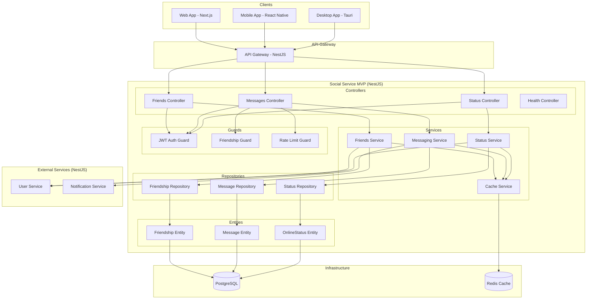

# Design Document - Social Service

## Overview

Social Service обеспечивает базовые социальные функции для MVP российской игровой платформы в рамках Месяца 3. Включает систему друзей, простые сообщения и онлайн статусы. Реализован с использованием единого технологического стека для максимального переиспользования кода.

**Технологический стек:**
- **Framework**: NestJS (встроенная поддержка микросервисов, DI, декораторы)
- **Runtime**: Node.js 18+ / TypeScript
- **База данных**: PostgreSQL (основная), Redis (кеширование)
- **ORM**: TypeORM (встроенная поддержка в NestJS)
- **Тестирование**: Jest + Supertest (встроенные в NestJS)
- **Документация**: Swagger/OpenAPI (автогенерация)
- **Контейнеризация**: Docker + Kubernetes готовность

**MVP Ограничения (Месяц 3):**
- ✅ Система друзей (заявки, принятие, удаление)
- ✅ Простые сообщения между друзьями
- ✅ Онлайн статусы (онлайн/офлайн/отошел)
- ❌ Групповые чаты - После MVP
- ❌ Игровые приглашения - После MVP
- ❌ Группы и сообщества - После MVP
- ❌ Интеграция с VK/OK - После MVP
- ❌ Лента активности - После MVP
- ❌ Реферальная система - После MVP
- ❌ Стримы и трансляции - После MVP

## Architecture

### NestJS Модульная Архитектура (MVP)



## Components and Interfaces

### NestJS Controllers (MVP)

#### FriendsController
```typescript
@Controller('friends')
@UseGuards(JwtAuthGuard)
@ApiTags('Friends')
export class FriendsController {
  @Post('request')
  @ApiOperation({ summary: 'Send friend request' })
  async sendFriendRequest(@Req() request: AuthRequest, @Body() dto: SendFriendRequestDto): Promise<FriendDto>
  
  @Post('accept/:requestId')
  @ApiOperation({ summary: 'Accept friend request' })
  async acceptFriendRequest(@Req() request: AuthRequest, @Param('requestId') requestId: string): Promise<FriendDto>
  
  @Post('decline/:requestId')
  @ApiOperation({ summary: 'Decline friend request' })
  async declineFriendRequest(@Req() request: AuthRequest, @Param('requestId') requestId: string): Promise<void>
  
  @Delete(':friendId')
  @ApiOperation({ summary: 'Remove friend' })
  async removeFriend(@Req() request: AuthRequest, @Param('friendId') friendId: string): Promise<void>
  
  @Get()
  @ApiOperation({ summary: 'Get friends list' })
  async getFriends(@Req() request: AuthRequest, @Query() query: FriendsQueryDto): Promise<FriendsResponseDto>
  
  @Get('requests')
  @ApiOperation({ summary: 'Get pending friend requests' })
  async getFriendRequests(@Req() request: AuthRequest): Promise<FriendDto[]>
  
  @Get('search')
  @ApiOperation({ summary: 'Search users by username' })
  async searchUsers(@Req() request: AuthRequest, @Query('q') query: string): Promise<UserSearchResultDto[]>
}
```

#### MessagesController
```typescript
@Controller('messages')
@UseGuards(JwtAuthGuard, FriendshipGuard, RateLimitGuard)
@ApiTags('Messages')
export class MessagesController {
  @Post()
  @ApiOperation({ summary: 'Send message to friend' })
  async sendMessage(@Req() request: AuthRequest, @Body() dto: SendMessageDto): Promise<MessageDto>
  
  @Get('conversations')
  @ApiOperation({ summary: 'Get conversations list' })
  async getConversations(@Req() request: AuthRequest): Promise<ConversationDto[]>
  
  @Get('conversations/:friendId')
  @ApiOperation({ summary: 'Get conversation with friend' })
  async getConversation(@Req() request: AuthRequest, @Param('friendId') friendId: string, @Query() query: MessagesQueryDto): Promise<ConversationResponseDto>
  
  @Put(':messageId/read')
  @ApiOperation({ summary: 'Mark message as read' })
  async markAsRead(@Req() request: AuthRequest, @Param('messageId') messageId: string): Promise<void>
}
```

#### StatusController
```typescript
@Controller('status')
@UseGuards(JwtAuthGuard)
@ApiTags('Online Status')
export class StatusController {
  @Put('online')
  @ApiOperation({ summary: 'Set user online status' })
  async setOnlineStatus(@Req() request: AuthRequest, @Body() dto: SetStatusDto): Promise<void>
  
  @Put('offline')
  @ApiOperation({ summary: 'Set user offline' })
  async setOfflineStatus(@Req() request: AuthRequest): Promise<void>
  
  @Get('friends')
  @ApiOperation({ summary: 'Get friends online status' })
  async getFriendsStatus(@Req() request: AuthRequest): Promise<FriendStatusDto[]>
}
```

### NestJS Services (MVP)

#### FriendsService
```typescript
@Injectable()
export class FriendsService {
  async sendFriendRequest(fromUserId: string, toUserId: string): Promise<Friendship>
  async acceptFriendRequest(requestId: string, userId: string): Promise<Friendship>
  async declineFriendRequest(requestId: string, userId: string): Promise<void>
  async removeFriend(userId: string, friendId: string): Promise<void>
  async getFriends(userId: string, options: FriendsQueryOptions): Promise<FriendsResponse>
  async getFriendRequests(userId: string): Promise<Friendship[]>
  async checkFriendship(userId1: string, userId2: string): Promise<boolean>
  async searchUsers(query: string, currentUserId: string): Promise<UserSearchResult[]>
}
```

#### MessagingService
```typescript
@Injectable()
export class MessagingService {
  async sendMessage(fromUserId: string, dto: SendMessageDto): Promise<Message>
  async getConversations(userId: string): Promise<Conversation[]>
  async getConversation(userId: string, friendId: string, options: MessagesQueryOptions): Promise<ConversationResponse>
  async markAsRead(messageId: string, userId: string): Promise<void>
  async getUnreadCount(userId: string): Promise<number>
  private async validateFriendship(userId1: string, userId2: string): Promise<boolean>
}
```

#### StatusService
```typescript
@Injectable()
export class StatusService {
  async setOnlineStatus(userId: string, status: UserStatus, currentGame?: string): Promise<void>
  async setOfflineStatus(userId: string): Promise<void>
  async getFriendsStatus(userId: string): Promise<FriendStatus[]>
  async getUserStatus(userId: string): Promise<OnlineStatus>
  async updateLastSeen(userId: string): Promise<void>
}
```

### REST API Endpoints (MVP)

#### Friends Management
```typescript
POST   /api/friends/request              // Отправить заявку в друзья
POST   /api/friends/accept/:requestId    // Принять заявку
POST   /api/friends/decline/:requestId   // Отклонить заявку
DELETE /api/friends/:friendId            // Удалить друга
GET    /api/friends                      // Список друзей
GET    /api/friends/requests             // Входящие заявки
GET    /api/friends/search?q=username    // Поиск пользователей
```

#### Simple Messaging
```typescript
POST   /api/messages                     // Отправить сообщение
GET    /api/messages/conversations       // Список диалогов
GET    /api/messages/conversations/:friendId  // История сообщений
PUT    /api/messages/:messageId/read     // Отметить как прочитанное
```

#### Online Status
```typescript
PUT    /api/status/online                // Установить статус "онлайн"
PUT    /api/status/offline               // Установить статус "офлайн"
GET    /api/status/friends               // Статусы друзей
```

## Data Models

### TypeORM Entities

#### Friendship Entity
```typescript
@Entity('friendships')
@Index(['userId', 'friendId'], { unique: true })
export class Friendship {
  @PrimaryGeneratedColumn('uuid')
  id: string;

  @Column('uuid')
  @Index()
  userId: string;

  @Column('uuid')
  @Index()
  friendId: string;

  @Column('enum', { enum: ['pending', 'accepted', 'declined', 'blocked'] })
  status: FriendshipStatus;

  @Column('uuid', { nullable: true })
  requestedBy: string;

  @CreateDateColumn()
  createdAt: Date;

  @UpdateDateColumn()
  updatedAt: Date;
}
```

#### Message Entity
```typescript
@Entity('messages')
export class Message {
  @PrimaryGeneratedColumn('uuid')
  id: string;

  @Column('uuid')
  @Index()
  fromUserId: string;

  @Column('uuid')
  @Index()
  toUserId: string;

  @Column('text')
  content: string;

  @Column('boolean', { default: false })
  isRead: boolean;

  @Column('timestamp', { nullable: true })
  readAt: Date;

  @CreateDateColumn()
  createdAt: Date;

  @UpdateDateColumn()
  updatedAt: Date;
}
```

#### OnlineStatus Entity
```typescript
@Entity('online_status')
export class OnlineStatus {
  @PrimaryGeneratedColumn('uuid')
  id: string;

  @Column('uuid', { unique: true })
  @Index()
  userId: string;

  @Column('enum', { enum: ['online', 'offline', 'away'] })
  status: UserStatus;

  @Column('timestamp')
  lastSeen: Date;

  @Column('varchar', { length: 100, nullable: true })
  currentGame: string;

  @UpdateDateColumn()
  updatedAt: Date;
}
```

### DTOs (Data Transfer Objects)

#### Request DTOs
```typescript
export class SendFriendRequestDto {
  @IsUUID()
  @IsNotEmpty()
  toUserId: string;

  @IsOptional()
  @IsString()
  @MaxLength(200)
  message?: string;
}

export class SendMessageDto {
  @IsUUID()
  @IsNotEmpty()
  toUserId: string;

  @IsString()
  @IsNotEmpty()
  @MinLength(1)
  @MaxLength(1000)
  content: string;
}

export class FriendsQueryDto {
  @IsOptional()
  @IsInt()
  @Min(1)
  @Transform(({ value }) => parseInt(value))
  page?: number = 1;

  @IsOptional()
  @IsInt()
  @Min(1)
  @Max(50)
  @Transform(({ value }) => parseInt(value))
  limit?: number = 20;

  @IsOptional()
  @IsEnum(['online', 'offline', 'all'])
  status?: string = 'all';
}

export class MessagesQueryDto {
  @IsOptional()
  @IsInt()
  @Min(1)
  @Transform(({ value }) => parseInt(value))
  page?: number = 1;

  @IsOptional()
  @IsInt()
  @Min(1)
  @Max(100)
  @Transform(({ value }) => parseInt(value))
  limit?: number = 50;
}
```

#### Response DTOs
```typescript
export class FriendDto {
  id: string;
  userId: string;
  friendId: string;
  status: FriendshipStatus;
  createdAt: Date;
  friendInfo?: {
    username: string;
    avatar?: string;
    onlineStatus: UserStatus;
    lastSeen: Date;
    currentGame?: string;
  };
}

export class FriendsResponseDto {
  friends: FriendDto[];
  pagination: {
    total: number;
    page: number;
    limit: number;
    totalPages: number;
  };
}

export class MessageDto {
  id: string;
  fromUserId: string;
  toUserId: string;
  content: string;
  isRead: boolean;
  readAt?: Date;
  createdAt: Date;
}

export class ConversationDto {
  friendId: string;
  friendInfo: {
    username: string;
    avatar?: string;
    onlineStatus: UserStatus;
  };
  lastMessage?: MessageDto;
  unreadCount: number;
}

export class ConversationResponseDto {
  messages: MessageDto[];
  pagination: {
    total: number;
    page: number;
    limit: number;
    totalPages: number;
  };
}
```

### Enums
```typescript
export enum FriendshipStatus {
  PENDING = 'pending',
  ACCEPTED = 'accepted',
  DECLINED = 'declined',
  BLOCKED = 'blocked'
}

export enum UserStatus {
  ONLINE = 'online',
  OFFLINE = 'offline',
  AWAY = 'away'
}
```

## Error Handling

### NestJS Exception Filters

#### GlobalExceptionFilter
```typescript
@Catch()
export class GlobalExceptionFilter implements ExceptionFilter {
  catch(exception: unknown, host: ArgumentsHost): void
  private handleValidationException(exception: ValidationException, response: Response): void
  private handleBusinessException(exception: BusinessException, response: Response): void
  private handleDatabaseException(exception: QueryFailedError, response: Response): void
}
```

### Custom Exception Classes
```typescript
export class FriendRequestNotFoundException extends HttpException {
  constructor(requestId: string) {
    super({
      error: 'FRIEND_REQUEST_NOT_FOUND',
      message: `Friend request ${requestId} not found`,
      statusCode: 404
    }, 404);
  }
}

export class AlreadyFriendsException extends HttpException {
  constructor(userId1: string, userId2: string) {
    super({
      error: 'ALREADY_FRIENDS',
      message: `Users are already friends`,
      statusCode: 409
    }, 409);
  }
}

export class NotFriendsException extends HttpException {
  constructor(userId1: string, userId2: string) {
    super({
      error: 'NOT_FRIENDS',
      message: `Users are not friends`,
      statusCode: 403
    }, 403);
  }
}

export class MessageNotFoundException extends HttpException {
  constructor(messageId: string) {
    super({
      error: 'MESSAGE_NOT_FOUND',
      message: `Message ${messageId} not found`,
      statusCode: 404
    }, 404);
  }
}

export class RateLimitExceededException extends HttpException {
  constructor(limit: number) {
    super({
      error: 'RATE_LIMIT_EXCEEDED',
      message: `Rate limit exceeded: ${limit} messages per minute`,
      statusCode: 429
    }, 429);
  }
}
```

### HTTP Status Code Mapping
- `400` - Bad Request (валидация данных)
- `401` - Unauthorized (отсутствует токен)
- `403` - Forbidden (не друзья, нет прав)
- `404` - Not Found (заявка/сообщение не найдено)
- `409` - Conflict (уже друзья, дублирование)
- `429` - Too Many Requests (превышен rate limit)
- `500` - Internal Server Error (системная ошибка)

## Testing Strategy

### Unit Tests (Jest)
```typescript
describe('FriendsService', () => {
  describe('sendFriendRequest', () => {
    it('should send friend request successfully')
    it('should throw error if already friends')
    it('should throw error if request already exists')
  })
  
  describe('acceptFriendRequest', () => {
    it('should accept friend request and create friendship')
    it('should throw error if request not found')
    it('should throw error if not request recipient')
  })
  
  describe('getFriends', () => {
    it('should return friends list with pagination')
    it('should return empty list for user with no friends')
    it('should include online status for friends')
  })
})

describe('MessagingService', () => {
  describe('sendMessage', () => {
    it('should send message between friends')
    it('should throw error if not friends')
    it('should respect rate limiting')
  })
  
  describe('getConversation', () => {
    it('should return conversation history')
    it('should support pagination')
    it('should mark messages as read')
  })
})

describe('StatusService', () => {
  describe('setOnlineStatus', () => {
    it('should update user online status')
    it('should update last seen timestamp')
    it('should handle current game info')
  })
})
```

### Integration Tests (Supertest)
```typescript
describe('Social API Integration', () => {
  describe('Friends Management', () => {
    it('should complete full friend request flow')
    it('should prevent duplicate friend requests')
    it('should allow removing friends')
  })
  
  describe('Messaging', () => {
    it('should send and receive messages between friends')
    it('should prevent messaging non-friends')
    it('should track read status correctly')
  })
  
  describe('Online Status', () => {
    it('should update and retrieve online status')
    it('should show friends status correctly')
    it('should handle offline status')
  })
})
```

### End-to-End Tests
```typescript
describe('Social E2E', () => {
  describe('Complete Social Flow', () => {
    it('should handle user registration, friend request, messaging')
    it('should maintain online status throughout session')
    it('should handle multiple concurrent users')
  })
})
```

### Performance Tests
- **Load Testing**: 1000 concurrent users sending messages
- **Database Performance**: Friend queries with large friend lists
- **Cache Efficiency**: Online status cache hit rates
- **Rate Limiting**: Message sending under high load