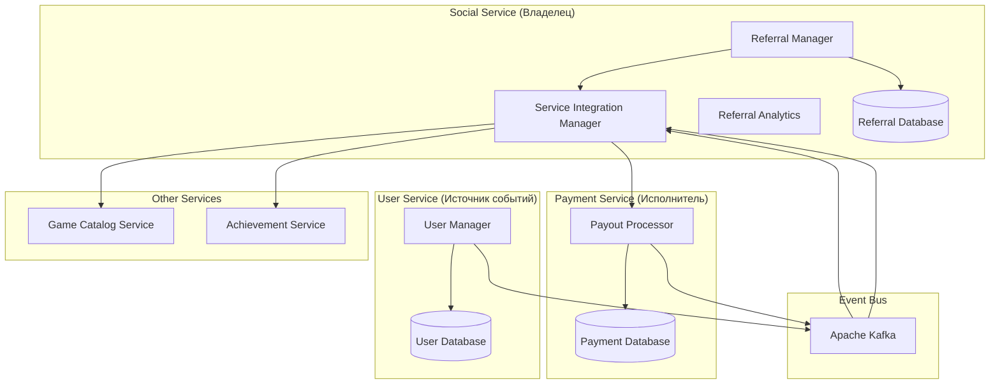
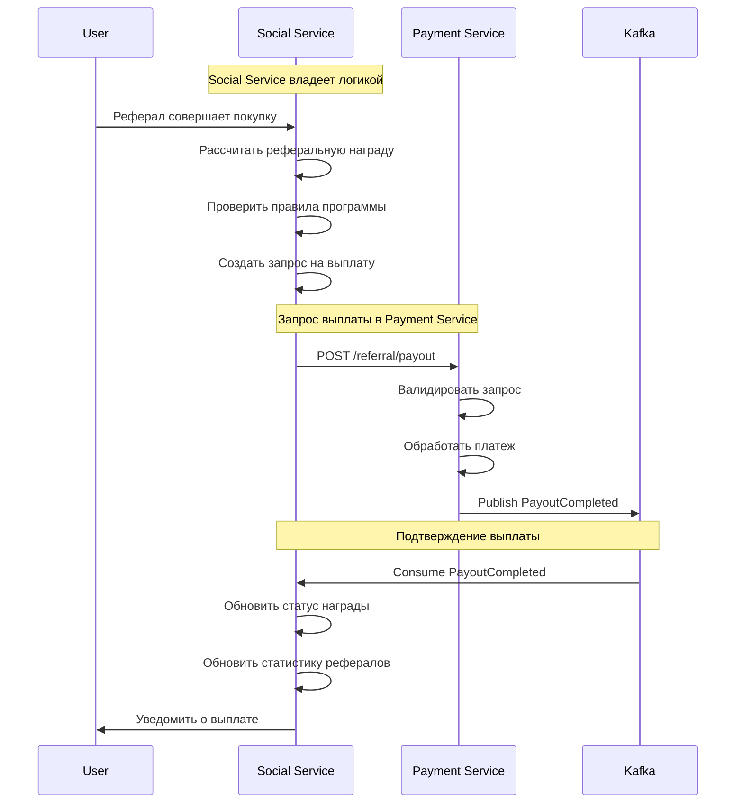
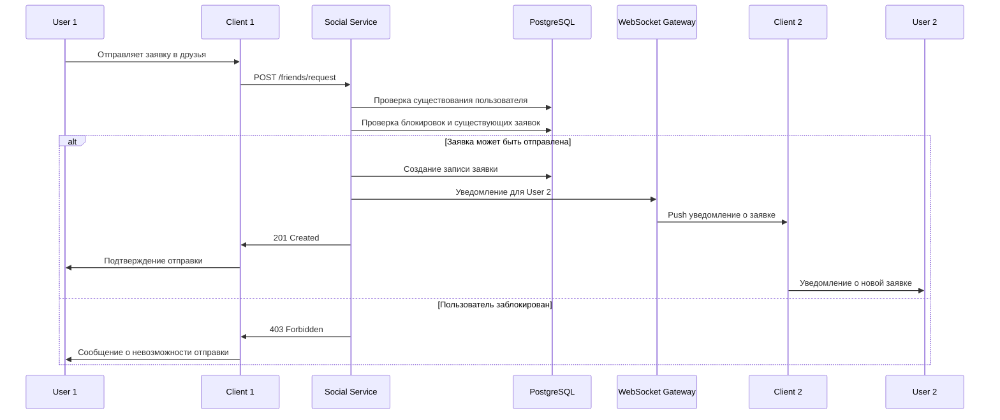
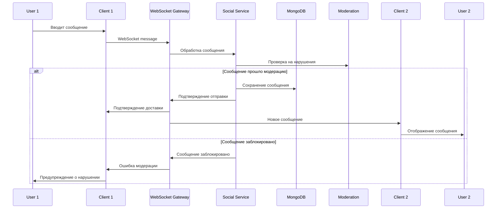
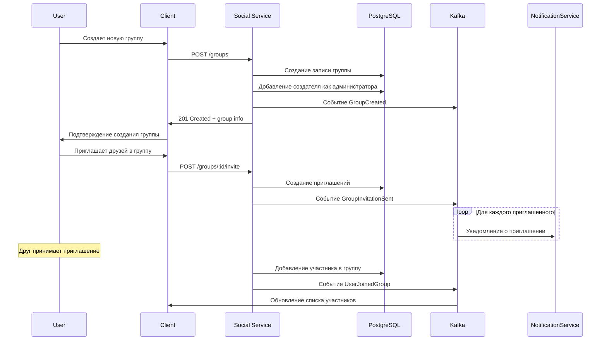
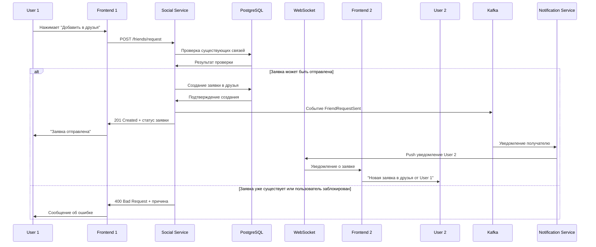
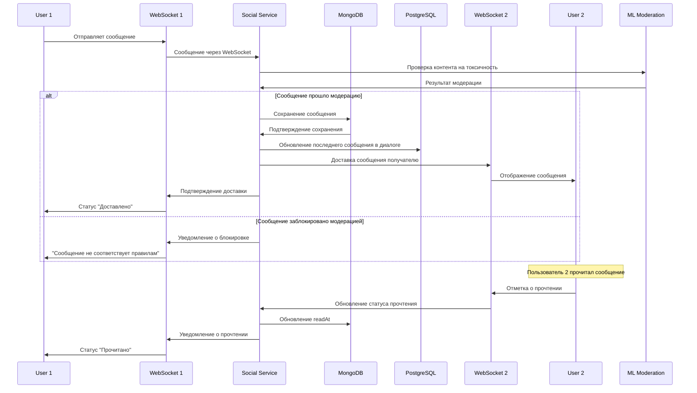
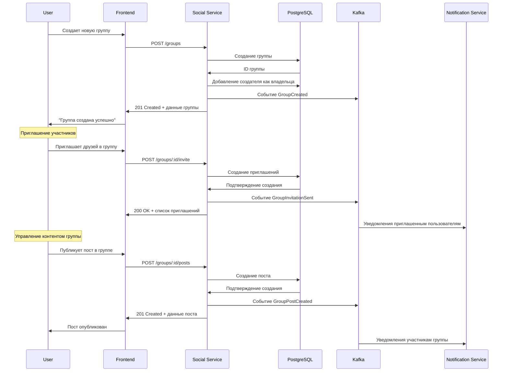
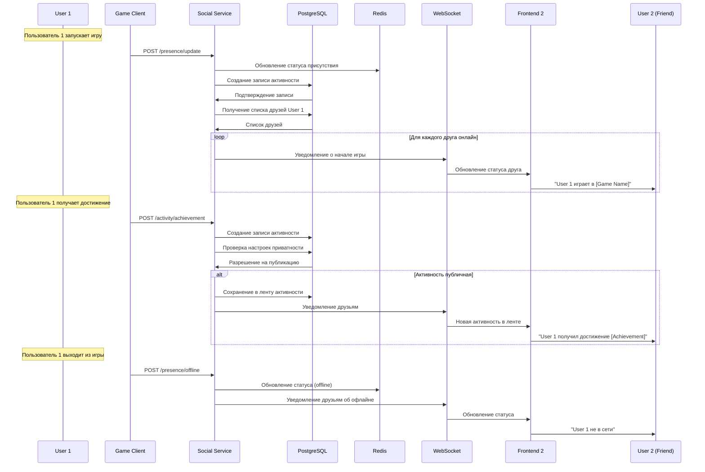

# Дизайн Social Service

## Обзор

Social Service является центральным сервисом для социальных функций российской игровой платформы. Сервис обеспечивает управление друзьями, реальное время чат, активность пользователей, группы и сообщества, игровые приглашения и интеграцию с российскими социальными сетями.

### Расширенная функциональность включает:

- **Комплексная реферальная система**: Отслеживание источников, уникальные коды, базовые награды за регистрацию
- **Многоуровневая реферальная программа**: До 3 уровней рефералов с убывающими процентами и визуализацией дерева
- **Геймификация рефералов**: Уровни, milestone'ы, специальные значки, конкурсы и лидерборды
- **Социальные инструменты для рефералов**: Персонализированные сообщения, интеграция с VK, Telegram, WhatsApp
- **Интеграция с другими сервисами**: Синхронизация с Payment Service, User Service, Game Catalog Service
- **Аналитика реферальной программы**: Метрики конверсии, LTV рефералов, ROI программы, прогнозирование

### Ключевые принципы дизайна

- **Реальное время**: WebSocket соединения для мгновенного общения
- **Масштабируемость**: Поддержка миллионов пользователей онлайн
- **Приватность**: Гибкие настройки приватности и безопасности
- **Интеграция**: Связь с российскими социальными сетями
- **Модерация**: Автоматическая и ручная модерация контента

## Архитектура

### Общая архитектура

```mermaid
graph TB
    subgraph "External Services"
        VK[VK API]
        OK[Одноклассники API]
        Telegram[Telegram Bot API]
        ML[ML Content Moderation]
    end
    
    subgraph "WebSocket Gateway"
        WSGateway[WebSocket Gateway]
        WSCluster[WS Connection Pool]
    end
    
    subgraph "API Gateway"
        Gateway[API Gateway]
    end
    
    subgraph "Social Service"
        API[REST API]
        
        subgraph "Core Social"
            FriendManager[Friend Manager]
            ChatManager[Chat Manager]
            ActivityManager[Activity Manager]
            GroupManager[Group Manager]
        end
        
        subgraph "Referral System"
            ReferralManager[Referral Manager]
            ReferralAnalytics[Referral Analytics]
            ReferralRewards[Referral Rewards]
            ReferralGameification[Referral Gamification]
        end
        
        subgraph "Social Tools"
            SocialIntegration[Social Integration]
            MessageGenerator[Message Generator]
            ShareManager[Share Manager]
        end
        
        subgraph "Support Services"
            ModerationManager[Moderation Manager]
            Events[Event Publisher]
        end
        
        API --> FriendManager
        API --> ChatManager
        API --> ActivityManager
        API --> GroupManager
        API --> ReferralManager
        
        ReferralManager --> ReferralAnalytics
        ReferralManager --> ReferralRewards
        ReferralManager --> ReferralGameification
        ReferralManager --> SocialIntegration
        
        ChatManager --> ModerationManager
        FriendManager --> Events
        ChatManager --> Events
        ActivityManager --> Events
        ReferralManager --> Events
    end
    
    subgraph "Data Layer"
        PostgreSQL[(PostgreSQL)]
        Redis[(Redis Cache)]
        MongoDB[(MongoDB Messages)]
        Kafka[Apache Kafka]
    end
    
    subgraph "Other Services"
        User[User Service]
        Library[Library Service]
        Achievement[Achievement Service]
        Notification[Notification Service]
    end
    
    Gateway --> API
    WSGateway --> ChatManager
    WSGateway --> ActivityManager
    
    FriendManager --> VK
    FriendManager --> OK
    ChatManager --> Telegram
    ModerationManager --> ML
    
    API --> PostgreSQL
    API --> Redis
    ChatManager --> MongoDB
    Events --> Kafka
    
    Kafka --> User
    Kafka --> Library
    Kafka --> Achievement
    Kafka --> Notification
```## A
PI Эндпоинты и маршруты

### Структура API

```
Base URL: https://api.gaming-platform.ru/social-service/v1
WebSocket: wss://ws.gaming-platform.ru/social/v1
```

### Friends Management Endpoints

```typescript
// Управление друзьями
GET    /friends                    // Список друзей пользователя
POST   /friends/request            // Отправка заявки в друзья
PUT    /friends/request/:id/accept // Принятие заявки в друзья
PUT    /friends/request/:id/decline // Отклонение заявки
DELETE /friends/:userId            // Удаление из друзей
POST   /friends/block              // Блокировка пользователя
DELETE /friends/block/:userId      // Разблокировка пользователя

// Поиск друзей
GET    /friends/search             // Поиск пользователей
GET    /friends/suggestions        // Предложения друзей
POST   /friends/import/:provider   // Импорт друзей из соцсетей
GET    /friends/requests           // Входящие заявки в друзья
GET    /friends/requests/sent      // Отправленные заявки
```

### Chat & Messaging Endpoints

```typescript
// Личные сообщения
GET    /messages/conversations     // Список диалогов
GET    /messages/:conversationId   // Сообщения в диалоге
POST   /messages/:conversationId   // Отправка сообщения
PUT    /messages/:messageId        // Редактирование сообщения
DELETE /messages/:messageId        // Удаление сообщения
POST   /messages/:messageId/read   // Отметка как прочитанное

// Групповые чаты
POST   /chats                      // Создание группового чата
GET    /chats/:chatId              // Информация о чате
PUT    /chats/:chatId              // Обновление чата
DELETE /chats/:chatId              // Удаление чата
POST   /chats/:chatId/members      // Добавление участника
DELETE /chats/:chatId/members/:userId // Удаление участника
PUT    /chats/:chatId/members/:userId/role // Изменение роли
```

### Activity & Status Endpoints

```typescript
// Активность пользователей
GET    /activity/feed              // Лента активности
POST   /activity                   // Публикация активности
GET    /activity/:userId           // Активность конкретного пользователя
PUT    /activity/:id/like          // Лайк активности
POST   /activity/:id/comment       // Комментарий к активности

// Статус пользователя
GET    /status/:userId             // Текущий статус пользователя
PUT    /status                     // Обновление своего статуса
GET    /presence/friends           // Статусы друзей
```

### Groups & Communities Endpoints

```typescript
// Группы и сообщества
GET    /groups                     // Список групп пользователя
POST   /groups                     // Создание группы
GET    /groups/:groupId            // Информация о группе
PUT    /groups/:groupId            // Обновление группы
DELETE /groups/:groupId            // Удаление группы
POST   /groups/:groupId/join       // Вступление в группу
POST   /groups/:groupId/leave      // Выход из группы
GET    /groups/:groupId/members    // Участники группы
POST   /groups/:groupId/invite     // Приглашение в группу
```

### Referral System Endpoints (Новые)

```typescript
// Комплексная реферальная система
POST   /referrals/generate-link    // Генерация реферальной ссылки
GET    /referrals/my-link          // Получение своей реферальной ссылки
GET    /referrals/stats            // Статистика рефералов
GET    /referrals/earnings         // Заработок с рефералов
POST   /referrals/register         // Регистрация по реферальной ссылке

// Многоуровневая реферальная программа
GET    /referrals/tree             // Дерево рефералов (до 3 уровней)
GET    /referrals/levels           // Статистика по уровням
POST   /referrals/levels/configure // Настройка процентов по уровням
GET    /referrals/network-stats    // Статистика реферальной сети

// Геймификация рефералов
GET    /referrals/level            // Текущий реферальный уровень
GET    /referrals/progress         // Прогресс до следующего уровня
GET    /referrals/achievements     // Реферальные достижения
GET    /referrals/leaderboard      // Таблица лидеров рефералов
GET    /referrals/competitions     // Активные реферальные конкурсы
POST   /referrals/competitions     // Создание конкурса (админ)

// Социальные инструменты для рефералов
POST   /referrals/share/vk         // Поделиться в VK
POST   /referrals/share/telegram   // Поделиться в Telegram
POST   /referrals/share/whatsapp   // Поделиться в WhatsApp
POST   /referrals/share/email      // Отправить по email
GET    /referrals/share/stats      // Статистика по каналам
POST   /referrals/messages/customize // Кастомизация сообщений

// Аналитика реферальной программы
GET    /referrals/analytics/conversion // Метрики конверсии
GET    /referrals/analytics/ltv        // LTV рефералов
GET    /referrals/analytics/roi        // ROI программы
GET    /referrals/analytics/channels   // Эффективность каналов
GET    /referrals/analytics/forecast   // Прогнозирование результатов
POST   /referrals/analytics/report     // Генерация отчета
```

## Компоненты и интерфейсы

### 1. Referral Program Manager (Владелец реферальной программы)

**Ответственность:**
- Полное управление логикой реферальной программы
- Расчет всех типов наград и бонусов
- Интеграция с Payment Service для выплат
- Отслеживание активности и мошенничества

```typescript
interface ReferralProgramManager {
  // Основные операции реферальной системы
  generateReferralLink(userId: string, source?: string): Promise<ReferralLink>
  processReferralRegistration(referralCode: string, newUserId: string): Promise<ReferralRegistrationResult>
  calculateRewards(referralId: string, activity: ReferralActivity): Promise<RewardCalculation>
  trackReferralActivity(referralId: string, activity: ReferralActivity): Promise<ActivityTrackingResult>
  
  // Интеграция с Payment Service для выплат
  requestPayoutFromPaymentService(userId: string, amount: number, reason: string): Promise<PayoutRequest>
  handlePayoutConfirmation(payoutId: string, status: PayoutStatus): Promise<void>
  
  // Валидация и безопасность
  validateReferralCode(code: string): Promise<ReferralValidation>
  detectFraudulentReferral(referralData: ReferralData): Promise<FraudDetectionResult>
  blockFraudulentReferrals(referralIds: string[], reason: string): Promise<BlockResult>
  
  // Статистика и отчетность
  getReferralStats(userId: string): Promise<ReferralStats>
  getTopReferrers(period: DateRange, limit: number): Promise<TopReferrer[]>
  generateReferralReport(userId: string, period: DateRange): Promise<ReferralReport>
}

interface ReferralLink {
  id: string
  userId: string
  code: string
  url: string
  source?: string
  createdAt: Date
  expiresAt?: Date
  clickCount: number
  conversionCount: number
  isActive: boolean
}

interface ReferralRegistrationResult {
  success: boolean
  referralId: string
  referrerId: string
  newUserId: string
  baseReward: number
  bonusReward?: number
  registrationDate: Date
}
```

### 2. Multi-Level Referral System (Новый)

```typescript
interface MultiLevelReferralSystem {
  // Управление многоуровневой структурой
  buildReferralTree(userId: string, maxLevels: number): Promise<ReferralTree>
  calculateMultiLevelRewards(referralId: string): Promise<MultiLevelRewardCalculation>
  updateReferralHierarchy(userId: string): Promise<HierarchyUpdateResult>
  
  // Настройка уровней и процентов
  configureReferralLevels(config: ReferralLevelConfiguration): Promise<ConfigurationResult>
  setLevelPercentages(level1: number, level2: number, level3: number): Promise<PercentageUpdateResult>
  
  // Визуализация и аналитика
  generateTreeVisualization(userId: string): Promise<TreeVisualization>
  calculateNetworkValue(userId: string): Promise<NetworkValueCalculation>
  analyzeReferralChain(referralId: string): Promise<ChainAnalysis>
  
  // Обработка разрывов цепочки
  handleChainBreak(brokenReferralId: string): Promise<ChainBreakResult>
  recalculateAffectedRewards(affectedUserIds: string[]): Promise<RecalculationResult>
  notifyChainParticipants(chainId: string, changeType: ChainChangeType): Promise<NotificationResult>
}

interface ReferralTree {
  rootUserId: string
  levels: ReferralTreeLevel[]
  totalReferrals: number
  totalValue: number
  maxDepth: number
}

interface ReferralTreeLevel {
  level: number
  referrals: ReferralNode[]
  count: number
  totalValue: number
  averageValue: number
}

interface ReferralNode {
  userId: string
  username: string
  registrationDate: Date
  totalSpent: number
  directReferrals: number
  isActive: boolean
  lifetimeValue: number
}
```

### 3. Referral Gamification System (Новый)

```typescript
interface ReferralGamificationSystem {
  // Система уровней и прогресса
  calculateReferralLevel(userId: string): Promise<ReferralLevel>
  getProgressToNextLevel(userId: string): Promise<LevelProgress>
  updateUserLevel(userId: string, newLevel: ReferralLevel): Promise<LevelUpdateResult>
  
  // Milestone'ы и достижения
  checkMilestoneAchievements(userId: string): Promise<MilestoneCheck[]>
  awardMilestoneReward(userId: string, milestone: Milestone): Promise<MilestoneReward>
  createCustomMilestone(milestoneData: MilestoneData): Promise<CustomMilestone>
  
  // Конкурсы и события
  createReferralCompetition(competitionData: CompetitionData): Promise<ReferralCompetition>
  joinCompetition(userId: string, competitionId: string): Promise<CompetitionJoinResult>
  updateCompetitionLeaderboard(competitionId: string): Promise<LeaderboardUpdate>
  endCompetition(competitionId: string): Promise<CompetitionEndResult>
  
  // Лидерборды и рейтинги
  updateGlobalLeaderboard(): Promise<LeaderboardUpdate>
  getTopReferrers(period: DateRange, category: LeaderboardCategory): Promise<TopReferrer[]>
  getUserRanking(userId: string, category: LeaderboardCategory): Promise<UserRanking>
  
  // Система наград и значков
  awardSpecialBadge(userId: string, badgeType: BadgeType, reason: string): Promise<BadgeAward>
  createExclusiveReward(rewardData: ExclusiveRewardData): Promise<ExclusiveReward>
  distributeSeasonalRewards(season: Season): Promise<SeasonalRewardDistribution>
}

interface ReferralLevel {
  level: number
  name: string
  requiredReferrals: number
  requiredRevenue: number
  benefits: LevelBenefit[]
  badgeUrl: string
  nextLevel?: ReferralLevel
}

interface ReferralCompetition {
  id: string
  name: string
  description: string
  startDate: Date
  endDate: Date
  prizes: CompetitionPrize[]
  participants: CompetitionParticipant[]
  rules: CompetitionRule[]
  status: CompetitionStatus
}
```

### 4. Social Referral Tools (Новый)

```typescript
interface SocialReferralTools {
  // Генерация персонализированных сообщений
  generatePersonalizedMessage(userId: string, platform: SocialPlatform, template?: string): Promise<PersonalizedMessage>
  customizeReferralMessage(userId: string, messageData: MessageCustomization): Promise<CustomMessage>
  
  // Интеграция с социальными платформами
  shareToVK(userId: string, message: string, imageUrl?: string): Promise<VKShareResult>
  shareToTelegram(userId: string, message: string, chatId?: string): Promise<TelegramShareResult>
  shareToWhatsApp(userId: string, message: string, phoneNumber?: string): Promise<WhatsAppShareResult>
  sendEmailInvitation(userId: string, emails: string[], message: string): Promise<EmailInvitationResult>
  
  // Отслеживание эффективности каналов
  trackChannelPerformance(userId: string, channel: SocialChannel): Promise<ChannelPerformance>
  getChannelStatistics(userId: string, period: DateRange): Promise<ChannelStatistics>
  optimizeChannelStrategy(userId: string): Promise<ChannelOptimization>
  
  // Автоматизация и планирование
  scheduleReferralCampaign(userId: string, campaignData: ReferralCampaignData): Promise<ScheduledCampaign>
  createAutoReferralPost(userId: string, frequency: PostFrequency): Promise<AutoPostSetup>
  manageReferralContacts(userId: string, contacts: ContactList): Promise<ContactManagementResult>
}

interface PersonalizedMessage {
  platform: SocialPlatform
  message: string
  hashtags: string[]
  imageUrl?: string
  linkPreview: LinkPreview
  estimatedReach: number
}

interface ChannelPerformance {
  channel: SocialChannel
  clicks: number
  conversions: number
  conversionRate: number
  averageTimeToConversion: number
  topPerformingContent: ContentPerformance[]
}
```

### 5. Referral Analytics Service (Новый)

```typescript
interface ReferralAnalyticsService {
  // Метрики конверсии
  calculateConversionMetrics(userId: string, period: DateRange): Promise<ConversionMetrics>
  analyzeConversionFunnel(userId: string): Promise<ConversionFunnel>
  identifyConversionBottlenecks(userId: string): Promise<ConversionBottleneck[]>
  
  // LTV и ROI анализ
  calculateReferralLTV(userId: string, cohortPeriod: DateRange): Promise<ReferralLTVAnalysis>
  analyzeROI(userId: string, period: DateRange): Promise<ROIAnalysis>
  predictFutureLTV(userId: string, predictionPeriod: DateRange): Promise<LTVPrediction>
  
  // Сегментация и когортный анализ
  segmentReferrals(userId: string, segmentationCriteria: SegmentationCriteria): Promise<ReferralSegments>
  performCohortAnalysis(userId: string, cohortType: CohortType): Promise<CohortAnalysis>
  analyzeReferralBehavior(userId: string): Promise<BehaviorAnalysis>
  
  // Прогнозирование и рекомендации
  forecastReferralGrowth(userId: string, forecastPeriod: DateRange): Promise<GrowthForecast>
  generateOptimizationRecommendations(userId: string): Promise<OptimizationRecommendation[]>
  identifyHighValueReferrals(userId: string): Promise<HighValueReferral[]>
  
  // Детекция аномалий и мошенничества
  detectAnomalousActivity(userId: string): Promise<AnomalyDetection>
  analyzeFraudPatterns(suspiciousActivity: SuspiciousActivity[]): Promise<FraudAnalysis>
  generateFraudReport(period: DateRange): Promise<FraudReport>
}

interface ConversionMetrics {
  totalClicks: number
  totalConversions: number
  conversionRate: number
  averageTimeToConversion: number
  conversionsByChannel: ChannelConversion[]
  conversionTrends: ConversionTrend[]
}

interface ROIAnalysis {
  totalInvestment: number
  totalRevenue: number
  roi: number
  paybackPeriod: number
  profitMargin: number
  revenueBySource: RevenueSource[]
}
```

### 6. Service Integration Manager (Владелец интеграций)

**Ответственность:**
- Управление всеми интеграциями реферальной программы
- Отправка запросов на выплаты в Payment Service
- Получение событий от других сервисов
- Синхронизация состояния программы

```typescript
interface ServiceIntegrationManager {
  // Интеграция с Payment Service (Social Service как инициатор)
  requestReferralPayout(userId: string, amount: number, level: number, sourceTransactionId: string): Promise<PayoutRequest>
  handlePayoutConfirmation(payoutId: string, status: PayoutStatus, errorMessage?: string): Promise<void>
  retryFailedPayout(payoutId: string): Promise<PayoutRetryResult>
  
  // Обработка событий от Payment Service
  handlePaymentCompleted(event: PaymentCompletedEvent): Promise<void>
  handlePaymentRefunded(event: PaymentRefundedEvent): Promise<void>
  
  // Интеграция с User Service (получение событий)
  handleUserRegistered(event: UserRegisteredEvent): Promise<void>
  handleUserProfileUpdated(event: UserProfileUpdatedEvent): Promise<void>
  
  // Интеграция с Game Catalog Service (запросы скидок)
  requestReferralDiscount(userId: string, gameId: string): Promise<DiscountRequest>
  applyReferralPromotion(userId: string, promotionData: PromotionData): Promise<PromotionApplication>
  
  // Интеграция с Achievement Service (создание достижений)
  createReferralMilestoneAchievement(userId: string, milestone: ReferralMilestone): Promise<AchievementCreation>
  awardReferralAchievement(userId: string, achievementType: string): Promise<AchievementAward>
  
  // Синхронизация и мониторинг
  syncReferralData(syncRequest: DataSyncRequest): Promise<DataSyncResult>
  monitorIntegrationHealth(): Promise<IntegrationHealthReport>
  handleIntegrationFailure(service: string, error: IntegrationError): Promise<FailureHandling>
}
```
DELETE /groups/:groupId/leave      // Выход из группы

// Управление группой
GET    /groups/:groupId/members    // Участники группы
POST   /groups/:groupId/invite     // Приглашение в группу
PUT    /groups/:groupId/members/:userId/role // Изменение роли участника
DELETE /groups/:groupId/members/:userId // Исключение участника
GET    /groups/:groupId/posts      // Посты в группе
POST   /groups/:groupId/posts      // Создание поста
```

## Архитектура интеграции с другими сервисами

### Реферальная система как владелец программы

Social Service является единственным владельцем всей логики реферальной программы и координирует работу с другими сервисами:



### Последовательность обработки реферальной выплаты



## User Flows (Пользовательские сценарии)

### 1. Отправка заявки в друзья



### 2. Реальное время чат



### 3. Создание и управление группой



## Модели данных

### Основные сущности

```typescript
interface Friendship {
  id: string
  requesterId: string
  addresseeId: string
  
  // Статус дружбы
  status: 'pending' | 'accepted' | 'blocked'
  
  // Метаданные
  requestedAt: Date
  acceptedAt?: Date
  blockedAt?: Date
  
  // Настройки
  isFavorite: boolean
  notificationsEnabled: boolean
  
  createdAt: Date
  updatedAt: Date
}

interface Message {
  id: string
  conversationId: string
  senderId: string
  
  // Содержание
  content: string
  messageType: 'text' | 'image' | 'file' | 'game_invite' | 'system'
  attachments: MessageAttachment[]
  
  // Статус
  isEdited: boolean
  editedAt?: Date
  isDeleted: boolean
  deletedAt?: Date
  
  // Модерация
  moderationStatus: 'pending' | 'approved' | 'rejected'
  moderationReason?: string
  
  // Реакции
  reactions: MessageReaction[]
  
  // Метаданные
  sentAt: Date
  deliveredAt?: Date
  readBy: MessageRead[]
}

interface Conversation {
  id: string
  type: 'direct' | 'group'
  
  // Участники
  participants: ConversationParticipant[]
  
  // Настройки
  name?: string
  description?: string
  avatarUrl?: string
  
  // Последнее сообщение
  lastMessageId?: string
  lastMessageAt?: Date
  
  // Статус
  isActive: boolean
  isArchived: boolean
  
  createdAt: Date
  updatedAt: Date
}

interface UserActivity {
  id: string
  userId: string
  
  // Тип активности
  activityType: 'game_started' | 'achievement_unlocked' | 'game_completed' | 'friend_added' | 'custom'
  
  // Содержание
  title: string
  description?: string
  imageUrl?: string
  gameId?: string
  achievementId?: string
  
  // Видимость
  visibility: 'public' | 'friends' | 'private'
  
  // Взаимодействие
  likes: ActivityLike[]
  comments: ActivityComment[]
  
  createdAt: Date
}

interface Group {
  id: string
  name: string
  description?: string
  avatarUrl?: string
  
  // Настройки
  isPublic: boolean
  requiresApproval: boolean
  maxMembers: number
  
  // Создатель
  createdBy: string
  
  // Участники
  members: GroupMember[]
  memberCount: number
  
  // Теги и категории
  tags: string[]
  category: string
  
  // Статистика
  postsCount: number
  
  createdAt: Date
  updatedAt: Date
}

interface UserPresence {
  userId: string
  
  // Статус
  status: 'online' | 'away' | 'busy' | 'invisible' | 'offline'
  customStatus?: string
  
  // Игровая активность
  currentGame?: {
    gameId: string
    gameName: string
    startedAt: Date
  }
  
  // Подключение
  lastSeenAt: Date
  deviceType: 'desktop' | 'mobile' | 'web'
  
  updatedAt: Date
}
```

## Детальная схема базы данных

```sql
-- Дружеские связи
CREATE TABLE friendships (
    id UUID PRIMARY KEY DEFAULT gen_random_uuid(),
    requester_id UUID NOT NULL,
    addressee_id UUID NOT NULL,
    
    -- Статус дружбы
    status VARCHAR(20) DEFAULT 'pending' CHECK (status IN ('pending', 'accepted', 'blocked')),
    
    -- Метаданные
    requested_at TIMESTAMP DEFAULT NOW(),
    accepted_at TIMESTAMP,
    blocked_at TIMESTAMP,
    
    -- Настройки
    is_favorite BOOLEAN DEFAULT FALSE,
    notifications_enabled BOOLEAN DEFAULT TRUE,
    
    created_at TIMESTAMP DEFAULT NOW(),
    updated_at TIMESTAMP DEFAULT NOW(),
    
    UNIQUE(requester_id, addressee_id),
    CHECK (requester_id != addressee_id)
);

-- Диалоги и групповые чаты
CREATE TABLE conversations (
    id UUID PRIMARY KEY DEFAULT gen_random_uuid(),
    type VARCHAR(10) NOT NULL CHECK (type IN ('direct', 'group')),
    
    -- Настройки (для групповых чатов)
    name VARCHAR(100),
    description TEXT,
    avatar_url VARCHAR(500),
    
    -- Создатель (для групповых чатов)
    created_by UUID,
    
    -- Последнее сообщение
    last_message_id UUID,
    last_message_at TIMESTAMP,
    
    -- Статус
    is_active BOOLEAN DEFAULT TRUE,
    is_archived BOOLEAN DEFAULT FALSE,
    
    created_at TIMESTAMP DEFAULT NOW(),
    updated_at TIMESTAMP DEFAULT NOW()
);

-- Участники диалогов
CREATE TABLE conversation_participants (
    id UUID PRIMARY KEY DEFAULT gen_random_uuid(),
    conversation_id UUID NOT NULL REFERENCES conversations(id) ON DELETE CASCADE,
    user_id UUID NOT NULL,
    
    -- Роль (для групповых чатов)
    role VARCHAR(20) DEFAULT 'member' CHECK (role IN ('admin', 'moderator', 'member')),
    
    -- Настройки
    notifications_enabled BOOLEAN DEFAULT TRUE,
    is_muted BOOLEAN DEFAULT FALSE,
    
    -- Статус
    joined_at TIMESTAMP DEFAULT NOW(),
    left_at TIMESTAMP,
    
    UNIQUE(conversation_id, user_id)
);

-- Сообщения (хранятся в MongoDB, здесь только ссылочная информация)
CREATE TABLE message_references (
    id UUID PRIMARY KEY,
    conversation_id UUID NOT NULL REFERENCES conversations(id) ON DELETE CASCADE,
    sender_id UUID NOT NULL,
    
    -- Статус модерации
    moderation_status VARCHAR(20) DEFAULT 'approved' CHECK (moderation_status IN ('pending', 'approved', 'rejected')),
    moderation_reason TEXT,
    
    -- Метаданные
    sent_at TIMESTAMP DEFAULT NOW(),
    is_deleted BOOLEAN DEFAULT FALSE,
    deleted_at TIMESTAMP
);

-- Активность пользователей
CREATE TABLE user_activities (
    id UUID PRIMARY KEY DEFAULT gen_random_uuid(),
    user_id UUID NOT NULL,
    
    -- Тип активности
    activity_type VARCHAR(50) NOT NULL,
    
    -- Содержание
    title VARCHAR(255) NOT NULL,
    description TEXT,
    image_url VARCHAR(500),
    
    -- Связанные объекты
    game_id VARCHAR(255),
    achievement_id VARCHAR(255),
    
    -- Видимость
    visibility VARCHAR(20) DEFAULT 'friends' CHECK (visibility IN ('public', 'friends', 'private')),
    
    -- Статистика
    likes_count INTEGER DEFAULT 0,
    comments_count INTEGER DEFAULT 0,
    
    created_at TIMESTAMP DEFAULT NOW()
);

-- Лайки активности
CREATE TABLE activity_likes (
    id UUID PRIMARY KEY DEFAULT gen_random_uuid(),
    activity_id UUID NOT NULL REFERENCES user_activities(id) ON DELETE CASCADE,
    user_id UUID NOT NULL,
    created_at TIMESTAMP DEFAULT NOW(),
    
    UNIQUE(activity_id, user_id)
);

-- Комментарии к активности
CREATE TABLE activity_comments (
    id UUID PRIMARY KEY DEFAULT gen_random_uuid(),
    activity_id UUID NOT NULL REFERENCES user_activities(id) ON DELETE CASCADE,
    user_id UUID NOT NULL,
    content TEXT NOT NULL,
    
    -- Модерация
    moderation_status VARCHAR(20) DEFAULT 'approved' CHECK (moderation_status IN ('pending', 'approved', 'rejected')),
    
    created_at TIMESTAMP DEFAULT NOW()
);

-- Группы и сообщества
CREATE TABLE groups (
    id UUID PRIMARY KEY DEFAULT gen_random_uuid(),
    name VARCHAR(100) NOT NULL,
    description TEXT,
    avatar_url VARCHAR(500),
    
    -- Настройки
    is_public BOOLEAN DEFAULT TRUE,
    requires_approval BOOLEAN DEFAULT FALSE,
    max_members INTEGER DEFAULT 1000,
    
    -- Создатель
    created_by UUID NOT NULL,
    
    -- Статистика
    member_count INTEGER DEFAULT 1,
    posts_count INTEGER DEFAULT 0,
    
    -- Теги и категории
    tags TEXT[] DEFAULT '{}',
    category VARCHAR(50),
    
    created_at TIMESTAMP DEFAULT NOW(),
    updated_at TIMESTAMP DEFAULT NOW()
);

-- Участники групп
CREATE TABLE group_members (
    id UUID PRIMARY KEY DEFAULT gen_random_uuid(),
    group_id UUID NOT NULL REFERENCES groups(id) ON DELETE CASCADE,
    user_id UUID NOT NULL,
    
    -- Роль
    role VARCHAR(20) DEFAULT 'member' CHECK (role IN ('owner', 'admin', 'moderator', 'member')),
    
    -- Статус
    status VARCHAR(20) DEFAULT 'active' CHECK (status IN ('active', 'banned', 'left')),
    
    -- Настройки
    notifications_enabled BOOLEAN DEFAULT TRUE,
    
    joined_at TIMESTAMP DEFAULT NOW(),
    left_at TIMESTAMP,
    
    UNIQUE(group_id, user_id)
);

-- Посты в группах
CREATE TABLE group_posts (
    id UUID PRIMARY KEY DEFAULT gen_random_uuid(),
    group_id UUID NOT NULL REFERENCES groups(id) ON DELETE CASCADE,
    author_id UUID NOT NULL,
    
    -- Содержание
    title VARCHAR(255),
    content TEXT NOT NULL,
    attachments JSONB DEFAULT '[]',
    
    -- Модерация
    moderation_status VARCHAR(20) DEFAULT 'approved' CHECK (moderation_status IN ('pending', 'approved', 'rejected')),
    
    -- Статистика
    likes_count INTEGER DEFAULT 0,
    comments_count INTEGER DEFAULT 0,
    
    created_at TIMESTAMP DEFAULT NOW(),
    updated_at TIMESTAMP DEFAULT NOW()
);

-- Присутствие пользователей (статус онлайн)
CREATE TABLE user_presence (
    user_id UUID PRIMARY KEY,
    
    -- Статус
    status VARCHAR(20) DEFAULT 'offline' CHECK (status IN ('online', 'away', 'busy', 'invisible', 'offline')),
    custom_status VARCHAR(100),
    
    -- Игровая активность
    current_game_id VARCHAR(255),
    current_game_name VARCHAR(255),
    game_started_at TIMESTAMP,
    
    -- Подключение
    last_seen_at TIMESTAMP DEFAULT NOW(),
    device_type VARCHAR(20) DEFAULT 'desktop' CHECK (device_type IN ('desktop', 'mobile', 'web')),
    
    updated_at TIMESTAMP DEFAULT NOW()
);

-- Настройки приватности пользователей
CREATE TABLE user_privacy_settings (
    user_id UUID PRIMARY KEY,
    
    -- Видимость профиля
    profile_visibility VARCHAR(20) DEFAULT 'friends' CHECK (profile_visibility IN ('public', 'friends', 'private')),
    
    -- Кто может отправлять заявки в друзья
    friend_requests_from VARCHAR(20) DEFAULT 'everyone' CHECK (friend_requests_from IN ('everyone', 'friends_of_friends', 'nobody')),
    
    -- Кто может писать сообщения
    messages_from VARCHAR(20) DEFAULT 'friends' CHECK (messages_from IN ('everyone', 'friends', 'nobody')),
    
    -- Показывать ли онлайн статус
    show_online_status BOOLEAN DEFAULT TRUE,
    
    -- Показывать ли игровую активность
    show_game_activity BOOLEAN DEFAULT TRUE,
    
    -- Показывать ли достижения
    show_achievements BOOLEAN DEFAULT TRUE,
    
    updated_at TIMESTAMP DEFAULT NOW()
);

-- Блокировки пользователей
CREATE TABLE user_blocks (
    id UUID PRIMARY KEY DEFAULT gen_random_uuid(),
    blocker_id UUID NOT NULL,
    blocked_id UUID NOT NULL,
    reason VARCHAR(255),
    blocked_at TIMESTAMP DEFAULT NOW(),
    
    UNIQUE(blocker_id, blocked_id),
    CHECK (blocker_id != blocked_id)
);

-- Индексы для производительности
CREATE INDEX idx_friendships_requester ON friendships(requester_id, status);
CREATE INDEX idx_friendships_addressee ON friendships(addressee_id, status);
CREATE INDEX idx_friendships_accepted ON friendships(status, accepted_at) WHERE status = 'accepted';

CREATE INDEX idx_conversations_participants ON conversation_participants(user_id, left_at) WHERE left_at IS NULL;
CREATE INDEX idx_conversations_last_message ON conversations(last_message_at DESC) WHERE is_active = TRUE;

CREATE INDEX idx_message_refs_conversation ON message_references(conversation_id, sent_at DESC);
CREATE INDEX idx_message_refs_moderation ON message_references(moderation_status, sent_at) WHERE moderation_status = 'pending';

CREATE INDEX idx_user_activities_user ON user_activities(user_id, created_at DESC);
CREATE INDEX idx_user_activities_visibility ON user_activities(visibility, created_at DESC);
CREATE INDEX idx_user_activities_type ON user_activities(activity_type, created_at DESC);

CREATE INDEX idx_activity_likes_activity ON activity_likes(activity_id);
CREATE INDEX idx_activity_comments_activity ON activity_comments(activity_id, created_at);

CREATE INDEX idx_groups_public ON groups(is_public, created_at DESC) WHERE is_public = TRUE;
CREATE INDEX idx_groups_category ON groups(category, member_count DESC);

CREATE INDEX idx_group_members_group ON group_members(group_id, status) WHERE status = 'active';
CREATE INDEX idx_group_members_user ON group_members(user_id, status) WHERE status = 'active';

CREATE INDEX idx_group_posts_group ON group_posts(group_id, created_at DESC);
CREATE INDEX idx_group_posts_moderation ON group_posts(moderation_status, created_at) WHERE moderation_status = 'pending';

CREATE INDEX idx_user_presence_status ON user_presence(status, last_seen_at) WHERE status != 'offline';
CREATE INDEX idx_user_presence_game ON user_presence(current_game_id, game_started_at) WHERE current_game_id IS NOT NULL;

CREATE INDEX idx_user_blocks_blocker ON user_blocks(blocker_id);
CREATE INDEX idx_user_blocks_blocked ON user_blocks(blocked_id);

-- Триггеры для автоматического обновления счетчиков
CREATE OR REPLACE FUNCTION update_activity_counters()
RETURNS TRIGGER AS $$
BEGIN
    IF TG_OP = 'INSERT' THEN
        IF TG_TABLE_NAME = 'activity_likes' THEN
            UPDATE user_activities SET likes_count = likes_count + 1 WHERE id = NEW.activity_id;
        ELSIF TG_TABLE_NAME = 'activity_comments' THEN
            UPDATE user_activities SET comments_count = comments_count + 1 WHERE id = NEW.activity_id;
        END IF;
        RETURN NEW;
    ELSIF TG_OP = 'DELETE' THEN
        IF TG_TABLE_NAME = 'activity_likes' THEN
            UPDATE user_activities SET likes_count = likes_count - 1 WHERE id = OLD.activity_id;
        ELSIF TG_TABLE_NAME = 'activity_comments' THEN
            UPDATE user_activities SET comments_count = comments_count - 1 WHERE id = OLD.activity_id;
        END IF;
        RETURN OLD;
    END IF;
    RETURN NULL;
END;
$$ LANGUAGE plpgsql;

CREATE TRIGGER trigger_update_activity_likes_count
    AFTER INSERT OR DELETE ON activity_likes
    FOR EACH ROW EXECUTE FUNCTION update_activity_counters();

CREATE TRIGGER trigger_update_activity_comments_count
    AFTER INSERT OR DELETE ON activity_comments
    FOR EACH ROW EXECUTE FUNCTION update_activity_counters();

-- Функция для обновления счетчика участников группы
CREATE OR REPLACE FUNCTION update_group_member_count()
RETURNS TRIGGER AS $$
BEGIN
    IF TG_OP = 'INSERT' AND NEW.status = 'active' THEN
        UPDATE groups SET member_count = member_count + 1 WHERE id = NEW.group_id;
        RETURN NEW;
    ELSIF TG_OP = 'UPDATE' THEN
        IF OLD.status = 'active' AND NEW.status != 'active' THEN
            UPDATE groups SET member_count = member_count - 1 WHERE id = NEW.group_id;
        ELSIF OLD.status != 'active' AND NEW.status = 'active' THEN
            UPDATE groups SET member_count = member_count + 1 WHERE id = NEW.group_id;
        END IF;
        RETURN NEW;
    ELSIF TG_OP = 'DELETE' AND OLD.status = 'active' THEN
        UPDATE groups SET member_count = member_count - 1 WHERE id = OLD.group_id;
        RETURN OLD;
    END IF;
    RETURN NULL;
END;
$$ LANGUAGE plpgsql;

CREATE TRIGGER trigger_update_group_member_count
    AFTER INSERT OR UPDATE OR DELETE ON group_members
    FOR EACH ROW EXECUTE FUNCTION update_group_member_count();
```

### MongoDB Schema для сообщений

```javascript
// Коллекция messages в MongoDB
{
  _id: ObjectId,
  id: "uuid",
  conversationId: "uuid",
  senderId: "uuid",
  
  // Содержание
  content: "string",
  messageType: "text|image|file|game_invite|system",
  attachments: [
    {
      type: "image|file|audio|video",
      url: "string",
      filename: "string",
      size: "number",
      mimeType: "string"
    }
  ],
  
  // Игровые приглашения
  gameInvite: {
    gameId: "string",
    gameName: "string",
    sessionId: "string",
    expiresAt: "Date"
  },
  
  // Статус
  isEdited: "boolean",
  editedAt: "Date",
  isDeleted: "boolean",
  deletedAt: "Date",
  
  // Модерация
  moderationStatus: "approved|pending|rejected",
  moderationFlags: ["string"],
  
  // Метаданные
  sentAt: "Date",
  deliveredAt: "Date",
  readAt: "Date"
}

// Индексы MongoDB
db.messages.createIndex({ "conversationId": 1, "sentAt": -1 })
db.messages.createIndex({ "senderId": 1, "sentAt": -1 })
db.messages.createIndex({ "moderationStatus": 1, "sentAt": 1 })
```

## User Flows (Пользовательские сценарии)

### 1. Добавление в друзья



### 2. Чат в реальном времени



### 3. Создание и управление группой



### 4. Отслеживание активности друзей


        RETURN NEW;
    ELSIF TG_OP = 'DELETE' AND OLD.status = 'active' THEN
        UPDATE groups SET member_count = member_count - 1 WHERE id = OLD.group_id;
        RETURN OLD;
    END IF;
    RETURN NULL;
END;
$$ LANGUAGE plpgsql;

CREATE TRIGGER trigger_update_group_member_count
    AFTER INSERT OR UPDATE OR DELETE ON group_members
    FOR EACH ROW EXECUTE FUNCTION update_group_member_count();
```

### MongoDB Schema для сообщений

```javascript
// Коллекция messages в MongoDB
{
  _id: ObjectId,
  id: "uuid",
  conversationId: "uuid",
  senderId: "uuid",
  
  // Содержание
  content: "string",
  messageType: "text|image|file|game_invite|system",
  attachments: [
    {
      type: "image|file|audio|video",
      url: "string",
      filename: "string",
      size: "number",
      mimeType: "string"
    }
  ],
  
  // Статус
  isEdited: false,
  editedAt: null,
  originalContent: "string", // если сообщение редактировалось
  
  // Реакции
  reactions: [
    {
      emoji: "👍",
      users: ["userId1", "userId2"],
      count: 2
    }
  ],
  
  // Метаданные
  sentAt: ISODate,
  deliveredAt: ISODate,
  readBy: [
    {
      userId: "uuid",
      readAt: ISODate
    }
  ],
  
  // Индексы
  indexes: [
    { conversationId: 1, sentAt: -1 },
    { senderId: 1, sentAt: -1 },
    { "readBy.userId": 1, "readBy.readAt": -1 }
  ]
}
```

Этот дизайн обеспечивает масштабируемую и функциональную социальную платформу с поддержкой реального времени, модерации контента и интеграции с российскими социальными сетями для Social Service игровой платформы.