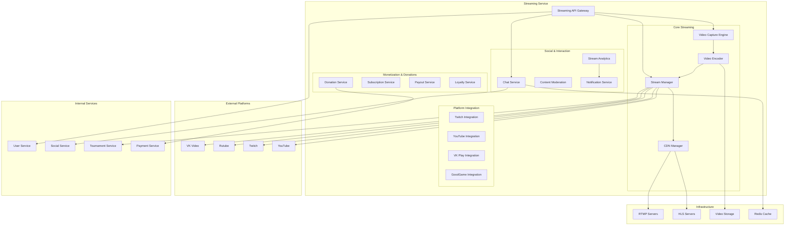
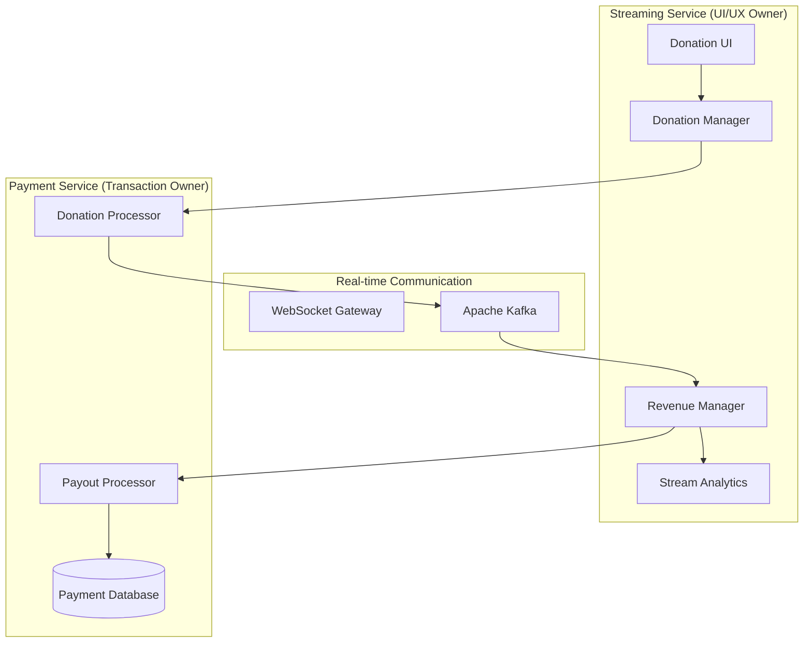
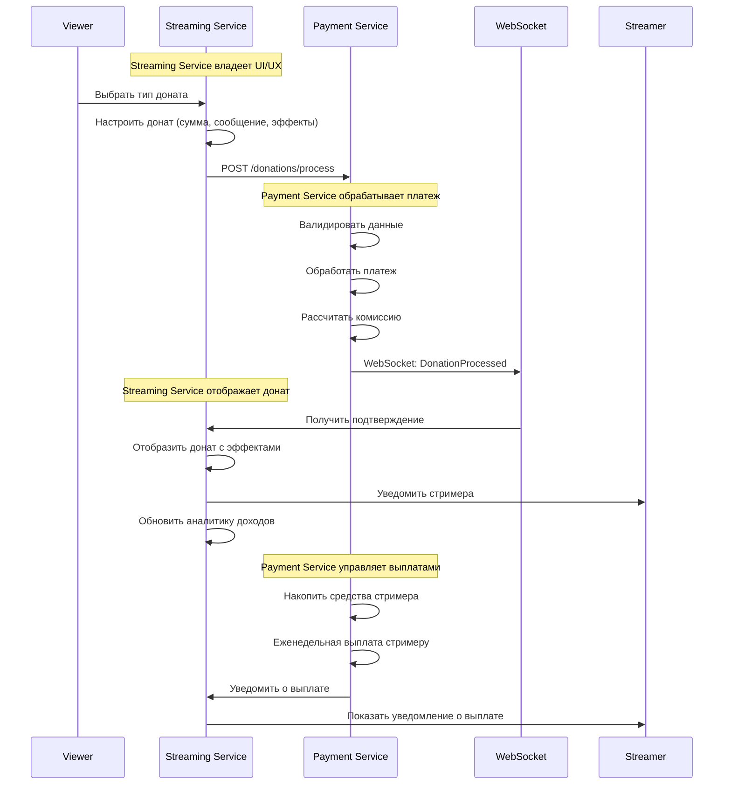

# Дизайн Streaming Service

## Обзор

Streaming Service обеспечивает полнофункциональную стриминговую экосистему для российской Steam платформы, включая захват и трансляцию геймплея, интерактивный чат, систему донатов, модерацию контента и интеграцию с российскими стриминговыми платформами.

### Расширенная функциональность включает:

- **Комплексная система донатов**: Денежные донаты, виртуальные подарки, игровые предметы с real-time обработкой
- **Интеграция со стриминговыми платформами**: Twitch, YouTube, VK Play, GoodGame с единой системой управления
- **Система донатов в реальном времени**: Мгновенные уведомления, анимированные оверлеи, интерактивные функции
- **Система подписок и членства**: Многоуровневые планы (Supporter, VIP, Champion) с эксклюзивными привилегиями
- **Монетизация стримеров**: Прозрачное revenue sharing, автоматические выплаты, детальная аналитика доходов
- **Система лояльности зрителей**: Баллы за активность, достижения, награды, специальные события

## Архитектура

### Высокоуровневая архитектура



### Компонентная архитектура

#### Video Capture Engine
- Захват видео и аудио из игровых приложений
- Поддержка различных источников (игры, рабочий стол, камера)
- Оптимизация производительности для минимального влияния на FPS
- Поддержка аппаратного ускорения

#### Video Encoder
- Кодирование видео в различных форматах и качествах
- Адаптивное изменение битрейта в зависимости от соединения
- Поддержка H.264, H.265, AV1 кодеков
- Аппаратное ускорение кодирования

#### Stream Manager
- Управление жизненным циклом стримов
- Распределение потоков на различные платформы
- Мониторинг качества и стабильности стримов
- Автоматическое восстановление после сбоев

#### Chat Service
- Реалтайм чат для зрителей
- Модерация сообщений
- Интеграция чатов с внешних платформ
- Система эмодзи и стикеров

## Компоненты и интерфейсы

### 1. Streaming API Gateway

```typescript
interface StreamingAPIGateway {
  // Управление стримами
  startStream(streamerId: string, config: StreamConfiguration): Promise<StreamResult>
  stopStream(streamId: string): Promise<StopResult>
  updateStreamSettings(streamId: string, settings: StreamSettings): Promise<UpdateResult>
  
  // Просмотр стримов
  getActiveStreams(filters: StreamFilters): Promise<ActiveStream[]>
  joinStream(viewerId: string, streamId: string): Promise<JoinResult>
  leaveStream(viewerId: string, streamId: string): Promise<LeaveResult>
  
  // Чат
  sendChatMessage(userId: string, streamId: string, message: string): Promise<ChatResult>
  moderateMessage(moderatorId: string, messageId: string, action: ModerationAction): Promise<ModerationResult>
  
  // Донаты
  sendDonation(donorId: string, streamId: string, amount: number, message?: string): Promise<DonationResult>
  
  // Аналитика
  getStreamAnalytics(streamId: string, period: TimePeriod): Promise<StreamAnalytics>
  getStreamerStatistics(streamerId: string): Promise<StreamerStatistics>
}
```

### 2. Video Capture Engine

```typescript
interface VideoCaptureEngine {
  // Захват видео
  startCapture(source: CaptureSource, settings: CaptureSettings): Promise<CaptureSession>
  stopCapture(sessionId: string): Promise<StopCaptureResult>
  updateCaptureSettings(sessionId: string, settings: CaptureSettings): Promise<UpdateCaptureResult>
  
  // Источники захвата
  getAvailableSources(): Promise<CaptureSource[]>
  detectGameWindow(processName: string): Promise<GameWindow>
  captureDesktop(monitor: number): Promise<DesktopCapture>
  
  // Настройки качества
  setResolution(sessionId: string, width: number, height: number): Promise<ResolutionResult>
  setFrameRate(sessionId: string, fps: number): Promise<FrameRateResult>
  setBitrate(sessionId: string, bitrate: number): Promise<BitrateResult>
  
  // Мониторинг
  getCaptureMetrics(sessionId: string): Promise<CaptureMetrics>
  getSystemPerformance(): Promise<SystemPerformance>
}
```

### 3. Video Encoder

```typescript
interface VideoEncoder {
  // Кодирование
  startEncoding(input: VideoInput, config: EncodingConfiguration): Promise<EncodingSession>
  stopEncoding(sessionId: string): Promise<StopEncodingResult>
  
  // Адаптивное качество
  adjustBitrate(sessionId: string, targetBitrate: number): Promise<BitrateAdjustResult>
  changeResolution(sessionId: string, resolution: Resolution): Promise<ResolutionChangeResult>
  switchCodec(sessionId: string, codec: VideoCodec): Promise<CodecSwitchResult>
  
  // Предустановки качества
  applyQualityPreset(sessionId: string, preset: QualityPreset): Promise<PresetResult>
  createCustomPreset(name: string, settings: EncodingSettings): Promise<CustomPresetResult>
  
  // Мониторинг
  getEncodingMetrics(sessionId: string): Promise<EncodingMetrics>
  getHardwareCapabilities(): Promise<HardwareCapabilities>
}
```

### 4. Donation UI/UX Manager (Владелец пользовательского опыта)

**Ответственность:**
- Управление интерфейсом донатов и пользовательским опытом
- Отображение донатов в стримах с эффектами и анимациями
- Интеграция с Payment Service для обработки платежей
- Предоставление аналитики доходов для стримеров

```typescript
interface DonationUIUXManager {
  // UI/UX для донатов (Streaming Service владеет)
  createDonationInterface(streamId: string, config: DonationUIConfig): Promise<DonationInterface>
  displayDonationInStream(donationId: string, effects: DonationEffects): Promise<DisplayResult>
  updateDonationOverlay(streamId: string, overlayConfig: OverlayConfig): Promise<OverlayResult>
  
  // Интеграция с Payment Service (Streaming Service как клиент)
  requestDonationPayment(donationData: DonationRequest): Promise<PaymentRequestResult>
  handlePaymentConfirmation(paymentId: string, status: PaymentStatus): Promise<ConfirmationResult>
  handlePaymentFailure(paymentId: string, error: PaymentError): Promise<FailureHandling>
  
  // Виртуальные подарки и интерактивные функции
  sendVirtualGift(senderId: string, streamId: string, giftId: string): Promise<VirtualGiftResult>
  createCustomGift(creatorId: string, giftData: CustomGiftData): Promise<CustomGift>
  getAvailableGifts(category?: GiftCategory): Promise<VirtualGift[]>
  
  // Интерактивные донаты
  highlightMoment(donorId: string, streamId: string, timestamp: number): Promise<HighlightResult>
  boostMessage(donorId: string, messageId: string, boostLevel: number): Promise<MessageBoostResult>
  requestSong(donorId: string, streamId: string, songRequest: SongRequest): Promise<SongRequestResult>
  requestGame(donorId: string, streamId: string, gameRequest: GameRequest): Promise<GameRequestResult>
  
  // Отображение и эффекты
  displayDonationAlert(donationData: DonationDisplayData): Promise<AlertResult>
  playDonationAnimation(animationType: AnimationType, donationAmount: number): Promise<AnimationResult>
  playDonationSound(soundType: SoundType, volume: number): Promise<SoundResult>
  
  // Модерация контента (только UI части)
  moderateDonationMessage(message: string): Promise<ModerationResult>
  filterInappropriateContent(content: string): Promise<FilterResult>
}

interface DonationData {
  donorId: string
  streamId: string
  amount: number
  currency: string
  message?: string
  isAnonymous: boolean
  donationType: DonationType
}

enum DonationType {
  MONEY = 'money',
  VIRTUAL_GIFT = 'virtual_gift',
  GAME_KEY = 'game_key',
  IN_GAME_ITEM = 'in_game_item',
  DLC = 'dlc',
  SUBSCRIPTION = 'subscription'
}
```

### 5. Platform Integration Service (Новый)

```typescript
interface PlatformIntegrationService {
  // Twitch интеграция
  connectTwitch(streamerId: string, twitchCredentials: TwitchCredentials): Promise<TwitchConnection>
  syncTwitchChat(streamId: string): Promise<ChatSyncResult>
  manageTwitchSubscribers(streamerId: string): Promise<SubscriberManagement>
  
  // YouTube интеграция
  connectYouTube(streamerId: string, youtubeCredentials: YouTubeCredentials): Promise<YouTubeConnection>
  handleSuperChat(streamId: string, superChatData: SuperChatData): Promise<SuperChatResult>
  manageMemberships(streamerId: string): Promise<MembershipManagement>
  
  // VK Play интеграция
  connectVKPlay(streamerId: string, vkCredentials: VKCredentials): Promise<VKConnection>
  syncVKDonations(streamId: string): Promise<VKDonationSync>
  
  // GoodGame интеграция
  connectGoodGame(streamerId: string, ggCredentials: GoodGameCredentials): Promise<GoodGameConnection>
  handleGGDonations(streamId: string): Promise<GGDonationResult>
  
  // Кросс-платформенные функции
  unifyDonationGoals(streamerId: string, goals: DonationGoal[]): Promise<UnifiedGoals>
  aggregateAlerts(streamerId: string): Promise<AggregatedAlerts>
  consolidateAnalytics(streamerId: string, period: DateRange): Promise<ConsolidatedAnalytics>
  
  // Управление подключениями
  disconnectPlatform(streamerId: string, platform: StreamingPlatform): Promise<DisconnectResult>
  getPlatformStatus(streamerId: string): Promise<PlatformStatus[]>
  handlePlatformFailover(streamerId: string, failedPlatform: StreamingPlatform): Promise<FailoverResult>
}
```

### 6. Real-time Donation System (Новый)

```typescript
interface RealTimeDonationSystem {
  // Обработка донатов в реальном времени
  processDonationPipeline(donation: DonationRequest): Promise<DonationPipelineResult>
  validatePayment(paymentData: PaymentData): Promise<PaymentValidation>
  sendInstantNotification(streamerId: string, donation: ProcessedDonation): Promise<NotificationResult>
  
  // Уведомления и оверлеи
  createPopupAlert(donation: ProcessedDonation, alertConfig: AlertConfiguration): Promise<PopupAlert>
  generateAnimatedOverlay(donation: ProcessedDonation, overlayConfig: OverlayConfiguration): Promise<AnimatedOverlay>
  playCustomSound(soundId: string, volume: number): Promise<SoundResult>
  triggerTextToSpeech(message: string, voice: TTSVoice): Promise<TTSResult>
  
  // Интеграция с чатом
  publishDonationToChat(streamId: string, donation: ProcessedDonation): Promise<ChatPublishResult>
  highlightDonorMessage(messageId: string, highlightLevel: number): Promise<HighlightResult>
  
  // Интерактивные функции
  createCommunityGoal(streamerId: string, goalData: CommunityGoalData): Promise<CommunityGoal>
  startDonationCompetition(streamId: string, competitionConfig: CompetitionConfig): Promise<DonationCompetition>
  triggerAchievementReward(streamerId: string, achievement: Achievement): Promise<RewardResult>
  handleViewerChallenge(challengeData: ViewerChallengeData): Promise<ChallengeResult>
  
  // Защита от мошенничества
  detectFraudulentDonation(donation: DonationRequest): Promise<FraudDetectionResult>
  handleChargeback(donationId: string, chargebackData: ChargebackData): Promise<ChargebackResult>
  blockSuspiciousDonor(donorId: string, reason: string): Promise<BlockResult>
}
```

### 7. Subscription & Membership Service (Новый)

```typescript
interface SubscriptionMembershipService {
  // Уровни подписок
  createSubscriptionTier(streamerId: string, tierData: SubscriptionTierData): Promise<SubscriptionTier>
  updateTierPrivileges(tierId: string, privileges: TierPrivileges): Promise<UpdateResult>
  
  // Управление подписками
  subscribeToStreamer(userId: string, streamerId: string, tierId: string): Promise<SubscriptionResult>
  cancelSubscription(subscriptionId: string, reason?: string): Promise<CancellationResult>
  upgradeSubscription(subscriptionId: string, newTierId: string): Promise<UpgradeResult>
  
  // Подарочные подписки
  giftSubscription(gifterId: string, recipientId: string, streamerId: string, tierId: string, duration: number): Promise<GiftSubscriptionResult>
  handleGiftSubscriptionSeries(gifterId: string, streamerId: string, count: number, tierId: string): Promise<SeriesGiftResult>
  
  // Награды за лояльность
  calculateLoyaltyRewards(subscriptionId: string): Promise<LoyaltyRewards>
  grantSubscriberBadge(userId: string, streamerId: string, badgeType: BadgeType): Promise<BadgeResult>
  
  // Эксклюзивный контент
  grantAccessToPrivateStream(userId: string, streamId: string): Promise<AccessResult>
  provideEarlyAccess(userId: string, contentId: string): Promise<EarlyAccessResult>
  deliverPersonalizedContent(userId: string, streamerId: string): Promise<PersonalizedContent>
  
  // Управление подписками
  pauseSubscription(subscriptionId: string, pauseDuration: number): Promise<PauseResult>
  resumeSubscription(subscriptionId: string): Promise<ResumeResult>
  getSubscriptionHistory(userId: string): Promise<SubscriptionHistory>
  
  // Уведомления об истечении
  notifyExpiringSubscription(subscriptionId: string): Promise<NotificationResult>
  offerRenewalDiscount(subscriptionId: string, discountPercentage: number): Promise<RenewalOfferResult>
}

interface SubscriptionTierData {
  name: string
  price: number
  currency: string
  privileges: TierPrivileges
  badgeDesign: BadgeDesign
  exclusiveEmotes: EmoteSet[]
}

enum SubscriptionTier {
  SUPPORTER = 'supporter', // 199₽
  VIP = 'vip',            // 499₽
  CHAMPION = 'champion'    // 999₽
}
```

### 8. Streamer Monetization Service (Новый)

```typescript
interface StreamerRevenueManager {
  // Отслеживание доходов (Streaming Service владеет аналитикой)
  trackDonationRevenue(streamerId: string, donationData: DonationRevenueData): Promise<RevenueTrackingResult>
  calculateRevenueShare(streamerId: string, period: DateRange): Promise<RevenueCalculation>
  updateStreamerBalance(streamerId: string, amount: number, source: RevenueSource): Promise<BalanceUpdate>
  
  // Интеграция с Payment Service для выплат
  requestPayoutFromPaymentService(streamerId: string, amount: number, method: PayoutMethod): Promise<PayoutRequest>
  handlePayoutConfirmation(payoutId: string, status: PayoutStatus): Promise<PayoutConfirmation>
  handlePayoutFailure(payoutId: string, error: PayoutError): Promise<PayoutFailureHandling>
  
  // Настройки выплат (UI/UX)
  setupPayoutPreferences(streamerId: string, preferences: PayoutPreferences): Promise<PreferencesResult>
  updatePayoutSchedule(streamerId: string, schedule: PayoutSchedule): Promise<ScheduleResult>
  setMinimumPayoutThreshold(streamerId: string, threshold: number): Promise<ThresholdResult>
  
  // Аналитика доходов (Streaming Service владеет)
  getDetailedEarningsBreakdown(streamerId: string, period: DateRange): Promise<EarningsBreakdown>
  analyzeAudienceGrowth(streamerId: string): Promise<AudienceAnalytics>
  provideGrowthRecommendations(streamerId: string): Promise<GrowthRecommendation[]>
  getTopDonorsAnalytics(streamerId: string, period: DateRange): Promise<TopDonorsAnalytics>
  
  // Обработка событий от Payment Service
  handleDonationProcessed(event: DonationProcessedEvent): Promise<void>
  handleChargebackNotification(event: ChargebackEvent): Promise<void>
  handlePayoutCompleted(event: PayoutCompletedEvent): Promise<void>
  
  // Уведомления стримерам
  notifyRevenueUpdate(streamerId: string, revenueData: RevenueUpdateData): Promise<NotificationResult>
  notifyPayoutScheduled(streamerId: string, payoutData: PayoutData): Promise<NotificationResult>
  notifyChargebackImpact(streamerId: string, impact: ChargebackImpact): Promise<NotificationResult>
}

interface RevenueShareRates {
  donations: number      // 85% к стримеру
  subscriptions: number  // 70% к стримеру  
  virtualGifts: number   // 80% к стримеру
  sponsoredContent: number // 90% к стримеру
}
```

### 9. Viewer Loyalty System (Новый)

```typescript
interface ViewerLoyaltySystem {
  // Система баллов
  awardViewingPoints(userId: string, streamId: string, minutesWatched: number): Promise<PointsAwardResult>
  awardDonationPoints(userId: string, donationAmount: number): Promise<PointsAwardResult>
  awardSubscriptionBonus(userId: string, subscriptionTier: SubscriptionTier): Promise<BonusResult>
  awardSharingBonus(userId: string, shareType: ShareType): Promise<SharingBonusResult>
  
  // Трата баллов
  unlockEmote(userId: string, emoteId: string, pointsCost: number): Promise<EmoteUnlockResult>
  gainChatPriority(userId: string, durationMinutes: number, pointsCost: number): Promise<PriorityResult>
  requestGame(userId: string, streamerId: string, gameRequest: string, pointsCost: number): Promise<GameRequestResult>
  accessExclusiveContent(userId: string, contentId: string, pointsCost: number): Promise<ExclusiveAccessResult>
  
  // Достижения
  checkViewingAchievements(userId: string): Promise<AchievementCheck[]>
  awardFirstDonationAchievement(userId: string): Promise<AchievementResult>
  trackChatParticipation(userId: string, streamId: string): Promise<ParticipationResult>
  
  // Система рангов и сообщество
  calculateUserRank(userId: string): Promise<UserRank>
  assignSpecialBadge(userId: string, badgeType: BadgeType, reason: string): Promise<BadgeAssignmentResult>
  updateLeaderboard(streamerId: string): Promise<LeaderboardUpdate>
  createCommunityEvent(streamerId: string, eventData: CommunityEventData): Promise<CommunityEvent>
  
  // Возвращение неактивных пользователей
  detectInactiveViewer(userId: string): Promise<InactivityDetection>
  offerReturnBonus(userId: string, bonusData: ReturnBonusData): Promise<ReturnOfferResult>
  sendPersonalizedInvitation(userId: string, streamerId: string): Promise<InvitationResult>
}

interface PointsSystem {
  viewingRate: number    // 1 балл за минуту просмотра
  donationRate: number   // 1 балл за 10₽ доната
  subscriptionBonus: {
    supporter: number    // Бонус за подписку Supporter
    vip: number         // Бонус за подписку VIP  
    champion: number    // Бонус за подписку Champion
  }
  sharingBonus: number  // Бонус за шаринг
}
```
```

### 4. Stream Manager

```typescript
interface StreamManager {
  // Управление стримами
  createStream(streamer: StreamerInfo, configuration: StreamConfiguration): Promise<Stream>
  updateStream(streamId: string, updates: StreamUpdate): Promise<UpdateStreamResult>
  terminateStream(streamId: string, reason: TerminationReason): Promise<TerminationResult>
  
  // Мультиплатформенная трансляция
  addPlatform(streamId: string, platform: StreamingPlatform, credentials: PlatformCredentials): Promise<PlatformResult>
  removePlatform(streamId: string, platform: StreamingPlatform): Promise<RemovePlatformResult>
  syncPlatforms(streamId: string): Promise<SyncResult>
  
  // Мониторинг и аналитика
  getStreamHealth(streamId: string): Promise<StreamHealth>
  getViewerStatistics(streamId: string): Promise<ViewerStatistics>
  getStreamMetrics(streamId: string): Promise<StreamMetrics>
  
  // Записи
  startRecording(streamId: string, settings: RecordingSettings): Promise<RecordingResult>
  stopRecording(recordingId: string): Promise<StopRecordingResult>
  getRecordings(streamerId: string): Promise<Recording[]>
}
```

### 5. Chat Service

```typescript
interface ChatService {
  // Управление чатом
  createChatRoom(streamId: string, settings: ChatSettings): Promise<ChatRoom>
  joinChatRoom(userId: string, roomId: string): Promise<JoinChatResult>
  leaveChatRoom(userId: string, roomId: string): Promise<LeaveChatResult>
  
  // Сообщения
  sendMessage(userId: string, roomId: string, content: MessageContent): Promise<MessageResult>
  deleteMessage(messageId: string, moderatorId: string): Promise<DeleteMessageResult>
  editMessage(messageId: string, userId: string, newContent: string): Promise<EditMessageResult>
  
  // Модерация
  muteUser(roomId: string, userId: string, duration: number, moderatorId: string): Promise<MuteResult>
  banUser(roomId: string, userId: string, reason: string, moderatorId: string): Promise<BanResult>
  addModerator(roomId: string, userId: string, streamerId: string): Promise<ModeratorResult>
  
  // Интеграция с внешними платформами
  syncExternalChat(roomId: string, platform: ChatPlatform): Promise<SyncChatResult>
  forwardMessage(messageId: string, platforms: ChatPlatform[]): Promise<ForwardResult>
}
```

### 6. Donation Service

```typescript
interface DonationService {
  // Донаты
  processDonation(donation: DonationRequest): Promise<DonationResult>
  getDonationHistory(streamerId: string, period: TimePeriod): Promise<DonationHistory>
  
  // Настройки донатов
  setDonationGoal(streamerId: string, goal: DonationGoal): Promise<GoalResult>
  configureDonationAlerts(streamerId: string, alerts: DonationAlerts): Promise<AlertResult>
  
  // Интеграция с платежными системами
  setupPaymentMethod(streamerId: string, method: PaymentMethod): Promise<PaymentSetupResult>
  withdrawFunds(streamerId: string, amount: number, method: WithdrawalMethod): Promise<WithdrawalResult>
  
  // Аналитика
  getDonationAnalytics(streamerId: string, period: TimePeriod): Promise<DonationAnalytics>
  getTopDonors(streamerId: string, period: TimePeriod): Promise<TopDonor[]>
}
```

## Интеграция с Payment Service

### Архитектура интеграции донатов

Streaming Service управляет UI/UX донатов, а Payment Service обрабатывает все финансовые операции:



### Последовательность обработки доната



### API интеграции

```typescript
// Streaming Service отправляет запросы в Payment Service
interface PaymentServiceIntegration {
  // Обработка донатов
  processDonation(request: DonationProcessRequest): Promise<DonationProcessResponse>
  
  // Запрос выплат стримерам
  requestStreamerPayout(request: StreamerPayoutRequest): Promise<PayoutResponse>
  
  // Получение статуса платежей
  getDonationStatus(donationId: string): Promise<DonationStatus>
  getStreamerBalance(streamerId: string): Promise<StreamerBalance>
}

// Payment Service отправляет события в Streaming Service
interface StreamingServiceEvents {
  DonationProcessed: {
    donationId: string
    streamerId: string
    amount: number
    status: 'completed' | 'failed'
    timestamp: Date
  }
  
  PayoutCompleted: {
    payoutId: string
    streamerId: string
    amount: number
    timestamp: Date
  }
  
  ChargebackReceived: {
    donationId: string
    streamerId: string
    amount: number
    reason: string
    timestamp: Date
  }
}
```

## Модели данных

### Stream
```typescript
interface Stream {
  id: string
  streamerId: string
  title: string
  description: string
  gameId?: string
  category: StreamCategory
  status: StreamStatus
  startedAt: Date
  endedAt?: Date
  currentViewers: number
  peakViewers: number
  totalViews: number
  duration: number
  language: string
  tags: string[]
  thumbnailUrl: string
  isRecording: boolean
  platforms: ConnectedPlatform[]
  chatRoomId: string
  donationGoal?: DonationGoal
}

enum StreamStatus {
  STARTING = 'starting',
  LIVE = 'live',
  PAUSED = 'paused',
  ENDING = 'ending',
  ENDED = 'ended',
  ERROR = 'error'
}

interface ConnectedPlatform {
  platform: StreamingPlatform
  platformStreamId: string
  status: PlatformStatus
  viewers: number
  chatEnabled: boolean
  lastSync: Date
}
```

### Stream Configuration
```typescript
interface StreamConfiguration {
  title: string
  description: string
  gameId?: string
  category: StreamCategory
  language: string
  tags: string[]
  isPrivate: boolean
  videoSettings: VideoSettings
  audioSettings: AudioSettings
  platforms: PlatformConfiguration[]
  chatSettings: ChatSettings
  donationSettings: DonationSettings
}

interface VideoSettings {
  resolution: Resolution
  frameRate: number
  bitrate: number
  codec: VideoCodec
  keyFrameInterval: number
  adaptiveBitrate: boolean
}

interface AudioSettings {
  sampleRate: number
  bitrate: number
  channels: number
  codec: AudioCodec
  noiseSuppressionEnabled: boolean
  echoCancellationEnabled: boolean
}
```

### Chat Message
```typescript
interface ChatMessage {
  id: string
  roomId: string
  userId: string
  username: string
  content: MessageContent
  timestamp: Date
  platform: ChatPlatform
  isModerated: boolean
  moderationReason?: string
  reactions: MessageReaction[]
  isHighlighted: boolean
  isDonationMessage: boolean
  donationAmount?: number
}

interface MessageContent {
  text: string
  emojis: Emoji[]
  mentions: UserMention[]
  links: MessageLink[]
}

interface MessageReaction {
  emoji: string
  count: number
  users: string[]
}
```

### Donation
```typescript
interface Donation {
  id: string
  streamId: string
  streamerId: string
  donorId?: string
  donorName: string
  amount: number
  currency: string
  message?: string
  timestamp: Date
  paymentMethod: PaymentMethod
  status: DonationStatus
  isAnonymous: boolean
  isRefunded: boolean
  refundReason?: string
}

enum DonationStatus {
  PENDING = 'pending',
  COMPLETED = 'completed',
  FAILED = 'failed',
  REFUNDED = 'refunded'
}

interface DonationGoal {
  id: string
  streamerId: string
  title: string
  description: string
  targetAmount: number
  currentAmount: number
  currency: string
  deadline?: Date
  isActive: boolean
  createdAt: Date
}
```

### Stream Analytics
```typescript
interface StreamAnalytics {
  streamId: string
  period: TimePeriod
  totalViews: number
  uniqueViewers: number
  averageViewers: number
  peakViewers: number
  watchTime: number
  averageWatchTime: number
  chatMessages: number
  donations: DonationSummary
  platformBreakdown: PlatformAnalytics[]
  viewerDemographics: ViewerDemographics
  engagementMetrics: EngagementMetrics
}

interface PlatformAnalytics {
  platform: StreamingPlatform
  viewers: number
  chatMessages: number
  donations: number
  watchTime: number
}

interface EngagementMetrics {
  chatMessagesPerMinute: number
  donationsPerHour: number
  viewerRetentionRate: number
  newFollowers: number
  subscriberGrowth: number
}
```

## Обработка ошибок

### Error Handling Strategy

```typescript
interface StreamingError {
  code: StreamingErrorCode
  message: string
  streamId?: string
  userId?: string
  platform?: string
  details?: any
  timestamp: Date
}

enum StreamingErrorCode {
  // Захват видео
  CAPTURE_FAILED = 'CAPTURE_FAILED',
  GAME_NOT_DETECTED = 'GAME_NOT_DETECTED',
  INSUFFICIENT_PERFORMANCE = 'INSUFFICIENT_PERFORMANCE',
  
  // Кодирование
  ENCODING_FAILED = 'ENCODING_FAILED',
  CODEC_NOT_SUPPORTED = 'CODEC_NOT_SUPPORTED',
  BITRATE_TOO_HIGH = 'BITRATE_TOO_HIGH',
  
  // Стриминг
  STREAM_CONNECTION_FAILED = 'STREAM_CONNECTION_FAILED',
  PLATFORM_UNAVAILABLE = 'PLATFORM_UNAVAILABLE',
  BANDWIDTH_INSUFFICIENT = 'BANDWIDTH_INSUFFICIENT',
  
  // Чат
  CHAT_CONNECTION_FAILED = 'CHAT_CONNECTION_FAILED',
  MESSAGE_BLOCKED = 'MESSAGE_BLOCKED',
  USER_BANNED = 'USER_BANNED',
  
  // Донаты
  PAYMENT_FAILED = 'PAYMENT_FAILED',
  DONATION_LIMIT_EXCEEDED = 'DONATION_LIMIT_EXCEEDED',
  WITHDRAWAL_FAILED = 'WITHDRAWAL_FAILED'
}
```

### Recovery Mechanisms
- Автоматическое переподключение при сбоях сети
- Переключение на резервные серверы
- Адаптивное снижение качества при проблемах с производительностью
- Сохранение состояния чата при временных отключениях

## Стратегия тестирования

### Unit Tests
- Тестирование алгоритмов кодирования
- Проверка логики управления стримами
- Тестирование модерации чата
- Валидация обработки донатов

### Integration Tests
- Тестирование интеграции с внешними платформами
- Проверка взаимодействия с платежными системами
- Тестирование захвата видео из игр
- Проверка синхронизации чатов

### Performance Tests
- Нагрузочное тестирование стриминговых серверов
- Тестирование производительности кодирования
- Проверка масштабирования при большом количестве зрителей
- Стресс-тестирование чата

### End-to-End Tests
- Полный цикл создания и проведения стрима
- Тестирование взаимодействия зрителей
- Проверка турнирных трансляций
- Тестирование мультиплатформенной трансляции

## Безопасность

### Content Moderation
- Автоматическое обнаружение неподходящего контента
- Машинное обучение для классификации контента
- Интеграция с системами модерации
- Соблюдение российского законодательства

### Chat Security
- Фильтрация спама и токсичных сообщений
- Защита от флуда и ботов
- Система репортов и жалоб
- Автоматическая модерация

### Financial Security
- Защита донатов от мошенничества
- Безопасная обработка платежей
- Предотвращение отмывания денег
- Соблюдение финансового законодательства

## Производительность и масштабируемость

### Video Processing Optimization
- Аппаратное ускорение кодирования
- Оптимизация алгоритмов сжатия
- Адаптивное изменение качества
- Кэширование обработанного контента

### CDN and Delivery
- Глобальная сеть доставки контента
- Региональные серверы для минимизации задержек
- Адаптивная потоковая передача
- Оптимизация для мобильных устройств

### Real-time Communication
- Низколатентная передача чата
- Оптимизация WebSocket соединений
- Горизонтальное масштабирование чат-серверов
- Кэширование активных сессий

## Соответствие российским требованиям

### Legal Compliance
- Соблюдение закона о блогерах
- Интеграция с системами контроля контента
- Соответствие требованиям Роскомнадзора
- Ведение реестра стримеров

### Data Localization
- Хранение стримов на российских серверах
- Локализация пользовательских данных
- Соответствие требованиям по персональным данным
- Интеграция с российскими CDN

### Platform Integration
- Приоритетная интеграция с российскими платформами
- Поддержка российских платежных систем
- Локализация интерфейса на русский язык
- Адаптация под российские культурные особенности