# Дизайн Subscription Service

## Обзор

Subscription Service управляет всеми типами подписок на российской Steam платформе, включая игровые подписки (аналог Game Pass), премиум-аккаунты, семейные и корпоративные подписки, с поддержкой российских платежных систем и региональных особенностей.

## Архитектура

### Высокоуровневая архитектура

```mermaid
graph TB
    subgraph "Subscription Service"
        API[Subscription API Gateway]
        SUB_MGR[Subscription Manager]
        BILLING[Billing Engine]
        CATALOG[Subscription Catalog]
        ANALYTICS[Subscription Analytics]
        LOYALTY[Loyalty System]
        TRIAL[Trial Manager]
        FAMILY[Family Manager]
        CORPORATE[Corporate Manager]
        QUEUE[Message Queue]
    end
    
    subgraph "External Services"
        PAYMENT[Payment Service]
        LIBRARY[Library Service]
        USER[User Service]
        GAME_CATALOG[Game Catalog Service]
        NOTIFICATION[Notification Service]
        ANALYTICS_SVC[Analytics Service]
    end
    
    subgraph "Data Storage"
        SUBSCRIPTIONS_DB[(Subscriptions Database)]
        BILLING_DB[(Billing Database)]
        ANALYTICS_DB[(Analytics Database)]
        CACHE[(Redis Cache)]
    end
    
    API --> SUB_MGR
    API --> BILLING
    API --> CATALOG
    SUB_MGR --> FAMILY
    SUB_MGR --> CORPORATE
    BILLING --> TRIAL
    ANALYTICS --> LOYALTY
    
    SUB_MGR --> PAYMENT
    CATALOG --> LIBRARY
    API --> USER
    CATALOG --> GAME_CATALOG
    SUB_MGR --> NOTIFICATION
    ANALYTICS --> ANALYTICS_SVC
    
    SUB_MGR --> SUBSCRIPTIONS_DB
    BILLING --> BILLING_DB
    ANALYTICS --> ANALYTICS_DB
    API --> CACHE
```



### Компонентная архитектура

#### Subscription Manager
- Управление жизненным циклом подписок
- Активация, продление, отмена подписок
- Управление доступом к контенту
- Интеграция с библиотечной системой

#### Billing Engine
- Обработка recurring платежей
- Управление пробными периодами
- Расчет пропорциональных доплат/возвратов
- Интеграция с российскими платежными системами

#### Subscription Catalog
- Управление каталогом подписочных игр
- Региональные ограничения контента
- Динамическое обновление каталогов
- Персонализация предложений

#### Family Manager
- Управление семейными подписками
- Родительский контроль
- Возрастные ограничения
- Мониторинг игрового времени

## Компоненты и интерфейсы

### 1. Subscription API Gateway

```typescript
interface SubscriptionAPIGateway {
  // Управление подписками
  createSubscription(userId: string, planId: string, paymentMethod: PaymentMethod): Promise<SubscriptionResult>
  updateSubscription(subscriptionId: string, updates: SubscriptionUpdate): Promise<UpdateResult>
  cancelSubscription(subscriptionId: string, reason: CancellationReason): Promise<CancelResult>
  
  // Семейные подписки
  createFamilySubscription(ownerId: string, planId: string): Promise<FamilySubscriptionResult>
  addFamilyMember(subscriptionId: string, userId: string): Promise<AddMemberResult>
  removeFamilyMember(subscriptionId: string, userId: string): Promise<RemoveMemberResult>
  
  // Корпоративные подписки
  createCorporateSubscription(organizationId: string, planId: string, employeeCount: number): Promise<CorporateSubscriptionResult>
  manageCorporateAccess(subscriptionId: string, employeeId: string, action: AccessAction): Promise<AccessResult>
  
  // Пробные периоды
  activateTrialPeriod(userId: string, planId: string): Promise<TrialResult>
  convertTrialToSubscription(trialId: string, paymentMethod: PaymentMethod): Promise<ConversionResult>
  
  // Аналитика и отчеты
  getSubscriptionAnalytics(subscriptionId: string, period: TimePeriod): Promise<SubscriptionAnalytics>
  getUserSubscriptions(userId: string): Promise<UserSubscription[]>
  getSubscriptionPlans(region: string): Promise<SubscriptionPlan[]>
}
```

### 2. Subscription Manager

```typescript
interface SubscriptionManager {
  // Жизненный цикл подписок
  activateSubscription(subscription: Subscription): Promise<ActivationResult>
  renewSubscription(subscriptionId: string): Promise<RenewalResult>
  suspendSubscription(subscriptionId: string, reason: SuspensionReason): Promise<SuspensionResult>
  
  // Управление доступом
  grantAccess(userId: string, subscriptionId: string, gameIds: string[]): Promise<AccessGrantResult>
  revokeAccess(userId: string, subscriptionId: string, gameIds: string[]): Promise<AccessRevokeResult>
  checkAccess(userId: string, gameId: string): Promise<AccessCheckResult>
  
  // Обновления каталога
  updateSubscriptionCatalog(subscriptionId: string, catalogChanges: CatalogChange[]): Promise<CatalogUpdateResult>
  notifySubscribersOfChanges(catalogChanges: CatalogChange[]): Promise<NotificationResult>
  
  // Офлайн режим
  cacheLicensesForOffline(userId: string, gameIds: string[]): Promise<OfflineCacheResult>
  validateOfflineAccess(userId: string, gameId: string): Promise<OfflineValidationResult>
  
  // Миграция и обновления
  upgradeSubscription(subscriptionId: string, newPlanId: string): Promise<UpgradeResult>
  downgradeSubscription(subscriptionId: string, newPlanId: string): Promise<DowngradeResult>
  transferSubscription(subscriptionId: string, newOwnerId: string): Promise<TransferResult>
}
```

### 3. Billing Engine

```typescript
interface BillingEngine {
  // Recurring платежи
  setupRecurringPayment(subscriptionId: string, paymentMethod: PaymentMethod): Promise<RecurringSetupResult>
  processRecurringPayment(subscriptionId: string): Promise<PaymentResult>
  updatePaymentMethod(subscriptionId: string, newPaymentMethod: PaymentMethod): Promise<UpdatePaymentResult>
  
  // Расчеты и пропорции
  calculateProration(subscriptionId: string, changeType: SubscriptionChangeType): Promise<ProrationResult>
  processRefund(subscriptionId: string, refundAmount: number, reason: RefundReason): Promise<RefundResult>
  
  // Пробные периоды
  setupTrialPeriod(userId: string, planId: string, trialDuration: number): Promise<TrialSetupResult>
  convertTrialToPaid(trialId: string, paymentMethod: PaymentMethod): Promise<ConversionResult>
  
  // Льготные периоды
  applyGracePeriod(subscriptionId: string, duration: number): Promise<GracePeriodResult>
  sendPaymentReminders(subscriptionId: string): Promise<ReminderResult>
  
  // Региональные цены
  calculateRegionalPrice(planId: string, region: string, currency: string): Promise<RegionalPriceResult>
  applyRegionalDiscounts(userId: string, planId: string): Promise<DiscountResult>
  
  // Корпоративные скидки
  calculateVolumeDiscount(employeeCount: number, planId: string): Promise<VolumeDiscountResult>
  generateCorporateInvoice(subscriptionId: string, period: BillingPeriod): Promise<InvoiceResult>
}
```

### 4. Family Manager

```typescript
interface FamilyManager {
  // Управление семьей
  createFamilyGroup(ownerId: string, subscriptionId: string): Promise<FamilyGroup>
  addFamilyMember(familyId: string, userId: string, role: FamilyRole): Promise<AddMemberResult>
  removeFamilyMember(familyId: string, userId: string): Promise<RemoveMemberResult>
  
  // Родительский контроль
  setParentalControls(familyId: string, childId: string, controls: ParentalControls): Promise<ControlsResult>
  updateAgeRestrictions(familyId: string, childId: string, restrictions: AgeRestriction[]): Promise<RestrictionResult>
  setPlayTimeLimit(familyId: string, childId: string, limits: PlayTimeLimit): Promise<LimitResult>
  
  // Мониторинг
  getChildActivity(familyId: string, childId: string, period: TimePeriod): Promise<ChildActivity>
  checkContentAccess(childId: string, gameId: string): Promise<ContentAccessResult>
  
  // Уведомления
  notifyParentsOfActivity(familyId: string, activity: ChildActivity): Promise<NotificationResult>
  requestParentalApproval(childId: string, gameId: string): Promise<ApprovalRequestResult>
}
```

### 5. Corporate Manager

```typescript
interface CorporateManager {
  // Управление корпоративными подписками
  createCorporateSubscription(organizationId: string, planId: string, config: CorporateConfig): Promise<CorporateSubscription>
  addEmployee(subscriptionId: string, employeeId: string, permissions: EmployeePermissions): Promise<EmployeeResult>
  removeEmployee(subscriptionId: string, employeeId: string): Promise<RemovalResult>
  
  // Интеграция с HR системами
  syncWithHRSystem(subscriptionId: string, hrSystemConfig: HRSystemConfig): Promise<SyncResult>
  processEmployeeChanges(subscriptionId: string, changes: EmployeeChange[]): Promise<ProcessResult>
  
  // Отчетность
  generateUsageReport(subscriptionId: string, period: TimePeriod): Promise<UsageReport>
  getEmployeeActivity(subscriptionId: string, employeeId: string, period: TimePeriod): Promise<EmployeeActivity>
  
  // Административные функции
  setEmployeePermissions(subscriptionId: string, employeeId: string, permissions: EmployeePermissions): Promise<PermissionResult>
  createDepartmentGroups(subscriptionId: string, departments: Department[]): Promise<GroupResult>
  applyPolicyRestrictions(subscriptionId: string, policies: CorporatePolicy[]): Promise<PolicyResult>
}
```

## Модели данных

### Subscription
```typescript
interface Subscription {
  id: string
  userId: string
  planId: string
  type: SubscriptionType
  status: SubscriptionStatus
  startDate: Date
  endDate: Date
  renewalDate: Date
  isAutoRenewal: boolean
  paymentMethodId: string
  region: string
  currency: string
  price: number
  discountApplied?: Discount
  trialPeriod?: TrialPeriod
  gracePeriodEnd?: Date
  cancellationDate?: Date
  cancellationReason?: string
  metadata: SubscriptionMetadata
}

enum SubscriptionType {
  BASIC = 'basic',
  PREMIUM = 'premium',
  FAMILY = 'family',
  CORPORATE = 'corporate',
  STUDENT = 'student'
}

enum SubscriptionStatus {
  ACTIVE = 'active',
  TRIAL = 'trial',
  SUSPENDED = 'suspended',
  CANCELLED = 'cancelled',
  EXPIRED = 'expired',
  PENDING_PAYMENT = 'pending_payment'
}

interface SubscriptionMetadata {
  gamesAccessed: string[]
  totalPlayTime: number
  lastAccessDate: Date
  deviceCount: number
  offlineLicensesCached: string[]
}
```

### Subscription Plan
```typescript
interface SubscriptionPlan {
  id: string
  name: string
  description: string
  type: SubscriptionType
  features: PlanFeature[]
  pricing: RegionalPricing[]
  gamesCatalog: GameCatalogAccess
  restrictions: PlanRestriction[]
  trialPeriodDays: number
  maxDevices: number
  maxFamilyMembers?: number
  maxCorporateUsers?: number
  isActive: boolean
  availableRegions: string[]
}

interface PlanFeature {
  id: string
  name: string
  description: string
  enabled: boolean
  limits?: FeatureLimit[]
}

interface RegionalPricing {
  region: string
  currency: string
  monthlyPrice: number
  quarterlyPrice: number
  yearlyPrice: number
  discounts: RegionalDiscount[]
}

interface GameCatalogAccess {
  includedGames: string[]
  excludedGames: string[]
  newReleaseAccess: boolean
  earlyAccess: boolean
  exclusiveContent: boolean
  maxDownloads: number
}
```

### Family Subscription
```typescript
interface FamilySubscription {
  id: string
  subscriptionId: string
  ownerId: string
  members: FamilyMember[]
  parentalControls: FamilyParentalControls
  sharedLibrary: SharedLibrarySettings
  createdAt: Date
  updatedAt: Date
}

interface FamilyMember {
  userId: string
  role: FamilyRole
  joinedAt: Date
  permissions: FamilyPermissions
  restrictions: FamilyRestrictions
  playTimeTracking: PlayTimeTracking
}

enum FamilyRole {
  OWNER = 'owner',
  ADULT = 'adult',
  CHILD = 'child'
}

interface FamilyParentalControls {
  ageRatings: AgeRatingRestriction[]
  playTimeLimits: PlayTimeLimit[]
  purchaseRestrictions: PurchaseRestriction[]
  communicationRestrictions: CommunicationRestriction[]
  contentFilters: ContentFilter[]
}

interface PlayTimeLimit {
  userId: string
  dailyLimit: number
  weeklyLimit: number
  timeSlots: TimeSlot[]
  breakReminders: boolean
}
```

### Corporate Subscription
```typescript
interface CorporateSubscription {
  id: string
  subscriptionId: string
  organizationId: string
  adminUserId: string
  employees: CorporateEmployee[]
  departments: Department[]
  policies: CorporatePolicy[]
  hrIntegration?: HRIntegration
  billing: CorporateBilling
  analytics: CorporateAnalytics
}

interface CorporateEmployee {
  userId: string
  employeeId: string
  departmentId: string
  permissions: EmployeePermissions
  joinedAt: Date
  lastActivity: Date
  usageStats: EmployeeUsageStats
}

interface CorporatePolicy {
  id: string
  name: string
  type: PolicyType
  rules: PolicyRule[]
  applicableDepartments: string[]
  isActive: boolean
}

enum PolicyType {
  CONTENT_RESTRICTION = 'content_restriction',
  TIME_RESTRICTION = 'time_restriction',
  DEVICE_RESTRICTION = 'device_restriction',
  NETWORK_RESTRICTION = 'network_restriction'
}

interface CorporateBilling {
  billingCycle: BillingCycle
  volumeDiscount: number
  invoiceSettings: InvoiceSettings
  paymentTerms: PaymentTerms
  costCenter: string
}
```

### Trial Period
```typescript
interface TrialPeriod {
  id: string
  userId: string
  planId: string
  startDate: Date
  endDate: Date
  status: TrialStatus
  featuresAccessed: string[]
  conversionOffered: boolean
  conversionDate?: Date
  conversionSubscriptionId?: string
  restrictions: TrialRestriction[]
}

enum TrialStatus {
  ACTIVE = 'active',
  EXPIRED = 'expired',
  CONVERTED = 'converted',
  CANCELLED = 'cancelled'
}

interface TrialRestriction {
  type: RestrictionType
  value: any
  description: string
}

enum RestrictionType {
  GAME_COUNT_LIMIT = 'game_count_limit',
  PLAY_TIME_LIMIT = 'play_time_limit',
  FEATURE_DISABLED = 'feature_disabled',
  QUALITY_LIMITATION = 'quality_limitation'
}
```

### Loyalty Program
```typescript
interface LoyaltyProgram {
  userId: string
  subscriptionId: string
  tier: LoyaltyTier
  points: number
  totalSpent: number
  subscriptionMonths: number
  referrals: LoyaltyReferral[]
  rewards: LoyaltyReward[]
  milestones: LoyaltyMilestone[]
}

enum LoyaltyTier {
  BRONZE = 'bronze',
  SILVER = 'silver',
  GOLD = 'gold',
  PLATINUM = 'platinum',
  DIAMOND = 'diamond'
}

interface LoyaltyReward {
  id: string
  type: RewardType
  value: any
  earnedAt: Date
  redeemedAt?: Date
  expiresAt?: Date
}

enum RewardType {
  DISCOUNT = 'discount',
  FREE_MONTH = 'free_month',
  EXCLUSIVE_GAME = 'exclusive_game',
  EARLY_ACCESS = 'early_access',
  PREMIUM_SUPPORT = 'premium_support'
}
```

## Обработка ошибок

### Error Handling Strategy

```typescript
interface SubscriptionError {
  code: SubscriptionErrorCode
  message: string
  subscriptionId?: string
  userId?: string
  planId?: string
  details?: any
  timestamp: Date
}

enum SubscriptionErrorCode {
  // Подписки
  SUBSCRIPTION_NOT_FOUND = 'SUBSCRIPTION_NOT_FOUND',
  SUBSCRIPTION_ALREADY_EXISTS = 'SUBSCRIPTION_ALREADY_EXISTS',
  SUBSCRIPTION_EXPIRED = 'SUBSCRIPTION_EXPIRED',
  SUBSCRIPTION_SUSPENDED = 'SUBSCRIPTION_SUSPENDED',
  
  // Платежи
  PAYMENT_FAILED = 'PAYMENT_FAILED',
  PAYMENT_METHOD_INVALID = 'PAYMENT_METHOD_INVALID',
  INSUFFICIENT_FUNDS = 'INSUFFICIENT_FUNDS',
  RECURRING_PAYMENT_FAILED = 'RECURRING_PAYMENT_FAILED',
  
  // Планы
  PLAN_NOT_AVAILABLE = 'PLAN_NOT_AVAILABLE',
  PLAN_REGION_RESTRICTED = 'PLAN_REGION_RESTRICTED',
  UPGRADE_NOT_ALLOWED = 'UPGRADE_NOT_ALLOWED',
  
  // Семейные подписки
  FAMILY_LIMIT_EXCEEDED = 'FAMILY_LIMIT_EXCEEDED',
  PARENTAL_APPROVAL_REQUIRED = 'PARENTAL_APPROVAL_REQUIRED',
  AGE_RESTRICTION_VIOLATION = 'AGE_RESTRICTION_VIOLATION',
  
  // Корпоративные
  EMPLOYEE_LIMIT_EXCEEDED = 'EMPLOYEE_LIMIT_EXCEEDED',
  CORPORATE_POLICY_VIOLATION = 'CORPORATE_POLICY_VIOLATION',
  HR_SYNC_FAILED = 'HR_SYNC_FAILED',
  
  // Доступ
  GAME_NOT_IN_SUBSCRIPTION = 'GAME_NOT_IN_SUBSCRIPTION',
  OFFLINE_LICENSE_EXPIRED = 'OFFLINE_LICENSE_EXPIRED',
  DEVICE_LIMIT_EXCEEDED = 'DEVICE_LIMIT_EXCEEDED'
}
```

### Recovery Mechanisms
- Автоматическое продление подписок при временных сбоях платежей
- Льготные периоды для восстановления доступа
- Сохранение прогресса при временной приостановке подписки
- Автоматическое восстановление доступа после решения проблем

## Стратегия тестирования

### Unit Tests
- Тестирование логики billing и расчетов
- Проверка алгоритмов доступа к контенту
- Тестирование семейных ограничений
- Валидация корпоративных политик

### Integration Tests
- Тестирование интеграции с платежными системами
- Проверка взаимодействия с библиотечной системой
- Тестирование уведомлений
- Проверка аналитических данных

### End-to-End Tests
- Полный цикл оформления и использования подписки
- Тестирование семейных подписок с родительским контролем
- Проверка корпоративных сценариев
- Тестирование пробных периодов и конверсии

### Performance Tests
- Нагрузочное тестирование billing системы
- Тестирование производительности проверки доступа
- Проверка масштабирования при большом количестве подписчиков
- Стресс-тестирование recurring платежей

## Безопасность

### Payment Security
- Шифрование всех платежных данных
- Соответствие PCI DSS стандартам
- Защита от мошенничества с платежами
- Аудит всех финансовых операций

### Access Control
- Строгая валидация доступа к подписочному контенту
- Защита от несанкционированного доступа
- Мониторинг подозрительной активности
- Ограничение количества устройств

### Family Safety
- Защита детских аккаунтов
- Безопасная передача данных о детях
- Соблюдение законов о защите детей
- Родительский контроль над данными

## Производительность и масштабируемость

### Caching Strategy
- Кэширование статуса подписок
- Кэширование каталогов игр
- Кэширование пользовательских разрешений
- Кэширование региональных цен

### Database Optimization
- Индексирование для быстрых проверок доступа
- Партиционирование billing данных
- Архивирование истекших подписок
- Оптимизация запросов аналитики

### Horizontal Scaling
- Микросервисная архитектура
- Автоматическое масштабирование billing
- Распределение нагрузки проверок доступа
- Асинхронная обработка уведомлений

## Соответствие российским требованиям

### Legal Compliance
- Соблюдение российского налогового законодательства
- Интеграция с российскими платежными системами
- Соответствие требованиям по защите детей
- Ведение документооборота согласно российским стандартам

### Data Localization
- Хранение данных подписок на российских серверах
- Локализация billing данных
- Соответствие требованиям по персональным данным
- Интеграция с российскими банковскими системами

### Regional Adaptation
- Адаптация цен под российский рынок
- Поддержка российских праздников и выходных
- Интеграция с российскими HR системами
- Учет российских культурных особенностей в семейных подписках