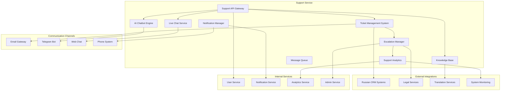

# Дизайн Support Service

## Обзор

Support Service обеспечивает комплексную систему технической поддержки для российской Steam платформы, включающую многоканальную поддержку, интеллектуальную тикет-систему, базу знаний, чат-бота с ИИ, интеграцию с российскими CRM системами и юридическими службами.

## Архитектура

### Высокоуровневая архитектура



### Компонентная архитектура

#### Ticket Management System
- Централизованное управление всеми обращениями
- Автоматическая категоризация и приоритизация
- Система эскалации и маршрутизации
- Интеграция с внешними системами

#### AI Chatbot Engine
- Обработка естественного языка на русском
- Интеграция с базой знаний
- Машинное обучение для улучшения ответов
- Автоматическая эскалация к живым операторам

#### Knowledge Base
- Структурированная база знаний
- Система поиска и рекомендаций
- Краудсорсинг переводов
- Аналитика использования

#### Live Chat Service
- Реалтайм чат с операторами
- Система очередей и маршрутизации
- Интеграция с CRM системами
- Мониторинг качества обслуживания

## Компоненты и интерфейсы

### 1. Support API Gateway

```typescript
interface SupportAPIGateway {
  // Управление тикетами
  createTicket(userId: string, issue: IssueDetails): Promise<TicketResult>
  updateTicket(ticketId: string, update: TicketUpdate): Promise<UpdateResult>
  closeTicket(ticketId: string, resolution: TicketResolution): Promise<CloseResult>
  
  // Поиск в базе знаний
  searchKnowledgeBase(query: string, language: string): Promise<KBSearchResult>
  getArticle(articleId: string, language: string): Promise<KBArticle>
  rateArticle(articleId: string, userId: string, rating: number): Promise<RatingResult>
  
  // Чат-бот
  sendMessageToBot(userId: string, message: string): Promise<BotResponse>
  escalateToHuman(sessionId: string, reason: EscalationReason): Promise<EscalationResult>
  
  // Live chat
  startChatSession(userId: string, topic: string): Promise<ChatSession>
  sendChatMessage(sessionId: string, message: string): Promise<ChatMessageResult>
  endChatSession(sessionId: string, feedback?: ChatFeedback): Promise<EndChatResult>
  
  // Аналитика
  getSupportMetrics(period: TimePeriod, filters: MetricFilters): Promise<SupportMetrics>
  getAgentPerformance(agentId: string, period: TimePeriod): Promise<AgentPerformance>
}
```

### 2. Ticket Management System

```typescript
interface TicketManagementSystem {
  // Создание и управление тикетами
  createTicket(ticket: CreateTicketRequest): Promise<Ticket>
  assignTicket(ticketId: string, agentId: string): Promise<AssignmentResult>
  updateTicketStatus(ticketId: string, status: TicketStatus): Promise<StatusUpdateResult>
  
  // Категоризация и приоритизация
  categorizeTicket(ticketContent: string): Promise<TicketCategory>
  calculatePriority(ticket: Ticket, userProfile: UserProfile): Promise<TicketPriority>
  
  // Эскалация
  checkEscalationRules(ticket: Ticket): Promise<EscalationCheck>
  escalateTicket(ticketId: string, escalationLevel: EscalationLevel): Promise<EscalationResult>
  
  // Интеграция
  syncWithCRM(ticketId: string, crmSystem: CRMSystem): Promise<CRMSyncResult>
  exportTicketData(filters: ExportFilters): Promise<ExportResult>
  
  // Поиск и фильтрация
  searchTickets(query: SearchQuery): Promise<TicketSearchResult>
  getTicketsByUser(userId: string, filters: TicketFilters): Promise<UserTickets>
  getTicketsByAgent(agentId: string, filters: TicketFilters): Promise<AgentTickets>
}
```

### 3. AI Chatbot Engine

```typescript
interface AIChatbotEngine {
  // Обработка сообщений
  processMessage(message: string, context: ChatContext): Promise<BotResponse>
  analyzeIntent(message: string): Promise<IntentAnalysis>
  generateResponse(intent: Intent, entities: Entity[]): Promise<GeneratedResponse>
  
  // Обучение и улучшение
  trainModel(trainingData: ChatTrainingData): Promise<TrainingResult>
  updateKnowledgeBase(newKnowledge: KnowledgeUpdate): Promise<UpdateResult>
  analyzeFeedback(feedback: UserFeedback): Promise<FeedbackAnalysis>
  
  // Эскалация
  detectEscalationNeed(conversation: ChatConversation): Promise<EscalationDecision>
  handoffToHuman(sessionId: string, context: HandoffContext): Promise<HandoffResult>
  
  // Многоязычность
  detectLanguage(message: string): Promise<LanguageDetection>
  translateMessage(message: string, targetLanguage: string): Promise<TranslationResult>
  
  // Аналитика
  getChatbotMetrics(period: TimePeriod): Promise<ChatbotMetrics>
  getConversationAnalytics(sessionId: string): Promise<ConversationAnalytics>
}
```

### 4. Knowledge Base

```typescript
interface KnowledgeBase {
  // Управление статьями
  createArticle(article: CreateArticleRequest): Promise<KBArticle>
  updateArticle(articleId: string, updates: ArticleUpdate): Promise<UpdateResult>
  publishArticle(articleId: string): Promise<PublishResult>
  
  // Поиск и навигация
  searchArticles(query: string, filters: SearchFilters): Promise<SearchResult>
  getRelatedArticles(articleId: string): Promise<RelatedArticle[]>
  getCategoryArticles(categoryId: string): Promise<CategoryArticles>
  
  // Переводы и локализация
  requestTranslation(articleId: string, targetLanguage: string): Promise<TranslationRequest>
  submitTranslation(requestId: string, translation: ArticleTranslation): Promise<SubmissionResult>
  reviewTranslation(translationId: string, review: TranslationReview): Promise<ReviewResult>
  
  // Аналитика использования
  trackArticleView(articleId: string, userId: string): Promise<ViewTrackingResult>
  getArticleAnalytics(articleId: string, period: TimePeriod): Promise<ArticleAnalytics>
  getPopularArticles(period: TimePeriod, language: string): Promise<PopularArticle[]>
  
  // Рейтинги и отзывы
  rateArticle(articleId: string, userId: string, rating: ArticleRating): Promise<RatingResult>
  getArticleRatings(articleId: string): Promise<ArticleRatings>
  moderateRating(ratingId: string, moderation: RatingModeration): Promise<ModerationResult>
}
```

### 5. Live Chat Service

```typescript
interface LiveChatService {
  // Управление сессиями
  createChatSession(request: ChatSessionRequest): Promise<ChatSession>
  joinChatSession(sessionId: string, participantId: string): Promise<JoinResult>
  leaveChatSession(sessionId: string, participantId: string): Promise<LeaveResult>
  
  // Сообщения
  sendMessage(sessionId: string, senderId: string, message: ChatMessage): Promise<MessageResult>
  editMessage(messageId: string, newContent: string): Promise<EditResult>
  deleteMessage(messageId: string, reason: string): Promise<DeleteResult>
  
  // Управление очередью
  addToQueue(userId: string, topic: string, priority: QueuePriority): Promise<QueueResult>
  getQueuePosition(userId: string): Promise<QueuePosition>
  assignNextInQueue(agentId: string): Promise<AssignmentResult>
  
  // Передача и эскалация
  transferChat(sessionId: string, fromAgentId: string, toAgentId: string): Promise<TransferResult>
  escalateChat(sessionId: string, escalationReason: string): Promise<ChatEscalationResult>
  
  // Мониторинг и аналитика
  getChatMetrics(agentId: string, period: TimePeriod): Promise<ChatMetrics>
  getSessionHistory(sessionId: string): Promise<ChatHistory>
  analyzeChatSentiment(sessionId: string): Promise<SentimentAnalysis>
}
```

## Модели данных

### Ticket
```typescript
interface Ticket {
  id: string
  userId: string
  subject: string
  description: string
  category: TicketCategory
  priority: TicketPriority
  status: TicketStatus
  assignedAgentId?: string
  createdAt: Date
  updatedAt: Date
  resolvedAt?: Date
  closedAt?: Date
  channel: SupportChannel
  language: string
  tags: string[]
  attachments: TicketAttachment[]
  messages: TicketMessage[]
  escalationHistory: EscalationRecord[]
  satisfactionRating?: number
  resolutionTime?: number
}

enum TicketStatus {
  NEW = 'new',
  ASSIGNED = 'assigned',
  IN_PROGRESS = 'in_progress',
  WAITING_FOR_USER = 'waiting_for_user',
  ESCALATED = 'escalated',
  RESOLVED = 'resolved',
  CLOSED = 'closed',
  REOPENED = 'reopened'
}

enum TicketPriority {
  LOW = 'low',
  NORMAL = 'normal',
  HIGH = 'high',
  URGENT = 'urgent',
  CRITICAL = 'critical'
}

interface TicketMessage {
  id: string
  ticketId: string
  senderId: string
  senderType: SenderType
  content: string
  timestamp: Date
  isInternal: boolean
  attachments: MessageAttachment[]
}
```

### Knowledge Base Article
```typescript
interface KBArticle {
  id: string
  title: string
  content: string
  summary: string
  category: KBCategory
  tags: string[]
  language: string
  status: ArticleStatus
  authorId: string
  createdAt: Date
  updatedAt: Date
  publishedAt?: Date
  viewCount: number
  helpfulVotes: number
  unhelpfulVotes: number
  translations: ArticleTranslation[]
  relatedArticles: string[]
  searchKeywords: string[]
}

interface ArticleTranslation {
  id: string
  articleId: string
  language: string
  title: string
  content: string
  translatorId: string
  status: TranslationStatus
  reviewerId?: string
  createdAt: Date
  approvedAt?: Date
  votes: TranslationVote[]
}

enum TranslationStatus {
  REQUESTED = 'requested',
  IN_PROGRESS = 'in_progress',
  SUBMITTED = 'submitted',
  UNDER_REVIEW = 'under_review',
  APPROVED = 'approved',
  REJECTED = 'rejected'
}
```

### Chat Session
```typescript
interface ChatSession {
  id: string
  userId: string
  agentId?: string
  topic: string
  status: ChatStatus
  priority: QueuePriority
  startedAt: Date
  endedAt?: Date
  messages: ChatMessage[]
  transferHistory: ChatTransfer[]
  satisfactionRating?: ChatFeedback
  tags: string[]
  language: string
  queueWaitTime?: number
  responseTime?: number
}

enum ChatStatus {
  QUEUED = 'queued',
  ACTIVE = 'active',
  TRANSFERRED = 'transferred',
  ESCALATED = 'escalated',
  ENDED = 'ended',
  ABANDONED = 'abandoned'
}

interface ChatMessage {
  id: string
  sessionId: string
  senderId: string
  senderType: SenderType
  content: string
  timestamp: Date
  messageType: MessageType
  isRead: boolean
  attachments: MessageAttachment[]
}
```

### Support Agent
```typescript
interface SupportAgent {
  id: string
  userId: string
  name: string
  email: string
  role: AgentRole
  skills: AgentSkill[]
  languages: string[]
  status: AgentStatus
  currentLoad: number
  maxConcurrentChats: number
  workingHours: WorkingHours
  performance: AgentPerformance
  certifications: AgentCertification[]
}

interface AgentPerformance {
  averageResponseTime: number
  averageResolutionTime: number
  customerSatisfactionScore: number
  ticketsResolved: number
  chatsHandled: number
  escalationRate: number
  period: TimePeriod
}

enum AgentRole {
  JUNIOR_AGENT = 'junior_agent',
  SENIOR_AGENT = 'senior_agent',
  SPECIALIST = 'specialist',
  TEAM_LEAD = 'team_lead',
  SUPERVISOR = 'supervisor'
}
```

### Bot Conversation
```typescript
interface BotConversation {
  id: string
  userId: string
  sessionId: string
  startedAt: Date
  endedAt?: Date
  messages: BotMessage[]
  intent: ConversationIntent
  entities: ExtractedEntity[]
  confidence: number
  wasEscalated: boolean
  escalationReason?: string
  userSatisfaction?: number
  resolvedByBot: boolean
}

interface BotMessage {
  id: string
  conversationId: string
  sender: MessageSender
  content: string
  timestamp: Date
  intent?: Intent
  confidence?: number
  suggestedActions: BotAction[]
}

interface Intent {
  name: string
  confidence: number
  parameters: IntentParameter[]
}
```

## Обработка ошибок

### Error Handling Strategy

```typescript
interface SupportError {
  code: SupportErrorCode
  message: string
  ticketId?: string
  userId?: string
  agentId?: string
  sessionId?: string
  details?: any
  timestamp: Date
}

enum SupportErrorCode {
  // Тикеты
  TICKET_NOT_FOUND = 'TICKET_NOT_FOUND',
  TICKET_ACCESS_DENIED = 'TICKET_ACCESS_DENIED',
  INVALID_TICKET_STATUS = 'INVALID_TICKET_STATUS',
  ESCALATION_FAILED = 'ESCALATION_FAILED',
  
  // Чат
  CHAT_SESSION_NOT_FOUND = 'CHAT_SESSION_NOT_FOUND',
  AGENT_UNAVAILABLE = 'AGENT_UNAVAILABLE',
  QUEUE_FULL = 'QUEUE_FULL',
  CHAT_TRANSFER_FAILED = 'CHAT_TRANSFER_FAILED',
  
  // База знаний
  ARTICLE_NOT_FOUND = 'ARTICLE_NOT_FOUND',
  TRANSLATION_FAILED = 'TRANSLATION_FAILED',
  SEARCH_SERVICE_UNAVAILABLE = 'SEARCH_SERVICE_UNAVAILABLE',
  
  // Интеграции
  CRM_SYNC_FAILED = 'CRM_SYNC_FAILED',
  EMAIL_DELIVERY_FAILED = 'EMAIL_DELIVERY_FAILED',
  TELEGRAM_BOT_ERROR = 'TELEGRAM_BOT_ERROR',
  
  // Чат-бот
  BOT_PROCESSING_ERROR = 'BOT_PROCESSING_ERROR',
  INTENT_RECOGNITION_FAILED = 'INTENT_RECOGNITION_FAILED',
  KNOWLEDGE_BASE_UNAVAILABLE = 'KNOWLEDGE_BASE_UNAVAILABLE'
}
```

### Recovery Mechanisms
- Автоматическое переключение на резервные каналы связи
- Сохранение состояния чатов при сбоях
- Восстановление тикетов из резервных копий
- Уведомление пользователей о временных проблемах

## Стратегия тестирования

### Unit Tests
- Тестирование логики категоризации тикетов
- Проверка алгоритмов эскалации
- Тестирование чат-бота и NLP
- Валидация системы рейтингов

### Integration Tests
- Тестирование интеграции с CRM системами
- Проверка email и Telegram интеграций
- Тестирование системы переводов
- Проверка аналитических дашбордов

### End-to-End Tests
- Полный цикл обработки тикета
- Тестирование live chat сессий
- Проверка эскалации к юридическим службам
- Тестирование многоканальной поддержки

### Performance Tests
- Нагрузочное тестирование чат-системы
- Тестирование производительности поиска в базе знаний
- Проверка масштабирования при высокой нагрузке
- Стресс-тестирование чат-бота

## Безопасность

### Data Protection
- Шифрование всех пользовательских данных
- Соблюдение GDPR и российского законодательства
- Аудит доступа к конфиденциальной информации
- Анонимизация данных для аналитики

### Access Control
- Ролевая модель доступа для агентов
- Двухфакторная аутентификация для администраторов
- Логирование всех действий с тикетами
- Ограничение доступа к персональным данным

### Communication Security
- Шифрование чат-сообщений
- Защита от спама и злоупотреблений
- Модерация контента в реальном времени
- Защита от DDoS атак на чат-серверы

## Производительность и масштабируемость

### Horizontal Scaling
- Микросервисная архитектура
- Автоматическое масштабирование чат-серверов
- Распределение нагрузки между агентами
- Кэширование часто используемых данных

### Optimization Strategies
- Индексирование базы знаний для быстрого поиска
- Предиктивная маршрутизация тикетов
- Оптимизация алгоритмов чат-бота
- Сжатие и архивирование старых данных

### Monitoring and Alerting
- Мониторинг времени ответа агентов
- Отслеживание удовлетворенности клиентов
- Алерты при превышении времени ожидания
- Мониторинг производительности чат-бота

## Соответствие российским требованиям

### Legal Compliance
- Интеграция с российскими юридическими службами
- Соблюдение требований по защите персональных данных
- Ведение документооборота согласно российским стандартам
- Интеграция с системами медиации и арбитража

### Localization
- Полная локализация на русский язык
- Поддержка российских часовых поясов
- Интеграция с российскими CRM системами
- Адаптация под российские бизнес-процессы

### Cultural Adaptation
- Учет российских культурных особенностей в общении
- Адаптация тона и стиля общения
- Поддержка российских праздников и выходных
- Интеграция с российскими социальными платформами