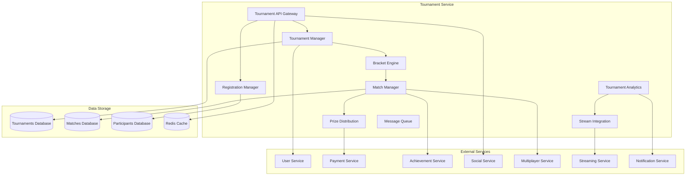

# Дизайн Tournament Service

## Обзор

Tournament Service обеспечивает полнофункциональную систему организации и проведения турниров и соревнований на российской Steam платформе, включая создание турниров, управление участниками, проведение матчей, подсчет результатов, распределение призов и интеграцию с социальными функциями.

## Архитектура

### Высокоуровневая архитектура



### Компонентная архитектура

#### Tournament Manager
- Создание и управление турнирами
- Настройка правил и форматов
- Управление жизненным циклом турниров
- Интеграция с внешними системами

#### Bracket Engine
- Генерация турнирных сеток
- Поддержка различных форматов (single/double elimination, round robin)
- Автоматическое продвижение победителей
- Обработка технических поражений

#### Match Manager
- Планирование и проведение матчей
- Интеграция с игровыми серверами
- Запись результатов матчей
- Разрешение спорных ситуаций

#### Prize Distribution
- Управление призовыми фондами
- Автоматическое распределение призов
- Интеграция с платежными системами
- Налоговая отчетность

## Компоненты и интерфейсы

### 1. Tournament API Gateway

```typescript
interface TournamentAPIGateway {
  // Управление турнирами
  createTournament(organizerId: string, tournament: TournamentConfig): Promise<TournamentResult>
  updateTournament(tournamentId: string, updates: TournamentUpdate): Promise<UpdateResult>
  cancelTournament(tournamentId: string, reason: string): Promise<CancelResult>
  
  // Регистрация участников
  registerParticipant(tournamentId: string, participantId: string): Promise<RegistrationResult>
  unregisterParticipant(tournamentId: string, participantId: string): Promise<UnregistrationResult>
  registerTeam(tournamentId: string, team: TeamRegistration): Promise<TeamRegistrationResult>
  
  // Управление матчами
  startMatch(matchId: string): Promise<MatchStartResult>
  reportMatchResult(matchId: string, result: MatchResult): Promise<ReportResult>
  disputeMatch(matchId: string, disputeData: MatchDispute): Promise<DisputeResult>
  
  // Просмотр турниров
  getTournaments(filters: TournamentFilters): Promise<TournamentList>
  getTournamentBracket(tournamentId: string): Promise<TournamentBracket>
  getMatchDetails(matchId: string): Promise<MatchDetails>
  
  // Аналитика и статистика
  getTournamentStats(tournamentId: string): Promise<TournamentStatistics>
  getPlayerTournamentHistory(playerId: string): Promise<PlayerTournamentHistory>
  getLeaderboards(gameId: string, period: TimePeriod): Promise<TournamentLeaderboards>
}
```

### 2. Tournament Manager

```typescript
interface TournamentManager {
  // Создание и настройка турниров
  createTournament(config: TournamentConfiguration): Promise<Tournament>
  configureTournamentRules(tournamentId: string, rules: TournamentRules): Promise<ConfigurationResult>
  setTournamentSchedule(tournamentId: string, schedule: TournamentSchedule): Promise<ScheduleResult>
  
  // Управление жизненным циклом
  startTournament(tournamentId: string): Promise<StartResult>
  pauseTournament(tournamentId: string, reason: string): Promise<PauseResult>
  resumeTournament(tournamentId: string): Promise<ResumeResult>
  finalizeTournament(tournamentId: string): Promise<FinalizationResult>
  
  // Управление участниками
  validateParticipant(tournamentId: string, participantId: string): Promise<ValidationResult>
  seedParticipants(tournamentId: string, seedingMethod: SeedingMethod): Promise<SeedingResult>
  
  // Интеграция с внешними системами
  syncWithGameServers(tournamentId: string): Promise<SyncResult>
  setupStreamingIntegration(tournamentId: string, streamConfig: StreamConfiguration): Promise<StreamSetupResult>
  
  // Мониторинг и управление
  getTournamentStatus(tournamentId: string): Promise<TournamentStatus>
  handleTournamentEmergency(tournamentId: string, emergency: EmergencyType): Promise<EmergencyResult>
}
```

### 3. Bracket Engine

```typescript
interface BracketEngine {
  // Генерация турнирных сеток
  generateBracket(participants: Participant[], format: BracketFormat): Promise<TournamentBracket>
  generateSingleElimination(participants: Participant[]): Promise<SingleEliminationBracket>
  generateDoubleElimination(participants: Participant[]): Promise<DoubleEliminationBracket>
  generateRoundRobin(participants: Participant[]): Promise<RoundRobinBracket>
  generateSwiss(participants: Participant[], rounds: number): Promise<SwissBracket>
  
  // Управление прогрессом
  advanceWinner(matchId: string, winnerId: string): Promise<AdvancementResult>
  handleBye(participantId: string, round: number): Promise<ByeResult>
  processDisqualification(participantId: string, reason: string): Promise<DisqualificationResult>
  
  // Пересчет и корректировки
  recalculateBracket(tournamentId: string, changes: BracketChange[]): Promise<RecalculationResult>
  handleTechnicalDefeat(matchId: string, defaulterId: string): Promise<TechnicalDefeatResult>
  
  // Визуализация и экспорт
  generateBracketVisualization(tournamentId: string): Promise<BracketVisualization>
  exportBracket(tournamentId: string, format: ExportFormat): Promise<ExportResult>
}
```

### 4. Match Manager

```typescript
interface MatchManager {
  // Планирование матчей
  scheduleMatch(match: MatchSchedule): Promise<ScheduledMatch>
  rescheduleMatch(matchId: string, newTime: Date, reason: string): Promise<RescheduleResult>
  
  // Проведение матчей
  startMatch(matchId: string): Promise<MatchSession>
  monitorMatch(matchId: string): Promise<MatchMonitoring>
  endMatch(matchId: string, result: MatchResult): Promise<MatchEndResult>
  
  // Интеграция с игровыми серверами
  allocateGameServer(matchId: string, requirements: ServerRequirements): Promise<ServerAllocation>
  configureMatchSettings(matchId: string, settings: MatchSettings): Promise<ConfigurationResult>
  
  // Обработка результатов
  validateMatchResult(matchId: string, result: MatchResult): Promise<ValidationResult>
  handleMatchDispute(matchId: string, dispute: MatchDispute): Promise<DisputeHandlingResult>
  
  // Статистика матчей
  recordMatchStatistics(matchId: string, stats: MatchStatistics): Promise<StatisticsResult>
  generateMatchReport(matchId: string): Promise<MatchReport>
  
  // Уведомления и коммуникация
  notifyParticipants(matchId: string, notification: MatchNotification): Promise<NotificationResult>
  createMatchChat(matchId: string): Promise<ChatCreationResult>
}
```

### 5. Registration Manager

```typescript
interface RegistrationManager {
  // Регистрация участников
  registerIndividual(tournamentId: string, playerId: string): Promise<IndividualRegistration>
  registerTeam(tournamentId: string, team: TeamData): Promise<TeamRegistration>
  
  // Валидация регистрации
  validateRegistration(tournamentId: string, participantData: ParticipantData): Promise<RegistrationValidation>
  checkEligibility(tournamentId: string, participantId: string): Promise<EligibilityCheck>
  
  // Управление регистрацией
  updateRegistration(registrationId: string, updates: RegistrationUpdate): Promise<UpdateResult>
  cancelRegistration(registrationId: string, reason: string): Promise<CancellationResult>
  
  // Командная регистрация
  createTeam(teamData: TeamCreationData): Promise<Team>
  inviteToTeam(teamId: string, playerId: string): Promise<TeamInvitation>
  acceptTeamInvitation(invitationId: string): Promise<AcceptanceResult>
  
  // Управление списками ожидания
  addToWaitingList(tournamentId: string, participantId: string): Promise<WaitingListResult>
  processWaitingList(tournamentId: string): Promise<WaitingListProcessing>
  
  // Статистика регистрации
  getRegistrationStats(tournamentId: string): Promise<RegistrationStatistics>
  getParticipantHistory(participantId: string): Promise<ParticipationHistory>
}
```

### 6. Prize Distribution

```typescript
interface PrizeDistribution {
  // Управление призовыми фондами
  createPrizePool(tournamentId: string, prizePool: PrizePoolConfiguration): Promise<PrizePool>
  updatePrizeDistribution(tournamentId: string, distribution: PrizeDistribution): Promise<UpdateResult>
  
  // Распределение призов
  distributePrizes(tournamentId: string, results: TournamentResults): Promise<PrizeDistributionResult>
  processPrizePayment(prizeId: string, recipientId: string): Promise<PaymentResult>
  
  // Специальные призы
  awardSpecialPrize(tournamentId: string, recipientId: string, prize: SpecialPrize): Promise<SpecialPrizeResult>
  createAchievementPrizes(tournamentId: string, achievements: TournamentAchievement[]): Promise<AchievementPrizeResult>
  
  // Налоги и отчетность
  calculateTaxes(prizeAmount: number, recipientLocation: string): Promise<TaxCalculation>
  generateTaxReports(tournamentId: string): Promise<TaxReport>
  
  // Спонсорские призы
  manageSponsorPrizes(tournamentId: string, sponsorPrizes: SponsorPrize[]): Promise<SponsorPrizeResult>
  trackPrizeDelivery(prizeId: string): Promise<DeliveryTracking>
}
```

## Модели данных

### Tournament
```typescript
interface Tournament {
  id: string
  name: string
  description: string
  gameId: string
  organizerId: string
  format: TournamentFormat
  type: TournamentType
  status: TournamentStatus
  maxParticipants: number
  currentParticipants: number
  registrationStart: Date
  registrationEnd: Date
  tournamentStart: Date
  tournamentEnd: Date
  prizePool: PrizePool
  rules: TournamentRules
  settings: TournamentSettings
  bracket?: TournamentBracket
  sponsors: Sponsor[]
  streamingInfo?: StreamingInfo
  createdAt: Date
  updatedAt: Date
}

enum TournamentFormat {
  SINGLE_ELIMINATION = 'single_elimination',
  DOUBLE_ELIMINATION = 'double_elimination',
  ROUND_ROBIN = 'round_robin',
  SWISS = 'swiss',
  LADDER = 'ladder',
  BATTLE_ROYALE = 'battle_royale'
}

enum TournamentType {
  PUBLIC = 'public',
  PRIVATE = 'private',
  CORPORATE = 'corporate',
  EDUCATIONAL = 'educational',
  CHARITY = 'charity'
}

enum TournamentStatus {
  DRAFT = 'draft',
  REGISTRATION_OPEN = 'registration_open',
  REGISTRATION_CLOSED = 'registration_closed',
  IN_PROGRESS = 'in_progress',
  PAUSED = 'paused',
  COMPLETED = 'completed',
  CANCELLED = 'cancelled'
}
```

### Tournament Bracket
```typescript
interface TournamentBracket {
  id: string
  tournamentId: string
  format: BracketFormat
  rounds: BracketRound[]
  currentRound: number
  isComplete: boolean
  createdAt: Date
  updatedAt: Date
}

interface BracketRound {
  roundNumber: number
  name: string
  matches: BracketMatch[]
  startTime?: Date
  endTime?: Date
  status: RoundStatus
}

interface BracketMatch {
  id: string
  roundNumber: number
  matchNumber: number
  participant1?: Participant
  participant2?: Participant
  winner?: Participant
  status: MatchStatus
  scheduledTime?: Date
  actualStartTime?: Date
  actualEndTime?: Date
  gameServerId?: string
  streamUrl?: string
  result?: MatchResult
}

enum MatchStatus {
  SCHEDULED = 'scheduled',
  READY = 'ready',
  IN_PROGRESS = 'in_progress',
  COMPLETED = 'completed',
  DISPUTED = 'disputed',
  CANCELLED = 'cancelled',
  TECHNICAL_DEFEAT = 'technical_defeat'
}
```

### Participant
```typescript
interface Participant {
  id: string
  type: ParticipantType
  tournamentId: string
  userId?: string
  teamId?: string
  displayName: string
  seed?: number
  registrationTime: Date
  status: ParticipantStatus
  statistics: ParticipantStatistics
  achievements: TournamentAchievement[]
}

enum ParticipantType {
  INDIVIDUAL = 'individual',
  TEAM = 'team'
}

enum ParticipantStatus {
  REGISTERED = 'registered',
  CONFIRMED = 'confirmed',
  CHECKED_IN = 'checked_in',
  ACTIVE = 'active',
  ELIMINATED = 'eliminated',
  DISQUALIFIED = 'disqualified',
  WITHDRAWN = 'withdrawn'
}

interface ParticipantStatistics {
  matchesPlayed: number
  matchesWon: number
  matchesLost: number
  winRate: number
  averageScore: number
  bestPlacement: number
  totalPrizesWon: number
}
```

### Team
```typescript
interface Team {
  id: string
  name: string
  tag: string
  captainId: string
  members: TeamMember[]
  maxMembers: number
  logoUrl?: string
  description?: string
  createdAt: Date
  statistics: TeamStatistics
  achievements: TeamAchievement[]
}

interface TeamMember {
  userId: string
  role: TeamRole
  joinedAt: Date
  isActive: boolean
  permissions: TeamPermission[]
}

enum TeamRole {
  CAPTAIN = 'captain',
  PLAYER = 'player',
  SUBSTITUTE = 'substitute',
  COACH = 'coach'
}

interface TeamStatistics {
  tournamentsPlayed: number
  tournamentsWon: number
  winRate: number
  totalPrizesWon: number
  bestPlacement: number
  currentRanking?: number
}
```

### Prize Pool
```typescript
interface PrizePool {
  id: string
  tournamentId: string
  totalAmount: number
  currency: string
  distribution: PrizeDistribution[]
  sponsorContributions: SponsorContribution[]
  specialPrizes: SpecialPrize[]
  status: PrizePoolStatus
}

interface PrizeDistribution {
  placement: number
  amount: number
  percentage: number
  type: PrizeType
  description?: string
}

enum PrizeType {
  CASH = 'cash',
  DIGITAL_ITEM = 'digital_item',
  PHYSICAL_ITEM = 'physical_item',
  ACHIEVEMENT = 'achievement',
  TITLE = 'title'
}

interface SponsorContribution {
  sponsorId: string
  amount: number
  type: ContributionType
  items?: SponsorItem[]
}

enum ContributionType {
  MONETARY = 'monetary',
  ITEMS = 'items',
  SERVICES = 'services'
}
```

### Match Result
```typescript
interface MatchResult {
  matchId: string
  winnerId: string
  loserId: string
  score: MatchScore
  duration: number
  statistics: MatchStatistics
  replay?: ReplayData
  screenshots: string[]
  reportedBy: string
  reportedAt: Date
  verifiedBy?: string
  verifiedAt?: Date
  disputes?: MatchDispute[]
}

interface MatchScore {
  participant1Score: number
  participant2Score: number
  scoreDetails?: ScoreDetail[]
}

interface MatchStatistics {
  participant1Stats: PlayerMatchStats
  participant2Stats: PlayerMatchStats
  gameSpecificStats: any
}

interface PlayerMatchStats {
  participantId: string
  kills?: number
  deaths?: number
  assists?: number
  score: number
  accuracy?: number
  damageDealt?: number
  customStats: Record<string, any>
}
```

## Обработка ошибок

### Error Handling Strategy

```typescript
interface TournamentError {
  code: TournamentErrorCode
  message: string
  tournamentId?: string
  matchId?: string
  participantId?: string
  details?: any
  timestamp: Date
}

enum TournamentErrorCode {
  // Турниры
  TOURNAMENT_NOT_FOUND = 'TOURNAMENT_NOT_FOUND',
  TOURNAMENT_FULL = 'TOURNAMENT_FULL',
  REGISTRATION_CLOSED = 'REGISTRATION_CLOSED',
  TOURNAMENT_ALREADY_STARTED = 'TOURNAMENT_ALREADY_STARTED',
  
  // Участники
  PARTICIPANT_NOT_ELIGIBLE = 'PARTICIPANT_NOT_ELIGIBLE',
  ALREADY_REGISTERED = 'ALREADY_REGISTERED',
  TEAM_INCOMPLETE = 'TEAM_INCOMPLETE',
  PARTICIPANT_NOT_FOUND = 'PARTICIPANT_NOT_FOUND',
  
  // Матчи
  MATCH_NOT_FOUND = 'MATCH_NOT_FOUND',
  MATCH_ALREADY_STARTED = 'MATCH_ALREADY_STARTED',
  INVALID_MATCH_RESULT = 'INVALID_MATCH_RESULT',
  MATCH_DISPUTE_PENDING = 'MATCH_DISPUTE_PENDING',
  
  // Призы
  INSUFFICIENT_PRIZE_POOL = 'INSUFFICIENT_PRIZE_POOL',
  PRIZE_DISTRIBUTION_FAILED = 'PRIZE_DISTRIBUTION_FAILED',
  PAYMENT_PROCESSING_ERROR = 'PAYMENT_PROCESSING_ERROR',
  
  // Серверы
  GAME_SERVER_UNAVAILABLE = 'GAME_SERVER_UNAVAILABLE',
  SERVER_ALLOCATION_FAILED = 'SERVER_ALLOCATION_FAILED',
  MATCH_SERVER_ERROR = 'MATCH_SERVER_ERROR'
}
```

### Recovery Mechanisms
- Автоматическое переназначение матчей при сбоях серверов
- Восстановление турнирных сеток из резервных копий
- Компенсация призов при технических проблемах
- Автоматическое уведомление участников о проблемах

## Стратегия тестирования

### Unit Tests
- Тестирование алгоритмов генерации турнирных сеток
- Проверка логики распределения призов
- Тестирование валидации участников
- Валидация правил турниров

### Integration Tests
- Тестирование интеграции с игровыми серверами
- Проверка взаимодействия с платежными системами
- Тестирование системы достижений
- Проверка стриминговой интеграции

### End-to-End Tests
- Полный цикл проведения турнира
- Тестирование регистрации и участия команд
- Проверка распределения призов
- Тестирование разрешения споров

### Performance Tests
- Нагрузочное тестирование при большом количестве участников
- Тестирование производительности генерации сеток
- Проверка масштабирования при множественных турнирах
- Стресс-тестирование системы матчмейкинга

## Безопасность

### Tournament Integrity
- Защита от манипуляций с результатами
- Валидация всех матчевых данных
- Мониторинг подозрительной активности
- Система репортов о нарушениях

### Prize Security
- Защита призовых фондов от мошенничества
- Двухфакторная аутентификация для крупных выплат
- Аудит всех финансовых операций
- Соответствие налоговому законодательству

### Data Protection
- Защита персональных данных участников
- Шифрование конфиденциальной информации
- Соблюдение GDPR и российского законодательства
- Безопасное хранение результатов матчей

## Производительность и масштабируемость

### Caching Strategy
- Кэширование турнирных сеток
- Кэширование результатов матчей
- Кэширование статистики участников
- Кэширование призовых данных

### Database Optimization
- Индексирование для быстрого поиска турниров
- Партиционирование больших турнирных данных
- Архивирование завершенных турниров
- Оптимизация запросов статистики

### Horizontal Scaling
- Микросервисная архитектура
- Автоматическое масштабирование при крупных турнирах
- Распределение нагрузки между регионами
- Асинхронная обработка результатов

## Соответствие российским требованиям

### Legal Compliance
- Соблюдение российского законодательства о киберспорте
- Интеграция с российскими налоговыми системами
- Соответствие требованиям по организации соревнований
- Ведение документооборота согласно российским стандартам

### Data Localization
- Хранение турнирных данных на российских серверах
- Локализация призовых выплат
- Соответствие требованиям по персональным данным
- Интеграция с российскими платежными системами

### Regional Adaptation
- Поддержка российских часовых поясов
- Интеграция с российскими киберспортивными организациями
- Адаптация под российские культурные особенности
- Поддержка российских праздников в расписании турниров