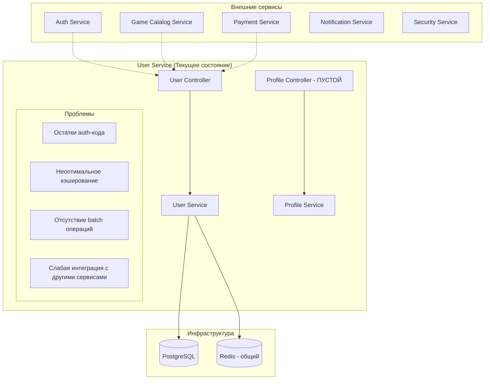
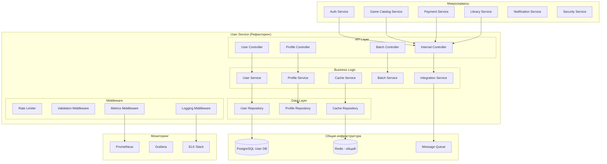

# Документ проектирования - Рефакторинг User Service

## Обзор

После успешной миграции функционала аутентификации в Auth Service, User Service требует комплексного рефакторинга для оптимизации архитектуры, улучшения производительности и интеграции с микросервисной экосистемой. Сервис должен сосредоточиться исключительно на управлении пользовательскими данными и профилями.

**Текущее состояние:** User Service содержит остатки auth-кода, неоптимальную архитектуру и требует улучшения интеграции с другими сервисами.

**Целевое состояние:** Чистый, высокопроизводительный сервис управления пользователями с оптимальной интеграцией в микросервисную архитектуру.

## Архитектура

### Текущая архитектура (проблемы)



### Целевая архитектура (после рефакторинга)



## Компоненты и интерфейсы

### 1. Очищенные контроллеры

#### UserController (рефакторинг)
```typescript
@Controller('users')
@UseGuards(RateLimitGuard)
@UseInterceptors(MetricsInterceptor, LoggingInterceptor)
export class UserController {
  // Внутренние API для Auth Service
  @Post()                           // Создание пользователя
  @Get('email/:email')             // Поиск по email
  @Get(':id')                      // Поиск по ID
  @Patch(':id/last-login')         // Обновление последнего входа
  @Get(':id/exists')               // Проверка существования
  
  // Новые оптимизированные endpoints
  @Post('batch')                   // Batch создание пользователей
  @Get('batch')                    // Batch получение пользователей
  @Patch('batch/last-login')       // Batch обновление последнего входа
}
```

#### ProfileController (новый)
```typescript
@Controller('profiles')
@UseGuards(RateLimitGuard)
export class ProfileController {
  @Get(':userId')                  // Получение профиля
  @Patch(':userId')                // Обновление профиля
  @Post(':userId/avatar')          // Загрузка аватара
  @Delete(':userId/avatar')        // Удаление аватара
  @Get(':userId/settings')         // Настройки приватности
  @Patch(':userId/settings')       // Обновление настроек
}
```

#### BatchController (новый)
```typescript
@Controller('batch')
@UseGuards(InternalServiceGuard)
export class BatchController {
  @Post('users/create')            // Массовое создание
  @Get('users/lookup')             // Массовый поиск
  @Patch('users/update')           // Массовое обновление
  @Delete('users/soft-delete')     // Массовое мягкое удаление
}
```

### 2. Оптимизированные сервисы

#### CacheService (новый)
```typescript
@Injectable()
export class CacheService {
  // Многоуровневое кэширование
  async getUser(id: string): Promise<User | null>
  async setUser(user: User, ttl?: number): Promise<void>
  async invalidateUser(id: string): Promise<void>
  async getUsersBatch(ids: string[]): Promise<Map<string, User>>
  
  // Кэширование профилей
  async getProfile(userId: string): Promise<Profile | null>
  async setProfile(profile: Profile): Promise<void>
  async invalidateProfile(userId: string): Promise<void>
  
  // Статистика кэша
  async getCacheStats(): Promise<CacheStats>
}
```

#### BatchService (новый)
```typescript
@Injectable()
export class BatchService {
  async createUsers(users: CreateUserDto[]): Promise<User[]>
  async getUsersByIds(ids: string[]): Promise<User[]>
  async updateUsers(updates: BatchUpdateDto[]): Promise<void>
  async softDeleteUsers(ids: string[]): Promise<void>
  
  // Оптимизация для больших объемов
  async processInChunks<T>(items: T[], chunkSize: number, processor: (chunk: T[]) => Promise<void>): Promise<void>
}
```

#### IntegrationService (новый)
```typescript
@Injectable()
export class IntegrationService {
  // Интеграция с Auth Service
  async notifyUserCreated(user: User): Promise<void>
  async notifyUserUpdated(user: User): Promise<void>
  async notifyUserDeleted(userId: string): Promise<void>
  
  // Интеграция с другими сервисами
  async publishUserEvent(event: UserEvent): Promise<void>
  async handleExternalUserRequest(serviceId: string, userId: string): Promise<UserData>
  
  // Circuit breaker для внешних вызовов
  async callExternalService<T>(serviceName: string, operation: () => Promise<T>): Promise<T>
}
```

### 3. Модели данных

#### Расширенная User Entity
```typescript
@Entity('users')
export class User {
  @PrimaryGeneratedColumn('uuid')
  id: string;

  @Column({ unique: true })
  email: string;

  @Column()
  password: string; // Хешированный пароль от Auth Service

  @Column()
  name: string;

  @Column({ nullable: true })
  lastLoginAt: Date;

  @CreateDateColumn()
  createdAt: Date;

  @UpdateDateColumn()
  updatedAt: Date;

  @DeleteDateColumn()
  deletedAt: Date; // Для soft delete

  // Новые поля для профиля
  @Column({ nullable: true })
  avatarUrl: string;

  @Column({ type: 'jsonb', nullable: true })
  preferences: UserPreferences;

  @Column({ type: 'jsonb', nullable: true })
  privacySettings: PrivacySettings;

  @Column({ default: true })
  isActive: boolean;

  // Метаданные
  @Column({ type: 'jsonb', nullable: true })
  metadata: Record<string, any>;
}
```

#### UserPreferences
```typescript
interface UserPreferences {
  language: string;
  timezone: string;
  theme: 'light' | 'dark' | 'auto';
  notifications: {
    email: boolean;
    push: boolean;
    sms: boolean;
  };
  gameSettings: {
    autoDownload: boolean;
    cloudSave: boolean;
    achievementNotifications: boolean;
  };
}
```

#### PrivacySettings
```typescript
interface PrivacySettings {
  profileVisibility: 'public' | 'friends' | 'private';
  showOnlineStatus: boolean;
  showGameActivity: boolean;
  allowFriendRequests: boolean;
  showAchievements: boolean;
}
```

## Обработка ошибок

### Стандартизированные ошибки
```typescript
export class UserServiceError extends Error {
  constructor(
    public code: string,
    public message: string,
    public statusCode: number,
    public details?: any
  ) {
    super(message);
  }
}

// Типы ошибок
export const ErrorCodes = {
  USER_NOT_FOUND: 'USER_NOT_FOUND',
  USER_ALREADY_EXISTS: 'USER_ALREADY_EXISTS',
  INVALID_USER_DATA: 'INVALID_USER_DATA',
  CACHE_ERROR: 'CACHE_ERROR',
  DATABASE_ERROR: 'DATABASE_ERROR',
  EXTERNAL_SERVICE_ERROR: 'EXTERNAL_SERVICE_ERROR',
  BATCH_OPERATION_FAILED: 'BATCH_OPERATION_FAILED',
  RATE_LIMIT_EXCEEDED: 'RATE_LIMIT_EXCEEDED'
} as const;
```

### Глобальный обработчик ошибок
```typescript
@Catch()
export class GlobalExceptionFilter implements ExceptionFilter {
  catch(exception: unknown, host: ArgumentsHost) {
    const ctx = host.switchToHttp();
    const response = ctx.getResponse<Response>();
    const request = ctx.getRequest<Request>();

    const errorResponse = {
      statusCode: this.getStatusCode(exception),
      message: this.getMessage(exception),
      error: this.getErrorType(exception),
      timestamp: new Date().toISOString(),
      path: request.url,
      correlationId: request.headers['x-correlation-id']
    };

    // Логирование с correlation ID
    this.logger.error('Exception occurred', {
      ...errorResponse,
      stack: exception instanceof Error ? exception.stack : undefined
    });

    response.status(errorResponse.statusCode).json(errorResponse);
  }
}
```

## Стратегия тестирования

### Unit тесты
- **UserService** - все методы CRUD
- **ProfileService** - управление профилями
- **CacheService** - кэширование и инвалидация
- **BatchService** - массовые операции
- **IntegrationService** - внешние интеграции

### Integration тесты
- **API endpoints** - все контроллеры
- **Database операции** - TypeORM репозитории
- **Redis кэширование** - операции с общим Redis
- **External services** - моки для других микросервисов

### Performance тесты
- **Load testing** - 1000+ одновременных пользователей
- **Batch operations** - массовые операции с 10k+ записями
- **Cache performance** - hit/miss ratio, latency
- **Database performance** - query optimization

### E2E тесты
- **Microservice integration** - взаимодействие с Auth Service
- **Shared infrastructure** - работа с общим Redis и PostgreSQL
- **CI/CD pipeline** - автоматическое тестирование в GitHub Actions

## Мониторинг и наблюдаемость

### Prometheus метрики
```typescript
// Пользовательские метрики
user_operations_total{operation, status}
user_cache_hits_total{cache_type}
user_cache_misses_total{cache_type}
user_batch_operations_duration_seconds{operation}
user_external_service_calls_total{service, status}

// Системные метрики
user_service_memory_usage_bytes
user_service_cpu_usage_percent
user_service_active_connections
user_service_database_pool_size
```

### Структурированное логирование
```typescript
interface LogEntry {
  timestamp: string;
  level: 'error' | 'warn' | 'info' | 'debug';
  message: string;
  correlationId: string;
  userId?: string;
  operation: string;
  duration?: number;
  metadata?: Record<string, any>;
}
```

### Health checks
```typescript
@Controller('health')
export class HealthController {
  @Get()
  async check(): Promise<HealthCheckResult> {
    return this.health.check([
      () => this.db.pingCheck('database'),
      () => this.redis.pingCheck('redis'),
      () => this.memory.checkHeap('memory_heap', 150 * 1024 * 1024),
      () => this.disk.checkStorage('storage', { path: '/', threshold: 0.9 })
    ]);
  }

  @Get('ready')
  async ready(): Promise<HealthCheckResult> {
    // Kubernetes readiness probe
    return this.health.check([
      () => this.db.pingCheck('database'),
      () => this.redis.pingCheck('redis')
    ]);
  }

  @Get('live')
  async live(): Promise<HealthCheckResult> {
    // Kubernetes liveness probe
    return { status: 'ok' };
  }
}
```

## Интеграция с микросервисной архитектурой

### Service-to-Service коммуникация
```typescript
// Внутренние API для других сервисов
@Controller('internal')
@UseGuards(InternalServiceGuard)
export class InternalController {
  // Для Auth Service
  @Post('users')
  @Get('users/:id')
  @Get('users/email/:email')
  @Patch('users/:id/last-login')

  // Для Game Catalog Service
  @Get('users/:id/profile')
  @Get('users/batch/profiles')

  // Для Payment Service
  @Get('users/:id/billing-info')
  @Patch('users/:id/billing-info')

  // Для Library Service
  @Get('users/:id/preferences')
  @Patch('users/:id/preferences')
}
```

### Event-driven интеграция
```typescript
// События для других сервисов
interface UserEvent {
  type: 'USER_CREATED' | 'USER_UPDATED' | 'USER_DELETED' | 'PROFILE_UPDATED';
  userId: string;
  timestamp: Date;
  data: any;
  correlationId: string;
}

@Injectable()
export class EventPublisher {
  async publishUserCreated(user: User): Promise<void>
  async publishUserUpdated(user: User, changes: Partial<User>): Promise<void>
  async publishUserDeleted(userId: string): Promise<void>
  async publishProfileUpdated(userId: string, profile: any): Promise<void>
}
```

### Использование общего Redis
```typescript
@Injectable()
export class SharedRedisService {
  constructor(
    @Inject('REDIS_CLIENT') private redis: Redis
  ) {}

  // Namespace для User Service
  private getKey(key: string): string {
    return `user-service:${key}`;
  }

  // Кэширование с TTL
  async set(key: string, value: any, ttl: number = 300): Promise<void> {
    await this.redis.setex(this.getKey(key), ttl, JSON.stringify(value));
  }

  async get<T>(key: string): Promise<T | null> {
    const value = await this.redis.get(this.getKey(key));
    return value ? JSON.parse(value) : null;
  }

  // Batch операции
  async mget(keys: string[]): Promise<(any | null)[]> {
    const redisKeys = keys.map(key => this.getKey(key));
    const values = await this.redis.mget(...redisKeys);
    return values.map(value => value ? JSON.parse(value) : null);
  }

  // Pub/Sub для межсервисной коммуникации
  async publish(channel: string, message: any): Promise<void> {
    await this.redis.publish(`user-service:${channel}`, JSON.stringify(message));
  }
}
```

## Безопасность

### Шифрование чувствительных данных
```typescript
@Injectable()
export class EncryptionService {
  private readonly algorithm = 'aes-256-gcm';
  private readonly key = process.env.ENCRYPTION_KEY;

  encrypt(text: string): { encrypted: string; iv: string; tag: string } {
    const iv = crypto.randomBytes(16);
    const cipher = crypto.createCipher(this.algorithm, this.key);
    cipher.setAAD(Buffer.from('user-service'));
    
    let encrypted = cipher.update(text, 'utf8', 'hex');
    encrypted += cipher.final('hex');
    
    const tag = cipher.getAuthTag();
    
    return {
      encrypted,
      iv: iv.toString('hex'),
      tag: tag.toString('hex')
    };
  }

  decrypt(encryptedData: { encrypted: string; iv: string; tag: string }): string {
    const decipher = crypto.createDecipher(this.algorithm, this.key);
    decipher.setAAD(Buffer.from('user-service'));
    decipher.setAuthTag(Buffer.from(encryptedData.tag, 'hex'));
    
    let decrypted = decipher.update(encryptedData.encrypted, 'hex', 'utf8');
    decrypted += decipher.final('utf8');
    
    return decrypted;
  }
}
```

### Аудит логирование
```typescript
@Injectable()
export class AuditService {
  async logDataAccess(userId: string, operation: string, resourceId: string): Promise<void> {
    const auditEntry = {
      timestamp: new Date(),
      userId,
      operation,
      resourceId,
      ipAddress: this.getClientIp(),
      userAgent: this.getUserAgent(),
      correlationId: this.getCorrelationId()
    };

    // Отправка в Security Service
    await this.securityClient.logAuditEvent(auditEntry);
    
    // Локальное логирование
    this.logger.info('Data access logged', auditEntry);
  }
}
```

## Производительность

### Оптимизация запросов к БД
```typescript
@Injectable()
export class OptimizedUserRepository {
  // Индексы для быстрого поиска
  @Index(['email'])
  @Index(['lastLoginAt'])
  @Index(['createdAt'])
  @Index(['isActive'])

  // Оптимизированные запросы
  async findActiveUsersByIds(ids: string[]): Promise<User[]> {
    return this.repository
      .createQueryBuilder('user')
      .where('user.id IN (:...ids)', { ids })
      .andWhere('user.isActive = :isActive', { isActive: true })
      .andWhere('user.deletedAt IS NULL')
      .getMany();
  }

  // Пагинация с курсором для больших объемов
  async findUsersWithCursor(cursor?: string, limit: number = 100): Promise<{users: User[], nextCursor?: string}> {
    const query = this.repository
      .createQueryBuilder('user')
      .where('user.isActive = :isActive', { isActive: true })
      .orderBy('user.createdAt', 'DESC')
      .limit(limit + 1);

    if (cursor) {
      query.andWhere('user.createdAt < :cursor', { cursor: new Date(cursor) });
    }

    const users = await query.getMany();
    const hasMore = users.length > limit;
    
    if (hasMore) {
      users.pop();
    }

    return {
      users,
      nextCursor: hasMore ? users[users.length - 1].createdAt.toISOString() : undefined
    };
  }
}
```

### Connection pooling
```typescript
// Оптимизированная конфигурация TypeORM
export const databaseConfig: TypeOrmModuleOptions = {
  type: 'postgres',
  host: process.env.POSTGRES_HOST,
  port: parseInt(process.env.POSTGRES_PORT),
  username: process.env.POSTGRES_USER,
  password: process.env.POSTGRES_PASSWORD,
  database: process.env.POSTGRES_DB,
  
  // Оптимизация пула соединений
  extra: {
    max: 20,                    // Максимум соединений
    min: 5,                     // Минимум соединений
    acquireTimeoutMillis: 30000, // Таймаут получения соединения
    idleTimeoutMillis: 30000,   // Таймаут простоя
    connectionTimeoutMillis: 2000, // Таймаут подключения
  },
  
  // Логирование медленных запросов
  logging: ['error', 'warn', 'migration'],
  maxQueryExecutionTime: 1000, // Логировать запросы > 1 секунды
  
  // Кэширование запросов
  cache: {
    type: 'redis',
    options: {
      host: process.env.REDIS_HOST,
      port: parseInt(process.env.REDIS_PORT),
      password: process.env.REDIS_PASSWORD,
    },
    duration: 30000, // 30 секунд
  }
};
```

## Совместимость с CI/CD

### GitHub Actions интеграция
```yaml
# .github/workflows/user-service.yml
name: User Service CI/CD

on:
  push:
    paths:
      - 'backend/user-service/**'
  pull_request:
    paths:
      - 'backend/user-service/**'

jobs:
  test:
    runs-on: ubuntu-latest
    services:
      postgres:
        image: postgres:15-alpine
        env:
          POSTGRES_PASSWORD: test_password
        options: >-
          --health-cmd pg_isready
          --health-interval 10s
          --health-timeout 5s
          --health-retries 5
      redis:
        image: redis:7-alpine
        options: >-
          --health-cmd "redis-cli ping"
          --health-interval 10s
          --health-timeout 5s
          --health-retries 5

    steps:
      - uses: actions/checkout@v4
      
      - name: Setup Node.js
        uses: actions/setup-node@v4
        with:
          node-version: '20'
          cache: 'npm'
          cache-dependency-path: backend/user-service/package-lock.json
      
      - name: Install dependencies
        working-directory: backend/user-service
        run: npm ci
      
      - name: Run linting
        working-directory: backend/user-service
        run: npm run lint
      
      - name: Run unit tests
        working-directory: backend/user-service
        run: npm run test:cov
      
      - name: Run integration tests
        working-directory: backend/user-service
        run: npm run test:e2e
      
      - name: Build application
        working-directory: backend/user-service
        run: npm run build

  build-and-deploy:
    needs: test
    if: github.ref == 'refs/heads/main'
    runs-on: ubuntu-latest
    
    steps:
      - uses: actions/checkout@v4
      
      - name: Build Docker image
        working-directory: backend
        run: docker-compose build user-service
      
      - name: Deploy to staging
        working-directory: backend
        run: |
          docker-compose up -d user-service
          docker-compose exec -T user-service npm run migration:run
```

Этот дизайн обеспечивает:
- ✅ Полную очистку от auth-кода
- ✅ Оптимизированную производительность с кэшированием
- ✅ Интеграцию с микросервисной архитектурой
- ✅ Использование общего Redis и инфраструктуры
- ✅ Совместимость с общим CI/CD процессом
- ✅ Комплексный мониторинг и логирование
- ✅ Безопасность и аудит
- ✅ Масштабируемость и надежность