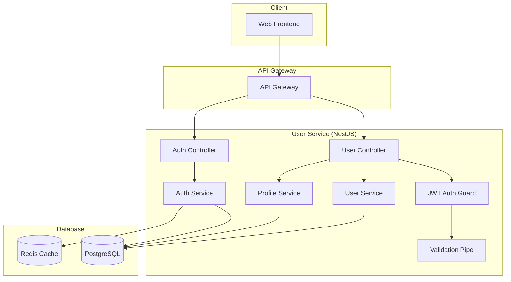

# Design Document - User Service MVP

## Overview

User Service - базовый сервис управления пользователями для MVP российской игровой платформы. Обеспечивает регистрацию, аутентификацию и базовое управление профилем.

**Технологический стек:** NestJS + TypeScript + PostgreSQL + Redis (основной стек для бизнес-логики)

## Architecture

### System Architecture



## NestJS Architecture

### Module Structure

```typescript
@Module({
  imports: [
    TypeOrmModule.forFeature([User]),
    JwtModule.register({
      secret: process.env.JWT_SECRET,
      signOptions: { expiresIn: '1h' },
    }),
    CacheModule.register(),
  ],
  controllers: [UserController, AuthController],
  providers: [
    UserService,
    AuthService,
    ProfileService,
    JwtStrategy,
    LocalStrategy,
  ],
  exports: [UserService, AuthService],
})
export class UserModule {}
```

### Controllers

```typescript
@Controller('users')
@UseGuards(JwtAuthGuard)
export class UserController {
  constructor(private readonly userService: UserService) {}

  @Get('profile')
  async getProfile(@Request() req) {
    return this.userService.findById(req.user.id);
  }

  @Put('profile')
  @UsePipes(ValidationPipe)
  async updateProfile(@Request() req, @Body() updateDto: UpdateProfileDto) {
    return this.userService.updateProfile(req.user.id, updateDto);
  }
}

@Controller('auth')
export class AuthController {
  constructor(private readonly authService: AuthService) {}

  @Post('register')
  @UsePipes(ValidationPipe)
  async register(@Body() registerDto: RegisterDto) {
    return this.authService.register(registerDto);
  }

  @Post('login')
  @UseGuards(LocalAuthGuard)
  async login(@Request() req) {
    return this.authService.login(req.user);
  }
}
```

## Components and Interfaces

### REST API Endpoints

#### Authentication
- `POST /auth/register` - Регистрация пользователя
- `POST /auth/login` - Вход в систему
- `POST /auth/logout` - Выход из системы
- `POST /auth/refresh` - Обновление токена

#### User Profile
- `GET /users/profile` - Получение профиля
- `PUT /users/profile` - Обновление профиля
- `DELETE /users/profile` - Удаление аккаунта

### Services

#### AuthService
- `register(email, password, name)` - Регистрация
- `login(email, password)` - Аутентификация
- `generateTokens(userId)` - Генерация JWT токенов
- `validateToken(token)` - Валидация токена

#### UserService
- `createUser(userData)` - Создание пользователя
- `findByEmail(email)` - Поиск по email
- `findById(id)` - Поиск по ID
- `deleteUser(id)` - Удаление пользователя

#### ProfileService
- `getProfile(userId)` - Получение профиля
- `updateProfile(userId, data)` - Обновление профиля

## Data Models

### User Entity

```typescript
interface User {
  id: string;
  email: string;
  password: string; // hashed
  name: string;
  createdAt: Date;
  updatedAt: Date;
}
```

### JWT Payload

```typescript
interface JWTPayload {
  userId: string;
  email: string;
  iat: number;
  exp: number;
}
```

## Error Handling

### Error Types
- `ValidationError` - Ошибки валидации данных
- `AuthenticationError` - Ошибки аутентификации
- `AuthorizationError` - Ошибки авторизации
- `NotFoundError` - Пользователь не найден
- `ConflictError` - Email уже существует

### Error Response Format

```json
{
  "error": {
    "code": "VALIDATION_ERROR",
    "message": "Invalid email format",
    "details": {}
  }
}
```

## Testing Strategy

### Unit Tests
- AuthService методы
- UserService методы
- ProfileService методы
- Валидация данных

### Integration Tests
- API endpoints
- Database операции
- JWT токены

### Test Coverage
- ✅ **100% покрытие кода** (92 теста)
- ✅ Все критические пути покрыты тестами
- ✅ Unit тесты для всех сервисов
- ✅ Integration тесты для API
- ✅ E2E тесты для пользовательских сценариев

## ✅ Статус реализации

### Архитектурные улучшения:
- ✅ **ProfileService** выделен отдельно для лучшей архитектуры
- ✅ **Winston** логирование вместо стандартного NestJS
- ✅ **GlobalExceptionFilter** переработан под единый формат ошибок
- ✅ **Redis** используется для черного списка JWT токенов (logout)
- ✅ **Prometheus** метрики доступны по `/metrics`

### Дополнительные эндпоинты:
```typescript
// Мониторинг и метрики
GET /health                    // Health check
GET /metrics                   // Prometheus метрики

// Logout с черным списком
POST /auth/logout              // Добавление токена в черный список Redis
```

### Production готовность:
- ✅ TypeScript 5.3.0
- ✅ 0 ошибок компиляции
- ✅ Structured logging с Winston
- ✅ Полная Swagger документация
- ✅ CHANGELOG.md и техническая документация