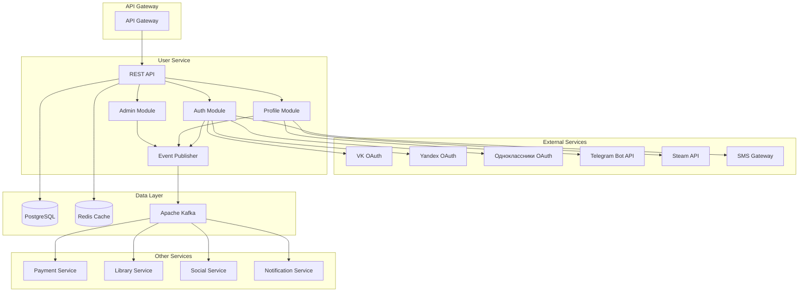
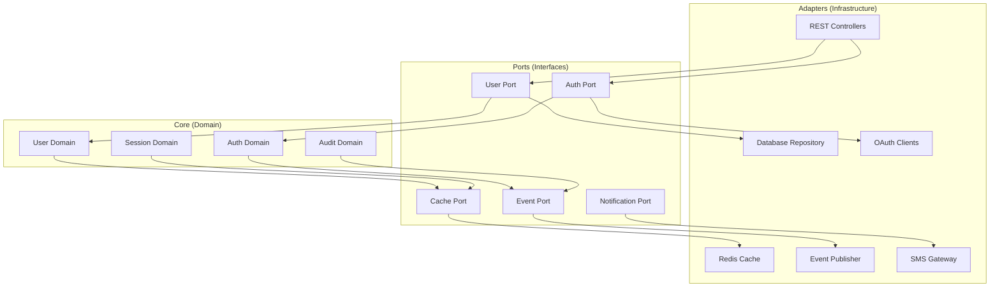
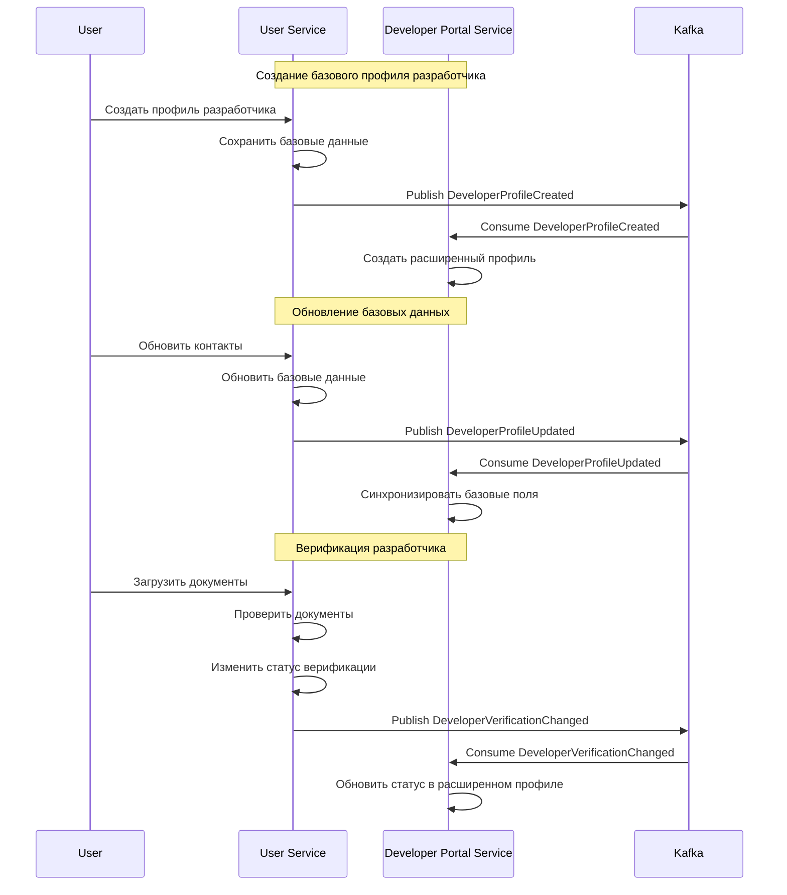
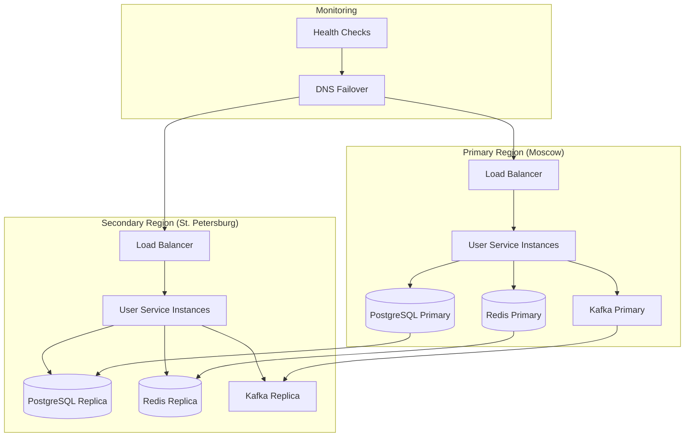
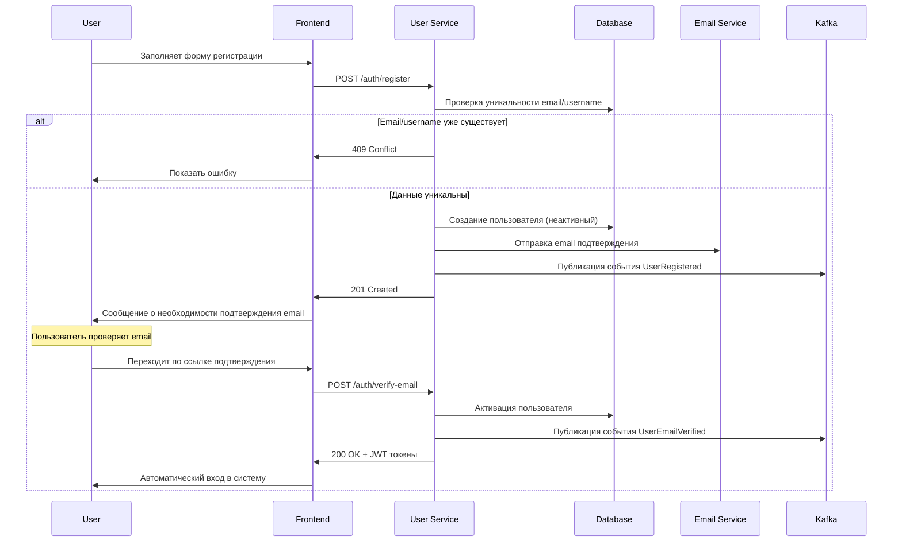
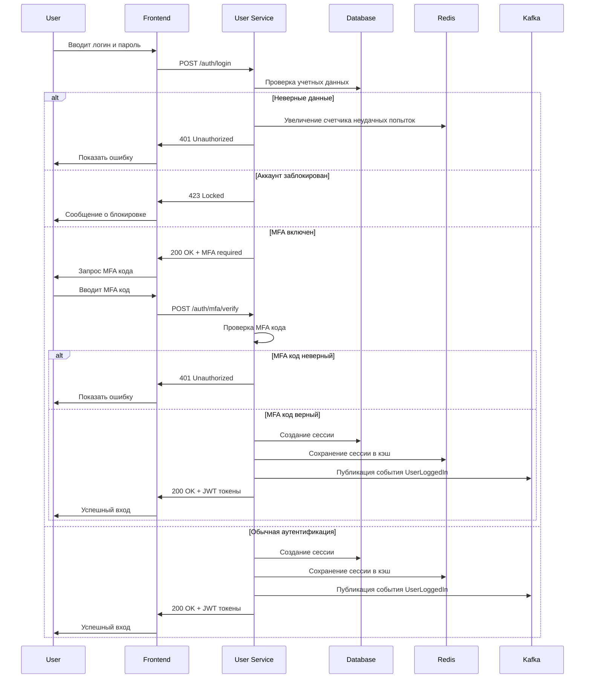
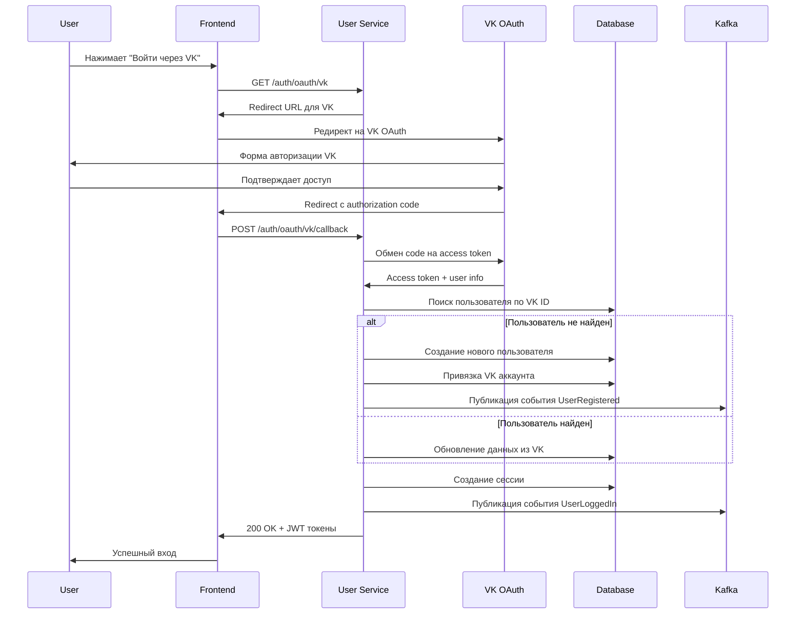
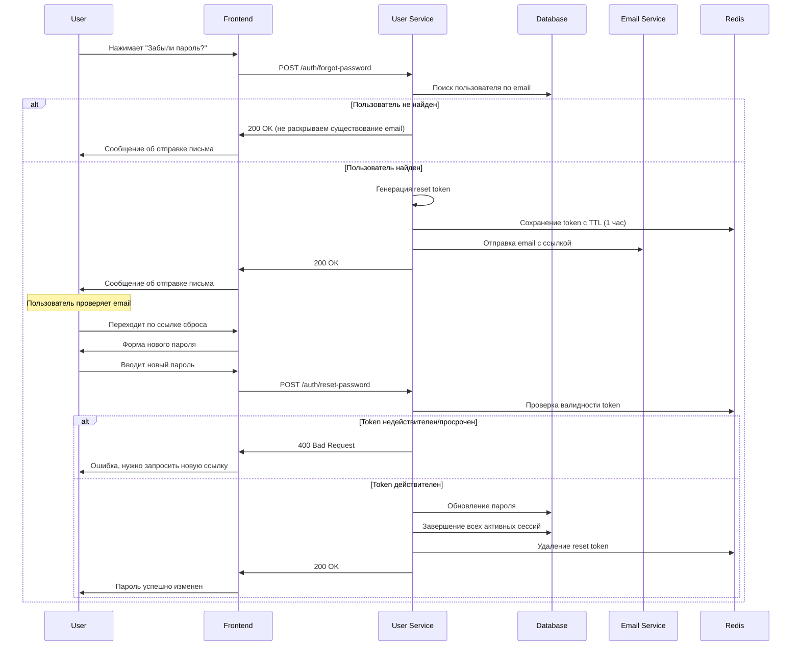
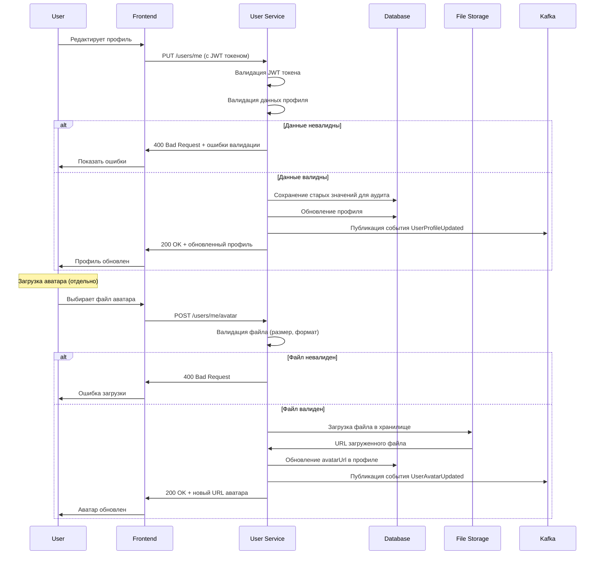
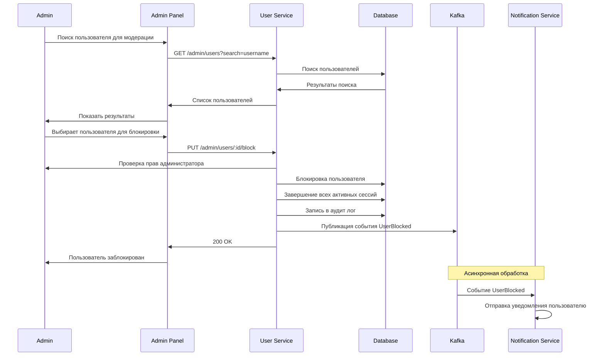

# Дизайн User Service

## Обзор

User Service является центральным микросервисом российской игровой платформы, отвечающим за управление пользователями, аутентификацию, авторизацию и интеграцию с российскими OAuth провайдерами. Сервис построен на принципах высокой доступности, масштабируемости и соответствия российскому законодательству о персональных данных.

### Ключевые принципы дизайна

- **Безопасность прежде всего**: Все операции с персональными данными шифруются ГОСТ-совместимыми алгоритмами
- **Высокая доступность**: 99.9% uptime с автоматическим failover
- **Масштабируемость**: Горизонтальное масштабирование до 50,000 RPS
- **Соответствие законодательству**: Полное соблюдение 152-ФЗ и требований Роскомнадзора
- **Наблюдаемость**: Полное логирование и мониторинг всех операций

## Архитектура

### Общая архитектура



### Hexagonal Architecture

Сервис построен по принципу Hexagonal Architecture для обеспечения чистой архитектуры и тестируемости:



## Компоненты и интерфейсы

### 1. Authentication Module

**Ответственность:**
- Аутентификация пользователей (логин/пароль, OAuth)
- Управление JWT токенами
- Многофакторная аутентификация
- Управление сессиями

**Интерфейсы:**

```typescript
interface AuthService {
  // Основная аутентификация
  authenticate(credentials: LoginCredentials): Promise<AuthResult>
  authenticateOAuth(provider: OAuthProvider, code: string): Promise<AuthResult>
  
  // Управление токенами
  refreshToken(refreshToken: string): Promise<TokenPair>
  validateToken(token: string): Promise<TokenValidationResult>
  revokeToken(token: string): Promise<void>
  
  // MFA
  enableMFA(userId: string, method: MFAMethod): Promise<MFASetupResult>
  verifyMFA(userId: string, code: string): Promise<boolean>
  generateBackupCodes(userId: string): Promise<string[]>
  
  // Восстановление пароля
  requestPasswordReset(email: string): Promise<void>
  resetPassword(token: string, newPassword: string): Promise<void>
}

interface SessionService {
  createSession(userId: string, deviceInfo: DeviceInfo): Promise<Session>
  getActiveSessions(userId: string): Promise<Session[]>
  terminateSession(sessionId: string): Promise<void>
  terminateAllSessions(userId: string, exceptCurrent?: string): Promise<void>
}
```

### 2. User Profile Module

**Ответственность:**
- Управление базовыми профилями пользователей
- Настройки приватности
- Загрузка аватаров
- Интеграция с внешними платформами
- **Базовые данные профилей разработчиков и издателей** (только основная информация)
- Корпоративные профили организаций
- Кастомизация и персонализация профилей
- **Синхронизация с Developer Portal Service через события**

**Интерфейсы:**

```typescript
interface UserService {
  // CRUD операции
  createUser(userData: CreateUserRequest): Promise<User>
  getUserById(userId: string): Promise<User>
  getUserByEmail(email: string): Promise<User>
  updateUser(userId: string, updates: UpdateUserRequest): Promise<User>
  deleteUser(userId: string): Promise<void>
  
  // Профиль
  updateProfile(userId: string, profile: ProfileData): Promise<Profile>
  uploadAvatar(userId: string, file: File): Promise<string>
  
  // Настройки
  updatePrivacySettings(userId: string, settings: PrivacySettings): Promise<void>
  updateNotificationSettings(userId: string, settings: NotificationSettings): Promise<void>
  
  // Интеграции
  linkSocialAccount(userId: string, provider: string, accountData: any): Promise<void>
  importFromSteam(userId: string, steamId: string): Promise<ImportResult>
  
  // Кастомизация профилей
  updateProfileTheme(userId: string, theme: ProfileTheme): Promise<void>
  addProfileWidget(userId: string, widget: ProfileWidget): Promise<void>
  removeProfileWidget(userId: string, widgetId: string): Promise<void>
  reorderProfileWidgets(userId: string, widgetOrder: string[]): Promise<void>
  
  // Система репутации
  updateReputationScore(userId: string, change: number, reason: string): Promise<void>
  getReputationHistory(userId: string): Promise<ReputationEntry[]>
}

interface DeveloperService {
  // Базовые операции (только основная информация)
  createBasicDeveloperProfile(userId: string, basicData: BasicDeveloperData): Promise<BasicDeveloperProfile>
  updateBasicDeveloperProfile(userId: string, updates: BasicDeveloperUpdate): Promise<BasicDeveloperProfile>
  verifyDeveloper(userId: string, documents: VerificationDocuments): Promise<VerificationResult>
  
  // Получение базовой информации
  getBasicDeveloperProfile(userId: string): Promise<BasicDeveloperProfile>
  getDeveloperVerificationStatus(userId: string): Promise<VerificationStatus>
  
  // События для синхронизации с Developer Portal Service
  publishDeveloperVerificationChanged(userId: string, status: VerificationStatus): Promise<void>
  publishDeveloperProfileUpdated(userId: string, changes: BasicProfileChanges): Promise<void>
}

interface PublisherService {
  // Базовые профили издателей (только корпоративная информация)
  createBasicPublisherProfile(userId: string, corporateData: BasicCorporateData): Promise<BasicPublisherProfile>
  updateBasicPublisherProfile(userId: string, updates: BasicPublisherUpdate): Promise<BasicPublisherProfile>
  
  // Получение базовой информации
  getBasicPublisherProfile(userId: string): Promise<BasicPublisherProfile>
  getPublisherVerificationStatus(userId: string): Promise<VerificationStatus>
  
  // События для синхронизации с Developer Portal Service
  publishPublisherProfileUpdated(userId: string, changes: BasicPublisherChanges): Promise<void>
  publishPublisherVerificationChanged(userId: string, status: VerificationStatus): Promise<void>
}

interface CorporateService {
  // Корпоративные профили
  createCorporateProfile(adminUserId: string, companyData: CorporateCompanyData): Promise<CorporateProfile>
  updateCorporateProfile(corporateId: string, updates: CorporateProfileUpdate): Promise<CorporateProfile>
  
  // Управление сотрудниками
  addEmployee(corporateId: string, employeeData: EmployeeData): Promise<void>
  removeEmployee(corporateId: string, userId: string): Promise<void>
  updateEmployeeRole(corporateId: string, userId: string, role: string): Promise<void>
  createDepartment(corporateId: string, departmentData: DepartmentData): Promise<Department>
  
  // Подписки и биллинг
  updateCorporateSubscription(corporateId: string, plan: CorporatePlan): Promise<void>
  getCorporateBilling(corporateId: string, dateRange: DateRange): Promise<CorporateBilling>
  
  // SSO интеграция
  configureSSOProvider(corporateId: string, ssoConfig: SSOConfiguration): Promise<void>
  syncEmployeesFromSSO(corporateId: string): Promise<SSOSyncResult>
  
  // Аналитика использования
  getCorporateUsageStats(corporateId: string, dateRange: DateRange): Promise<CorporateUsageStats>
  getEmployeeActivityReport(corporateId: string, dateRange: DateRange): Promise<EmployeeActivityReport>
}
```

### 3. Admin Module

**Ответственность:**
- Модерация пользователей
- Управление блокировками
- Корпоративные аккаунты
- Аудит и отчетность

**Интерфейсы:**

```typescript
interface AdminService {
  // Модерация
  blockUser(userId: string, reason: string, duration?: number): Promise<void>
  unblockUser(userId: string, reason: string): Promise<void>
  warnUser(userId: string, reason: string): Promise<void>
  
  // Массовые операции
  bulkBlockUsers(userIds: string[], reason: string): Promise<BulkOperationResult>
  bulkUpdateUsers(updates: BulkUserUpdate[]): Promise<BulkOperationResult>
  
  // Поиск и фильтрация
  searchUsers(criteria: UserSearchCriteria): Promise<PaginatedResult<User>>
  getUserActivity(userId: string, dateRange: DateRange): Promise<UserActivity[]>
  
  // Корпоративные аккаунты
  createCorporateAccount(companyData: CompanyData): Promise<CorporateAccount>
  addEmployeeToCompany(companyId: string, employeeData: EmployeeData): Promise<void>
  removeEmployeeFromCompany(companyId: string, userId: string): Promise<void>
}

interface AuditService {
  logUserAction(userId: string, action: string, details: any): Promise<void>
  getAuditLog(userId: string, dateRange: DateRange): Promise<AuditEntry[]>
  generateComplianceReport(dateRange: DateRange): Promise<ComplianceReport>
}
```

### 4. Event Publisher

**Ответственность:**
- Публикация событий в Kafka
- Обеспечение доставки событий
- Retry механизмы

**События:**

```typescript
interface UserEvents {
  UserRegistered: {
    userId: string
    email: string
    username: string
    registrationDate: Date
    source: 'direct' | 'oauth'
    oauthProvider?: string
  }
  
  UserProfileUpdated: {
    userId: string
    changedFields: string[]
    oldValues: Record<string, any>
    newValues: Record<string, any>
    timestamp: Date
  }
  
  UserBlocked: {
    userId: string
    reason: string
    blockedBy: string
    duration?: number
    timestamp: Date
  }
  
  UserSessionCreated: {
    userId: string
    sessionId: string
    deviceInfo: DeviceInfo
    ipAddress: string
    timestamp: Date
  }
  
  UserMFAEnabled: {
    userId: string
    method: MFAMethod
    timestamp: Date
  }
  
  // События для синхронизации с Developer Portal Service
  DeveloperVerificationChanged: {
    userId: string
    developerId: string
    oldStatus: VerificationStatus
    newStatus: VerificationStatus
    verifiedAt?: Date
    timestamp: Date
  }
  
  DeveloperProfileUpdated: {
    userId: string
    developerId: string
    changedFields: string[]
    basicData: BasicDeveloperData
    timestamp: Date
  }
  
  PublisherProfileUpdated: {
    userId: string
    publisherId: string
    changedFields: string[]
    basicData: BasicPublisherData
    timestamp: Date
  }
}
```

## Модели данных

### Основные сущности

```typescript
interface User {
  id: string
  email: string
  username: string
  passwordHash: string
  emailVerified: boolean
  phoneNumber?: string
  phoneVerified: boolean
  
  // Профиль
  profile: UserProfile
  
  // Настройки
  privacySettings: PrivacySettings
  notificationSettings: NotificationSettings
  
  // Безопасность
  mfaEnabled: boolean
  mfaMethods: MFAMethod[]
  backupCodes: string[]
  
  // Метаданные
  createdAt: Date
  updatedAt: Date
  lastLoginAt?: Date
  isActive: boolean
  isBlocked: boolean
  blockReason?: string
  blockExpiresAt?: Date
  
  // Репутация
  reputationScore: number
  
  // Связанные аккаунты
  socialAccounts: SocialAccount[]
  
  // Роли
  roles: UserRole[]
  permissions: Permission[]
}

interface UserProfile {
  displayName: string
  firstName?: string
  lastName?: string
  dateOfBirth?: Date
  country: string
  city?: string
  timezone: string
  language: string
  avatarUrl?: string
  bio?: string
  website?: string
  
  // Игровая информация
  steamId?: string
  favoriteGenres: string[]
  gamesOwned: number
  achievementsCount: number
}

interface Session {
  id: string
  userId: string
  deviceInfo: DeviceInfo
  ipAddress: string
  userAgent: string
  createdAt: Date
  lastActivityAt: Date
  expiresAt: Date
  isActive: boolean
  
  // JWT токены
  accessToken: string
  refreshToken: string
}

interface DeveloperProfile {
  id: string
  userId: string
  companyName: string
  companyType: 'individual' | 'llc' | 'corporation'
  inn?: string
  ogrn?: string
  legalAddress?: string
  contactEmail: string
  contactPhone: string
  website?: string
  
  // Верификация
  isVerified: boolean
  verificationStatus: 'pending' | 'approved' | 'rejected'
  verificationDocuments: VerificationDocument[]
  verifiedAt?: Date
  
  // Расширенная информация о студии
  studioInfo: {
    foundedYear: number
    teamSize: number
    specialization: string[]
    experience: string
    previousProjects: string[]
    awards: Award[]
    certifications: Certification[]
  }
  
  // Портфолио
  portfolio: {
    games: GamePortfolioEntry[]
    totalGames: number
    featuredGames: string[]
    upcomingGames: GamePortfolioEntry[]
  }
  
  // Статистика
  stats: {
    gamesPublished: number
    totalDownloads: number
    totalRevenue: number
    averageRating: number
    totalReviews: number
    monthlyActiveUsers: number
    conversionRate: number
  }
  
  // Социальные функции
  social: {
    newsUpdates: DeveloperNews[]
    communityPosts: CommunityPost[]
    reviewResponses: ReviewResponse[]
    followerCount: number
    isFollowingEnabled: boolean
  }
  
  // Настройки профиля
  profileSettings: {
    isPublic: boolean
    showStats: boolean
    showContactInfo: boolean
    allowDirectMessages: boolean
    autoRespondToReviews: boolean
  }
  
  createdAt: Date
  updatedAt: Date
}

interface PublisherProfile {
  id: string
  userId: string
  companyName: string
  companyType: 'indie_publisher' | 'aa_publisher' | 'aaa_publisher'
  
  // Корпоративная информация
  corporateInfo: {
    inn: string
    ogrn: string
    legalAddress: string
    headquarters: string
    foundedYear: number
    employeeCount: number
    annualRevenue?: number
    stockSymbol?: string
  }
  
  // Контактная информация
  contacts: {
    businessEmail: string
    pressEmail: string
    supportEmail: string
    phone: string
    website: string
    socialMedia: SocialMediaLinks
  }
  
  // Брендинг
  branding: {
    logoUrl: string
    bannerUrl: string
    colorScheme: {
      primary: string
      secondary: string
      accent: string
    }
    customCSS?: string
    brandGuidelines?: string
  }
  
  // Управление студиями
  studios: {
    ownedStudios: OwnedStudio[]
    partnerStudios: PartnerStudio[]
    contractedStudios: ContractedStudio[]
  }
  
  // Портфолио и франшизы
  portfolio: {
    franchises: Franchise[]
    publishedGames: PublishedGame[]
    upcomingReleases: UpcomingRelease[]
    exclusiveDeals: ExclusiveDeal[]
  }
  
  // Аналитика и статистика
  analytics: {
    totalGamesPublished: number
    totalRevenue: number
    marketShare: number
    topGenres: string[]
    regionalPerformance: RegionalPerformance[]
    quarterlyGrowth: number
  }
  
  // Верификация
  verification: {
    isVerified: boolean
    verificationLevel: 'basic' | 'premium' | 'enterprise'
    verificationBadges: string[]
    verifiedAt?: Date
  }
  
  createdAt: Date
  updatedAt: Date
}

interface CorporateProfile {
  id: string
  adminUserId: string
  
  // Информация о компании
  companyInfo: {
    name: string
    legalName: string
    inn: string
    ogrn: string
    industry: string
    companySize: 'small' | 'medium' | 'large' | 'enterprise'
    annualRevenue?: number
    headquarters: string
    website: string
  }
  
  // Структура организации
  organization: {
    departments: Department[]
    employees: CorporateEmployee[]
    hierarchy: OrganizationHierarchy
    roles: CorporateRole[]
  }
  
  // Подписка и биллинг
  subscription: {
    plan: CorporatePlan
    licenseCount: number
    usedLicenses: number
    billingCycle: 'monthly' | 'quarterly' | 'annual'
    nextBillingDate: Date
    totalSpent: number
  }
  
  // SSO и интеграции
  integrations: {
    ssoEnabled: boolean
    ssoProvider?: 'azure_ad' | 'google_workspace' | 'okta' | 'custom'
    ssoConfiguration?: SSOConfiguration
    ldapIntegration?: LDAPConfiguration
    apiIntegrations: APIIntegration[]
  }
  
  // Политики и настройки
  policies: {
    gameAccessPolicy: GameAccessPolicy
    spendingLimits: SpendingLimits
    contentFilters: ContentFilter[]
    workingHours: WorkingHours
    vacationPolicy: VacationPolicy
  }
  
  // Аналитика использования
  usage: {
    monthlyActiveUsers: number
    totalGameHours: number
    popularGames: PopularGame[]
    departmentUsage: DepartmentUsage[]
    costPerEmployee: number
  }
  
  createdAt: Date
  updatedAt: Date
}

interface ProfileCustomization {
  userId: string
  
  // Тема оформления
  theme: {
    name: string
    colorScheme: 'light' | 'dark' | 'auto'
    primaryColor: string
    accentColor: string
    backgroundImage?: string
    customCSS?: string
  }
  
  // Виджеты профиля
  widgets: ProfileWidget[]
  
  // Макет профиля
  layout: {
    widgetOrder: string[]
    columnsCount: number
    showSidebar: boolean
    sidebarPosition: 'left' | 'right'
  }
  
  // Настройки отображения
  display: {
    showAchievements: boolean
    showGameStats: boolean
    showFriendsList: boolean
    showRecentActivity: boolean
    showWishlist: boolean
    maxItemsPerWidget: number
  }
  
  // Анимации и эффекты
  animations: {
    enableAnimations: boolean
    animationSpeed: 'slow' | 'normal' | 'fast'
    enableParticleEffects: boolean
    enableSoundEffects: boolean
  }
  
  updatedAt: Date
}

interface ProfileWidget {
  id: string
  type: 'achievements' | 'game_stats' | 'friends' | 'activity' | 'wishlist' | 'custom'
  title: string
  position: number
  isVisible: boolean
  settings: WidgetSettings
  data?: any
}

interface ReputationEntry {
  id: string
  userId: string
  change: number
  reason: string
  source: 'system' | 'user_review' | 'community_vote' | 'admin_action'
  sourceId?: string
  createdAt: Date
}

interface CorporateAccount {
  id: string
  companyName: string
  inn: string
  ogrn: string
  legalAddress: string
  adminUserId: string
  
  // SSO настройки
  ssoEnabled: boolean
  ssoProvider?: string
  ssoConfiguration?: any
  
  // Сотрудники
  employees: CorporateEmployee[]
  
  createdAt: Date
  updatedAt: Date
}
```

### Схема базы данных

```sql
-- Основная таблица пользователей
CREATE TABLE users (
    id UUID PRIMARY KEY DEFAULT gen_random_uuid(),
    email VARCHAR(255) UNIQUE NOT NULL,
    username VARCHAR(50) UNIQUE NOT NULL,
    password_hash VARCHAR(255) NOT NULL,
    email_verified BOOLEAN DEFAULT FALSE,
    phone_number VARCHAR(20),
    phone_verified BOOLEAN DEFAULT FALSE,
    
    -- Профиль (JSON)
    profile JSONB NOT NULL DEFAULT '{}',
    
    -- Настройки (JSON)
    privacy_settings JSONB NOT NULL DEFAULT '{}',
    notification_settings JSONB NOT NULL DEFAULT '{}',
    
    -- Безопасность
    mfa_enabled BOOLEAN DEFAULT FALSE,
    mfa_methods JSONB DEFAULT '[]',
    backup_codes TEXT[],
    
    -- Статус
    is_active BOOLEAN DEFAULT TRUE,
    is_blocked BOOLEAN DEFAULT FALSE,
    block_reason TEXT,
    block_expires_at TIMESTAMP,
    
    -- Репутация
    reputation_score INTEGER DEFAULT 0,
    
    -- Метаданные
    created_at TIMESTAMP DEFAULT NOW(),
    updated_at TIMESTAMP DEFAULT NOW(),
    last_login_at TIMESTAMP
);

-- Сессии пользователей
CREATE TABLE user_sessions (
    id UUID PRIMARY KEY DEFAULT gen_random_uuid(),
    user_id UUID NOT NULL REFERENCES users(id) ON DELETE CASCADE,
    device_info JSONB NOT NULL,
    ip_address INET NOT NULL,
    user_agent TEXT,
    access_token_hash VARCHAR(255) NOT NULL,
    refresh_token_hash VARCHAR(255) NOT NULL,
    created_at TIMESTAMP DEFAULT NOW(),
    last_activity_at TIMESTAMP DEFAULT NOW(),
    expires_at TIMESTAMP NOT NULL,
    is_active BOOLEAN DEFAULT TRUE
);

-- Связанные социальные аккаунты
CREATE TABLE social_accounts (
    id UUID PRIMARY KEY DEFAULT gen_random_uuid(),
    user_id UUID NOT NULL REFERENCES users(id) ON DELETE CASCADE,
    provider VARCHAR(50) NOT NULL,
    provider_user_id VARCHAR(255) NOT NULL,
    provider_data JSONB,
    linked_at TIMESTAMP DEFAULT NOW(),
    
    UNIQUE(provider, provider_user_id)
);

-- Профили разработчиков (расширенные)
CREATE TABLE developer_profiles (
    id UUID PRIMARY KEY DEFAULT gen_random_uuid(),
    user_id UUID NOT NULL REFERENCES users(id) ON DELETE CASCADE,
    company_name VARCHAR(255) NOT NULL,
    company_type VARCHAR(50) NOT NULL,
    inn VARCHAR(12),
    ogrn VARCHAR(15),
    legal_address TEXT,
    contact_email VARCHAR(255) NOT NULL,
    contact_phone VARCHAR(20),
    website VARCHAR(255),
    
    -- Расширенная информация о студии
    studio_info JSONB NOT NULL DEFAULT '{}',
    
    -- Портфолио
    portfolio JSONB NOT NULL DEFAULT '{}',
    
    -- Статистика
    stats JSONB NOT NULL DEFAULT '{}',
    
    -- Социальные функции
    social JSONB NOT NULL DEFAULT '{}',
    
    -- Настройки профиля
    profile_settings JSONB NOT NULL DEFAULT '{}',
    
    -- Верификация
    is_verified BOOLEAN DEFAULT FALSE,
    verification_status VARCHAR(20) DEFAULT 'pending',
    verification_documents JSONB DEFAULT '[]',
    verified_at TIMESTAMP,
    
    created_at TIMESTAMP DEFAULT NOW(),
    updated_at TIMESTAMP DEFAULT NOW(),
    
    UNIQUE(user_id)
);

-- Профили издателей
CREATE TABLE publisher_profiles (
    id UUID PRIMARY KEY DEFAULT gen_random_uuid(),
    user_id UUID NOT NULL REFERENCES users(id) ON DELETE CASCADE,
    company_name VARCHAR(255) NOT NULL,
    company_type VARCHAR(50) NOT NULL,
    
    -- Корпоративная информация
    corporate_info JSONB NOT NULL DEFAULT '{}',
    
    -- Контактная информация
    contacts JSONB NOT NULL DEFAULT '{}',
    
    -- Брендинг
    branding JSONB NOT NULL DEFAULT '{}',
    
    -- Управление студиями
    studios JSONB NOT NULL DEFAULT '{}',
    
    -- Портфолио и франшизы
    portfolio JSONB NOT NULL DEFAULT '{}',
    
    -- Аналитика и статистика
    analytics JSONB NOT NULL DEFAULT '{}',
    
    -- Верификация
    verification JSONB NOT NULL DEFAULT '{}',
    
    created_at TIMESTAMP DEFAULT NOW(),
    updated_at TIMESTAMP DEFAULT NOW(),
    
    UNIQUE(user_id)
);

-- Корпоративные профили
CREATE TABLE corporate_profiles (
    id UUID PRIMARY KEY DEFAULT gen_random_uuid(),
    admin_user_id UUID NOT NULL REFERENCES users(id) ON DELETE CASCADE,
    
    -- Информация о компании
    company_info JSONB NOT NULL DEFAULT '{}',
    
    -- Структура организации
    organization JSONB NOT NULL DEFAULT '{}',
    
    -- Подписка и биллинг
    subscription JSONB NOT NULL DEFAULT '{}',
    
    -- SSO и интеграции
    integrations JSONB NOT NULL DEFAULT '{}',
    
    -- Политики и настройки
    policies JSONB NOT NULL DEFAULT '{}',
    
    -- Аналитика использования
    usage JSONB NOT NULL DEFAULT '{}',
    
    created_at TIMESTAMP DEFAULT NOW(),
    updated_at TIMESTAMP DEFAULT NOW(),
    
    UNIQUE(admin_user_id)
);

-- Кастомизация профилей
CREATE TABLE profile_customizations (
    id UUID PRIMARY KEY DEFAULT gen_random_uuid(),
    user_id UUID NOT NULL REFERENCES users(id) ON DELETE CASCADE,
    
    -- Тема оформления
    theme JSONB NOT NULL DEFAULT '{}',
    
    -- Виджеты профиля
    widgets JSONB NOT NULL DEFAULT '[]',
    
    -- Макет профиля
    layout JSONB NOT NULL DEFAULT '{}',
    
    -- Настройки отображения
    display JSONB NOT NULL DEFAULT '{}',
    
    -- Анимации и эффекты
    animations JSONB NOT NULL DEFAULT '{}',
    
    updated_at TIMESTAMP DEFAULT NOW(),
    
    UNIQUE(user_id)
);

-- История репутации
CREATE TABLE reputation_history (
    id UUID PRIMARY KEY DEFAULT gen_random_uuid(),
    user_id UUID NOT NULL REFERENCES users(id) ON DELETE CASCADE,
    change INTEGER NOT NULL,
    reason TEXT NOT NULL,
    source VARCHAR(50) NOT NULL,
    source_id VARCHAR(255),
    created_at TIMESTAMP DEFAULT NOW()
);

-- Департаменты корпоративных аккаунтов
CREATE TABLE corporate_departments (
    id UUID PRIMARY KEY DEFAULT gen_random_uuid(),
    corporate_profile_id UUID NOT NULL REFERENCES corporate_profiles(id) ON DELETE CASCADE,
    name VARCHAR(255) NOT NULL,
    description TEXT,
    parent_department_id UUID REFERENCES corporate_departments(id),
    manager_user_id UUID REFERENCES users(id),
    budget_limit DECIMAL(15,2),
    created_at TIMESTAMP DEFAULT NOW(),
    updated_at TIMESTAMP DEFAULT NOW()
);

-- Роли в корпоративных аккаунтах
CREATE TABLE corporate_roles (
    id UUID PRIMARY KEY DEFAULT gen_random_uuid(),
    corporate_profile_id UUID NOT NULL REFERENCES corporate_profiles(id) ON DELETE CASCADE,
    name VARCHAR(100) NOT NULL,
    description TEXT,
    permissions JSONB NOT NULL DEFAULT '[]',
    created_at TIMESTAMP DEFAULT NOW()
);

-- Корпоративные аккаунты
CREATE TABLE corporate_accounts (
    id UUID PRIMARY KEY DEFAULT gen_random_uuid(),
    company_name VARCHAR(255) NOT NULL,
    inn VARCHAR(12) NOT NULL,
    ogrn VARCHAR(15) NOT NULL,
    legal_address TEXT NOT NULL,
    admin_user_id UUID NOT NULL REFERENCES users(id),
    
    -- SSO
    sso_enabled BOOLEAN DEFAULT FALSE,
    sso_provider VARCHAR(100),
    sso_configuration JSONB,
    
    created_at TIMESTAMP DEFAULT NOW(),
    updated_at TIMESTAMP DEFAULT NOW(),
    
    UNIQUE(inn)
);

-- Сотрудники корпоративных аккаунтов
CREATE TABLE corporate_employees (
    id UUID PRIMARY KEY DEFAULT gen_random_uuid(),
    corporate_account_id UUID NOT NULL REFERENCES corporate_accounts(id) ON DELETE CASCADE,
    user_id UUID NOT NULL REFERENCES users(id) ON DELETE CASCADE,
    role VARCHAR(50) NOT NULL DEFAULT 'employee',
    added_at TIMESTAMP DEFAULT NOW(),
    added_by UUID NOT NULL REFERENCES users(id),
    
    UNIQUE(corporate_account_id, user_id)
);

-- Аудит лог
CREATE TABLE audit_log (
    id UUID PRIMARY KEY DEFAULT gen_random_uuid(),
    user_id UUID REFERENCES users(id),
    action VARCHAR(100) NOT NULL,
    resource_type VARCHAR(50),
    resource_id VARCHAR(255),
    details JSONB,
    ip_address INET,
    user_agent TEXT,
    created_at TIMESTAMP DEFAULT NOW()
);

-- Роли и разрешения
CREATE TABLE roles (
    id UUID PRIMARY KEY DEFAULT gen_random_uuid(),
    name VARCHAR(50) UNIQUE NOT NULL,
    description TEXT,
    permissions TEXT[] NOT NULL DEFAULT '{}'
);

CREATE TABLE user_roles (
    user_id UUID NOT NULL REFERENCES users(id) ON DELETE CASCADE,
    role_id UUID NOT NULL REFERENCES roles(id) ON DELETE CASCADE,
    assigned_at TIMESTAMP DEFAULT NOW(),
    assigned_by UUID REFERENCES users(id),
    
    PRIMARY KEY (user_id, role_id)
);

-- Индексы для производительности
CREATE INDEX idx_users_email ON users(email);
CREATE INDEX idx_users_username ON users(username);
CREATE INDEX idx_users_active ON users(is_active) WHERE is_active = TRUE;
CREATE INDEX idx_sessions_user_active ON user_sessions(user_id, is_active) WHERE is_active = TRUE;
CREATE INDEX idx_sessions_expires ON user_sessions(expires_at);
CREATE INDEX idx_social_accounts_user ON social_accounts(user_id);
CREATE INDEX idx_audit_log_user_created ON audit_log(user_id, created_at);
CREATE INDEX idx_audit_log_action_created ON audit_log(action, created_at);
```

## Интеграция с другими сервисами

### Developer Portal Service Integration

User Service является владельцем базовых данных профилей разработчиков, в то время как Developer Portal Service управляет расширенной информацией.

**Принципы интеграции:**
- **Single Source of Truth**: User Service хранит только базовую информацию
- **Event-Driven Sync**: Синхронизация через события Kafka
- **API Integration**: Developer Portal Service может запрашивать базовые данные через API

**Архитектура интеграции:**



**Разделение данных:**

```typescript
// User Service - Базовые данные
interface BasicDeveloperData {
  companyName: string
  companyType: 'individual' | 'llc' | 'corporation'
  contactEmail: string
  contactPhone: string
  website?: string
  verificationStatus: VerificationStatus
  verifiedAt?: Date
}

// Developer Portal Service - Расширенные данные
interface ExtendedDeveloperData {
  studioInfo: StudioInfo
  portfolio: Portfolio
  stats: DeveloperStats
  social: SocialFeatures
  tools: DeveloperTools
  // Ссылка на базовые данные
  userServiceDeveloperId: string
}
```

### Social Service Integration

User Service отправляет события о регистрации пользователей для реферальной программы.

```typescript
// События для Social Service
interface SocialIntegrationEvents {
  UserRegistered: {
    userId: string
    email: string
    username: string
    referralCode?: string // если пользователь пришел по реферальной ссылке
    registrationDate: Date
  }
  
  UserProfileUpdated: {
    userId: string
    displayName: string
    avatarUrl?: string
    // Только публичная информация для социальных функций
  }
}
```

## Обработка ошибок

### Стратегия обработки ошибок

1. **Стандартизированные коды ошибок**
2. **Graceful degradation** при недоступности внешних сервисов
3. **Circuit breaker** для защиты от каскадных сбоев
4. **Retry механизмы** с экспоненциальной задержкой

### Коды ошибок

```typescript
enum ErrorCodes {
  // Аутентификация
  INVALID_CREDENTIALS = 'AUTH_001',
  ACCOUNT_BLOCKED = 'AUTH_002',
  MFA_REQUIRED = 'AUTH_003',
  TOKEN_EXPIRED = 'AUTH_004',
  TOKEN_INVALID = 'AUTH_005',
  
  // Регистрация
  EMAIL_ALREADY_EXISTS = 'REG_001',
  USERNAME_ALREADY_EXISTS = 'REG_002',
  WEAK_PASSWORD = 'REG_003',
  EMAIL_VERIFICATION_REQUIRED = 'REG_004',
  
  // Профиль
  USER_NOT_FOUND = 'USER_001',
  INVALID_PROFILE_DATA = 'USER_002',
  AVATAR_TOO_LARGE = 'USER_003',
  INVALID_AVATAR_FORMAT = 'USER_004',
  
  // Внешние сервисы
  OAUTH_PROVIDER_ERROR = 'EXT_001',
  SMS_GATEWAY_ERROR = 'EXT_002',
  EMAIL_SERVICE_ERROR = 'EXT_003',
  
  // Система
  RATE_LIMIT_EXCEEDED = 'SYS_001',
  SERVICE_UNAVAILABLE = 'SYS_002',
  DATABASE_ERROR = 'SYS_003',
  CACHE_ERROR = 'SYS_004'
}

interface ApiError {
  code: ErrorCodes
  message: string
  details?: any
  timestamp: Date
  requestId: string
}
```

### Circuit Breaker Configuration

```typescript
interface CircuitBreakerConfig {
  failureThreshold: number // 5 failures
  recoveryTimeout: number  // 30 seconds
  monitoringPeriod: number // 60 seconds
}

// Конфигурация для разных сервисов
const circuitBreakers = {
  vkOAuth: { failureThreshold: 3, recoveryTimeout: 30000, monitoringPeriod: 60000 },
  yandexOAuth: { failureThreshold: 3, recoveryTimeout: 30000, monitoringPeriod: 60000 },
  smsGateway: { failureThreshold: 5, recoveryTimeout: 60000, monitoringPeriod: 120000 },
  emailService: { failureThreshold: 5, recoveryTimeout: 60000, monitoringPeriod: 120000 }
}
```

## Стратегия тестирования

### 1. Unit Tests (90% покрытие)

- Тестирование бизнес-логики в изоляции
- Моки для всех внешних зависимостей
- Тестирование edge cases и error handling

```typescript
describe('AuthService', () => {
  describe('authenticate', () => {
    it('should authenticate user with valid credentials', async () => {
      // Test implementation
    })
    
    it('should block account after 5 failed attempts', async () => {
      // Test implementation
    })
    
    it('should require MFA when enabled', async () => {
      // Test implementation
    })
  })
})
```

### 2. Integration Tests

- Тестирование взаимодействия с базой данных
- Тестирование OAuth провайдеров (с моками)
- Тестирование публикации событий в Kafka

```typescript
describe('User Registration Integration', () => {
  it('should create user and publish UserRegistered event', async () => {
    // Test implementation with real database
  })
})
```

### 3. Contract Tests

- Тестирование API контрактов с другими сервисами
- Использование Pact для consumer-driven contracts

### 4. Load Tests

- Нагрузочное тестирование с помощью k6
- Тестирование 50,000 одновременных аутентификаций
- Тестирование 100,000 RPS для операций чтения

```javascript
// k6 load test example
import http from 'k6/http'
import { check } from 'k6'

export let options = {
  stages: [
    { duration: '2m', target: 100 },
    { duration: '5m', target: 1000 },
    { duration: '2m', target: 0 }
  ]
}

export default function() {
  let response = http.post('http://user-service/api/auth/login', {
    email: 'test@example.com',
    password: 'password123'
  })
  
  check(response, {
    'status is 200': (r) => r.status === 200,
    'response time < 500ms': (r) => r.timings.duration < 500
  })
}
```

### 5. Security Tests

- Тестирование на уязвимости (OWASP Top 10)
- Penetration testing
- Тестирование rate limiting
- Тестирование JWT токенов

### 6. Compliance Tests

- Тестирование соответствия 152-ФЗ
- Тестирование шифрования персональных данных
- Тестирование аудит логов
- Тестирование процедур удаления данных

## Мониторинг и наблюдаемость

### Метрики

```typescript
interface UserServiceMetrics {
  // Производительность
  authenticationLatency: Histogram
  profileUpdateLatency: Histogram
  databaseQueryLatency: Histogram
  
  // Пропускная способность
  authenticationsPerSecond: Counter
  registrationsPerSecond: Counter
  profileUpdatesPerSecond: Counter
  
  // Ошибки
  authenticationErrors: Counter
  databaseErrors: Counter
  externalServiceErrors: Counter
  
  // Бизнес метрики
  activeUsers: Gauge
  blockedUsers: Gauge
  mfaEnabledUsers: Gauge
  
  // Безопасность
  failedLoginAttempts: Counter
  suspiciousActivity: Counter
  rateLimitHits: Counter
}
```

### Логирование

```typescript
interface LogEntry {
  timestamp: Date
  level: 'debug' | 'info' | 'warn' | 'error'
  service: 'user-service'
  correlationId: string
  userId?: string
  action: string
  details: any
  duration?: number
  error?: Error
}

// Примеры логов
logger.info('User authenticated successfully', {
  userId: 'user-123',
  action: 'authenticate',
  method: 'password',
  ipAddress: '192.168.1.1',
  duration: 150
})

logger.warn('Multiple failed login attempts detected', {
  userId: 'user-123',
  action: 'authenticate',
  failedAttempts: 4,
  ipAddress: '192.168.1.1',
  timeWindow: '5m'
})
```

### Алерты

```yaml
alerts:
  - name: HighAuthenticationLatency
    condition: authentication_latency_p95 > 500ms
    severity: warning
    
  - name: HighErrorRate
    condition: error_rate > 5%
    severity: critical
    
  - name: DatabaseConnectionFailure
    condition: database_connection_errors > 0
    severity: critical
    
  - name: SuspiciousActivity
    condition: failed_login_attempts > 100 in 5m
    severity: warning
    
  - name: ServiceUnavailable
    condition: health_check_failures > 3
    severity: critical
```

### Трейсинг

Использование OpenTelemetry для distributed tracing:

```typescript
import { trace } from '@opentelemetry/api'

const tracer = trace.getTracer('user-service')

async function authenticateUser(credentials: LoginCredentials): Promise<AuthResult> {
  return tracer.startActiveSpan('authenticate_user', async (span) => {
    span.setAttributes({
      'user.email': credentials.email,
      'auth.method': 'password'
    })
    
    try {
      // Authentication logic
      const result = await performAuthentication(credentials)
      
      span.setAttributes({
        'auth.success': true,
        'user.id': result.userId
      })
      
      return result
    } catch (error) {
      span.recordException(error)
      span.setStatus({ code: SpanStatusCode.ERROR })
      throw error
    } finally {
      span.end()
    }
  })
}
```

## Безопасность

### Шифрование данных

```typescript
// ГОСТ-совместимое шифрование для соответствия российским требованиям
interface EncryptionService {
  encryptPersonalData(data: string): Promise<string>
  decryptPersonalData(encryptedData: string): Promise<string>
  hashPassword(password: string): Promise<string>
  verifyPassword(password: string, hash: string): Promise<boolean>
}

// Конфигурация шифрования
const encryptionConfig = {
  algorithm: 'GOST-28147-89', // Российский стандарт шифрования
  keyDerivation: 'PBKDF2',
  iterations: 100000,
  saltLength: 32
}
```

### Rate Limiting

```typescript
interface RateLimitConfig {
  // Аутентификация
  login: { requests: 5, window: '15m', blockDuration: '30m' }
  registration: { requests: 3, window: '1h', blockDuration: '1h' }
  passwordReset: { requests: 3, window: '1h', blockDuration: '1h' }
  
  // API
  profileUpdate: { requests: 10, window: '1m' }
  profileRead: { requests: 100, window: '1m' }
  
  // Глобальные лимиты
  global: { requests: 1000, window: '1m' }
}
```

### JWT Token Security

```typescript
interface JWTConfig {
  accessToken: {
    expiresIn: '15m'
    algorithm: 'RS256'
    issuer: 'russian-gaming-platform'
    audience: 'gaming-services'
  }
  
  refreshToken: {
    expiresIn: '7d'
    algorithm: 'RS256'
    rotateOnUse: true
  }
}

interface TokenPayload {
  sub: string // userId
  iss: string // issuer
  aud: string // audience
  exp: number // expiration
  iat: number // issued at
  jti: string // JWT ID
  
  // Custom claims
  roles: string[]
  permissions: string[]
  sessionId: string
  deviceId: string
}
```

## Развертывание и масштабирование

### Kubernetes Deployment

```yaml
apiVersion: apps/v1
kind: Deployment
metadata:
  name: user-service
spec:
  replicas: 3
  selector:
    matchLabels:
      app: user-service
  template:
    metadata:
      labels:
        app: user-service
    spec:
      containers:
      - name: user-service
        image: user-service:latest
        ports:
        - containerPort: 3000
        env:
        - name: DATABASE_URL
          valueFrom:
            secretKeyRef:
              name: user-service-secrets
              key: database-url
        - name: REDIS_URL
          valueFrom:
            secretKeyRef:
              name: user-service-secrets
              key: redis-url
        resources:
          requests:
            memory: "256Mi"
            cpu: "250m"
          limits:
            memory: "512Mi"
            cpu: "500m"
        livenessProbe:
          httpGet:
            path: /health
            port: 3000
          initialDelaySeconds: 30
          periodSeconds: 10
        readinessProbe:
          httpGet:
            path: /ready
            port: 3000
          initialDelaySeconds: 5
          periodSeconds: 5
```

### Horizontal Pod Autoscaler

```yaml
apiVersion: autoscaling/v2
kind: HorizontalPodAutoscaler
metadata:
  name: user-service-hpa
spec:
  scaleTargetRef:
    apiVersion: apps/v1
    kind: Deployment
    name: user-service
  minReplicas: 3
  maxReplicas: 20
  metrics:
  - type: Resource
    resource:
      name: cpu
      target:
        type: Utilization
        averageUtilization: 70
  - type: Resource
    resource:
      name: memory
      target:
        type: Utilization
        averageUtilization: 80
```

### Database Scaling

```yaml
# PostgreSQL Master-Slave configuration
apiVersion: postgresql.cnpg.io/v1
kind: Cluster
metadata:
  name: user-service-postgres
spec:
  instances: 3
  
  postgresql:
    parameters:
      max_connections: "200"
      shared_buffers: "256MB"
      effective_cache_size: "1GB"
      
  bootstrap:
    initdb:
      database: userservice
      owner: userservice
      secret:
        name: postgres-credentials
        
  storage:
    size: 100Gi
    storageClass: fast-ssd
    
  monitoring:
    enabled: true
```

## Disaster Recovery

### Backup Strategy

```typescript
interface BackupStrategy {
  database: {
    frequency: 'hourly'
    retention: '30 days'
    encryption: true
    compression: true
    location: 's3://backups/user-service/db'
  }
  
  redis: {
    frequency: 'every 15 minutes'
    retention: '7 days'
    location: 's3://backups/user-service/cache'
  }
  
  configuration: {
    frequency: 'on change'
    retention: '90 days'
    location: 'git repository'
  }
}
```

### Recovery Procedures

```typescript
interface RecoveryProcedures {
  rto: '30 minutes' // Recovery Time Objective
  rpo: '15 minutes' // Recovery Point Objective
  
  procedures: {
    databaseFailure: 'Automatic failover to read replica'
    cacheFailure: 'Service continues with degraded performance'
    completeServiceFailure: 'Restore from backup in secondary region'
    dataCorruption: 'Point-in-time recovery from backup'
  }
}
```

### Multi-Region Setup



## API Эндпоинты и маршруты

### Структура API

Все API эндпоинты следуют RESTful принципам и используют версионирование через URL:

```
Base URL: https://api.gaming-platform.ru/user-service/v1
```

### Authentication Endpoints

```typescript
// Регистрация и аутентификация
POST   /auth/register              // Регистрация нового пользователя
POST   /auth/login                 // Вход по логину/паролю
POST   /auth/logout                // Выход из системы
POST   /auth/refresh               // Обновление токена
POST   /auth/verify-email          // Подтверждение email
POST   /auth/resend-verification   // Повторная отправка подтверждения

// Восстановление пароля
POST   /auth/forgot-password       // Запрос восстановления пароля
POST   /auth/reset-password        // Сброс пароля по токену
POST   /auth/change-password       // Смена пароля (авторизованный)

// OAuth
GET    /auth/oauth/:provider       // Редирект на OAuth провайдера
POST   /auth/oauth/:provider/callback // Обработка OAuth callback
POST   /auth/oauth/link            // Привязка OAuth аккаунта
DELETE /auth/oauth/unlink/:provider // Отвязка OAuth аккаунта

// Многофакторная аутентификация
POST   /auth/mfa/enable            // Включение MFA
POST   /auth/mfa/verify            // Проверка MFA кода
POST   /auth/mfa/disable           // Отключение MFA
GET    /auth/mfa/backup-codes      // Получение резервных кодов
POST   /auth/mfa/regenerate-codes  // Генерация новых резервных кодов

// Управление сессиями
GET    /auth/sessions              // Список активных сессий
DELETE /auth/sessions/:sessionId   // Завершение конкретной сессии
DELETE /auth/sessions/all          // Завершение всех сессий
```

### User Profile Endpoints

```typescript
// Основные операции с профилем
GET    /users/profile              // Получение профиля текущего пользователя
PUT    /users/profile              // Обновление профиля
POST   /users/avatar               // Загрузка аватара
DELETE /users/avatar               // Удаление аватара

// Публичные профили
GET    /users/:userId/profile      // Публичный профиль пользователя
GET    /users/:username/profile    // Профиль по username

// Настройки приватности
GET    /users/privacy              // Получение настроек приватности
PUT    /users/privacy              // Обновление настроек приватности

// Настройки уведомлений
GET    /users/notifications        // Получение настроек уведомлений
PUT    /users/notifications        // Обновление настроек уведомлений

// Кастомизация профиля
GET    /users/customization        // Получение настроек кастомизации
PUT    /users/customization        // Обновление кастомизации
POST   /users/widgets              // Добавление виджета
PUT    /users/widgets/:widgetId    // Обновление виджета
DELETE /users/widgets/:widgetId    // Удаление виджета
PUT    /users/widgets/order        // Изменение порядка виджетов

// Система репутации
GET    /users/reputation           // Получение репутации пользователя
GET    /users/reputation/history   // История изменений репутации
GET    /users/:userId/reputation   // Публичная репутация пользователя
```

### Developer Profile Endpoints

```typescript
// Основные операции с профилем разработчика
POST   /developers/profile         // Создание профиля разработчика
GET    /developers/profile         // Получение профиля разработчика
PUT    /developers/profile         // Обновление профиля разработчика
DELETE /developers/profile         // Удаление профиля разработчика

// Публичные профили разработчиков
GET    /developers/:developerId    // Публичный профиль разработчика
GET    /developers/search          // Поиск разработчиков

// Верификация разработчиков
POST   /developers/verification    // Подача заявки на верификацию
GET    /developers/verification    // Статус верификации
POST   /developers/verification/documents // Загрузка документов

// Портфолио
GET    /developers/portfolio       // Получение портфолио
POST   /developers/portfolio/games // Добавление игры в портфолио
PUT    /developers/portfolio/games/:gameId // Обновление игры в портфолио
DELETE /developers/portfolio/games/:gameId // Удаление игры из портфолио

// Статистика и аналитика
GET    /developers/stats           // Статистика разработчика
GET    /developers/analytics       // Детальная аналитика
GET    /developers/analytics/games // Аналитика по играм

// Социальные функции
POST   /developers/news            // Публикация новости
GET    /developers/news            // Получение новостей
PUT    /developers/news/:newsId    // Обновление новости
DELETE /developers/news/:newsId    // Удаление новости

POST   /developers/reviews/:reviewId/response // Ответ на отзыв
GET    /developers/reviews/responses // Список ответов на отзывы
```

### Publisher Profile Endpoints

```typescript
// Основные операции с профилем издателя
POST   /publishers/profile         // Создание профиля издателя
GET    /publishers/profile         // Получение профиля издателя
PUT    /publishers/profile         // Обновление профиля издателя
DELETE /publishers/profile         // Удаление профиля издателя

// Публичные профили издателей
GET    /publishers/:publisherId    // Публичный профиль издателя
GET    /publishers/search          // Поиск издателей

// Управление студиями
GET    /publishers/studios         // Список студий издателя
POST   /publishers/studios         // Добавление студии
PUT    /publishers/studios/:studioId // Обновление информации о студии
DELETE /publishers/studios/:studioId // Удаление студии

// Брендинг и кастомизация
GET    /publishers/branding        // Получение настроек брендинга
PUT    /publishers/branding        // Обновление брендинга
POST   /publishers/branding/logo   // Загрузка логотипа
POST   /publishers/branding/banner // Загрузка баннера

// Портфолио и франшизы
GET    /publishers/portfolio       // Портфолио издателя
POST   /publishers/franchises      // Создание франшизы
GET    /publishers/franchises      // Список франшиз
PUT    /publishers/franchises/:franchiseId // Обновление франшизы
DELETE /publishers/franchises/:franchiseId // Удаление франшизы

// Аналитика издателя
GET    /publishers/analytics       // Консолидированная аналитика
GET    /publishers/analytics/portfolio // Аналитика портфолио
GET    /publishers/analytics/revenue // Аналитика доходов
GET    /publishers/analytics/market // Рыночная аналитика
```

### Corporate Profile Endpoints

```typescript
// Основные операции с корпоративным профилем
POST   /corporate/profile          // Создание корпоративного профиля
GET    /corporate/profile          // Получение корпоративного профиля
PUT    /corporate/profile          // Обновление корпоративного профиля
DELETE /corporate/profile          // Удаление корпоративного профиля

// Управление сотрудниками
GET    /corporate/employees        // Список сотрудников
POST   /corporate/employees        // Добавление сотрудника
PUT    /corporate/employees/:userId // Обновление роли сотрудника
DELETE /corporate/employees/:userId // Удаление сотрудника

// Управление департаментами
GET    /corporate/departments      // Список департаментов
POST   /corporate/departments      // Создание департамента
PUT    /corporate/departments/:deptId // Обновление департамента
DELETE /corporate/departments/:deptId // Удаление департамента

// Роли и права доступа
GET    /corporate/roles            // Список корпоративных ролей
POST   /corporate/roles            // Создание роли
PUT    /corporate/roles/:roleId    // Обновление роли
DELETE /corporate/roles/:roleId    // Удаление роли

// Подписки и биллинг
GET    /corporate/subscription     // Информация о подписке
PUT    /corporate/subscription     // Обновление подписки
GET    /corporate/billing          // История биллинга
GET    /corporate/usage            // Статистика использования

// SSO интеграция
GET    /corporate/sso              // Настройки SSO
PUT    /corporate/sso              // Обновление настроек SSO
POST   /corporate/sso/sync         // Синхронизация с SSO
POST   /corporate/sso/test         // Тестирование SSO подключения

// Политики и настройки
GET    /corporate/policies         // Корпоративные политики
PUT    /corporate/policies         // Обновление политик
GET    /corporate/policies/games   // Политики доступа к играм
PUT    /corporate/policies/games   // Обновление игровых политик

// Аналитика и отчеты
GET    /corporate/analytics        // Корпоративная аналитика
GET    /corporate/analytics/employees // Аналитика по сотрудникам
GET    /corporate/analytics/usage  // Аналитика использования
GET    /corporate/reports          // Корпоративные отчеты
POST   /corporate/reports/generate // Генерация отчета    // Привязка OAuth аккаунта
DELETE /auth/oauth/:provider       // Отвязка OAuth аккаунта

// MFA
POST   /auth/mfa/enable            // Включение MFA
POST   /auth/mfa/verify            // Проверка MFA кода
POST   /auth/mfa/disable           // Отключение MFA
GET    /auth/mfa/backup-codes      // Получение резервных кодов
POST   /auth/mfa/regenerate-codes  // Генерация новых резервных кодов
```

### User Profile Endpoints

```typescript
// Профиль пользователя
GET    /users/me                   // Получение своего профиля
PUT    /users/me                   // Обновление профиля
DELETE /users/me                   // Удаление аккаунта
GET    /users/:id                  // Получение публичного профиля
POST   /users/me/avatar            // Загрузка аватара
DELETE /users/me/avatar            // Удаление аватара

// Настройки
GET    /users/me/settings          // Получение настроек
PUT    /users/me/settings/privacy  // Настройки приватности
PUT    /users/me/settings/notifications // Настройки уведомлений
PUT    /users/me/settings/language // Смена языка

// Сессии
GET    /users/me/sessions          // Список активных сессий
DELETE /users/me/sessions/:id      // Завершение сессии
DELETE /users/me/sessions          // Завершение всех сессий

// Интеграции
POST   /users/me/integrations/steam // Привязка Steam аккаунта
GET    /users/me/integrations      // Список интеграций
DELETE /users/me/integrations/:type // Отвязка интеграции

// Экспорт данных (GDPR/152-ФЗ)
POST   /users/me/export            // Запрос экспорта данных
GET    /users/me/export/:id        // Скачивание экспорта
```

### Developer Endpoints

```typescript
// Профиль разработчика
POST   /developers                 // Создание профиля разработчика
GET    /developers/me              // Получение профиля разработчика
PUT    /developers/me              // Обновление профиля
GET    /developers/:id             // Публичный профиль разработчика

// Верификация
POST   /developers/me/verification // Подача заявки на верификацию
GET    /developers/me/verification // Статус верификации
POST   /developers/me/verification/documents // Загрузка документов

// Статистика
GET    /developers/me/stats        // Статистика разработчика
GET    /developers/me/games        // Список игр разработчика
```

### Admin Endpoints

```typescript
// Управление пользователями
GET    /admin/users                // Поиск пользователей
GET    /admin/users/:id            // Детали пользователя
PUT    /admin/users/:id/block      // Блокировка пользователя
PUT    /admin/users/:id/unblock    // Разблокировка пользователя
POST   /admin/users/:id/warn       // Предупреждение пользователю
GET    /admin/users/:id/activity   // История активности

// Массовые операции
POST   /admin/users/bulk/block     // Массовая блокировка
POST   /admin/users/bulk/update    // Массовое обновление

// Корпоративные аккаунты
GET    /admin/corporate            // Список корпоративных аккаунтов
POST   /admin/corporate            // Создание корпоративного аккаунта
GET    /admin/corporate/:id        // Детали корпоративного аккаунта
PUT    /admin/corporate/:id        // Обновление корпоративного аккаунта
POST   /admin/corporate/:id/employees // Добавление сотрудника
DELETE /admin/corporate/:id/employees/:userId // Удаление сотрудника

// Верификация разработчиков
GET    /admin/developers/verification // Заявки на верификацию
PUT    /admin/developers/:id/verify // Подтверждение верификации
PUT    /admin/developers/:id/reject // Отклонение верификации

// Аудит и отчеты
GET    /admin/audit                // Аудит лог
GET    /admin/reports/compliance   // Отчеты соответствия
GET    /admin/reports/activity     // Отчеты активности
```

### System Endpoints

```typescript
// Здоровье сервиса
GET    /health                     // Health check
GET    /ready                      // Readiness check
GET    /metrics                    // Prometheus метрики

// Внутренние API для других сервисов
POST   /internal/validate-token    // Валидация JWT токена
GET    /internal/users/:id         // Получение данных пользователя
POST   /internal/users/bulk        // Массовое получение пользователей
```

## User Flows (Пользовательские сценарии)

### 1. Регистрация нового пользователя



### 2. Аутентификация пользователя



### 3. OAuth аутентификация (VK)



### 4. Восстановление пароля



### 5. Обновление профиля пользователя



### 6. Административная модерация



## Детальная схема базы данных

### Основные таблицы

```sql
-- Пользователи (основная таблица)
CREATE TABLE users (
    id UUID PRIMARY KEY DEFAULT gen_random_uuid(),
    
    -- Основные данные
    email VARCHAR(255) UNIQUE NOT NULL,
    username VARCHAR(50) UNIQUE NOT NULL,
    password_hash VARCHAR(255) NOT NULL,
    
    -- Статус аккаунта
    email_verified BOOLEAN DEFAULT FALSE,
    phone_number VARCHAR(20),
    phone_verified BOOLEAN DEFAULT FALSE,
    is_active BOOLEAN DEFAULT TRUE,
    is_blocked BOOLEAN DEFAULT FALSE,
    block_reason TEXT,
    block_expires_at TIMESTAMP,
    blocked_by UUID REFERENCES users(id),
    blocked_at TIMESTAMP,
    
    -- Профиль (JSON для гибкости)
    profile JSONB NOT NULL DEFAULT '{
        "displayName": "",
        "firstName": null,
        "lastName": null,
        "dateOfBirth": null,
        "country": "RU",
        "city": null,
        "timezone": "Europe/Moscow",
        "language": "ru",
        "avatarUrl": null,
        "bio": null,
        "website": null,
        "steamId": null,
        "favoriteGenres": [],
        "gamesOwned": 0,
        "achievementsCount": 0
    }',
    
    -- Настройки приватности
    privacy_settings JSONB NOT NULL DEFAULT '{
        "profileVisibility": "public",
        "showEmail": false,
        "showRealName": false,
        "showOnlineStatus": true,
        "allowFriendRequests": true,
        "allowMessages": true
    }',
    
    -- Настройки уведомлений
    notification_settings JSONB NOT NULL DEFAULT '{
        "email": {
            "marketing": true,
            "security": true,
            "gameUpdates": true,
            "friendActivity": true
        },
        "push": {
            "messages": true,
            "friendRequests": true,
            "gameInvites": true
        },
        "telegram": {
            "enabled": false,
            "chatId": null
        }
    }',
    
    -- Безопасность
    mfa_enabled BOOLEAN DEFAULT FALSE,
    mfa_secret VARCHAR(255), -- TOTP secret
    backup_codes TEXT[], -- Зашифрованные резервные коды
    failed_login_attempts INTEGER DEFAULT 0,
    last_failed_login_at TIMESTAMP,
    
    -- Репутация и статистика
    reputation_score INTEGER DEFAULT 0,
    total_playtime_hours INTEGER DEFAULT 0,
    
    -- Согласие на обработку данных (152-ФЗ)
    gdpr_consent BOOLEAN DEFAULT FALSE,
    gdpr_consent_date TIMESTAMP,
    data_processing_consent JSONB DEFAULT '{
        "marketing": false,
        "analytics": false,
        "personalizedContent": false
    }',
    
    -- Метаданные
    created_at TIMESTAMP DEFAULT NOW(),
    updated_at TIMESTAMP DEFAULT NOW(),
    last_login_at TIMESTAMP,
    last_activity_at TIMESTAMP,
    
    -- Индексы
    CONSTRAINT users_email_check CHECK (email ~* '^[A-Za-z0-9._%+-]+@[A-Za-z0-9.-]+\.[A-Za-z]{2,}$'),
    CONSTRAINT users_username_check CHECK (username ~* '^[a-zA-Z0-9_-]{3,50}$')
);

-- Сессии пользователей
CREATE TABLE user_sessions (
    id UUID PRIMARY KEY DEFAULT gen_random_uuid(),
    user_id UUID NOT NULL REFERENCES users(id) ON DELETE CASCADE,
    
    -- Информация о сессии
    access_token_hash VARCHAR(255) NOT NULL UNIQUE,
    refresh_token_hash VARCHAR(255) NOT NULL UNIQUE,
    
    -- Информация об устройстве
    device_info JSONB NOT NULL DEFAULT '{
        "type": "unknown",
        "os": "unknown",
        "browser": "unknown",
        "version": "unknown"
    }',
    ip_address INET NOT NULL,
    user_agent TEXT,
    
    -- Геолокация (для безопасности)
    country_code CHAR(2),
    city VARCHAR(100),
    
    -- Временные метки
    created_at TIMESTAMP DEFAULT NOW(),
    last_activity_at TIMESTAMP DEFAULT NOW(),
    expires_at TIMESTAMP NOT NULL,
    
    -- Статус
    is_active BOOLEAN DEFAULT TRUE,
    terminated_reason VARCHAR(50), -- 'logout', 'expired', 'admin', 'security'
    terminated_at TIMESTAMP
);

-- Связанные социальные аккаунты
CREATE TABLE social_accounts (
    id UUID PRIMARY KEY DEFAULT gen_random_uuid(),
    user_id UUID NOT NULL REFERENCES users(id) ON DELETE CASCADE,
    
    -- Провайдер
    provider VARCHAR(50) NOT NULL, -- 'vk', 'yandex', 'ok', 'telegram', 'steam'
    provider_user_id VARCHAR(255) NOT NULL,
    
    -- Данные от провайдера
    provider_data JSONB DEFAULT '{}',
    access_token_encrypted TEXT, -- Зашифрованный токен
    refresh_token_encrypted TEXT,
    token_expires_at TIMESTAMP,
    
    -- Метаданные
    linked_at TIMESTAMP DEFAULT NOW(),
    last_sync_at TIMESTAMP,
    
    UNIQUE(provider, provider_user_id),
    UNIQUE(user_id, provider)
);

-- Профили разработчиков
CREATE TABLE developer_profiles (
    id UUID PRIMARY KEY DEFAULT gen_random_uuid(),
    user_id UUID NOT NULL REFERENCES users(id) ON DELETE CASCADE,
    
    -- Основная информация
    company_name VARCHAR(255) NOT NULL,
    company_type VARCHAR(50) NOT NULL CHECK (company_type IN ('individual', 'llc', 'corporation', 'partnership')),
    
    -- Российские реквизиты
    inn VARCHAR(12),
    ogrn VARCHAR(15),
    kpp VARCHAR(9),
    legal_address TEXT,
    postal_address TEXT,
    
    -- Контакты
    contact_email VARCHAR(255) NOT NULL,
    contact_phone VARCHAR(20),
    website VARCHAR(255),
    
    -- Верификация
    is_verified BOOLEAN DEFAULT FALSE,
    verification_status VARCHAR(20) DEFAULT 'pending' CHECK (verification_status IN ('pending', 'in_review', 'approved', 'rejected', 'suspended')),
    verification_documents JSONB DEFAULT '[]',
    verification_notes TEXT,
    verified_at TIMESTAMP,
    verified_by UUID REFERENCES users(id),
    
    -- Статистика
    games_published INTEGER DEFAULT 0,
    total_downloads BIGINT DEFAULT 0,
    total_revenue DECIMAL(15,2) DEFAULT 0,
    average_rating DECIMAL(3,2) DEFAULT 0,
    
    -- Настройки
    public_profile BOOLEAN DEFAULT TRUE,
    allow_contact BOOLEAN DEFAULT TRUE,
    
    created_at TIMESTAMP DEFAULT NOW(),
    updated_at TIMESTAMP DEFAULT NOW(),
    
    UNIQUE(user_id),
    CONSTRAINT developer_inn_check CHECK (inn IS NULL OR inn ~* '^[0-9]{10,12}$'),
    CONSTRAINT developer_ogrn_check CHECK (ogrn IS NULL OR ogrn ~* '^[0-9]{13,15}$')
);

-- Корпоративные аккаунты
CREATE TABLE corporate_accounts (
    id UUID PRIMARY KEY DEFAULT gen_random_uuid(),
    
    -- Информация о компании
    company_name VARCHAR(255) NOT NULL,
    inn VARCHAR(12) NOT NULL,
    ogrn VARCHAR(15) NOT NULL,
    kpp VARCHAR(9),
    legal_address TEXT NOT NULL,
    
    -- Администратор
    admin_user_id UUID NOT NULL REFERENCES users(id),
    
    -- SSO настройки
    sso_enabled BOOLEAN DEFAULT FALSE,
    sso_provider VARCHAR(100),
    sso_configuration JSONB DEFAULT '{}',
    
    -- Настройки безопасности
    require_mfa BOOLEAN DEFAULT FALSE,
    allowed_ip_ranges INET[],
    session_timeout_minutes INTEGER DEFAULT 480, -- 8 часов
    
    -- Лимиты
    max_employees INTEGER DEFAULT 100,
    current_employees INTEGER DEFAULT 0,
    
    -- Биллинг
    billing_email VARCHAR(255),
    subscription_plan VARCHAR(50) DEFAULT 'basic',
    subscription_expires_at TIMESTAMP,
    
    created_at TIMESTAMP DEFAULT NOW(),
    updated_at TIMESTAMP DEFAULT NOW(),
    
    UNIQUE(inn),
    CONSTRAINT corporate_inn_check CHECK (inn ~* '^[0-9]{10,12}$'),
    CONSTRAINT corporate_ogrn_check CHECK (ogrn ~* '^[0-9]{13,15}$')
);

-- Сотрудники корпоративных аккаунтов
CREATE TABLE corporate_employees (
    id UUID PRIMARY KEY DEFAULT gen_random_uuid(),
    corporate_account_id UUID NOT NULL REFERENCES corporate_accounts(id) ON DELETE CASCADE,
    user_id UUID NOT NULL REFERENCES users(id) ON DELETE CASCADE,
    
    -- Роль в компании
    role VARCHAR(50) NOT NULL DEFAULT 'employee' CHECK (role IN ('admin', 'manager', 'employee', 'readonly')),
    department VARCHAR(100),
    position VARCHAR(100),
    
    -- Права доступа
    permissions JSONB DEFAULT '[]',
    
    -- Метаданные
    added_at TIMESTAMP DEFAULT NOW(),
    added_by UUID NOT NULL REFERENCES users(id),
    removed_at TIMESTAMP,
    removed_by UUID REFERENCES users(id),
    removal_reason TEXT,
    
    UNIQUE(corporate_account_id, user_id)
);

-- Роли и разрешения
CREATE TABLE roles (
    id UUID PRIMARY KEY DEFAULT gen_random_uuid(),
    name VARCHAR(50) UNIQUE NOT NULL,
    description TEXT,
    permissions TEXT[] NOT NULL DEFAULT '{}',
    is_system BOOLEAN DEFAULT FALSE, -- Системные роли нельзя удалять
    created_at TIMESTAMP DEFAULT NOW()
);

CREATE TABLE user_roles (
    user_id UUID NOT NULL REFERENCES users(id) ON DELETE CASCADE,
    role_id UUID NOT NULL REFERENCES roles(id) ON DELETE CASCADE,
    assigned_at TIMESTAMP DEFAULT NOW(),
    assigned_by UUID REFERENCES users(id),
    expires_at TIMESTAMP, -- Для временных ролей
    
    PRIMARY KEY (user_id, role_id)
);

-- Аудит лог (для соответствия 152-ФЗ)
CREATE TABLE audit_log (
    id UUID PRIMARY KEY DEFAULT gen_random_uuid(),
    
    -- Кто и что
    user_id UUID REFERENCES users(id),
    admin_id UUID REFERENCES users(id), -- Если действие выполнил админ
    action VARCHAR(100) NOT NULL,
    resource_type VARCHAR(50),
    resource_id VARCHAR(255),
    
    -- Детали
    details JSONB DEFAULT '{}',
    old_values JSONB, -- Старые значения для UPDATE операций
    new_values JSONB, -- Новые значения для UPDATE операций
    
    -- Контекст запроса
    ip_address INET,
    user_agent TEXT,
    session_id UUID,
    correlation_id UUID, -- Для трейсинга
    
    -- Результат
    success BOOLEAN DEFAULT TRUE,
    error_message TEXT,
    
    created_at TIMESTAMP DEFAULT NOW()
);

-- Токены для различных операций
CREATE TABLE user_tokens (
    id UUID PRIMARY KEY DEFAULT gen_random_uuid(),
    user_id UUID NOT NULL REFERENCES users(id) ON DELETE CASCADE,
    
    -- Тип токена
    token_type VARCHAR(50) NOT NULL CHECK (token_type IN ('email_verification', 'password_reset', 'phone_verification', 'mfa_backup')),
    token_hash VARCHAR(255) NOT NULL,
    
    -- Метаданные
    created_at TIMESTAMP DEFAULT NOW(),
    expires_at TIMESTAMP NOT NULL,
    used_at TIMESTAMP,
    ip_address INET,
    
    UNIQUE(token_hash)
);

-- Уведомления для пользователей
CREATE TABLE user_notifications (
    id UUID PRIMARY KEY DEFAULT gen_random_uuid(),
    user_id UUID NOT NULL REFERENCES users(id) ON DELETE CASCADE,
    
    -- Содержание
    type VARCHAR(50) NOT NULL,
    title VARCHAR(255) NOT NULL,
    message TEXT NOT NULL,
    data JSONB DEFAULT '{}',
    
    -- Статус
    is_read BOOLEAN DEFAULT FALSE,
    read_at TIMESTAMP,
    
    -- Каналы доставки
    channels JSONB DEFAULT '["in_app"]', -- ['in_app', 'email', 'push', 'telegram']
    delivery_status JSONB DEFAULT '{}',
    
    created_at TIMESTAMP DEFAULT NOW(),
    expires_at TIMESTAMP
);

-- Индексы для производительности
CREATE INDEX idx_users_email ON users(email);
CREATE INDEX idx_users_username ON users(username);
CREATE INDEX idx_users_active ON users(is_active) WHERE is_active = TRUE;
CREATE INDEX idx_users_blocked ON users(is_blocked) WHERE is_blocked = TRUE;
CREATE INDEX idx_users_created_at ON users(created_at);
CREATE INDEX idx_users_last_activity ON users(last_activity_at);

CREATE INDEX idx_sessions_user_active ON user_sessions(user_id, is_active) WHERE is_active = TRUE;
CREATE INDEX idx_sessions_expires ON user_sessions(expires_at);
CREATE INDEX idx_sessions_access_token ON user_sessions(access_token_hash);
CREATE INDEX idx_sessions_refresh_token ON user_sessions(refresh_token_hash);

CREATE INDEX idx_social_accounts_user ON social_accounts(user_id);
CREATE INDEX idx_social_accounts_provider ON social_accounts(provider, provider_user_id);

CREATE INDEX idx_developer_profiles_user ON developer_profiles(user_id);
CREATE INDEX idx_developer_profiles_verified ON developer_profiles(is_verified) WHERE is_verified = TRUE;
CREATE INDEX idx_developer_profiles_status ON developer_profiles(verification_status);

CREATE INDEX idx_corporate_employees_company ON corporate_employees(corporate_account_id);
CREATE INDEX idx_corporate_employees_user ON corporate_employees(user_id);

CREATE INDEX idx_audit_log_user_created ON audit_log(user_id, created_at);
CREATE INDEX idx_audit_log_action_created ON audit_log(action, created_at);
CREATE INDEX idx_audit_log_resource ON audit_log(resource_type, resource_id);
CREATE INDEX idx_audit_log_correlation ON audit_log(correlation_id);

CREATE INDEX idx_user_tokens_user_type ON user_tokens(user_id, token_type);
CREATE INDEX idx_user_tokens_hash ON user_tokens(token_hash);
CREATE INDEX idx_user_tokens_expires ON user_tokens(expires_at);

CREATE INDEX idx_notifications_user_unread ON user_notifications(user_id, is_read) WHERE is_read = FALSE;
CREATE INDEX idx_notifications_created ON user_notifications(created_at);

-- Триггеры для автоматического обновления updated_at
CREATE OR REPLACE FUNCTION update_updated_at_column()
RETURNS TRIGGER AS $$
BEGIN
    NEW.updated_at = NOW();
    RETURN NEW;
END;
$$ language 'plpgsql';

CREATE TRIGGER update_users_updated_at BEFORE UPDATE ON users
    FOR EACH ROW EXECUTE FUNCTION update_updated_at_column();

CREATE TRIGGER update_developer_profiles_updated_at BEFORE UPDATE ON developer_profiles
    FOR EACH ROW EXECUTE FUNCTION update_updated_at_column();

CREATE TRIGGER update_corporate_accounts_updated_at BEFORE UPDATE ON corporate_accounts
    FOR EACH ROW EXECUTE FUNCTION update_updated_at_column();

-- Функция для очистки просроченных токенов
CREATE OR REPLACE FUNCTION cleanup_expired_tokens()
RETURNS void AS $$
BEGIN
    DELETE FROM user_tokens WHERE expires_at < NOW();
    DELETE FROM user_sessions WHERE expires_at < NOW() AND is_active = FALSE;
    DELETE FROM user_notifications WHERE expires_at < NOW();
END;
$$ LANGUAGE plpgsql;

-- Функция для обновления счетчика сотрудников
CREATE OR REPLACE FUNCTION update_employee_count()
RETURNS TRIGGER AS $$
BEGIN
    IF TG_OP = 'INSERT' THEN
        UPDATE corporate_accounts 
        SET current_employees = current_employees + 1 
        WHERE id = NEW.corporate_account_id;
        RETURN NEW;
    ELSIF TG_OP = 'DELETE' THEN
        UPDATE corporate_accounts 
        SET current_employees = current_employees - 1 
        WHERE id = OLD.corporate_account_id;
        RETURN OLD;
    END IF;
    RETURN NULL;
END;
$$ LANGUAGE plpgsql;

CREATE TRIGGER trigger_update_employee_count
    AFTER INSERT OR DELETE ON corporate_employees
    FOR EACH ROW EXECUTE FUNCTION update_employee_count();
```

### Redis Schema (Кэширование и сессии)

```typescript
// Структура данных в Redis
interface RedisSchema {
  // Сессии пользователей (TTL = session timeout)
  "session:{sessionId}": {
    userId: string
    deviceInfo: DeviceInfo
    ipAddress: string
    createdAt: Date
    lastActivity: Date
  }
  
  // Кэш пользователей (TTL = 15 минут)
  "user:{userId}": User
  
  // Rate limiting (TTL = window time)
  "rate_limit:login:{ip}": number
  "rate_limit:api:{userId}": number
  "rate_limit:registration:{ip}": number
  
  // Временные токены (TTL = token expiry)
  "token:reset:{tokenHash}": {
    userId: string
    createdAt: Date
  }
  
  "token:verification:{tokenHash}": {
    userId: string
    email: string
    createdAt: Date
  }
  
  // MFA коды (TTL = 5 минут)
  "mfa:{userId}": {
    code: string
    attempts: number
    createdAt: Date
  }
  
  // Блокировки аккаунтов (TTL = block duration)
  "blocked:{userId}": {
    reason: string
    blockedBy: string
    expiresAt: Date
  }
  
  // Кэш OAuth состояний (TTL = 10 минут)
  "oauth_state:{state}": {
    provider: string
    redirectUrl: string
    createdAt: Date
  }
  
  // Счетчики для метрик
  "metrics:auth:success": number
  "metrics:auth:failed": number
  "metrics:registrations": number
}
```

Этот дизайн обеспечивает высокую доступность, масштабируемость и соответствие всем требованиям российского законодательства для User Service игровой платформы.
// НОВ
ЫЕ ИНТЕРФЕЙСЫ ДЛЯ РАСШИРЕННЫХ ПРОФИЛЕЙ

interface DeveloperProfile {
  id: string
  userId: string
  
  // Основная информация
  studioName: string
  displayName: string
  logo: string
  description: string
  website: string
  foundedDate: Date
  location: string
  teamSize: number
  
  // Верификация
  verificationStatus: 'verified' | 'pending' | 'rejected'
  verificationDate?: Date
  documents: VerificationDocument[]
  taxInfo: TaxInformation
  
  // Портфолио
  gamesPublished: string[] // game IDs
  totalSales: number
  averageRating: number
  specializations: string[]
  technologies: string[]
  awards: Award[]
  
  // Бизнес
  payoutInfo: PayoutInformation
  revenueShare: number
  contractType: 'individual' | 'company'
  supportedPlatforms: string[]
  
  // Социальные данные
  followersCount: number
  communitySize: number
  socialLinks: SocialLink[]
  newsUpdates: NewsUpdate[]
  
  createdAt: Date
  updatedAt: Date
}

interface PublisherProfile {
  id: string
  userId: string
  
  // Основная информация
  companyName: string
  brandName: string
  logo: string
  description: string
  website: string
  establishedDate: Date
  headquarters: string
  employeeCount: number
  
  // Бизнес информация
  registrationNumber: string
  taxId: string
  legalAddress: string
  businessType: 'AAA' | 'indie' | 'mobile' | 'mixed'
  marketCap?: number
  publicTrading: boolean
  
  // Портфолио
  studiosOwned: string[]
  gamesPublished: string[]
  franchises: string[]
  totalRevenue: number
  marketShare: number
  regions: string[]
  
  // Партнерства
  distributionDeals: DistributionDeal[]
  exclusiveContracts: ExclusiveContract[]
  marketingPartners: MarketingPartner[]
  technologyPartners: TechnologyPartner[]
  
  // Брендинг
  colorScheme: ColorScheme
  customTheme: CustomTheme
  brandAssets: BrandAsset[]
  marketingMaterials: MarketingMaterial[]
  
  createdAt: Date
  updatedAt: Date
}

interface CorporateProfile {
  id: string
  userId: string
  
  // Организация
  companyName: string
  industry: string
  size: 'small' | 'medium' | 'large' | 'enterprise'
  employees: number
  locations: string[]
  
  // Подписка
  subscriptionPlan: 'basic' | 'professional' | 'enterprise'
  licenseCount: number
  features: string[]
  billingCycle: 'monthly' | 'annual'
  renewalDate: Date
  
  // Управление
  administrators: CorporateAdmin[]
  departments: Department[]
  employeeGroups: EmployeeGroup[]
  permissions: Permission[]
  
  // Использование
  activeUsers: number
  gamesDeployed: number
  totalPlaytime: number
  popularGames: PopularGame[]
  usageAnalytics: UsageAnalytics
  
  createdAt: Date
  updatedAt: Date
}

interface UserRole {
  id: string
  name: string
  type: 'regular' | 'developer' | 'publisher' | 'corporate' | 'moderator' | 'admin'
  permissions: string[]
  restrictions: string[]
  verificationRequired: boolean
  mfaRequired: boolean
  temporaryUntil?: Date
}

interface ProfileCustomization {
  id: string
  userId: string
  
  // Тема
  theme: 'light' | 'dark' | 'auto' | 'custom'
  colorScheme: ColorScheme
  
  // Макет
  layout: 'default' | 'compact' | 'detailed'
  widgets: ProfileWidget[]
  
  // Приватность
  privacySettings: PrivacySettings
  
  // VIP функции
  isVip: boolean
  vipFeatures: string[]
  
  createdAt: Date
  updatedAt: Date
}

```