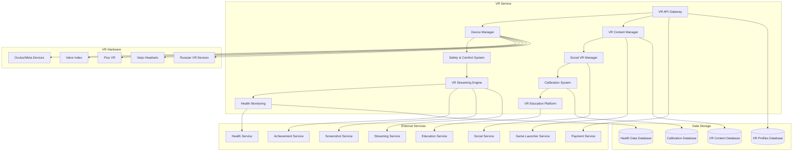

# Дизайн VR Service

## Обзор

VR Service обеспечивает комплексную поддержку виртуальной реальности на российской Steam платформе, включая интеграцию с VR-устройствами, управление VR-контентом, системы безопасности и комфорта, социальные VR-функции и образовательные возможности.

## Архитектура

### Высокоуровневая архитектура



### Компонентная архитектура

#### Device Manager
- Обнаружение и подключение VR-устройств
- Управление драйверами и совместимостью
- Мониторинг состояния устройств
- Автоматическая настройка параметров

#### VR Content Manager
- Каталогизация VR-контента
- Управление совместимостью игр
- Оптимизация настроек для VR
- Интеграция с игровыми движками

#### Safety & Comfort System
- Мониторинг безопасности игрового пространства
- Система предупреждений и границ
- Настройки комфорта и доступности
- Предотвращение VR-болезни

#### Social VR Manager
- Создание и управление VR-комнатами
- Мультиплеерные VR-сессии
- Пространственный звук и жесты
- Интеграция с социальными функциями

## Компоненты и интерфейсы

### 1. VR API Gateway

```typescript
interface VRAPIGateway {
  // Управление устройствами
  detectVRDevices(): Promise<VRDevice[]>
  connectDevice(deviceId: string): Promise<ConnectionResult>
  calibrateDevice(deviceId: string, calibrationData: CalibrationData): Promise<CalibrationResult>
  
  // VR-контент
  getVRGames(filters: VRGameFilters): Promise<VRGame[]>
  launchVRGame(gameId: string, vrSettings: VRGameSettings): Promise<LaunchResult>
  optimizeGameForVR(gameId: string, deviceSpecs: DeviceSpecs): Promise<OptimizationResult>
  
  // Социальные VR функции
  createVRRoom(roomConfig: VRRoomConfiguration): Promise<VRRoom>
  joinVRRoom(roomId: string, userId: string): Promise<JoinRoomResult>
  inviteToVRRoom(roomId: string, inviteeIds: string[]): Promise<InvitationResult>
  
  // Безопасность и комфорт
  setupPlayArea(playAreaConfig: PlayAreaConfiguration): Promise<PlayAreaResult>
  updateComfortSettings(userId: string, settings: ComfortSettings): Promise<ComfortResult>
  getHealthRecommendations(userId: string, sessionData: VRSessionData): Promise<HealthRecommendation[]>
  
  // VR-стриминг
  startVRStream(streamConfig: VRStreamConfiguration): Promise<VRStreamResult>
  recordVR360Video(recordingConfig: VR360RecordingConfig): Promise<RecordingResult>
  
  // Образование
  launchVREducationApp(appId: string, classConfig: VRClassConfiguration): Promise<EducationLaunchResult>
  createVRClassroom(classroomConfig: VRClassroomConfig): Promise<VRClassroom>
}
```

### 2. Device Manager

```typescript
interface DeviceManager {
  // Обнаружение устройств
  scanForVRDevices(): Promise<VRDeviceDetectionResult>
  identifyDevice(deviceInfo: DeviceInfo): Promise<DeviceIdentification>
  checkDeviceCompatibility(deviceId: string, gameId: string): Promise<CompatibilityCheck>
  
  // Управление подключением
  establishConnection(deviceId: string): Promise<DeviceConnection>
  maintainConnection(deviceId: string): Promise<ConnectionMaintenance>
  handleDisconnection(deviceId: string, reason: DisconnectionReason): Promise<DisconnectionHandling>
  
  // Настройка устройств
  configureDevice(deviceId: string, configuration: DeviceConfiguration): Promise<ConfigurationResult>
  updateDeviceDrivers(deviceId: string): Promise<DriverUpdateResult>
  optimizeDeviceSettings(deviceId: string, gameRequirements: GameRequirements): Promise<OptimizationResult>
  
  // Мониторинг
  monitorDeviceHealth(deviceId: string): Promise<DeviceHealthStatus>
  trackDevicePerformance(deviceId: string): Promise<PerformanceMetrics>
  detectDeviceIssues(deviceId: string): Promise<IssueDetectionResult>
  
  // Калибровка
  initiateCalibration(deviceId: string, calibrationType: CalibrationType): Promise<CalibrationSession>
  processCalibrationData(sessionId: string, calibrationData: CalibrationData): Promise<CalibrationProcessingResult>
  saveCalibrationProfile(userId: string, deviceId: string, profile: CalibrationProfile): Promise<ProfileSaveResult>
}
```

### 3. VR Content Manager

```typescript
interface VRContentManager {
  // Управление VR-каталогом
  indexVRContent(content: VRContentData[]): Promise<IndexingResult>
  categorizeVRGames(games: VRGame[]): Promise<CategorizationResult>
  validateVRCompatibility(gameId: string, vrSpecs: VRSpecifications): Promise<CompatibilityValidation>
  
  // Оптимизация контента
  analyzeVRPerformance(gameId: string, deviceSpecs: DeviceSpecs): Promise<PerformanceAnalysis>
  recommendVRSettings(gameId: string, userPreferences: UserPreferences): Promise<SettingsRecommendation>
  optimizeVRExperience(gameId: string, optimizationParams: OptimizationParams): Promise<ExperienceOptimization>
  
  // Контент-фильтрация
  filterVRContentByAge(content: VRContent[], userAge: number): Promise<FilteredContent>
  applyComfortFilters(content: VRContent[], comfortLevel: ComfortLevel): Promise<ComfortFilteredContent>
  
  // Метаданные VR
  extractVRMetadata(gameId: string): Promise<VRMetadata>
  updateVRTags(gameId: string, tags: VRTag[]): Promise<TagUpdateResult>
  generateVRPreview(gameId: string): Promise<VRPreview>
  
  // Интеграция с разработчиками
  onboardVRDeveloper(developerInfo: VRDeveloperInfo): Promise<OnboardingResult>
  validateVRSubmission(submission: VRGameSubmission): Promise<SubmissionValidation>
  publishVRContent(contentId: string, publishConfig: PublishConfiguration): Promise<PublishResult>
}
```

### 4. Safety & Comfort System

```typescript
interface SafetyComfortSystem {
  // Настройка игрового пространства
  definePlayArea(boundaries: PlayAreaBoundaries): Promise<PlayAreaDefinition>
  validatePlayAreaSafety(playArea: PlayArea): Promise<SafetyValidation>
  updateBoundaryWarnings(playArea: PlayArea, warningConfig: BoundaryWarningConfig): Promise<WarningUpdateResult>
  
  // Мониторинг безопасности
  trackPlayerMovement(userId: string, movementData: MovementData): Promise<MovementTracking>
  detectUnsafeMovement(movementData: MovementData): Promise<UnsafeMovementDetection>
  triggerSafetyAlert(alertType: SafetyAlertType, severity: AlertSeverity): Promise<SafetyAlertResult>
  
  // Система комфорта
  configureComfortSettings(userId: string, settings: ComfortSettings): Promise<ComfortConfiguration>
  adaptToMotionSickness(userId: string, symptoms: MotionSicknessSymptoms): Promise<AdaptationResult>
  applyComfortMeasures(measures: ComfortMeasure[]): Promise<ComfortApplicationResult>
  
  // Мониторинг здоровья
  trackVRSessionHealth(userId: string, sessionData: VRSessionData): Promise<HealthTracking>
  detectFatigue(userId: string, fatigueIndicators: FatigueIndicator[]): Promise<FatigueDetection>
  recommendBreaks(userId: string, sessionDuration: number): Promise<BreakRecommendation>
  
  // Доступность
  configureAccessibilityOptions(userId: string, accessibilityNeeds: AccessibilityNeeds): Promise<AccessibilityConfiguration>
  adaptControlsForDisabilities(controlAdaptations: ControlAdaptation[]): Promise<ControlAdaptationResult>
  provideAlternativeInteractions(interactionMethods: AlternativeInteraction[]): Promise<InteractionResult>
}
```

### 5. Social VR Manager

```typescript
interface SocialVRManager {
  // Управление VR-комнатами
  createVRRoom(roomConfig: VRRoomConfiguration): Promise<VRRoom>
  configureRoomSettings(roomId: string, settings: VRRoomSettings): Promise<RoomConfigurationResult>
  manageRoomAccess(roomId: string, accessControl: RoomAccessControl): Promise<AccessManagementResult>
  
  // Участники VR-сессий
  addParticipant(roomId: string, participantId: string): Promise<ParticipantAddResult>
  removeParticipant(roomId: string, participantId: string): Promise<ParticipantRemoveResult>
  updateParticipantRole(roomId: string, participantId: string, role: VRRoomRole): Promise<RoleUpdateResult>
  
  // VR-взаимодействия
  enableSpatialAudio(roomId: string, audioConfig: SpatialAudioConfig): Promise<SpatialAudioResult>
  trackGestures(userId: string, gestureData: GestureData): Promise<GestureTracking>
  synchronizeAvatars(roomId: string, avatarData: AvatarSyncData[]): Promise<AvatarSyncResult>
  
  // Кросс-платформенность
  enableNonVRParticipation(roomId: string, nonVRConfig: NonVRParticipationConfig): Promise<NonVRResult>
  bridgeVRAndDesktop(roomId: string, bridgeConfig: VRDesktopBridge): Promise<BridgeResult>
  
  // Модерация VR-пространств
  moderateVRContent(roomId: string, moderationRules: VRModerationRules): Promise<ModerationResult>
  handleVRReports(reportData: VRReportData): Promise<ReportHandlingResult>
  enforceVRCommunityGuidelines(roomId: string, guidelines: VRCommunityGuidelines): Promise<GuidelineEnforcementResult>
}
```

### 6. VR Streaming Engine

```typescript
interface VRStreamingEngine {
  // VR-стриминг
  initializeVRStream(streamConfig: VRStreamConfiguration): Promise<VRStreamInitialization>
  captureVRView(captureConfig: VRCaptureConfiguration): Promise<VRViewCapture>
  processMixedReality(mrConfig: MixedRealityConfiguration): Promise<MixedRealityProcessing>
  
  // 360-градусная запись
  start360Recording(recordingConfig: VR360RecordingConfig): Promise<VR360Recording>
  process360Video(videoData: VR360VideoData): Promise<VR360ProcessingResult>
  generate360Thumbnail(videoId: string): Promise<VR360Thumbnail>
  
  // Стриминговая оптимизация
  optimizeVRStreamQuality(streamId: string, networkConditions: NetworkConditions): Promise<StreamOptimization>
  adaptStreamForVRViewing(streamId: string, viewerVRSpecs: VRSpecs): Promise<StreamAdaptation>
  
  // Интерактивные элементы
  addVRStreamOverlays(streamId: string, overlays: VRStreamOverlay[]): Promise<OverlayResult>
  enableViewerVRInteraction(streamId: string, interactionConfig: ViewerInteractionConfig): Promise<InteractionEnablement>
  
  // Аналитика стримов
  trackVRStreamMetrics(streamId: string): Promise<VRStreamMetrics>
  analyzeVRViewerEngagement(streamId: string): Promise<VREngagementAnalysis>
  generateVRStreamReport(streamId: string, period: TimePeriod): Promise<VRStreamReport>
}
```

## Модели данных

### VR Device
```typescript
interface VRDevice {
  id: string
  manufacturer: string
  model: string
  type: VRDeviceType
  specifications: VRDeviceSpecs
  status: DeviceStatus
  connectionType: ConnectionType
  supportedFeatures: VRFeature[]
  calibrationProfile?: CalibrationProfile
  lastConnected: Date
  firmwareVersion: string
  driverVersion: string
  isRussianMade: boolean
}

enum VRDeviceType {
  HEADSET = 'headset',
  CONTROLLER = 'controller',
  TRACKER = 'tracker',
  HAPTIC_DEVICE = 'haptic_device',
  TREADMILL = 'treadmill'
}

interface VRDeviceSpecs {
  displayResolution: Resolution
  refreshRate: number[]
  fieldOfView: number
  trackingType: TrackingType
  playAreaSize: PlayAreaSize
  audioSupport: AudioSupport
  hapticFeedback: boolean
  eyeTracking: boolean
  handTracking: boolean
}

enum TrackingType {
  INSIDE_OUT = 'inside_out',
  OUTSIDE_IN = 'outside_in',
  LIGHTHOUSE = 'lighthouse',
  MIXED = 'mixed'
}
```

### VR Game
```typescript
interface VRGame {
  id: string
  title: string
  description: string
  developerId: string
  vrRequirements: VRRequirements
  supportedDevices: string[]
  vrFeatures: VRGameFeature[]
  comfortRating: ComfortRating
  playAreaRequirements: PlayAreaRequirements
  locomotionTypes: LocomotionType[]
  interactionTypes: InteractionType[]
  vrTags: VRTag[]
  ageRating: AgeRating
  isRussianDeveloped: boolean
  vrPreviewUrl?: string
  vr360TrailerUrl?: string
}

interface VRRequirements {
  minimumSpecs: VRDeviceSpecs
  recommendedSpecs: VRDeviceSpecs
  requiredFeatures: VRFeature[]
  optionalFeatures: VRFeature[]
  minimumPlayArea: PlayAreaSize
  recommendedPlayArea: PlayAreaSize
}

enum VRGameFeature {
  ROOM_SCALE = 'room_scale',
  SEATED = 'seated',
  STANDING = 'standing',
  HAND_TRACKING = 'hand_tracking',
  EYE_TRACKING = 'eye_tracking',
  HAPTIC_FEEDBACK = 'haptic_feedback',
  SPATIAL_AUDIO = 'spatial_audio',
  MULTIPLAYER_VR = 'multiplayer_vr',
  MIXED_REALITY = 'mixed_reality'
}

enum ComfortRating {
  COMFORTABLE = 'comfortable',
  MODERATE = 'moderate',
  INTENSE = 'intense'
}
```

### VR Room
```typescript
interface VRRoom {
  id: string
  name: string
  description: string
  hostId: string
  participants: VRParticipant[]
  maxParticipants: number
  roomType: VRRoomType
  settings: VRRoomSettings
  environment: VREnvironment
  activities: VRActivity[]
  createdAt: Date
  isActive: boolean
  isPrivate: boolean
  allowNonVRUsers: boolean
}

interface VRParticipant {
  userId: string
  displayName: string
  avatarId: string
  role: VRRoomRole
  deviceInfo: VRDevice
  position: VRPosition
  isVRUser: boolean
  joinedAt: Date
  lastActivity: Date
}

enum VRRoomType {
  SOCIAL = 'social',
  GAMING = 'gaming',
  EDUCATIONAL = 'educational',
  BUSINESS = 'business',
  CREATIVE = 'creative'
}

interface VRRoomSettings {
  spatialAudioEnabled: boolean
  gestureTrackingEnabled: boolean
  voiceChatEnabled: boolean
  recordingAllowed: boolean
  moderationLevel: ModerationLevel
  comfortSettings: RoomComfortSettings
}
```

### Calibration Profile
```typescript
interface CalibrationProfile {
  id: string
  userId: string
  deviceId: string
  playerHeight: number
  armSpan: number
  eyeDistance: number
  playArea: PlayAreaCalibration
  trackingOffsets: TrackingOffset[]
  comfortSettings: ComfortSettings
  accessibilitySettings: AccessibilitySettings
  createdAt: Date
  lastUpdated: Date
  isActive: boolean
}

interface PlayAreaCalibration {
  boundaries: PlayAreaBoundary[]
  center: VRPosition
  orientation: VROrientation
  safeZones: SafeZone[]
  obstacles: Obstacle[]
}

interface ComfortSettings {
  locomotionPreference: LocomotionType
  turnType: TurnType
  vignetteIntensity: number
  snapTurnAngle: number
  comfortMode: boolean
  motionSicknessReduction: boolean
  breakReminders: boolean
  breakInterval: number
}

enum LocomotionType {
  TELEPORTATION = 'teleportation',
  SMOOTH_LOCOMOTION = 'smooth_locomotion',
  ROOM_SCALE_ONLY = 'room_scale_only',
  HYBRID = 'hybrid'
}
```

### VR Session Data
```typescript
interface VRSessionData {
  id: string
  userId: string
  deviceId: string
  gameId?: string
  startTime: Date
  endTime?: Date
  duration: number
  movementData: MovementData[]
  healthMetrics: VRHealthMetrics
  comfortEvents: ComfortEvent[]
  safetyIncidents: SafetyIncident[]
  performanceMetrics: VRPerformanceMetrics
}

interface VRHealthMetrics {
  heartRateData?: HeartRateData[]
  eyeStrainIndicators: EyeStrainIndicator[]
  fatigueLevel: FatigueLevel
  motionSicknessEvents: MotionSicknessEvent[]
  breaksTaken: Break[]
  recommendedBreaks: BreakRecommendation[]
}

interface MovementData {
  timestamp: Date
  headPosition: VRPosition
  headRotation: VROrientation
  controllerPositions: VRPosition[]
  controllerRotations: VROrientation[]
  velocity: VRVelocity
  acceleration: VRAcceleration
}

interface SafetyIncident {
  id: string
  timestamp: Date
  type: SafetyIncidentType
  severity: IncidentSeverity
  description: string
  playerResponse: PlayerResponse
  systemResponse: SystemResponse
}
```

### VR Education Platform
```typescript
interface VRClassroom {
  id: string
  name: string
  instructorId: string
  students: VRStudent[]
  curriculum: VRCurriculum
  environment: VREducationEnvironment
  tools: VREducationTool[]
  session: VRClassSession
  settings: VRClassroomSettings
}

interface VRCurriculum {
  id: string
  title: string
  description: string
  lessons: VRLesson[]
  assessments: VRAssessment[]
  prerequisites: string[]
  learningObjectives: LearningObjective[]
  vrRequirements: VRRequirements
}

interface VRLesson {
  id: string
  title: string
  content: VRLessonContent
  interactiveElements: VRInteractiveElement[]
  duration: number
  vrActivities: VRActivity[]
  assessmentCriteria: AssessmentCriteria[]
}
```

## Обработка ошибок

### Error Handling Strategy

```typescript
interface VRError {
  code: VRErrorCode
  message: string
  deviceId?: string
  userId?: string
  sessionId?: string
  details?: any
  timestamp: Date
}

enum VRErrorCode {
  // Устройства
  DEVICE_NOT_FOUND = 'DEVICE_NOT_FOUND',
  DEVICE_CONNECTION_FAILED = 'DEVICE_CONNECTION_FAILED',
  DEVICE_CALIBRATION_FAILED = 'DEVICE_CALIBRATION_FAILED',
  UNSUPPORTED_DEVICE = 'UNSUPPORTED_DEVICE',
  
  // Производительность
  INSUFFICIENT_PERFORMANCE = 'INSUFFICIENT_PERFORMANCE',
  FRAME_RATE_TOO_LOW = 'FRAME_RATE_TOO_LOW',
  TRACKING_LOST = 'TRACKING_LOST',
  
  // Безопасность
  PLAY_AREA_TOO_SMALL = 'PLAY_AREA_TOO_SMALL',
  BOUNDARY_VIOLATION = 'BOUNDARY_VIOLATION',
  UNSAFE_MOVEMENT_DETECTED = 'UNSAFE_MOVEMENT_DETECTED',
  
  // Комфорт
  MOTION_SICKNESS_DETECTED = 'MOTION_SICKNESS_DETECTED',
  EXCESSIVE_SESSION_TIME = 'EXCESSIVE_SESSION_TIME',
  EYE_STRAIN_WARNING = 'EYE_STRAIN_WARNING',
  
  // Контент
  VR_CONTENT_NOT_COMPATIBLE = 'VR_CONTENT_NOT_COMPATIBLE',
  VR_GAME_LAUNCH_FAILED = 'VR_GAME_LAUNCH_FAILED',
  VR_STREAMING_FAILED = 'VR_STREAMING_FAILED'
}
```

### Recovery Mechanisms
- Автоматическое переподключение VR-устройств
- Адаптивное снижение качества при проблемах с производительностью
- Автоматическая активация режима комфорта при обнаружении дискомфорта
- Система резервного копирования калибровочных данных

## Стратегия тестирования

### Unit Tests
- Тестирование алгоритмов калибровки устройств
- Проверка систем безопасности и комфорта
- Тестирование VR-контент менеджера
- Валидация социальных VR-функций

### Integration Tests
- Тестирование интеграции с различными VR-устройствами
- Проверка взаимодействия с игровыми движками
- Тестирование стриминговых функций
- Проверка образовательных VR-приложений

### VR-Specific Tests
- Тестирование в реальных VR-условиях
- Проверка комфорта и безопасности
- Тестирование производительности в VR
- Валидация пользовательского опыта

### Performance Tests
- Нагрузочное тестирование VR-рендеринга
- Тестирование латентности трекинга
- Проверка стабильности 90+ FPS
- Стресс-тестирование мультиплеерных VR-сессий

## Безопасность

### Physical Safety
- Мониторинг игрового пространства
- Система предупреждений о препятствиях
- Автоматическое отключение при опасности
- Рекомендации по безопасному использованию

### Health Protection
- Мониторинг признаков VR-болезни
- Автоматические перерывы для отдыха
- Защита зрения и предотвращение усталости
- Интеграция с медицинскими рекомендациями

### Data Security
- Защита биометрических данных
- Шифрование данных трекинга
- Соблюдение приватности в VR-пространствах
- Безопасное хранение калибровочных профилей

## Производительность и масштабируемость

### VR Performance Optimization
- Поддержание стабильных 90+ FPS
- Адаптивное качество рендеринга
- Оптимизация латентности трекинга
- Предиктивное кэширование VR-контента

### Scalability
- Горизонтальное масштабирование VR-серверов
- Распределенная обработка VR-данных
- Кэширование калибровочных профилей
- Оптимизация сетевого трафика для VR

### Hardware Optimization
- Автоматическая настройка под конкретные устройства
- Оптимизация для российских VR-устройств
- Поддержка legacy VR-оборудования
- Интеграция с новейшими VR-технологиями

## Соответствие российским требованиям

### Legal Compliance
- Соблюдение российских стандартов безопасности VR
- Интеграция с российскими медицинскими рекомендациями
- Соответствие требованиям по защите детей в VR
- Ведение документооборота согласно российским стандартам

### Local VR Ecosystem
- Поддержка российских VR-устройств
- Интеграция с российскими VR-разработчиками
- Льготные условия для российского VR-контента
- Поддержка российских образовательных VR-программ

### Cultural Adaptation
- Русскоязычные VR-интерфейсы
- Адаптация под российские культурные особенности
- Поддержка российских праздников в VR-контенте
- Интеграция с российскими социальными VR-платформами