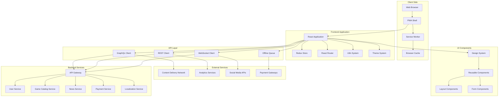
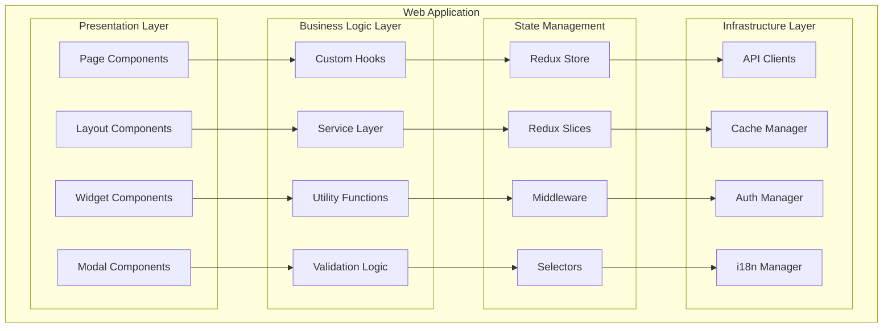

# Дизайн Web Application

## Обзор

Web Application - это основной веб-интерфейс российской Steam-платформы, построенный как современное Progressive Web Application (PWA). Приложение обеспечивает полнофункциональный доступ ко всем возможностям платформы через браузер, с поддержкой офлайн-режима, российской локализации и соответствием стандартам доступности.

## Архитектура

### Высокоуровневая архитектура



### Компонентная архитектура



## Компоненты и интерфейсы

### 1. Application Shell
**Назначение:** Основная оболочка PWA приложения

**Интерфейсы:**
```typescript
interface AppShell {
  initialize(): Promise<void>
  registerServiceWorker(): Promise<ServiceWorkerRegistration>
  handleOfflineMode(): void
  updateAvailable(): Promise<boolean>
  installUpdate(): Promise<void>
}

interface PWAConfig {
  name: string
  shortName: string
  description: string
  themeColor: string
  backgroundColor: string
  display: DisplayMode
  orientation: OrientationType
  icons: PWAIcon[]
  startUrl: string
  scope: string
}

interface ServiceWorkerManager {
  register(): Promise<ServiceWorkerRegistration>
  update(): Promise<void>
  skipWaiting(): Promise<void>
  getCacheStatus(): Promise<CacheStatus>
  clearCache(): Promise<void>
}
```

### 2. State Management
**Назначение:** Централизованное управление состоянием приложения

**Интерфейсы:**
```typescript
interface AppState {
  user: UserState
  games: GamesState
  library: LibraryState
  cart: CartState
  ui: UIState
  offline: OfflineState
}

interface UserState {
  profile: UserProfile | null
  isAuthenticated: boolean
  preferences: UserPreferences
  subscriptions: Subscription[]
  achievements: Achievement[]
}

interface GamesState {
  catalog: Game[]
  featured: Game[]
  trending: Game[]
  filters: GameFilters
  searchResults: SearchResult[]
  loading: boolean
  error: string | null
}

interface UIState {
  theme: ThemeMode
  language: string
  sidebarOpen: boolean
  notifications: Notification[]
  modals: ModalState[]
  loading: LoadingState
}
```

### 3. Component System
**Назначение:** Переиспользуемая система UI компонентов

**Интерфейсы:**
```typescript
interface DesignSystem {
  colors: ColorPalette
  typography: Typography
  spacing: SpacingScale
  breakpoints: Breakpoints
  shadows: ShadowScale
  animations: AnimationConfig
}

interface ComponentProps {
  className?: string
  children?: React.ReactNode
  testId?: string
  variant?: ComponentVariant
  size?: ComponentSize
  disabled?: boolean
}

interface GameCard extends ComponentProps {
  game: Game
  onAddToCart: (gameId: string) => void
  onAddToWishlist: (gameId: string) => void
  showPrice: boolean
  showDiscount: boolean
}

interface UserProfile extends ComponentProps {
  user: User
  editable: boolean
  onUpdate: (updates: Partial<User>) => void
  onAvatarChange: (avatar: File) => void
}
```

### 4. API Integration
**Назначение:** Интеграция с backend микросервисами

**Интерфейсы:**
```typescript
interface APIClient {
  get<T>(endpoint: string, params?: QueryParams): Promise<APIResponse<T>>
  post<T>(endpoint: string, data: any): Promise<APIResponse<T>>
  put<T>(endpoint: string, data: any): Promise<APIResponse<T>>
  delete<T>(endpoint: string): Promise<APIResponse<T>>
  upload(endpoint: string, file: File, onProgress?: ProgressCallback): Promise<UploadResponse>
}

interface GraphQLClient {
  query<T>(query: DocumentNode, variables?: Variables): Promise<T>
  mutate<T>(mutation: DocumentNode, variables?: Variables): Promise<T>
  subscribe<T>(subscription: DocumentNode, variables?: Variables): Observable<T>
}

interface WebSocketClient {
  connect(url: string): Promise<void>
  disconnect(): void
  send(message: WebSocketMessage): void
  subscribe(channel: string, callback: MessageCallback): Subscription
  unsubscribe(subscription: Subscription): void
}
```

### 5. Offline Manager
**Назначение:** Управление офлайн-функциональностью

**Интерфейсы:**
```typescript
interface OfflineManager {
  isOnline(): boolean
  syncWhenOnline(): Promise<void>
  queueAction(action: OfflineAction): void
  getCachedData<T>(key: string): Promise<T | null>
  setCachedData<T>(key: string, data: T, ttl?: number): Promise<void>
  clearExpiredCache(): Promise<void>
}

interface OfflineAction {
  id: string
  type: ActionType
  payload: any
  timestamp: Date
  retryCount: number
  maxRetries: number
}

interface CacheStrategy {
  name: string
  match: (request: Request) => boolean
  handler: (request: Request) => Promise<Response>
  options: CacheOptions
}
```

### 6. Localization Manager
**Назначение:** Управление многоязычностью и локализацией

**Интерфейсы:**
```typescript
interface LocalizationManager {
  getCurrentLanguage(): string
  setLanguage(language: string): Promise<void>
  translate(key: string, params?: TranslationParams): string
  formatCurrency(amount: number, currency?: string): string
  formatDate(date: Date, format?: DateFormat): string
  formatNumber(number: number, options?: NumberFormatOptions): string
}

interface TranslationResource {
  language: string
  namespace: string
  translations: Record<string, string>
  pluralRules?: PluralRule[]
}

interface RegionalSettings {
  language: string
  region: string
  currency: string
  dateFormat: string
  timeFormat: string
  numberFormat: NumberFormat
}
```

## Технологический стек

### Кросс-платформенная архитектура
- **Next.js 14+** для веб-платформы (SSR, SEO, производительность)
- **React Native 0.72+** для мобильных приложений (iOS/Android)
- **Tauri 1.5+** для десктопных приложений (Windows/Linux/macOS)
- **TypeScript** для type safety на всех платформах

### Общие технологии (Shared)
- **React 18** с Concurrent Features
- **Zustand** для легковесного state management
- **TanStack Query** для API кэширования и синхронизации
- **Socket.IO** для real-time функций
- **React Hook Form** для управления формами

### Веб-специфичные технологии (Next.js)
- **Next.js App Router** для файловой маршрутизации
- **Tailwind CSS** для быстрой стилизации
- **Framer Motion** для анимаций
- **next-pwa** для Progressive Web App функций
- **React Helmet Next** для SEO оптимизации

### Мобильные технологии (React Native)
- **Expo SDK 49+** для быстрой разработки
- **React Navigation 6** для навигации
- **NativeWind** (Tailwind для React Native)
- **React Native Reanimated 3** для производительных анимаций
- **React Native Gesture Handler** для жестов

### Десктопные технологии (Tauri)
- **Tauri** с Rust backend для производительности
- **React** frontend с веб-технологиями
- **Tauri API** для системных интеграций
- **Auto-updater** для обновлений приложения

### Общие инструменты разработки
- **Vite** для быстрой разработки (где применимо)
- **Metro** bundler для React Native
- **ESLint + Prettier** для качества кода
- **Husky** для git hooks

## Модели данных

### User Interface State
```typescript
interface UIState {
  theme: {
    mode: 'light' | 'dark' | 'auto'
    primaryColor: string
    customizations: ThemeCustomization[]
  }
  layout: {
    sidebarCollapsed: boolean
    gridView: boolean
    density: 'compact' | 'comfortable' | 'spacious'
  }
  preferences: {
    language: string
    region: string
    notifications: NotificationSettings
    privacy: PrivacySettings
  }
}
```

### Game Data Models
```typescript
interface Game {
  id: string
  title: string
  description: string
  shortDescription: string
  developer: Developer
  publisher: Publisher
  releaseDate: Date
  price: Price
  discount?: Discount
  media: GameMedia
  tags: string[]
  categories: Category[]
  systemRequirements: SystemRequirements
  ageRating: AgeRating
  localization: GameLocalization
}

interface GameMedia {
  headerImage: string
  screenshots: Screenshot[]
  videos: Video[]
  logo: string
  background: string
}
```

### User Data Models
```typescript
interface UserProfile {
  id: string
  username: string
  displayName: string
  avatar: string
  level: number
  experience: number
  joinDate: Date
  lastSeen: Date
  status: UserStatus
  privacy: PrivacySettings
  preferences: UserPreferences
}

interface UserLibrary {
  games: LibraryGame[]
  categories: LibraryCategory[]
  totalGames: number
  totalPlaytime: number
  recentlyPlayed: LibraryGame[]
  favorites: string[]
}
```

## Responsive Design

### Breakpoint System
```scss
$breakpoints: (
  mobile: 320px,
  tablet: 768px,
  desktop: 1024px,
  wide: 1440px,
  ultrawide: 1920px
);

// Mobile First Approach
@mixin mobile {
  @media (max-width: 767px) { @content; }
}

@mixin tablet {
  @media (min-width: 768px) and (max-width: 1023px) { @content; }
}

@mixin desktop {
  @media (min-width: 1024px) { @content; }
}
```

### Layout Adaptations
- **Mobile**: Single column, bottom navigation, swipe gestures
- **Tablet**: Two column grid, side navigation, touch-optimized
- **Desktop**: Multi-column layout, hover states, keyboard shortcuts
- **Wide/Ultrawide**: Expanded content areas, additional sidebars

## Performance Optimization

### Code Splitting Strategy
```typescript
// Route-based splitting
const HomePage = lazy(() => import('./pages/HomePage'))
const GamePage = lazy(() => import('./pages/GamePage'))
const LibraryPage = lazy(() => import('./pages/LibraryPage'))

// Component-based splitting
const GameDetails = lazy(() => import('./components/GameDetails'))
const UserProfile = lazy(() => import('./components/UserProfile'))

// Feature-based splitting
const AdminPanel = lazy(() => import('./features/admin'))
const DeveloperTools = lazy(() => import('./features/developer'))
```

### Caching Strategy
```typescript
interface CacheConfig {
  static: {
    strategy: 'CacheFirst'
    maxAge: '1y'
    resources: ['images', 'fonts', 'icons']
  }
  api: {
    strategy: 'NetworkFirst'
    maxAge: '5m'
    resources: ['games', 'user-data']
  }
  dynamic: {
    strategy: 'StaleWhileRevalidate'
    maxAge: '1h'
    resources: ['news', 'reviews']
  }
}
```

## Безопасность

### Content Security Policy
```typescript
const cspConfig = {
  defaultSrc: ["'self'"],
  scriptSrc: ["'self'", "'unsafe-inline'", "https://trusted-cdn.com"],
  styleSrc: ["'self'", "'unsafe-inline'", "https://fonts.googleapis.com"],
  imgSrc: ["'self'", "data:", "https:", "blob:"],
  connectSrc: ["'self'", "wss:", "https://api.platform.ru"],
  fontSrc: ["'self'", "https://fonts.gstatic.com"],
  mediaSrc: ["'self'", "https://media.platform.ru"]
}
```

### Authentication & Authorization
```typescript
interface AuthManager {
  login(credentials: LoginCredentials): Promise<AuthResult>
  logout(): Promise<void>
  refreshToken(): Promise<string>
  getCurrentUser(): User | null
  hasPermission(permission: Permission): boolean
  isTokenValid(): boolean
}

interface SecurityHeaders {
  'Strict-Transport-Security': string
  'X-Content-Type-Options': 'nosniff'
  'X-Frame-Options': 'DENY'
  'X-XSS-Protection': '1; mode=block'
  'Referrer-Policy': 'strict-origin-when-cross-origin'
}
```

## Accessibility (A11y)

### WCAG 2.1 Compliance
```typescript
interface AccessibilityFeatures {
  keyboardNavigation: boolean
  screenReaderSupport: boolean
  highContrastMode: boolean
  reducedMotion: boolean
  focusManagement: boolean
  ariaLabels: boolean
}

interface A11yConfig {
  announcements: boolean
  skipLinks: boolean
  focusTrapping: boolean
  colorContrastRatio: number
  minimumTouchTarget: number
  alternativeText: boolean
}
```

### Russian Accessibility Standards
- Соответствие ГОСТ Р 52872-2019
- Поддержка российских screen readers
- Русскоязычные ARIA метки
- Адаптация под российские стандарты

## SEO Optimization

### Meta Tags Management
```typescript
interface SEOManager {
  setTitle(title: string): void
  setDescription(description: string): void
  setKeywords(keywords: string[]): void
  setCanonicalUrl(url: string): void
  setOpenGraphTags(tags: OpenGraphTags): void
  setStructuredData(data: StructuredData): void
}

interface OpenGraphTags {
  title: string
  description: string
  image: string
  url: string
  type: 'website' | 'article' | 'product'
  siteName: string
  locale: string
}
```

### Server-Side Rendering
```typescript
interface SSRConfig {
  routes: SSRRoute[]
  preloadData: boolean
  cacheStrategy: 'static' | 'dynamic' | 'hybrid'
  fallback: 'spa' | 'static'
}

interface SSRRoute {
  path: string
  component: React.ComponentType
  preload: () => Promise<any>
  meta: RouteMeta
}
```

## Testing Strategy

### Testing Pyramid
```typescript
// Unit Tests (70%)
describe('GameCard Component', () => {
  it('should display game title', () => {
    render(<GameCard game={mockGame} />)
    expect(screen.getByText(mockGame.title)).toBeInTheDocument()
  })
})

// Integration Tests (20%)
describe('Game Purchase Flow', () => {
  it('should complete purchase successfully', async () => {
    // Test integration between components
  })
})

// E2E Tests (10%)
describe('User Journey', () => {
  it('should allow user to browse and purchase game', () => {
    // Full user journey test
  })
})
```

### Testing Tools
- **Jest** для unit тестов
- **React Testing Library** для component тестов
- **Cypress** для E2E тестов
- **Storybook** для visual testing
- **Lighthouse CI** для performance тестов

## Deployment & DevOps

### Build Configuration
```typescript
interface BuildConfig {
  target: 'development' | 'staging' | 'production'
  optimization: {
    minify: boolean
    treeshaking: boolean
    codesplitting: boolean
    compression: boolean
  }
  features: {
    pwa: boolean
    ssr: boolean
    analytics: boolean
    monitoring: boolean
  }
}
```

### CI/CD Pipeline
```yaml
stages:
  - lint
  - test
  - build
  - security-scan
  - deploy
  - smoke-test

deploy:
  script:
    - docker build -t web-app:$CI_COMMIT_SHA .
    - docker push registry/web-app:$CI_COMMIT_SHA
    - kubectl set image deployment/web-app web-app=registry/web-app:$CI_COMMIT_SHA
```

## Мониторинг и аналитика

### Performance Monitoring
```typescript
interface PerformanceMetrics {
  coreWebVitals: {
    LCP: number // Largest Contentful Paint
    FID: number // First Input Delay
    CLS: number // Cumulative Layout Shift
  }
  customMetrics: {
    timeToInteractive: number
    firstMeaningfulPaint: number
    totalBlockingTime: number
  }
}
```

### User Analytics
```typescript
interface AnalyticsManager {
  trackPageView(page: string): void
  trackEvent(event: AnalyticsEvent): void
  trackUserAction(action: UserAction): void
  trackPerformance(metrics: PerformanceMetrics): void
  setUserProperties(properties: UserProperties): void
}
```

## Интеграция с микросервисами

### API Integration Patterns
```typescript
interface ServiceIntegration {
  userService: UserServiceClient
  gameService: GameServiceClient
  paymentService: PaymentServiceClient
  newsService: NewsServiceClient
  localizationService: LocalizationServiceClient
}

interface ServiceClient {
  baseURL: string
  timeout: number
  retryConfig: RetryConfig
  cacheConfig: CacheConfig
  errorHandler: ErrorHandler
}
```

### Real-time Updates
```typescript
interface WebSocketManager {
  subscribeToUserUpdates(userId: string): Subscription
  subscribeToGameUpdates(gameId: string): Subscription
  subscribeToNewsUpdates(): Subscription
  subscribeToNotifications(userId: string): Subscription
}
```