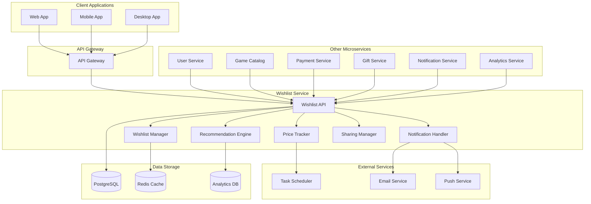
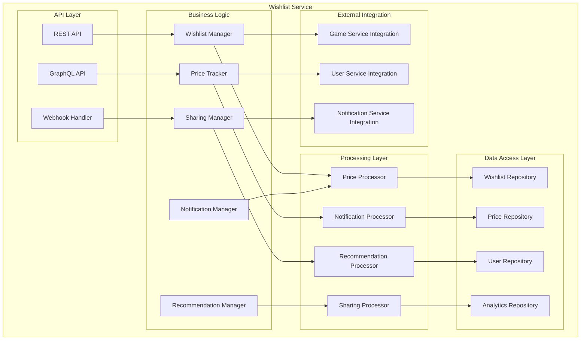

# Дизайн Wishlist Service

## Обзор

Wishlist Service - это микросервис для управления списками желаемых игр пользователей российской Steam-платформы. Сервис обеспечивает отслеживание цен, уведомления о скидках, социальные функции для подарков и интеграцию с системой рекомендаций.

## Архитектура

### Высокоуровневая архитектура



### Компонентная архитектура



## Компоненты и интерфейсы

### 1. Wishlist Manager
**Назначение:** Центральный компонент для управления списками желаний

**Интерфейсы:**
```typescript
interface WishlistManager {
  addToWishlist(userId: string, gameId: string): Promise<WishlistItem>
  removeFromWishlist(userId: string, gameId: string): Promise<void>
  getUserWishlist(userId: string, filters?: WishlistFilters): Promise<Wishlist>
  updateWishlistItem(userId: string, gameId: string, updates: WishlistItemUpdate): Promise<WishlistItem>
  getWishlistStats(userId: string): Promise<WishlistStats>
  bulkUpdateWishlist(userId: string, operations: WishlistOperation[]): Promise<BulkUpdateResult>
}

interface WishlistItem {
  id: string
  userId: string
  gameId: string
  addedAt: Date
  priority: WishlistPriority
  priceAlert: PriceAlert
  notes: string
  tags: string[]
  isPublic: boolean
  giftable: boolean
}

interface Wishlist {
  userId: string
  items: WishlistItem[]
  totalItems: number
  totalValue: number
  averageDiscount: number
  lastUpdated: Date
  isPublic: boolean
  shareUrl?: string
}

enum WishlistPriority {
  LOW = 'low',
  MEDIUM = 'medium',
  HIGH = 'high',
  URGENT = 'urgent'
}
```

### 2. Price Tracker
**Назначение:** Отслеживание изменений цен и уведомления о скидках

**Интерфейсы:**
```typescript
interface PriceTracker {
  trackPrice(gameId: string): Promise<PriceHistory>
  checkPriceChanges(): Promise<PriceChangeResult[]>
  setPriceAlert(userId: string, gameId: string, alert: PriceAlert): Promise<void>
  getPriceHistory(gameId: string, period: TimePeriod): Promise<PriceHistory>
  predictPriceChange(gameId: string): Promise<PricePrediction>
}

interface PriceAlert {
  id: string
  userId: string
  gameId: string
  targetPrice: number
  discountThreshold: number
  alertType: AlertType
  isActive: boolean
  createdAt: Date
  triggeredAt?: Date
}

interface PriceHistory {
  gameId: string
  prices: PricePoint[]
  currentPrice: number
  lowestPrice: number
  highestPrice: number
  averagePrice: number
  priceVolatility: number
}

interface PricePoint {
  price: number
  discount: number
  timestamp: Date
  source: PriceSource
  currency: string
}

enum AlertType {
  PRICE_DROP = 'price_drop',
  DISCOUNT_THRESHOLD = 'discount_threshold',
  FREE_GAME = 'free_game',
  SALE_EVENT = 'sale_event'
}
```

### 3. Sharing Manager
**Назначение:** Управление публичными списками и подарками

**Интерфейсы:**
```typescript
interface SharingManager {
  makeWishlistPublic(userId: string, settings: SharingSettings): Promise<PublicWishlist>
  makeWishlistPrivate(userId: string): Promise<void>
  getPublicWishlist(shareUrl: string): Promise<PublicWishlist>
  generateShareUrl(userId: string): Promise<string>
  getWishlistGifters(userId: string): Promise<GiftHistory[]>
  enableGifting(userId: string, gameId: string): Promise<void>
}

interface PublicWishlist {
  shareUrl: string
  ownerUsername: string
  ownerAvatar: string
  items: PublicWishlistItem[]
  settings: SharingSettings
  stats: WishlistStats
  lastUpdated: Date
}

interface PublicWishlistItem {
  gameId: string
  gameTitle: string
  gameImage: string
  currentPrice: number
  discount: number
  priority: WishlistPriority
  addedAt: Date
  giftable: boolean
  alreadyGifted: boolean
}

interface SharingSettings {
  isPublic: boolean
  allowGifts: boolean
  showPriorities: boolean
  showNotes: boolean
  allowComments: boolean
  restrictToFriends: boolean
}
```

### 4. Recommendation Engine
**Назначение:** Генерация рекомендаций на основе списков желаний

**Интерфейсы:**
```typescript
interface RecommendationEngine {
  getWishlistRecommendations(userId: string): Promise<GameRecommendation[]>
  getSimilarUsers(userId: string): Promise<SimilarUser[]>
  getTrendingWishlistGames(): Promise<TrendingGame[]>
  getPersonalizedDeals(userId: string): Promise<PersonalizedDeal[]>
  updateUserPreferences(userId: string, preferences: UserPreferences): Promise<void>
}

interface GameRecommendation {
  gameId: string
  score: number
  reason: RecommendationReason
  confidence: number
  similarGames: string[]
  usersThatAlsoWishlisted: number
  averageRating: number
  tags: string[]
}

interface SimilarUser {
  userId: string
  username: string
  similarityScore: number
  commonGames: string[]
  recommendedGames: string[]
}

interface TrendingGame {
  gameId: string
  wishlistAdditions: number
  growthRate: number
  timeframe: string
  categories: string[]
}

enum RecommendationReason {
  SIMILAR_GAMES = 'similar_games',
  SAME_DEVELOPER = 'same_developer',
  SAME_GENRE = 'same_genre',
  FRIENDS_WISHLISTED = 'friends_wishlisted',
  TRENDING = 'trending',
  ON_SALE = 'on_sale'
}
```

### 5. Notification Manager
**Назначение:** Управление уведомлениями о ценах и событиях

**Интерфейсы:**
```typescript
interface NotificationManager {
  sendPriceAlert(userId: string, alert: PriceAlert): Promise<void>
  sendWishlistDigest(userId: string): Promise<void>
  sendGiftNotification(userId: string, gift: GiftNotification): Promise<void>
  scheduleNotifications(): Promise<ScheduledNotification[]>
  getUserNotificationPreferences(userId: string): Promise<NotificationPreferences>
}

interface PriceAlertNotification {
  userId: string
  gameId: string
  gameTitle: string
  oldPrice: number
  newPrice: number
  discount: number
  alertType: AlertType
  urgency: NotificationUrgency
}

interface NotificationPreferences {
  priceAlerts: boolean
  weeklyDigest: boolean
  giftNotifications: boolean
  trendingGames: boolean
  friendActivity: boolean
  channels: NotificationChannel[]
}

enum NotificationUrgency {
  LOW = 'low',
  MEDIUM = 'medium',
  HIGH = 'high',
  CRITICAL = 'critical'
}

enum NotificationChannel {
  EMAIL = 'email',
  PUSH = 'push',
  SMS = 'sms',
  IN_APP = 'in_app'
}
```

## Модели данных

### Wishlist Schema
```sql
CREATE TABLE wishlists (
    id UUID PRIMARY KEY DEFAULT gen_random_uuid(),
    user_id UUID REFERENCES users(id) ON DELETE CASCADE,
    is_public BOOLEAN DEFAULT FALSE,
    share_url VARCHAR(100) UNIQUE,
    allow_gifts BOOLEAN DEFAULT TRUE,
    show_priorities BOOLEAN DEFAULT TRUE,
    show_notes BOOLEAN DEFAULT FALSE,
    created_at TIMESTAMP DEFAULT NOW(),
    updated_at TIMESTAMP DEFAULT NOW(),
    
    UNIQUE(user_id)
);

CREATE INDEX idx_wishlists_user_id ON wishlists(user_id);
CREATE INDEX idx_wishlists_share_url ON wishlists(share_url);
```

### Wishlist Items Schema
```sql
CREATE TABLE wishlist_items (
    id UUID PRIMARY KEY DEFAULT gen_random_uuid(),
    wishlist_id UUID REFERENCES wishlists(id) ON DELETE CASCADE,
    game_id UUID NOT NULL,
    priority wishlist_priority DEFAULT 'medium',
    notes TEXT,
    tags TEXT[],
    price_when_added DECIMAL(10,2),
    is_giftable BOOLEAN DEFAULT TRUE,
    added_at TIMESTAMP DEFAULT NOW(),
    
    UNIQUE(wishlist_id, game_id)
);

CREATE INDEX idx_wishlist_items_wishlist_id ON wishlist_items(wishlist_id);
CREATE INDEX idx_wishlist_items_game_id ON wishlist_items(game_id);
CREATE INDEX idx_wishlist_items_priority ON wishlist_items(priority);
```

### Price Alerts Schema
```sql
CREATE TABLE price_alerts (
    id UUID PRIMARY KEY DEFAULT gen_random_uuid(),
    user_id UUID REFERENCES users(id) ON DELETE CASCADE,
    game_id UUID NOT NULL,
    target_price DECIMAL(10,2),
    discount_threshold INTEGER CHECK (discount_threshold >= 0 AND discount_threshold <= 100),
    alert_type alert_type NOT NULL,
    is_active BOOLEAN DEFAULT TRUE,
    created_at TIMESTAMP DEFAULT NOW(),
    triggered_at TIMESTAMP,
    
    UNIQUE(user_id, game_id, alert_type)
);

CREATE INDEX idx_price_alerts_user_id ON price_alerts(user_id);
CREATE INDEX idx_price_alerts_game_id ON price_alerts(game_id);
CREATE INDEX idx_price_alerts_active ON price_alerts(is_active);
```

### Price History Schema
```sql
CREATE TABLE price_history (
    id UUID PRIMARY KEY DEFAULT gen_random_uuid(),
    game_id UUID NOT NULL,
    price DECIMAL(10,2) NOT NULL,
    discount INTEGER DEFAULT 0,
    currency VARCHAR(3) DEFAULT 'RUB',
    source price_source DEFAULT 'platform',
    recorded_at TIMESTAMP DEFAULT NOW(),
    
    CONSTRAINT valid_discount CHECK (discount >= 0 AND discount <= 100)
);

CREATE INDEX idx_price_history_game_id ON price_history(game_id);
CREATE INDEX idx_price_history_recorded_at ON price_history(recorded_at DESC);
CREATE INDEX idx_price_history_game_date ON price_history(game_id, recorded_at DESC);
```

## Обработка ошибок

### Стратегия обработки ошибок
1. **Graceful Degradation**: При недоступности внешних сервисов использование кэшированных данных
2. **Retry Logic**: Экспоненциальная задержка для временных сбоев
3. **Circuit Breaker**: Защита от каскадных сбоев
4. **Fallback Mechanisms**: Альтернативные источники данных о ценах

### Типы ошибок
```typescript
enum WishlistErrorType {
  GAME_NOT_FOUND = 'GAME_NOT_FOUND',
  WISHLIST_FULL = 'WISHLIST_FULL',
  DUPLICATE_ITEM = 'DUPLICATE_ITEM',
  PRICE_SERVICE_UNAVAILABLE = 'PRICE_SERVICE_UNAVAILABLE',
  NOTIFICATION_FAILED = 'NOTIFICATION_FAILED',
  SHARING_DISABLED = 'SHARING_DISABLED',
  INVALID_PRICE_ALERT = 'INVALID_PRICE_ALERT'
}

interface WishlistError {
  type: WishlistErrorType
  message: string
  details?: any
  retryable: boolean
}
```

## Стратегия тестирования

### Unit Tests
- Тестирование бизнес-логики компонентов
- Валидация алгоритмов отслеживания цен
- Проверка логики рекомендаций
- Тестирование уведомлений

### Integration Tests
- Интеграция с Game Catalog Service
- Взаимодействие с User Service
- Тестирование Notification Service
- Проверка Gift Service интеграции

### Performance Tests
- Нагрузочное тестирование API (2,000 RPS)
- Тестирование времени отклика (<50ms)
- Проверка производительности price tracking
- Memory usage профилирование

### E2E Tests
- Полный цикл добавления игры в wishlist
- Тестирование price alerts
- Проверка sharing функциональности
- Интеграция с клиентскими приложениями

## Безопасность

### Аутентификация и авторизация
- JWT токены для API доступа
- Проверка владельца wishlist
- Rate limiting для предотвращения спама
- Валидация публичных ссылок

### Защита данных
- Шифрование чувствительных предпочтений
- Валидация входных данных
- Защита от SQL injection
- Secure sharing URLs

## Мониторинг и метрики

### Ключевые метрики
- Wishlist conversion rate (>5%)
- Price alert accuracy (>95%)
- API response time (<50ms)
- Notification delivery rate (>98%)
- User engagement with recommendations

### Алерты
- High error rate (>1%)
- Slow price tracking updates
- Failed notifications
- Database connection issues
- External service failures

### Дашборды
- Real-time wishlist activity
- Price tracking effectiveness
- Recommendation performance
- User engagement metrics
- System health monitoring

## Развертывание и масштабирование

### Containerization
```dockerfile
FROM node:18-alpine
WORKDIR /app
COPY package*.json ./
RUN npm ci --only=production
COPY . .
EXPOSE 3000
CMD ["npm", "start"]
```

### Kubernetes Configuration
```yaml
apiVersion: apps/v1
kind: Deployment
metadata:
  name: wishlist-service
spec:
  replicas: 3
  selector:
    matchLabels:
      app: wishlist-service
  template:
    metadata:
      labels:
        app: wishlist-service
    spec:
      containers:
      - name: wishlist-service
        image: wishlist-service:latest
        ports:
        - containerPort: 3000
        env:
        - name: DATABASE_URL
          valueFrom:
            secretKeyRef:
              name: db-secret
              key: url
        - name: REDIS_URL
          valueFrom:
            secretKeyRef:
              name: redis-secret
              key: url
        resources:
          requests:
            memory: "256Mi"
            cpu: "250m"
          limits:
            memory: "512Mi"
            cpu: "500m"
```

### Масштабирование
- Horizontal Pod Autoscaler на основе CPU/Memory
- Redis для кэширования популярных wishlist
- Read replicas для аналитических запросов
- Background jobs для price tracking

## Интеграция с другими сервисами

### Game Catalog Service
- Получение информации об играх
- Отслеживание изменений цен
- Валидация существования игр

### User Service
- Проверка аутентификации
- Получение пользовательских предпочтений
- Управление друзьями для рекомендаций

### Gift Service
- Интеграция процесса дарения
- Уведомления о подарках
- Удаление подаренных игр из wishlist

### Notification Service
- Отправка price alerts
- Weekly digest уведомления
- Push-уведомления о скидках

### Analytics Service
- Сбор метрик использования
- Анализ трендов wishlist
- Данные для рекомендательной системы