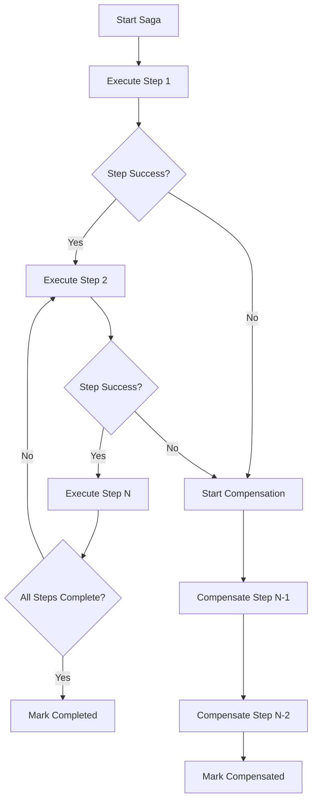

# Saga Pattern Implementation

## Overview

This document describes the implementation of the Saga pattern in the Auth Service to ensure transactional consistency across distributed operations. The Saga pattern provides a way to manage distributed transactions by breaking them into a series of compensatable steps.

## Architecture

### Core Components

1. **SagaService** - Core saga orchestration engine
2. **AuthSagaService** - Authentication-specific saga implementations
3. **SagaController** - REST API for saga monitoring and management
4. **Redis Storage** - Distributed saga state storage with TTL

### Saga Transaction Flow



## Registration Saga

### Steps

1. **validateUserDoesNotExist**
   - Check if user already exists
   - Compensation: No action needed

2. **hashPassword**
   - Hash the user's password
   - Compensation: Clear hashed password from memory

3. **createUser**
   - Create user in User Service
   - Compensation: Mark user as deleted (soft delete)

4. **generateTokens**
   - Generate JWT access and refresh tokens
   - Compensation: Blacklist generated tokens

5. **createSession**
   - Create session in Auth Service database
   - Compensation: Invalidate created session

6. **publishRegistrationEvents**
   - Publish user registration events
   - Compensation: Publish registration cancellation event

### Example Usage

```typescript
const sagaId = await authSagaService.executeRegistrationSaga(
  registerDto,
  ipAddress,
  userAgent
);

const result = await authSagaService.waitForSagaCompletion(sagaId, 30000);

if (result.completed) {
  // Registration successful
  return await getRegistrationResult(sagaId);
} else {
  // Registration failed, compensation executed
  throw new InternalServerErrorException(result.error);
}
```

## Login Saga

### Steps

1. **generateTokens**
   - Generate JWT tokens for authenticated user
   - Compensation: Blacklist generated tokens

2. **createSessionWithLimit**
   - Create session with concurrent session limit enforcement
   - Uses distributed locking to prevent race conditions
   - Compensation: Invalidate created session

3. **publishLoginEvents**
   - Publish login events and security events
   - Compensation: Publish login cancellation event

### Example Usage

```typescript
const sagaId = await authSagaService.executeLoginSaga(
  user,
  ipAddress,
  userAgent,
  maxSessionsPerUser
);

const result = await authSagaService.waitForSagaCompletion(sagaId, 30000);

if (result.completed) {
  // Login successful
  return await getLoginResult(sagaId);
} else {
  // Login failed, compensation executed
  throw new InternalServerErrorException(result.error);
}
```

## Configuration

### Environment Variables

```bash
# Saga Pattern Configuration
USE_SAGA_PATTERN=true             # Enable/disable saga pattern
SAGA_TIMEOUT=30000                # Default step timeout (30 seconds)
SAGA_MAX_RETRIES=3                # Maximum retry attempts per step
SAGA_LOCK_TTL=60000               # Distributed lock TTL (60 seconds)
SAGA_CLEANUP_INTERVAL=3600000     # Cleanup interval (1 hour)
SAGA_RETENTION_HOURS=24           # Saga retention period (24 hours)
```

### Redis Configuration

Sagas use Redis for:
- Distributed state storage
- Distributed locking
- TTL-based cleanup
- Metrics collection

## Monitoring and Observability

### Saga Metrics API

```bash
# Get saga execution metrics
GET /saga/metrics

# Get specific saga details
GET /saga/{sagaId}

# Get saga service health
GET /saga/health/status

# Cleanup old sagas
DELETE /saga/cleanup?olderThanHours=24
```

### Metrics Tracked

- **totalTransactions** - Total number of saga transactions
- **completedTransactions** - Successfully completed transactions
- **failedTransactions** - Failed transactions requiring compensation
- **compensatedTransactions** - Transactions that were compensated
- **averageExecutionTime** - Average execution time in milliseconds
- **successRate** - Success rate as percentage

### Health Status

- **healthy** - Success rate > 80%, avg execution time < 30s
- **degraded** - Success rate 50-80% or avg execution time > 30s
- **unhealthy** - Success rate < 50%

## Error Handling and Compensation

### Compensation Principles

1. **Idempotent Operations** - Compensation actions can be safely retried
2. **Reverse Order** - Compensation executes in reverse order of execution
3. **Best Effort** - Continue compensation even if individual steps fail
4. **Logging** - Comprehensive logging of all compensation actions

### Compensation Strategies

#### User Creation Compensation
```typescript
compensate: async () => {
  if (sagaData.createdUser) {
    // Note: User deletion not implemented for audit reasons
    // Instead, mark user as inactive or add compensation flag
    this.logger.warn('User deletion not implemented - user remains in system', {
      userId: sagaData.createdUser.id,
      compensationReason: 'registration_saga_failed'
    });
  }
}
```

#### Token Generation Compensation
```typescript
compensate: async () => {
  if (sagaData.generatedTokens) {
    await this.tokenService.blacklistToken(
      sagaData.generatedTokens.accessToken,
      userId,
      'saga_compensation'
    );
    await this.tokenService.blacklistToken(
      sagaData.generatedTokens.refreshToken,
      userId,
      'saga_compensation'
    );
  }
}
```

#### Session Creation Compensation
```typescript
compensate: async () => {
  if (sagaData.createdSession) {
    await this.sessionService.invalidateSession(sagaData.createdSession.id);
  }
}
```

## Distributed Locking

### Lock Implementation

```typescript
// Acquire distributed lock
const lockAcquired = await this.redis.set(
  lockKey,
  lockValue,
  'PX',
  this.lockTtl,
  'NX'
);

// Release lock with Lua script
const script = `
  if redis.call("get", KEYS[1]) == ARGV[1] then
    return redis.call("del", KEYS[1])
  else
    return 0
  end
`;
await this.redis.eval(script, 1, lockKey, lockValue);
```

### Lock Usage

- **Saga Execution** - Prevent concurrent execution of same saga
- **Session Limit Enforcement** - Atomic session creation with limit
- **Token Operations** - Prevent race conditions in token management

## Testing Strategy

### Unit Tests

- Individual saga step execution and compensation
- Error handling and retry logic
- Distributed locking mechanisms
- Metrics calculation and health checks

### Integration Tests

- End-to-end saga execution flows
- Compensation scenarios with partial failures
- Concurrent saga execution
- Redis connectivity and failover

### Test Scenarios

1. **Successful Registration Flow**
   - All steps execute successfully
   - Events are published correctly
   - Metrics are updated

2. **Failed Registration with Compensation**
   - User creation fails after password hashing
   - Compensation executes in reverse order
   - System state remains consistent

3. **Concurrent Registration Attempts**
   - Multiple sagas for same email
   - One succeeds, others fail with compensation
   - No duplicate users created

4. **Timeout and Retry Scenarios**
   - Steps timeout and retry with exponential backoff
   - Maximum retries reached, compensation triggered
   - Saga marked as failed with proper error

## Performance Considerations

### Optimization Strategies

1. **Async Execution** - Sagas execute asynchronously after initiation
2. **Batch Operations** - Group related operations where possible
3. **TTL Management** - Automatic cleanup of old saga data
4. **Connection Pooling** - Efficient Redis connection management

### Scalability

- **Horizontal Scaling** - Multiple Auth Service instances can execute sagas
- **Load Distribution** - Redis cluster for distributed state storage
- **Circuit Breakers** - Prevent cascade failures in external services

## Security Considerations

### Data Protection

- **Token Security** - Immediate blacklisting on compensation
- **Session Security** - Atomic session invalidation
- **Audit Trail** - Complete logging of all saga operations

### Access Control

- **API Security** - Saga monitoring endpoints require authentication
- **Redis Security** - Password-protected Redis with TLS
- **Lock Security** - Unique lock values prevent unauthorized releases

## Migration Strategy

### Gradual Rollout

1. **Feature Flag** - `USE_SAGA_PATTERN` environment variable
2. **Parallel Execution** - Both saga and legacy methods available
3. **Monitoring** - Compare success rates and performance
4. **Full Migration** - Remove legacy methods after validation

### Rollback Plan

1. **Disable Saga** - Set `USE_SAGA_PATTERN=false`
2. **Legacy Fallback** - Automatic fallback to original methods
3. **Data Cleanup** - Clean up saga-related Redis data
4. **Monitoring** - Verify system stability after rollback

## Troubleshooting

### Common Issues

1. **Redis Connection Failures**
   - Check Redis connectivity and credentials
   - Verify network connectivity between services
   - Monitor Redis memory usage and performance

2. **Saga Timeouts**
   - Increase `SAGA_TIMEOUT` for slow operations
   - Check external service response times
   - Review step retry configuration

3. **Compensation Failures**
   - Check compensation logic implementation
   - Verify external service availability
   - Review error logs for specific failures

4. **Lock Contention**
   - Monitor lock acquisition failures
   - Adjust `SAGA_LOCK_TTL` if needed
   - Check for deadlock scenarios

### Debugging Tools

```bash
# Check saga status
curl -H "Authorization: Bearer $TOKEN" \
  http://localhost:3001/saga/{sagaId}

# Get saga metrics
curl -H "Authorization: Bearer $TOKEN" \
  http://localhost:3001/saga/metrics

# Check service health
curl -H "Authorization: Bearer $TOKEN" \
  http://localhost:3001/saga/health/status

# Redis debugging
redis-cli keys "saga:*"
redis-cli get "saga:{sagaId}"
```

## Best Practices

### Saga Design

1. **Keep Steps Small** - Each step should be a single logical operation
2. **Idempotent Compensation** - Compensation should be safely repeatable
3. **Timeout Configuration** - Set appropriate timeouts for each step
4. **Error Handling** - Comprehensive error handling and logging

### Monitoring

1. **Success Rate Tracking** - Monitor saga success rates over time
2. **Performance Metrics** - Track execution times and identify bottlenecks
3. **Error Analysis** - Analyze failure patterns and compensation frequency
4. **Alerting** - Set up alerts for degraded performance or high failure rates

### Maintenance

1. **Regular Cleanup** - Automated cleanup of old saga data
2. **Metrics Review** - Regular review of saga performance metrics
3. **Configuration Tuning** - Adjust timeouts and retry policies based on metrics
4. **Documentation Updates** - Keep documentation current with implementation changes