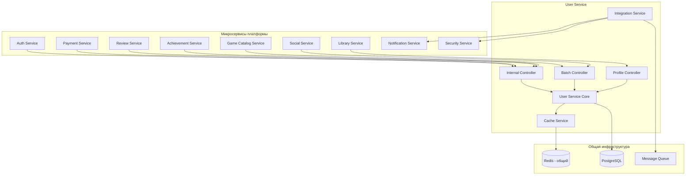

# Руководство по интеграции User Service с микросервисами

## Обзор

User Service предоставляет специализированные API для эффективного взаимодействия с другими микросервисами платформы. После рефакторинга и выделения Auth Service, все интеграции оптимизированы для высокой производительности и безопасности.

## Архитектура интеграции



## Аутентификация и безопасность

### Методы аутентификации для внутренних API

#### 1. API Keys (Рекомендуется)
```bash
# Через Authorization Bearer
curl -H "Authorization: Bearer auth-service-key" \
  http://user-service:3001/api/internal/users/uuid

# Через x-api-key заголовок
curl -H "x-api-key: game-catalog-key" \
  http://user-service:3001/api/batch/users/lookup?ids=uuid1,uuid2
```

#### 2. Internal Service Headers
```bash
# Для межсервисной коммуникации
curl -H "x-internal-service: user-service-internal-secret" \
  http://user-service:3001/api/internal/users/email/user@example.com
```

#### 3. IP Whitelist (Дополнительная защита)
```env
# В .env файле User Service
INTERNAL_ALLOWED_IPS=127.0.0.1,::1,192.168.1.0/24,10.0.0.0/8
```

### Конфигурация API ключей

```env
# User Service .env
INTERNAL_API_KEYS=auth-service-key,game-catalog-key,payment-service-key,library-service-key
INTERNAL_SERVICE_SECRET=user-service-internal-secret-2024
```

## Интеграция по сервисам

### 🔐 Auth Service

**Назначение:** Получение пользовательских данных для аутентификации и управления сессиями

#### Основные операции:
```typescript
// Создание пользователя после регистрации
POST /api/internal/users
{
  "name": "John Doe",
  "email": "user@example.com", 
  "password": "$2b$10$hashedPassword" // Уже хешированный
}

// Поиск пользователя для аутентификации
GET /api/internal/users/email/user@example.com

// Обновление времени последнего входа
PATCH /api/internal/users/{id}/last-login
{
  "lastLoginAt": "2024-01-01T10:00:00.000Z",
  "ipAddress": "192.168.1.100"
}

// Проверка существования пользователя
GET /api/internal/users/{id}/exists
```

#### Пример интеграции в Auth Service:
```typescript
// auth-service/src/user-client.service.ts
@Injectable()
export class UserClientService {
  private readonly httpService = new HttpService();
  private readonly baseUrl = 'http://user-service:3001/api/internal';
  private readonly apiKey = process.env.USER_SERVICE_API_KEY;

  async createUser(userData: CreateUserDto): Promise<User> {
    const response = await this.httpService.post(
      `${this.baseUrl}/users`,
      userData,
      {
        headers: {
          'Authorization': `Bearer ${this.apiKey}`,
          'Content-Type': 'application/json'
        }
      }
    ).toPromise();
    
    return response.data;
  }

  async findUserByEmail(email: string): Promise<User | null> {
    try {
      const response = await this.httpService.get(
        `${this.baseUrl}/users/email/${email}`,
        {
          headers: { 'Authorization': `Bearer ${this.apiKey}` }
        }
      ).toPromise();
      
      return response.data;
    } catch (error) {
      if (error.response?.status === 404) {
        return null;
      }
      throw error;
    }
  }

  async updateLastLogin(userId: string, ipAddress: string): Promise<void> {
    await this.httpService.patch(
      `${this.baseUrl}/users/${userId}/last-login`,
      { 
        lastLoginAt: new Date().toISOString(),
        ipAddress 
      },
      {
        headers: { 'Authorization': `Bearer ${this.apiKey}` }
      }
    ).toPromise();
  }
}
```

### 🎮 Game Catalog Service

**Назначение:** Получение профилей пользователей для персонализации игрового каталога

#### Основные операции:
```typescript
// Получение профиля с предпочтениями
GET /api/internal/users/{id}/profile?includePreferences=true&includePrivacySettings=true

// Массовое получение профилей для рекомендаций
POST /api/internal/users/batch/profiles
{
  "userIds": ["uuid1", "uuid2", "uuid3"],
  "includePreferences": true,
  "fields": ["name", "preferences.gameSettings", "privacySettings.showGameActivity"]
}

// Batch поиск для социальных функций
GET /api/batch/users/lookup?ids=uuid1,uuid2,uuid3&fields=name,avatarUrl,preferences.gameSettings
```

#### Пример интеграции в Game Catalog Service:
```typescript
// game-catalog-service/src/user-profile.service.ts
@Injectable()
export class UserProfileService {
  private readonly httpService = new HttpService();
  private readonly baseUrl = 'http://user-service:3001/api';
  private readonly apiKey = process.env.USER_SERVICE_API_KEY;

  async getUserProfile(userId: string): Promise<UserProfile> {
    const response = await this.httpService.get(
      `${this.baseUrl}/internal/users/${userId}/profile`,
      {
        params: {
          includePreferences: true,
          includePrivacySettings: true
        },
        headers: { 'x-api-key': this.apiKey }
      }
    ).toPromise();
    
    return response.data;
  }

  async getBatchProfiles(userIds: string[]): Promise<UserProfile[]> {
    const response = await this.httpService.post(
      `${this.baseUrl}/internal/users/batch/profiles`,
      {
        userIds,
        includePreferences: true,
        fields: ['name', 'avatarUrl', 'preferences.gameSettings', 'preferences.language']
      },
      {
        headers: { 'x-api-key': this.apiKey }
      }
    ).toPromise();
    
    return response.data.profiles;
  }

  async getGameRecommendations(userId: string): Promise<GameRecommendation[]> {
    const profile = await this.getUserProfile(userId);
    
    // Используем предпочтения пользователя для персонализации
    const preferences = profile.preferences?.gameSettings || {};
    
    return this.gameRecommendationEngine.getRecommendations({
      userId,
      language: profile.preferences?.language || 'ru',
      genres: preferences.preferredGenres || [],
      autoDownload: preferences.autoDownload || false,
      cloudSave: preferences.cloudSave || true
    });
  }
}
```

### 💳 Payment Service

**Назначение:** Получение биллинговой информации для обработки платежей

#### Основные операции:
```typescript
// Получение биллинговой информации
GET /api/internal/users/{id}/billing-info

// Обновление биллинговой информации
PATCH /api/internal/users/{id}/billing-info
{
  "billingAddress": "Москва, ул. Примерная, 123",
  "paymentMethods": ["card", "qiwi", "yandex_money"],
  "currency": "RUB",
  "taxId": "123456789012"
}

// Batch получение для массовых операций
POST /api/batch/users/lookup
{
  "ids": ["uuid1", "uuid2"],
  "fields": ["name", "email", "billingInfo"]
}
```

#### Пример интеграции в Payment Service:
```typescript
// payment-service/src/billing.service.ts
@Injectable()
export class BillingService {
  private readonly userClient = new UserClientService();

  async processPayment(paymentData: PaymentDto): Promise<PaymentResult> {
    // Получаем биллинговую информацию пользователя
    const billingInfo = await this.userClient.getBillingInfo(paymentData.userId);
    
    if (!billingInfo) {
      throw new BadRequestException('Биллинговая информация не найдена');
    }

    // Обрабатываем платеж с учетом валюты и налогов
    const paymentResult = await this.paymentProcessor.process({
      ...paymentData,
      currency: billingInfo.currency || 'RUB',
      taxId: billingInfo.taxId,
      billingAddress: billingInfo.billingAddress
    });

    // Обновляем статистику платежей в профиле
    if (paymentResult.success) {
      await this.userClient.updateBillingStats(paymentData.userId, {
        lastPaymentAt: new Date(),
        totalSpent: paymentResult.amount
      });
    }

    return paymentResult;
  }
}
```

### 📚 Library Service

**Назначение:** Синхронизация пользовательских предпочтений и игровых настроек

#### Основные операции:
```typescript
// Получение предпочтений пользователя
GET /api/internal/users/{id}/preferences

// Обновление игровых предпочтений
PATCH /api/internal/users/{id}/preferences
{
  "gameSettings": {
    "autoDownload": true,
    "cloudSave": true,
    "achievementNotifications": false,
    "preferredGenres": ["action", "rpg", "strategy"]
  },
  "downloadSettings": {
    "maxConcurrentDownloads": 3,
    "downloadPath": "/games",
    "autoUpdate": true
  }
}
```

### ⭐ Review Service

**Назначение:** Проверка данных пользователей для модерации отзывов

#### Основные операции:
```typescript
// Проверка пользователя для отзыва
GET /api/internal/users/{id}?fields=name,createdAt,isActive

// Batch проверка для модерации
GET /api/batch/users/lookup?ids=uuid1,uuid2&fields=name,createdAt,isActive,privacySettings
```

### 👥 Social Service

**Назначение:** Управление социальными связями и профилями

#### Основные операции:
```typescript
// Поиск пользователей для добавления в друзья
GET /api/batch/users/lookup?ids=uuid1,uuid2&fields=name,avatarUrl,privacySettings.profileVisibility

// Получение публичного профиля
GET /api/internal/users/{id}/profile?publicOnly=true
```

## Event-Driven интеграция

### Публикация событий

User Service публикует события изменений для других сервисов:

```typescript
// События, публикуемые User Service
interface UserEvent {
  type: 'USER_CREATED' | 'USER_UPDATED' | 'USER_DELETED' | 'PROFILE_UPDATED' | 'PREFERENCES_CHANGED';
  userId: string;
  timestamp: Date;
  data: any;
  correlationId: string;
  source: 'user-service';
}

// Примеры событий
{
  "type": "USER_CREATED",
  "userId": "uuid",
  "timestamp": "2024-01-01T00:00:00.000Z",
  "data": {
    "name": "John Doe",
    "email": "john@example.com"
  },
  "correlationId": "req-123",
  "source": "user-service"
}

{
  "type": "PREFERENCES_CHANGED", 
  "userId": "uuid",
  "timestamp": "2024-01-01T00:00:00.000Z",
  "data": {
    "changed": ["gameSettings.autoDownload", "language"],
    "previous": { "gameSettings": { "autoDownload": false }, "language": "ru" },
    "current": { "gameSettings": { "autoDownload": true }, "language": "en" }
  },
  "correlationId": "req-456",
  "source": "user-service"
}
```

### Подписка на события

Другие сервисы могут подписаться на события User Service:

```typescript
// library-service/src/user-events.handler.ts
@Injectable()
export class UserEventsHandler {
  @EventPattern('user.preferences.changed')
  async handlePreferencesChanged(event: UserEvent): Promise<void> {
    if (event.data.changed.some(field => field.startsWith('gameSettings'))) {
      // Синхронизируем настройки игр в Library Service
      await this.libraryService.syncGameSettings(event.userId, event.data.current.gameSettings);
    }
  }

  @EventPattern('user.created')
  async handleUserCreated(event: UserEvent): Promise<void> {
    // Создаем пустую библиотеку для нового пользователя
    await this.libraryService.createEmptyLibrary(event.userId);
  }
}
```

## Использование общего Redis

### Namespace стратегия

User Service использует namespace для избежания конфликтов:

```typescript
// Ключи кэша с namespace
const CACHE_KEYS = {
  USER: (id: string) => `user-service:user:${id}`,
  PROFILE: (id: string) => `user-service:profile:${id}`,
  BATCH_USERS: (ids: string[]) => `user-service:batch:${ids.sort().join(',')}`,
  PREFERENCES: (id: string) => `user-service:preferences:${id}`
};

// Pub/Sub каналы
const CHANNELS = {
  USER_EVENTS: 'user-service:events',
  CACHE_INVALIDATION: 'user-service:cache:invalidate'
};
```

### Кэширование для интеграций

```typescript
// Оптимизированное кэширование для частых запросов
@Injectable()
export class IntegrationCacheService {
  async getUserForAuth(userId: string): Promise<User | null> {
    // Кэш на 5 минут для Auth Service
    const cacheKey = `user-service:auth:${userId}`;
    const cached = await this.redis.get(cacheKey);
    
    if (cached) {
      return JSON.parse(cached);
    }

    const user = await this.userRepository.findOne({ where: { id: userId } });
    if (user) {
      await this.redis.setex(cacheKey, 300, JSON.stringify(user));
    }
    
    return user;
  }

  async getBatchProfilesForGameCatalog(userIds: string[]): Promise<UserProfile[]> {
    // Кэш на 10 минут для Game Catalog Service
    const cacheKey = `user-service:game-catalog:profiles:${userIds.sort().join(',')}`;
    const cached = await this.redis.get(cacheKey);
    
    if (cached) {
      return JSON.parse(cached);
    }

    const profiles = await this.getProfilesBatch(userIds);
    await this.redis.setex(cacheKey, 600, JSON.stringify(profiles));
    
    return profiles;
  }
}
```

## Мониторинг интеграций

### Метрики для интеграций

```typescript
// Prometheus метрики для мониторинга интеграций
const INTEGRATION_METRICS = {
  // Запросы от других сервисов
  'user_service_integration_requests_total': {
    help: 'Total integration requests by service',
    labelNames: ['service', 'endpoint', 'status']
  },
  
  // Время ответа для интеграций
  'user_service_integration_duration_seconds': {
    help: 'Integration request duration',
    labelNames: ['service', 'endpoint']
  },
  
  // Ошибки интеграций
  'user_service_integration_errors_total': {
    help: 'Integration errors by service',
    labelNames: ['service', 'error_type']
  },
  
  // Кэш для интеграций
  'user_service_integration_cache_hits_total': {
    help: 'Cache hits for integration requests',
    labelNames: ['service', 'cache_type']
  }
};
```

### Health checks для интеграций

```typescript
@Controller('health')
export class IntegrationHealthController {
  @Get('integrations')
  async checkIntegrations(): Promise<IntegrationHealthStatus> {
    return {
      redis: await this.checkRedisConnection(),
      database: await this.checkDatabaseConnection(),
      internalApis: await this.checkInternalApiSecurity(),
      eventPublishing: await this.checkEventPublishing(),
      cachePerformance: await this.checkCachePerformance()
    };
  }
}
```

## Лучшие практики интеграции

### 1. Обработка ошибок
```typescript
// Graceful degradation при недоступности User Service
@Injectable()
export class ResilientUserClient {
  async getUserWithFallback(userId: string): Promise<User | null> {
    try {
      return await this.userService.getUser(userId);
    } catch (error) {
      // Логируем ошибку
      this.logger.error('User Service unavailable', { userId, error: error.message });
      
      // Возвращаем кэшированные данные если доступны
      return await this.getCachedUser(userId);
    }
  }
}
```

### 2. Circuit Breaker Pattern
```typescript
@Injectable()
export class CircuitBreakerUserClient {
  private circuitBreaker = new CircuitBreaker(this.callUserService.bind(this), {
    timeout: 3000,
    errorThresholdPercentage: 50,
    resetTimeout: 30000
  });

  async getUser(userId: string): Promise<User> {
    return this.circuitBreaker.fire(userId);
  }
}
```

### 3. Retry Logic
```typescript
@Injectable()
export class RetryableUserClient {
  async getUserWithRetry(userId: string): Promise<User> {
    return retry(
      () => this.userService.getUser(userId),
      {
        retries: 3,
        factor: 2,
        minTimeout: 1000,
        maxTimeout: 5000
      }
    );
  }
}
```

### 4. Rate Limiting для интеграций
```typescript
// Различные лимиты для разных сервисов
const RATE_LIMITS = {
  'auth-service': { limit: 1000, ttl: 60 },      // 1000 req/min
  'game-catalog': { limit: 500, ttl: 60 },       // 500 req/min  
  'payment-service': { limit: 200, ttl: 60 },    // 200 req/min
  'default': { limit: 100, ttl: 60 }             // 100 req/min
};
```

## Заключение

User Service предоставляет комплексную интеграционную платформу для всех микросервисов с:

- **Высокой производительностью** через кэширование и batch операции
- **Безопасностью** через API ключи и IP whitelist
- **Надежностью** через graceful degradation и circuit breaker
- **Масштабируемостью** через оптимизированные запросы и connection pooling
- **Мониторингом** через детальные метрики и health checks

Все интеграции спроектированы для работы в высоконагруженной среде с автоматическим восстановлением при сбоях.