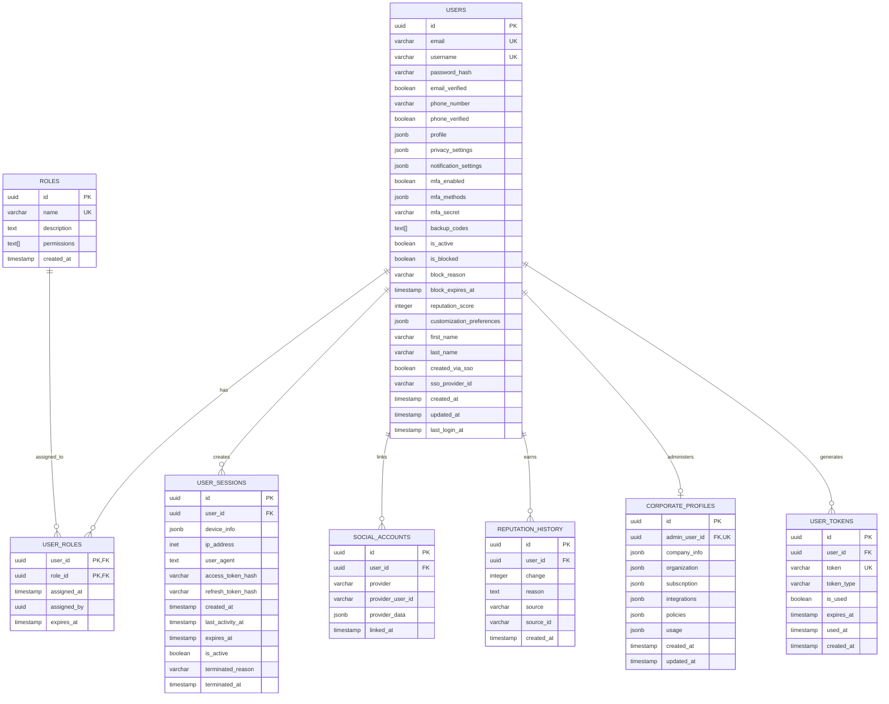

# User Service - Архитектурная диаграмма

## Общая архитектура системы

## Детальная архитектура User Service

## Event-Driven Architecture

## Security Architecture

## Database Schema Overview

## Deployment Architecture

---

**Последнее обновление:** 1 сентября 2025  
**Версия:** 2.0.0  
**Статус:** Production Ready ✅