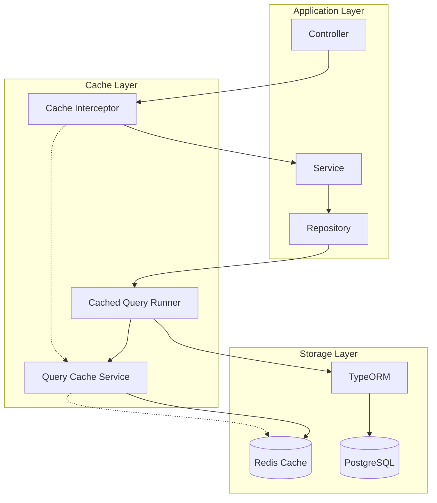

# TypeORM Query Cache Implementation

This document describes the enhanced TypeORM query caching implementation for the User Service, providing intelligent caching with Redis backend, automatic invalidation, and comprehensive monitoring.

## Overview

The TypeORM Query Cache system provides:

- **Intelligent Query Caching**: Automatic caching of SELECT queries with configurable TTL
- **Tag-based Invalidation**: Efficient cache invalidation using tags
- **Performance Monitoring**: Comprehensive metrics and statistics
- **Automatic Cache Management**: Smart cache eviction and cleanup
- **Development Tools**: Admin endpoints for cache management

## Architecture

### Components

1. **TypeOrmQueryCacheService**: Core caching service with Redis backend
2. **CachedQueryRunner**: Query runner wrapper for transparent caching
3. **Cache Decorators**: Method-level caching with `@CacheQuery` and `@InvalidateCache`
4. **Cache Interceptors**: Automatic caching and invalidation at controller level
5. **Admin Controller**: Management endpoints for cache operations

### Data Flow



## Configuration

### Environment Variables

```env
# Query Cache Configuration
QUERY_CACHE_ENABLED=true
QUERY_CACHE_TTL=300          # Default TTL in seconds (5 minutes)
QUERY_CACHE_MAX_SIZE=10000   # Maximum number of cached entries
SLOW_QUERY_THRESHOLD=1000    # Log queries slower than 1 second

# Redis Configuration (existing)
REDIS_HOST=localhost
REDIS_PORT=6379
REDIS_DB=0
```

### TypeORM Configuration

The query cache is automatically configured in `ConfigFactory`:

```typescript
// Enhanced query cache configuration
cache: {
  type: 'redis',
  options: {
    host: 'localhost',
    port: 6379,
    db: 1, // Separate DB for query cache
    keyPrefix: 'user-service:typeorm-query-cache:',
  },
  duration: 300000, // 5 minutes
  ignoreErrors: true,
}
```

## Usage

### Method-Level Caching with Decorators

#### Basic Caching

```typescript
import { CacheQuery, CacheConfigs } from '../common/cache/cache-query.decorator';

@Injectable()
export class UserRepository {
  
  @CacheQuery(CacheConfigs.USER)
  async findActiveUsers(): Promise<User[]> {
    return this.repository.find({ where: { isActive: true } });
  }
  
  @CacheQuery({ ttl: 600, tags: ['users', 'profiles'] })
  async findUserWithProfile(id: string): Promise<User | null> {
    return this.repository.findOne({ 
      where: { id },
      relations: ['profile']
    });
  }
}
```

#### Conditional Caching

```typescript
@CacheQuery({
  ttl: 300,
  tags: ['search'],
  condition: (searchTerm: string) => searchTerm.length > 2
})
async searchUsers(searchTerm: string): Promise<User[]> {
  // Only cache if search term is longer than 2 characters
  return this.repository
    .createQueryBuilder('user')
    .where('user.name ILIKE :term', { term: `%${searchTerm}%` })
    .getMany();
}
```

#### Cache Invalidation

```typescript
@InvalidateCache(['users', 'statistics'])
async createUser(userData: CreateUserDto): Promise<User> {
  const user = await this.repository.save(userData);
  // Cache entries with 'users' and 'statistics' tags will be invalidated
  return user;
}
```

### Predefined Cache Configurations

```typescript
// Available predefined configurations
CacheConfigs.SHORT    // 60 seconds TTL
CacheConfigs.MEDIUM   // 300 seconds TTL  
CacheConfigs.LONG     // 1800 seconds TTL
CacheConfigs.USER     // User-specific caching
CacheConfigs.STATISTICS // Statistics caching
CacheConfigs.PROFILE  // Profile caching
CacheConfigs.SEARCH   // Search results caching
```

### Helper Decorators

```typescript
// User-specific caching
@UserCache(300) // 5 minutes TTL
async getUserPreferences(userId: string): Promise<UserPreferences> {
  // Automatically tagged with 'users' and keyed by userId
}

// Time-sensitive data
@TimeSensitiveCache(['statistics'])
async getUserCount(): Promise<number> {
  // Cached for only 1 minute due to time-sensitive nature
}

// Conditional caching
@ConditionalCache(
  (id: string) => !!id, 
  { ttl: 300, tags: ['users'] }
)
async findUserById(id: string): Promise<User | null> {
  // Only cache if ID is provided
}
```

## Cache Management

### Admin Endpoints

The system provides comprehensive admin endpoints for cache management:

#### Statistics and Monitoring

```http
GET /admin/query-cache/stats
```

Returns detailed cache statistics:

```json
{
  "hits": 1250,
  "misses": 350,
  "hitRate": 78.13,
  "totalQueries": 1600,
  "cacheSize": 245,
  "memoryUsage": 15728640,
  "hitRateFormatted": "78.13%",
  "memorySizeFormatted": "15.0 MB"
}
```

#### Cache Operations

```http
# Clear all cache
DELETE /admin/query-cache/clear

# Invalidate by tags
POST /admin/query-cache/invalidate
{
  "tags": ["users", "statistics"]
}

# Invalidate by pattern
DELETE /admin/query-cache/pattern/user:*

# Get entries by tag
GET /admin/query-cache/entries/tag/users

# Warm up cache
POST /admin/query-cache/warmup
{
  "queries": [
    {
      "query": "SELECT * FROM users WHERE isActive = true",
      "parameters": [],
      "options": { "ttl": 300, "tags": ["users"] }
    }
  ]
}
```

#### Health Check

```http
GET /admin/query-cache/health
```

Returns cache health status with recommendations:

```json
{
  "status": "healthy",
  "issues": [],
  "recommendations": [],
  "stats": { ... }
}
```

### Programmatic Management

```typescript
@Injectable()
export class CacheManager {
  constructor(
    private readonly queryCacheService: TypeOrmQueryCacheService
  ) {}

  async clearUserCache(userId: string) {
    await this.queryCacheService.invalidateByTags([`user:${userId}`]);
  }

  async warmUpFrequentQueries() {
    const queries = [
      {
        query: 'SELECT * FROM users WHERE isActive = true',
        options: { ttl: 300, tags: ['users'] }
      }
    ];
    
    await this.queryCacheService.warmUp(queries);
  }

  async getCacheHealth() {
    const stats = await this.queryCacheService.getStats();
    return {
      healthy: stats.hitRate > 50,
      hitRate: stats.hitRate,
      memoryUsage: stats.memoryUsage
    };
  }
}
```

## Performance Optimization

### Query Analysis

The system automatically analyzes queries to determine caching strategy:

1. **SELECT queries**: Cached by default
2. **Write operations**: Never cached, trigger invalidation
3. **Queries with random functions**: Never cached
4. **Large queries**: Not cached to prevent memory issues

### TTL Strategy

Different TTL values based on data characteristics:

- **User profiles**: 10 minutes (stable data)
- **User lookups**: 5 minutes (moderately stable)
- **Statistics**: 2 minutes (frequently changing)
- **Search results**: 3 minutes (moderate volatility)

### Memory Management

- **LRU eviction**: Least recently used entries are evicted first
- **Size limits**: Configurable maximum cache size
- **Memory monitoring**: Automatic memory usage tracking
- **Cleanup**: Periodic cleanup of expired entries

## Monitoring and Alerting

### Key Metrics

- **Hit Rate**: Percentage of queries served from cache
- **Query Count**: Total number of queries processed
- **Cache Size**: Number of entries in cache
- **Memory Usage**: Total memory used by cache
- **Slow Queries**: Queries exceeding threshold

### Performance Thresholds

- **Hit Rate**: Should be > 50% for optimal performance
- **Memory Usage**: Alert if > 100MB
- **Cache Size**: Alert if > 10,000 entries
- **Slow Queries**: Log queries > 1 second

### Logging

```typescript
// Automatic logging of cache operations
logger.debug('Cache hit for query: SELECT * FROM users...');
logger.warn('Slow query executed in 1250ms: SELECT ...');
logger.log('Invalidated 15 cache entries by tags: users, statistics');
```

## Best Practices

### When to Use Caching

✅ **Good candidates for caching:**
- User profile queries
- Lookup operations by ID
- Statistics and aggregations
- Search results
- Reference data

❌ **Avoid caching:**
- Write operations (INSERT, UPDATE, DELETE)
- Queries with random functions
- Real-time data requirements
- User-specific sensitive data

### Cache Key Design

```typescript
// Good: Specific and predictable
@CacheQuery({
  keyGenerator: (userId: string) => `user:profile:${userId}`,
  tags: ['users', 'profiles']
})

// Bad: Generic and collision-prone
@CacheQuery({
  keyGenerator: () => 'user-data'
})
```

### Tag Strategy

```typescript
// Hierarchical tagging for efficient invalidation
tags: ['users', 'user:123', 'profiles', 'profile:123']

// Operation-based tagging
tags: ['statistics', 'time-sensitive']

// Feature-based tagging
tags: ['search', 'users', 'active-users']
```

### Error Handling

```typescript
// Always handle cache failures gracefully
try {
  const cached = await this.cacheService.get(key);
  if (cached) return cached;
} catch (error) {
  // Log but don't fail - proceed with database query
  this.logger.warn('Cache error, falling back to database:', error);
}

// Execute actual query
return await this.repository.find(conditions);
```

## Troubleshooting

### Common Issues

1. **Low Hit Rate**
   - Check TTL settings
   - Verify cache conditions
   - Review query patterns

2. **High Memory Usage**
   - Reduce TTL values
   - Implement cache size limits
   - Clear unused entries

3. **Cache Misses**
   - Check Redis connectivity
   - Verify key generation
   - Review invalidation logic

### Debugging Tools

```typescript
// Enable debug logging
LOG_LEVEL=debug

// Check cache statistics
GET /admin/query-cache/stats

// Monitor specific tags
GET /admin/query-cache/entries/tag/users

// Test cache health
GET /admin/query-cache/health
```

### Performance Tuning

1. **Optimize TTL values** based on data volatility
2. **Use appropriate tags** for efficient invalidation
3. **Monitor hit rates** and adjust caching strategy
4. **Implement cache warming** for frequently accessed data
5. **Set memory limits** to prevent Redis overflow

## Migration Guide

### From Basic Caching

1. **Add decorators** to existing repository methods
2. **Configure TTL values** based on data characteristics
3. **Implement invalidation** for write operations
4. **Monitor performance** and adjust settings

### Testing

```typescript
describe('Query Cache', () => {
  it('should cache query results', async () => {
    const result1 = await repository.findActiveUsers();
    const result2 = await repository.findActiveUsers();
    
    expect(cacheService.getStats().hits).toBe(1);
  });

  it('should invalidate cache on updates', async () => {
    await repository.createUser(userData);
    
    expect(cacheService.getStats().invalidations).toBeGreaterThan(0);
  });
});
```

This implementation provides a robust, scalable query caching solution that significantly improves database performance while maintaining data consistency through intelligent invalidation strategies.